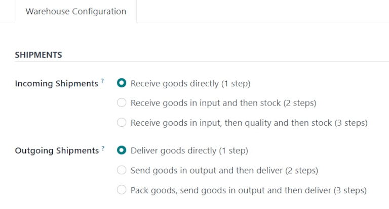
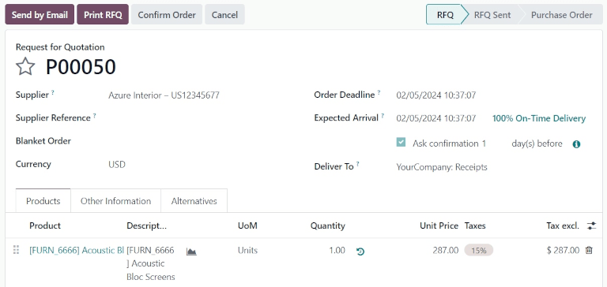
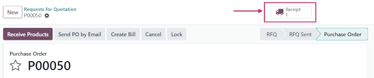
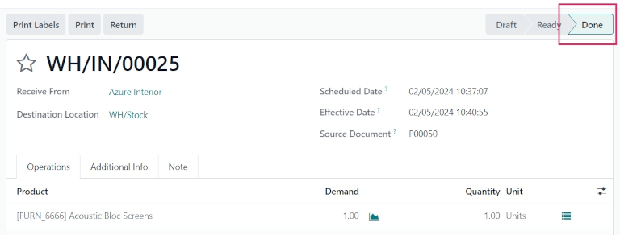
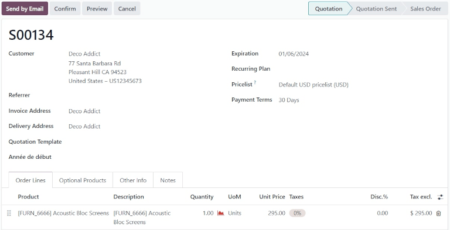
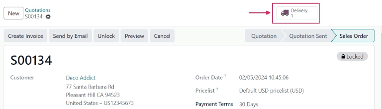
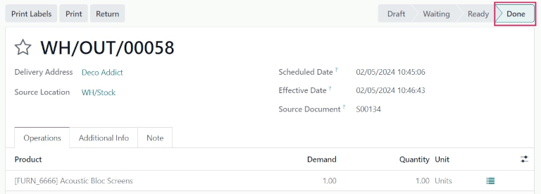

=============================
One-step receipt and delivery
=============================

.. |PO| replace:: :abbr:`PO (Purchase Order)`
.. |SO| replace:: :abbr:`SO (Sales Order)`
.. |RfQ| replace:: :abbr:`RfQ (Request for Quotation)`

In Odoo *Inventory*, both incoming and outgoing shipments are configured to process in one step, by
default. This means purchases will be received directly into stock, and deliveries will be moved
directly from stock to customers.

.. tip::
   Incoming and outgoing shipments do **not** need to be configured with the same amount of steps.

   For example, a warehouse's settings can be configured so products can be received directly in one
   step, and delivered in three steps (pick + pack + ship).

Configuration
=============

To configure one-step receipts and deliveries for a warehouse, navigate to :menuselection:`Inventory
app --> Configuration --> Warehouses`, and select a warehouse to edit.

Under the :guilabel:`Warehouse Configuration` tab, set :guilabel:`Incoming Shipments` to
:guilabel:`Receive goods directly (1 step)`, and set :guilabel:`Outgoing Shipments` to
:guilabel:`Deliver goods directly (1 step)`.

.. note::
   Since one-step receipt and delivery is the default for incoming and outgoing shipments in Odoo,
   the *Multi-Step Routes* feature is *not* required.

   However, for the :guilabel:`Shipments` settings to appear on a warehouse form, the feature
   **must** be enabled.

   To enable *Multi-Step Routes*, navigate to :menuselection:`Inventory app --> Configuration -->
   Settings`. Under the :guilabel:`Warehouse` section, tick the checkbox next to
   :guilabel:`Multi-Step Routes`, and click :guilabel:`Save`. Doing so also activates the
   :guilabel:`Storage Locations` feature.

.. _inventory/receipts_delivery_one_step/wh:

Receive goods directly (1 step)
===============================

When products are received in one step, they will move from the vendor location to warehouse stock
in the database immediately upon validation of a purchase order (PO).

Create purchase order
---------------------

To create a |PO|, navigate to the :menuselection:`Purchase app`, and click :guilabel:`New`. This
opens a blank :guilabel:`Request for Quotation` (RfQ) form.

Add a vendor in the :guilabel:`Supplier` field. Then, fill out the various fields on the |RfQ|, as
necessary.

Under the :guilabel:`Products` tab, click :guilabel:`Add a product`, and select a product to add to
the |RfQ|.

Once ready, click :guilabel:`Confirm Order`. This moves the |RfQ| to the :guilabel:`Purchase Order`
stage.

Once the |PO| is confirmed, a :guilabel:`Receipt` smart button appears at the top of the form.
Clicking the smart button opens the warehouse receipt (WH/IN) form.

Process receipt
---------------

From the warehouse receipt form, the products ordered can be received into the warehouse. To receive
the products, click :guilabel:`Validate`. Once validated, the receipt moves to the :guilabel:`Done`
stage.

Click back to the |PO| (via the breadcrumbs, at the top of the form) to view the |PO| form. On the
product line, the quantity in the :guilabel:`Received` column now matches the ordered
:guilabel:`Quantity`.

.. _inventory/delivery/one-step:

Deliver goods directly (1 step)
===============================

When products are delivered in one step, they will move from warehouse stock to the customer
location in the database immediately upon validation of a sales order (SO).

Create sales order
------------------

To create a |SO|, navigate to the :menuselection:`Sales app`, and click :guilabel:`New`. This
opens a blank sales quotation form.

Add a customer in the :guilabel:`Customer` field. Then, fill out the various fields on the sales
quotation form, as necessary.

Under the :guilabel:`Product` tab, click :guilabel:`Add a product`, and select a product to add to
the sales order quotation.

Once ready, click :guilabel:`Confirm`. This moves the quotation to the :guilabel:`Sales Order`
stage.

Once the |SO| is confirmed, a :guilabel:`Delivery` smart button appears at the top of the form.
Clicking the smart button opens the warehouse delivery (WH/OUT) form.

Process delivery
----------------

From the warehouse delivery form, the products ordered by the customer can be delivered from the
warehouse. To deliver the products, change the value in the :guilabel:`Quantity` field to match the
ordered quantity in the :guilabel:`Demand` field.

Once ready, click :guilabel:`Validate`. Once validated, the delivery order moves to the
:guilabel:`Done` stage.

Click back to the |SO| (via the breadcrumbs, at the top of the form) to view the |SO| form. On the
product line, the quantity in the :guilabel:`Delivered` column now matches the ordered
:guilabel:`Quantity`.

.. seealso::
   :doc:`../daily_operations`
