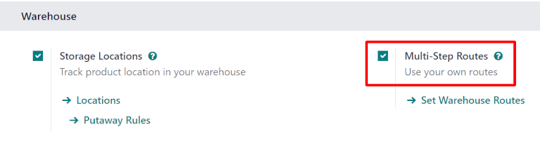
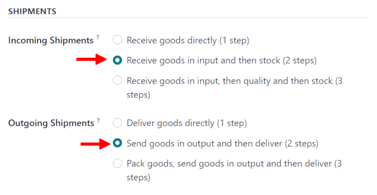
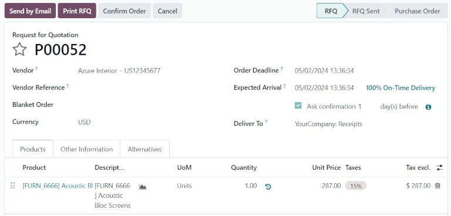
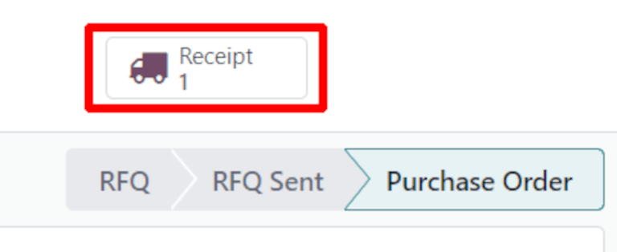
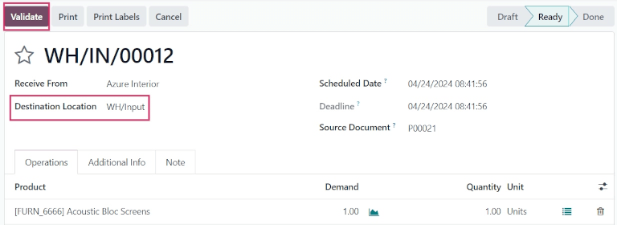
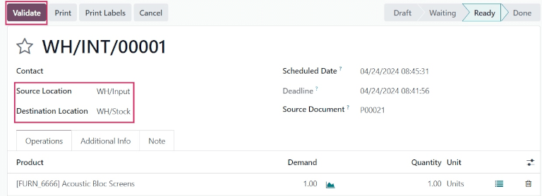
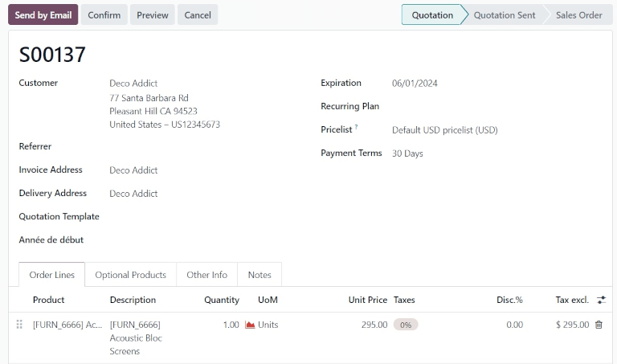
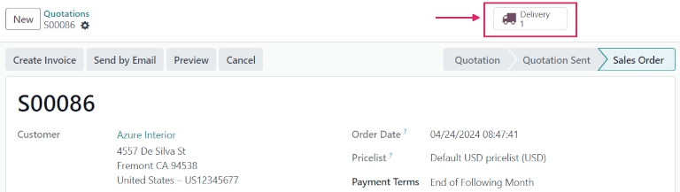
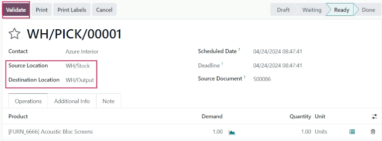
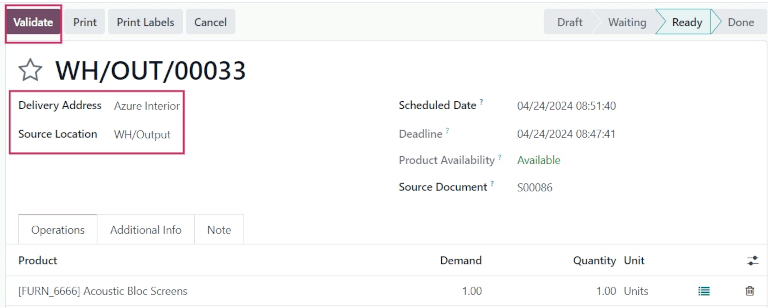

=============================
Two-step receipt and delivery
=============================

.. |PO| replace:: :abbr:`PO (Purchase Order)`
.. |SO| replace:: :abbr:`SO (Sales Order)`
.. |DO| replace:: :abbr:`DO (Delivery Order)`
.. |RfQ| replace:: :abbr:`RfQ (Request for Quotation)`

Depending on a company's needs, receiving and shipping products in and out of the warehouse might
require multi-step operations. In Odoo *Inventory*, this can be done using *Multi-Step Routes*.

In the two-step receipt process, products are received in an input area, then transferred to stock.
This kind of process for incoming shipments might be beneficial for warehouses with specific storage
locations, such as freezers and refrigerators, secured locked areas, or special aisles and shelves.

Products can be sorted according to where they are going to be stored, and employees can stock all
the products going to a specific location. The products are *not* available for further processing,
until they are transferred into stock.

In the two-step delivery process, products are first picked from their respective location in the
warehouse, then transferred to an output location before being shipped to the customer.

This might be beneficial for companies using a First In, First Out (FIFO), Last In, First Out
(LIFO), or First Expired, First Out (FEFO) removal strategy.

.. tip::
   Incoming and outgoing shipments do **not** need to be configured with the same amount of steps.

   For example, a warehouse's settings can be configured so products can be received in two steps
   (input + stock), and delivered in three steps (pick + pack + ship).

Configuration
=============

In Odoo *Inventory*, both incoming and outgoing shipments are configured to process in one step, by
default. To change these settings, the *Multi-Step Routes* feature must be enabled.

To enable *Multi-Step Routes*, navigate to :menuselection:`Inventory app --> Configuration -->
Settings`. Under the :guilabel:`Warehouse` section, tick the checkbox next to :guilabel:`Multi-Step
Routes`, and click :guilabel:`Save`. Doing so also activates the :guilabel:`Storage Locations`
feature.

Next, configure a warehouse for two-step receipts and deliveries. Navigate to
:menuselection:`Inventory app --> Configuration --> Warehouses`, and select a warehouse to edit.

Under the :guilabel:`Warehouse Configuration` tab, set :guilabel:`Incoming Shipments` to
:guilabel:`Receive goods in input and then stock (2 steps)`, and set :guilabel:`Outgoing Shipments`
to :guilabel:`Send goods in output and then deliver (2 steps)`.

.. note::
   Selecting two-step receipts and deliveries automatically creates new *Input* and *Output*
   warehouse locations in the database, named `WH/Input` and `WH/Output`, respectively.

   To rename or edit these locations, navigate to :menuselection:`Inventory app --> Configuration
   --> Locations`, and select the desired location.

   On the location's form, change the :guilabel:`Location Name`, and make any other necessary
   changes.

Process receipt in two steps (input + stock)
============================================

When products are received in two steps, they first move from the vendor location to an input
location. Then, they move from the input location to warehouse stock in the database, upon
validation of a purchase order (PO), and a subsequent internal transfer.

Create purchase order
---------------------

To create a |PO|, navigate to the :menuselection:`Purchase app`, and click :guilabel:`New`. This
opens a blank :guilabel:`Request for Quotation` (RfQ) form.

Add a vendor in the :guilabel:`Vendor` field. Then, fill out the various fields on the |RfQ|, as
necessary.

Under the :guilabel:`Products` tab, click :guilabel:`Add a product`, and select a product to add to
the |RfQ|.

Once ready, click :guilabel:`Confirm Order`. This moves the |RfQ| to the :guilabel:`Purchase Order`
stage.

Once the |PO| is confirmed, a :guilabel:`Receipt` smart button appears at the top of the form.
Clicking the smart button opens the warehouse receipt (WH/IN) form.

.. tip::
   For businesses with multiple warehouses that have different step configurations, the
   :guilabel:`Deliver To` field on the |PO| form **must** be specified as the correct *input
   location* connected to the two-step warehouse.

   This can be done by selecting the warehouse from the drop-down menu that includes the `Receipts`
   label at the end of the name.

Process receipt
---------------

From the warehouse receipt form, the products ordered can be received into the warehouse. To receive
the products, click :guilabel:`Validate`. Once validated, the receipt moves to the :guilabel:`Done`
stage, and the products move to the :guilabel:`WH/Input` location.

Click back to the |PO| (via the breadcrumbs, at the top of the form) to view the |PO| form. On the
product line, the quantity in the :guilabel:`Received` column now matches the ordered
:guilabel:`Quantity`.

Process internal transfer
-------------------------

Once the receipt is validated, an internal transfer is created and ready to process.

To view the internal transfer, navigate to the :menuselection:`Inventory app`, and locate the
:guilabel:`Internal Transfers` task card.

Click the :guilabel:`# To Process` button on the task card to reveal a list of all internal
transfers to process, and select the transfer associated with the previously validated receipt.

Once ready, click :guilabel:`Validate` to complete the transfer, and move the product from
:guilabel:`WH/Input` to :guilabel:`WH/Stock`.

Once the transfer is validated, the products enter inventory, and are available for customer
deliveries or manufacturing orders.

Process delivery order in two steps (pick + ship)
=================================================

When products are delivered in two steps, they move from warehouse stock to an output location.
Then, they move from the output location to a customer location in the database, upon validation of
a picking order, and a subsequent delivery order (DO).

Create sales order
------------------

To create a |SO|, navigate to the :menuselection:`Sales app`, and click :guilabel:`New`. This
opens a blank sales quotation form.

Add a customer in the :guilabel:`Customer` field. Then, fill out the various fields on the sales
quotation form, as necessary.

Under the :guilabel:`Order Lines` tab, click :guilabel:`Add a product`, and select a product to add
to the sales order quotation.

Once ready, click :guilabel:`Confirm`. This moves the quotation to the :guilabel:`Sales Order`
stage.

Once the |SO| is confirmed, a :guilabel:`Delivery` smart button appears at the top of the form.
Clicking the smart button opens the warehouse delivery (WH/OUT) form.

Process picking
---------------

Once the sales order is confirmed, a picking order is generated and ready to process.

To complete the picking, navigate to the :guilabel:`Inventory app`, and locate the :guilabel:`Pick`
task card on the :guilabel:`Inventory Overview` dashboard. Alternatively, the picking order can also
be accessed via the :guilabel:`Delivery` smart button at the top of the sales order form.

From the :guilabel:`Inventory Overview` page, click the :guilabel:`# To Process` button on the
:guilabel:`Pick` task card. This reveals a list of all pickings to process.

Click on the picking (WH/PICK) operation associated with the sales order to reveal the picking
order.

Manually set the quantity by changing the value in the :guilabel:`Quantity` column, to match the
value in the :guilabel:`Demand` column.

Once ready, click :guilabel:`Validate` to complete the picking, and move the product from
:guilabel:`WH/Stock` to :guilabel:`WH/Output.`

Process delivery
----------------

Once the picking is validated, a delivery order is created, and ready to process. Clicking the
:guilabel:`Delivery` smart button on the sales order form reveals the newly created delivery order.

Alternatively, to view the delivery order, navigate back to the :guilabel:`Inventory Overview` page,
via the breadcrumbs, and locate the :guilabel:`Delivery Orders` task card.

Click the :guilabel:`# To Process` button on the task card to reveal a list of all delivery orders
to process, and select the order associated with the previously validated picking.

To deliver the products, change the value in the :guilabel:`Quantity` field to match the ordered
quantity in the :guilabel:`Demand` field.

Once ready, click :guilabel:`Validate`. Once validated, the delivery order moves to the
:guilabel:`Done` stage.

.. seealso::
   :doc:`../daily_operations`
