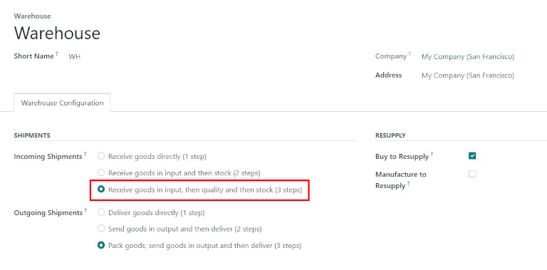
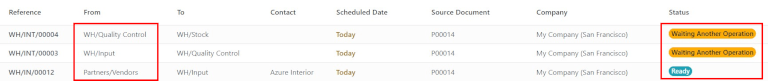
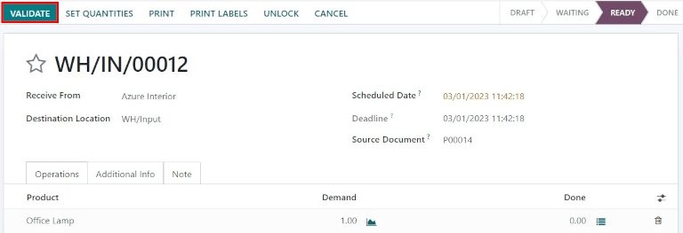
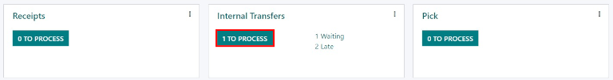
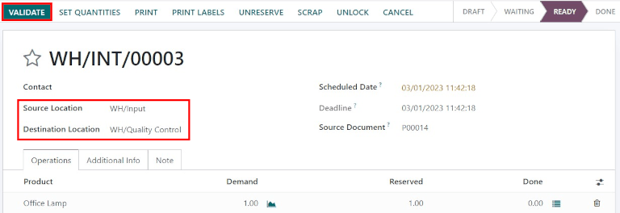

===============================
Process receipts in three steps
===============================

.. _inventory/receipts_three_steps:

Some companies require a quality control process before receiving goods from suppliers. To
accomplish this, Odoo has a three-step process for receiving goods.

In the three-step receipt process, products are received in an input area, then transferred to a
quality area for inspection. Products that pass the quality inspection are then transferred into
stock. The products are not available for further processing until they are transferred out of the
quality area and into stock.

Configuration
=============

Odoo is configured by default to :ref:`receive and deliver goods in one step
<inventory/receipts_delivery_one_step>`, so the settings need to be changed in order to utilize
three-step receipts. First, make sure the *Multi-Step Routes* option is enabled in
:menuselection:`Inventory --> Configuration --> Settings --> Warehouse`. Note that activating
:guilabel:`Multi-Step Routes` will also activate *Storage Locations*.

.. image:: receipts_three_steps/multi-step-routes.png
   :align: center
   :alt: Activate multi-step routes and storage locations in Inventory settings.

Next, the warehouse needs to be configured for three-step receipts. To do that, go to
:menuselection:`Inventory app --> Configuration --> Warehouses`, and select the desired warehouse to
be edited. Doing so reveals the detail form for that specific warehouse.

On that :guilabel:`Warehouse` detail form page, select :guilabel:`Receive goods in input, then
quality and then stock (3 steps)` for :guilabel:`Incoming Shipments`.

Activating three-step receipts and deliveries creates two new internal locations: *Input*
(WH/Input), and *Quality Control* (WH/Quality Control). To rename these locations, go to
:menuselection:`Inventory app --> Configuration --> Locations`, then click on the desired location
to change (or update) the name.

Receive in three steps (input + quality + stock)
================================================

Create a purchase order
-----------------------

To create a new :abbr:`RfQ (Request for Quotation)`, navigate to :menuselection:`Purchase app -->
New`, which reveals a blank :abbr:`RfQ (Request for Quotation)` form page. On this page, select a
:guilabel:`Vendor`, add a storable :guilabel:`Product`, and click :guilabel:`Confirm Order`.

A :guilabel:`Receipt` smart button will appear in the top right, and the receipt will be associated
with the purchase order. Clicking on the :guilabel:`Receipt` smart button will show the receipt
order.

.. image:: receipts_three_steps/three-step-purchase-receipt.png
   :align: center
   :alt: After confirming a purchase order, a Receipt smart button will appear.

Process a receipt
-----------------

One receipt and two internal transfers (one transfer to quality, and a subsequent transfer to stock)
will be created once the purchase order is confirmed. To view these transfers, go to
:menuselection:`Inventory --> Operations --> Transfers`.

         are waiting another operation.

The status of the receipt transferring the product to the input location will be :guilabel:`Ready`,
since the receipt must be processed before any other operation can occur. The status of the two
internal transfers will be :guilabel:`Waiting Another Operation`, since the transfers cannot be
processed until the linked step before each transfer is completed.

The status of the first internal transfer to *quality* will only change to :guilabel:`Ready` when
the receipt has been marked :guilabel:`Done`. The status for the second internal transfer to *stock*
will be marked :guilabel:`Ready` only after the transfer to quality has been marked
:guilabel:`Done`.

The receipt can also be found in the :menuselection:`Inventory` application. In the
:guilabel:`Overview` dashboard, click the :guilabel:`1 To Process` smart button in the
:guilabel:`Receipts` kanban card.

.. image:: receipts_three_steps/three-step-receive-kanban.png
   :align: center
   :alt: One Receipt ready to process in the Inventory Overview kanban view.

Click on the receipt associated with the purchase order, then click :guilabel:`Validate` to complete
the receipt and move the product to the :guilabel:`Input Location`.

         WH/Quality location.

Process a transfer to Quality Control
-------------------------------------

Once the product is in the :guilabel:`Input Location`, the internal transfer is ready to move the
product to :guilabel:`Quality Control`. In the :menuselection:`Inventory` :guilabel:`Overview`
dashboard, click the :guilabel:`1 To Process` smart button in the :guilabel:`Internal Transfers`
kanban card.

Click on the :guilabel:`Transfer` associated with the purchase order, then click
:guilabel:`Validate` to complete the transfer and move the product to the :guilabel:`Quality
Control` location. Once the transfer is validated, the product is ready for the quality inspection,
but is not available for manufacturing or delivery orders.

Process a transfer to stock
===========================

Once the product is in the :guilabel:`Quality Control` location, the final internal transfer is
ready to move the product to :guilabel:`Stock`. In the :guilabel:`Inventory` overview dashboard,
click the :guilabel:`1 To Process` smart button in the :guilabel:`Internal Transfers` Kanban card.

Click on the final :guilabel:`Transfer` associated with the purchase order, then click
:guilabel:`Validate` to complete the transfer and move the product to stock. Once the transfer is
validated, the product enters the stock and is available for customer deliveries or manufacturing
orders.
