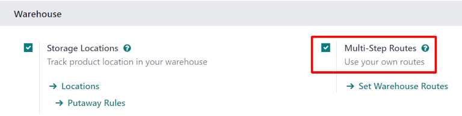
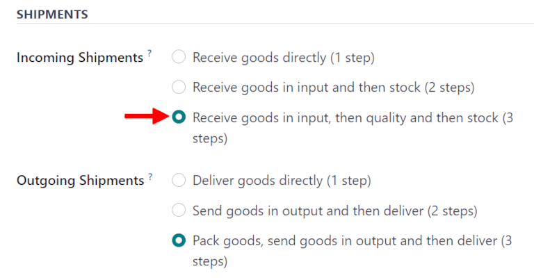
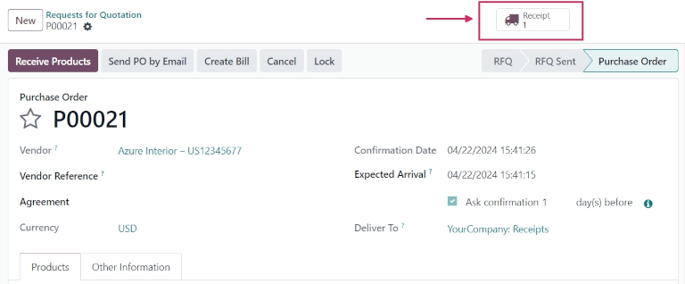
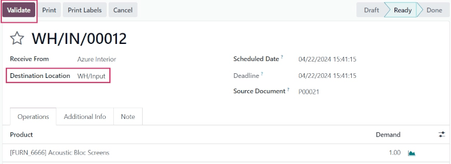
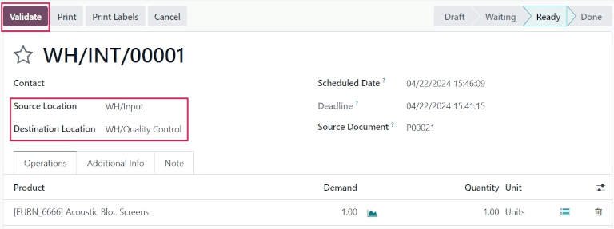
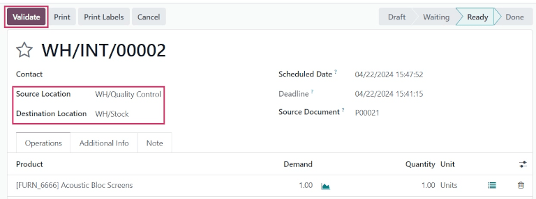

==================
Three-step receipt
==================

Some companies require a quality control process before receiving goods from suppliers. To
accomplish this, Odoo has a three-step process for receiving goods.

In the three-step receipt process, products are received in an input area, then transferred to a
quality area for inspection. Products that pass the quality inspection are then transferred into
stock. The products are not available for further processing until they are transferred out of the
quality area and into stock.

Configuration
=============

Odoo is configured by default to :doc:`receive and deliver goods in one step
<receipts_delivery_one_step>`, so the settings need to be changed in order to utilize three-step
receipts. First, make sure the *Multi-Step Routes* option is enabled in :menuselection:`Inventory
--> Configuration --> Settings --> Warehouse`. Note that activating :guilabel:`Multi-Step Routes`
will also activate *Storage Locations*.

Next, the warehouse needs to be configured for three-step receipts. To do that, go to
:menuselection:`Inventory app --> Configuration --> Warehouses`, and select the desired warehouse to
be edited. Doing so reveals the detail form for that specific warehouse.

On that :guilabel:`Warehouse` detail form page, select :guilabel:`Receive goods in input, then
quality and then stock (3 steps)` for :guilabel:`Incoming Shipments`.

Activating three-step receipts and deliveries creates two new internal locations: *Input*
(WH/Input), and *Quality Control* (WH/Quality Control). To rename these locations, go to
:menuselection:`Inventory app --> Configuration --> Locations`, then click on the desired location
to change (or update) the name.

Receive in three steps (input + quality + stock)
================================================

Create a purchase order
-----------------------

To create a new :abbr:`RfQ (Request for Quotation)`, navigate to :menuselection:`Purchase app -->
New`, which reveals a blank :abbr:`RfQ (Request for Quotation)` form page. On this page, select a
:guilabel:`Vendor`, add a storable :guilabel:`Product`, and click :guilabel:`Confirm Order`.

A :guilabel:`Receipt` smart button will appear in the top right, and the receipt will be associated
with the purchase order. Clicking on the :guilabel:`Receipt` smart button will show the receipt
order.

Process a receipt
-----------------

Once the purchase order (PO) is confirmed, a receipt (`WH/IN`) operation is generated and ready to
process.

The receipt can be confirmed from the original purchase order form, or it can be accessed by
navigating to the :menuselection:`Inventory app`, and locating the :guilabel:`Receipts` task card.

Click the :guilabel:`# To Process` button to reveal all incoming receipts to process. Click the
receipt associated with the previous purchase order.

Click :guilabel:`Validate` to validate the receipt, and move the product to the destination
location, :guilabel:`WH/Input`.

Process a transfer to Quality Control
-------------------------------------

Once the receipt has been validated, an internal transfer operation to move the product to quality
control is ready to process.

Click :guilabel:`Inventory Overview` in the breadcrumbs to navigate back to the dashboard, and
locate the :guilabel:`Internal Transfers` task card.

Select the :guilabel:`# To Process` button to reveal all internal transfers to process. Then, choose
the internal transfer associated with the validated receipt.

Once ready, click :guilabel:`Validate` to complete the transfer, and move the product from
:guilabel:`WH/Input` to :guilabel:`WH/Quality Control`.

Process a transfer to stock
===========================

Once the internal transfer to move the product to quality control has been validated, another
internal transfer operation to move the product into warehouse stock is ready to process.

Click :guilabel:`YourCompany: Internal Transfers` in the breadcrumbs to reveal the list of all
internal transfers to process. Then, select the new internal transfer to move the product from
`WH/Quality Control` to `WH/Stock`.

Once ready, click :guilabel:`Validate` to complete the transfer, and move the product from
:guilabel:`WH/Quality Control` to :guilabel:`WH/Stock`.

