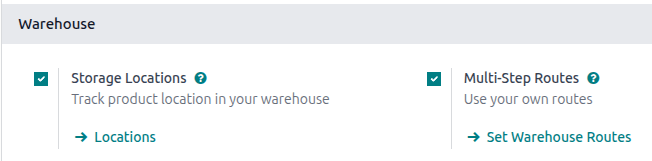

==================
Storage categories
==================

A *storage category* is used with :doc:`putaway rules <putaway>`, as an extra location attribute to
automatically propose optimal storage locations for products.

Follow these steps to complete the setup:

#. :ref:`Enable the Storage Category feature <inventory/routes/enable-storage-categories>`
#. :ref:`Define a storage category <inventory/routes/define-storage>` with specific limitations
#. Assign a :ref:`category to storage locations <inventory/routes/assign-location>`
#. Add the storage category as an attribute to a :ref:`putaway rule
   <inventory/routes/set-putaway-attribute>`

.. seealso::
   :doc:`putaway`

.. note::
   Assigning categories to storage locations tells Odoo these locations meet specific
   requirements, such as temperature or accessibility. Odoo then evaluates these locations, based on
   defined capacity, and recommends the best one on the warehouse transfer form.
.. _inventory/routes/enable-storage-categories:

Configuration
=============

To enable storage categories, go to :menuselection:`Inventory app --> Configuration --> Settings`.
Then, in the :guilabel:`Warehouse` section, ensure the :guilabel:`Storage Locations` and
:guilabel:`Multi-Step Routes` features are enabled.

Next, activate the :guilabel:`Storage Categories` feature. Finally, click :guilabel:`Save`.

.. _inventory/routes/define-storage:

Define storage category
=======================

A storage category with specific limitations **must** be created first, before it is applied to
locations, in order to decide the optimal storage location.

To create a storage category, go to :menuselection:`Inventory app --> Configuration --> Storage
Categories`, and click :guilabel:`Create`.

On the storage category form, type a name for the category in the :guilabel:`Storage Category`
field.

Options are available to limit capacity by weight, product, and package type.

.. note::
   Weight limits can be combined with capacity by package or product (e.g. a maximum of one hundred
   products with a total weight of two hundred kilograms).

   While it is possible to limit capacity by product and package type at the same location, it may
   be more practical to store items in different amounts across various locations, as shown in this
   example of :ref:`capacity by package <inventory/routes/set-capacity-package>`.

The :guilabel:`Allow New Product` field defines when the location is considered available to store a
product:

- :guilabel:`If location is empty`: a product can be added there only if the location is empty.
- :guilabel:`If products are the same`: a product can be added there only if the same product is
  already there.
- :guilabel:`Allow mixed products`: several different products can be stored in this location at
  the same time.

.. tip::
   When clicked, the :guilabel:`Location` smart button shows which storage locations the category
   has been assigned to.

Capacity by weight
------------------

On a storage category form (:menuselection:`Inventory app --> Configuration --> Storage
Categories`), set a maximum product weight in the :guilabel:`Max Weight` field. This limit applies
to each location assigned this storage category.

Capacity by product
-------------------

In the :guilabel:`Capacity by Product` tab, click :guilabel:`Add a Line` to input items, and enter
their capacities in the :guilabel:`Quantity` field.

.. example::
   Ensure only a maximum of five `Large Cabinets` and two `Corner Desk Right Sit` are stored at a
   single storage location, by specifying those amounts in the :guilabel:`Capacity by Product` tab
   of a storage category form.

   .. image:: storage_category/capacity-by-product.png
      :align: center
      :alt: Show storage category limiting by product count.

.. _inventory/routes/set-capacity-package:

Capacity by package
-------------------

For companies using :doc:`packages <../../product_management/configure/package>`, it becomes
possible to ensure real-time storage capacity checks, based on package types (e.g., crates, bins,
boxes, etc.).

.. important::
   Enable the :guilabel:`Packages` feature in :menuselection:`Inventory app --> Configuration -->
   Settings` to show the :guilabel:`Capacity by Package` tab.

.. example::
   Create putaway rules for pallet-stored items, by creating the `High Frequency pallets` storage
   category.

   In the :guilabel:`Capacity by Package` tab, specify the number of packages for the designated
   :guilabel:`Package Type`, and set a maximum of `2.00` `Pallets` for a specific location.

   .. image:: storage_category/storage-category.png
      :align: center
      :alt: Create a storage category on the page.

.. _inventory/routes/assign-location:

Assign to location
==================

Once the storage category is created, assign it to a location. Navigate to the location by going to
:menuselection:`Inventory app --> Configuration --> Locations`, and select the desired location.
Then, select the created category in the :guilabel:`Storage Category` field.

.. example::
   Assign the `High Frequency pallets` storage category (which limits pallets stored at any location
   to two pallets) to the `WH/Stock/pallets/PAL 1` sub-location.

   .. image:: storage_category/location-storage-category.png
      :align: center
      :alt: When a Storage Category is created, it can be linked to a warehouse location.

.. _inventory/routes/set-putaway-attribute:

Putaway rule
============

With the :ref:`storage category <inventory/routes/define-storage>` and :ref:`location
<inventory/routes/assign-location>` set up, create the :doc:`putaway rule <putaway>` by navigating
to :menuselection:`Inventory app --> Configuration --> Putaway Rules`.

Click the :guilabel:`Create` button to create the putaway rule. In the :guilabel:`Having Category`
field of the new putaway rule form, select the storage category.

.. example::
   Continuing the example from above, the `High Frequency Pallets` storage category is assigned to
   the putaway rule directing pallets of lemonade to locations with the `High Frequency Pallets`
   storage category :ref:`assigned to them <inventory/routes/assign-location>`.

   .. image:: storage_category/smart-putaways.png
      :align: center
      :alt: Storage Categories used in a variety of putaway rules.

Use case: limit capacity by package
===================================

To limit the capacity of a storage location by a specific number of packages, :ref:`create a storage
category with a Capacity By Package <inventory/routes/set-capacity-package>`.

Continuing the example from above, the `High Frequency Pallets` storage category is assigned to the
`PAL1` and `PAL2` locations.

Then, :ref:`putaway rules <inventory/routes/putaway-rule>` are set, so that any pallets received in
the warehouse are directed to be stored in `PAL1` and `PAL2` locations.

Depending on the number of pallets on-hand at each of the storage locations, when one pallet of
lemonade cans is received, the following scenarios happen:

- If `PAL1` and `PAL2` are empty, the pallet is redirected to `WH/Stock/Pallets/PAL1`.
- If `PAL1` is full, the pallet is redirected to `WH/Stock/Pallets/PAL2`.
- If `PAL1` and `PAL2` are full, the pallet is redirected to `WH/Stock/Pallets`.

