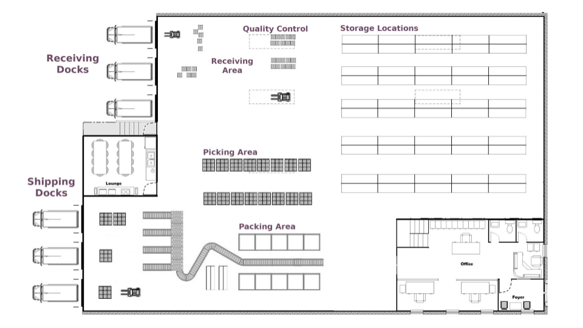
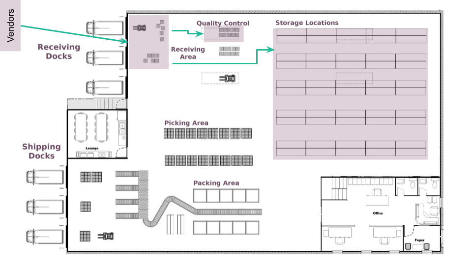
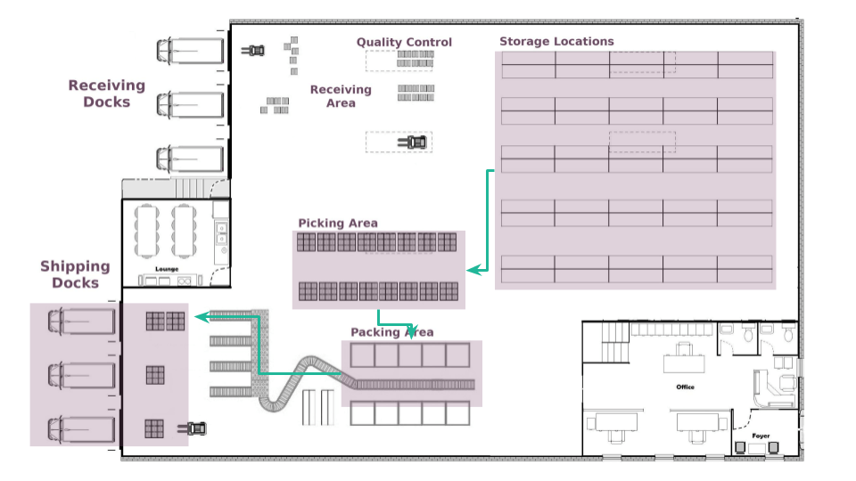
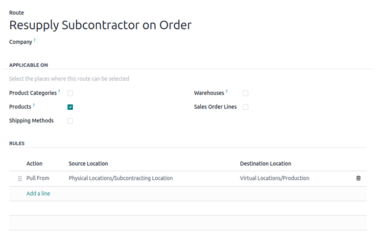
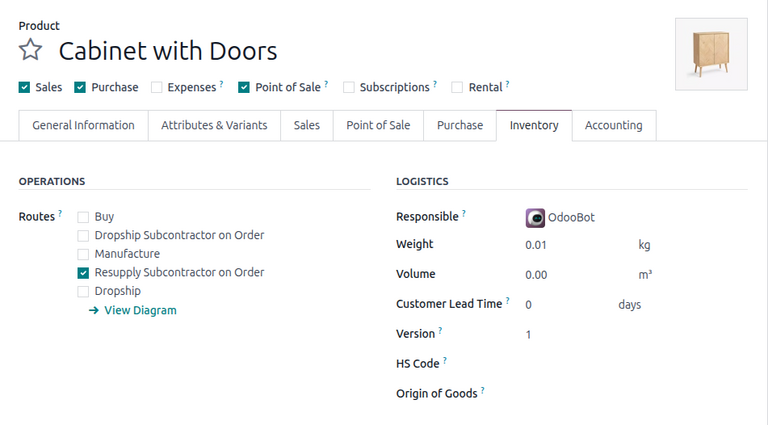
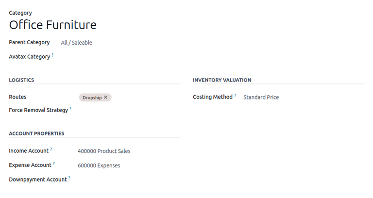
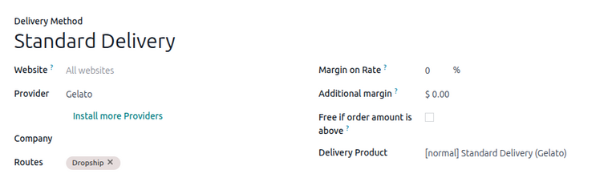
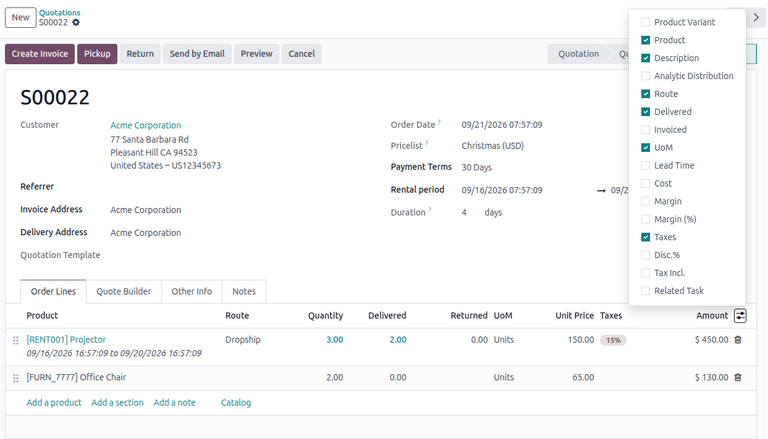

==========================
Routes and push/pull rules
==========================

.. |SO| replace:: :abbr:`SO (Sales Order)`
.. |RfQ| replace:: :abbr:`RfQ (Request for Quotation)`
.. |MO| replace:: :abbr:`MO (Manufacturing Order)`
.. |SUBC| replace:: `Physical Locations/Subcontracting Location`
.. |VEND| replace:: `Partners/Vendors`
.. |PROD| replace:: `Virtual Locations/Production`
.. |CUST| replace:: `Partners/Customers`
.. |ST| replace:: `<WH>/Stock`
.. |QC| replace:: `<WH>/Quality Control`
.. |IN| replace:: `<WH>/Input`
.. |OUT| replace:: `<WH>/Output`
.. |PACK| replace:: `<WH>/Packing Zone`

*Routes* in Odoo control the movement of products between different locations, whether internal or
external, using a combination of push and pull rules. These rules help automate the movement of
products based on specific conditions. They can be configured to create advanced use cases such as:

- Managing product manufacturing chains.
- Managing default locations per product.
- Defining routes within the stock warehouse according to business needs, such as quality control,
  after-sales services, or supplier returns.
- Helping rental management by generating automated return moves for rented products.

.. seealso::
   - `Odoo Tutorials: Routes <https://www.youtube.com/watch?v=qkhDUezyZuc>`_
   - :doc:`Standard routes in Odoo <../daily_operations>`

.. _inventory/routes/config:

Configuration
=============

To access routes and select them on products, ensure that the *Multi-Step Routes* feature is
enabled. To do so, navigate to :menuselection:`Inventory app --> Configuration --> Settings`. Then,
in the :guilabel:`Warehouse` section, enable the :guilabel:`Multi-Step Routes` feature and click
:guilabel:`Save`.

.. important::
   Enabling the :guilabel:`Multi-Step Routes` feature also enables :guilabel:`Storage Locations`.
   These features are both **required** when using routes.

Additionally, routes are generated depending on the warehouse's reception and delivery
configurations. To access these settings, navigate to :menuselection:`Inventory app -->
Configuration --> Warehouses`. On the *Warehouses* page, click the relevant warehouse. In the
*Warehouse Configuration* tab, enable the desired inbound and outbound flows in the
:guilabel:`Incoming Shipments` and :guilabel:`Outgoing Shipments` fields.

.. seealso::
   See the :doc:`../../warehouses_storage/inventory_management/warehouses` documentation for
   information about configuring warehouses.

.. _inventory/routes/overview:

Conceptual overview
===================

*Routes* are combinations of :ref:`push <inventory/routes/overview/push-rules>` and :ref:`pull
<inventory/routes/overview/pull-rules>` rules that determine how products move between locations,
whether they are internal or external to the warehouse. These routes are applied to products to
automatically trigger their movement between locations.

Within a warehouse, products typically move through the following locations: receiving docks, a
quality control area, storage locations, picking and packing areas, and shipping docks. Locations
also exist outside of the warehouse such as customers, vendors, and subcontractors.

.. seealso::
   See the :doc:`../../warehouses_storage/inventory_management/use_locations` documentation for
   information about locations in Odoo.

.. _inventory/routes/overview/push-rules:

Push rules
----------

Push rules move products from a source location to a destination location. These rules are triggered
as soon as products arrive at the source location.

In the following example, different products arrive from *Vendors* at the *Receiving Area*. Push
rules are configured on some products to move directly to the *Storage Locations* as soon as they
arrive at the *Receiving Area*, while other products are pushed to *Quality Control*.

.. important::
   Push rules can only be triggered once a product transfer has already been generated by a pull
   rule or otherwise.

.. _inventory/routes/overview/pull-rules:

Pull rules
----------

Pull rules define product transfer flows from a source location to a destination location. These
rules are demand-driven, triggered only when demand (e.g., sales orders or reordering needs) is
confirmed at the destination location.

However, for multi-step routes, pull rules are often used along with push rules. When there are
multiple locations in the transfer flow, the pull rule specifies the final destination of the
product and generates the first transfer in the route. Push rules are required to move the product
through the rest of the transfer flow.

For example, a warehouse is configured with a 3-step delivery route. A pull rule is configured to
move products from the *Storage Locations* as soon as they are needed at the *Shipping Docks*. The
rule also creates the first transfer in the flow, moving products from the *Storage Locations* to
the *Picking Area*. Then, push rules move the products from the *Picking Area* to the *Packing
Area*, then finally to the *Shipping Docks*.

.. _inventory/routes/manage:

Managing routes
===============

After enabling the *Multi-Step Routes* feature, users can access a dashboard of routes by navigating
to :menuselection:`Inventory --> Configuration --> Routes`. This opens the *Routes* page, displaying
a list of all available routes across all warehouses.

.. tip::
   To access a specific warehouse's routes, navigate to :menuselection:`Configuration -->
   Warehouses`. Select the warehouse, then click the :icon:`fa-refresh` :guilabel:`Routes` smart
   button.

Users can use the :ref:`default routes <inventory/routes/default-routes>` to automate replenishment
strategies such as Replenish on Order (MTO). These default routes are optionally applied by the user
and are shared across all warehouses in the user's company.

In addition to the default global routes, Odoo also automatically generates :ref:`warehouse routes
<inventory/routes/warehouse-routes>` depending on the user's configured warehouse settings. These
routes are automatically triggered by Odoo to move products through locations inside of a warehouse.

To view additional settings, click the desired route on the list. This opens the route's form.

.. _inventory/routes/manage/visibility:

Define route visibility
-----------------------

The :guilabel:`Company` field allows users to restrict the route to specific companies (if using a
multi-company environment.)

In the *Applicable On* section, specify any forms on which the route can be made selectable via the
following options:

- :guilabel:`Product Categories`: Allow routes to be selectable on a *Product Categories* form. When
  configured with a route, every product in the category inherits the route's rules.
- :guilabel:`Products`: Allow routes to be selectable on a *Products* form. The configured product
  inherits the route's rules.
- :guilabel:`Packagings`: Allow routes to be selectable on a *Product Packaging* form. When
  configured with a packaging, all orders with the chosen packaging inherit the route's rules.
- :guilabel:`Shipping Methods`: Allow routes to be selectable on a *Delivery Methods* form. When
  applied on a carrier, all orders with the chosen shipping method inherit the route's rules.
- :guilabel:`Warehouses`: Select the warehouses for which this route should be used as the default
  route.
- :guilabel:`Sales Order Lines`: Allow routes to be selectable on sales order lines. When applied
  on individual sales order lines, the chosen routes override the corresponding product's routes for
  the specific order **only**.

.. seealso::
   See the :ref:`Applying routes <inventory/routes/apply>` section to see how routes are applied on
   these forms.

.. _inventory/routes/manage/view-rules:

Viewing rules
-------------

The *Rules* section lists any rules defining the route.

.. warning::
   Modifying Odoo's default rules may cause unexpected errors in the database and is therefore
   **not** recommended.

Each rule has an :guilabel:`Action`, a :guilabel:`Source Location`, and a :guilabel:`Destination
Location`.

The following actions are defined in Odoo:

- `Pull From`: When demand (e.g., from sales or manufacturing orders) appears at the *Destination
  Location*, a picking of the specified *Operation Type* is created from the *Source Location* to
  fulfill the demand.
- `Push To`: When products arrive at the *Source Location*, a picking of the specified *Operation
  Type* is created to send them to the *Destination Location*.
- `Manufacture`: When products are needed at the *Destination Location*, a manufacturing order (MO)
  is created to fulfill the demand, taking any required components from the *Source Location*.
- `Buy`: When products are needed at the *Destination Location*, a request for quotation (RfQ) is
  created to fulfill the need.

.. seealso::
   See the following documentation for a reference of *Operation Types* and *Locations*:

   - :doc:`../../warehouses_storage/inventory_management/operation_type`
   - :doc:`../../warehouses_storage/inventory_management/use_locations`

.. _inventory/routes/apply:

Applying routes
===============

:ref:`Default routes <inventory/routes/default-routes>` can be assigned to products, product
categories, shipping methods, and sales order lines.

.. important::
   In order to apply routes on these forms, they must first be :ref:`made selectable
   <inventory/routes/manage/visibility>`.

On products
-----------

To assign routes directly to a product, navigate to :menuselection:`Products --> Products` and
select the product. On the product form, select the *Inventory* tab, then select one or more
:guilabel:`Routes` in the *Operations* section.

On product categories
---------------------

To assign routes to a product category, navigate to :menuselection:`Configuration --> Product
Categories` and select the product category. On the category form, select one or more
:guilabel:`Routes` in the *Logistics* section.

On product packagings
---------------------

To assign routes to a product packaging, navigate to :menuselection:`Products --> Products` and
select the product. On the product form, select the *Inventory* tab. In the *Packaging* section,
existing packagings are listed. By default, the route column is hidden. To enable it, click the
:icon:`oi-settings-adjust` (Optional Columns) icon, then select :guilabel:`Routes`.

In the newly-added column, select one or more routes on a packaging line.

.. seealso::
   See the :ref:`inventory/product_management/packaging-route` section for information about
   enabling and setting routes on product packagings.

On shipping methods
-------------------

To assign routes to a shipping method, navigate to :menuselection:`Configuration --> Delivery
Methods` and select the shipping method. On the form, select one or more :guilabel:`Routes`.

.. seealso::
   See the :ref:`inventory/shipping_receiving/shipping-route` section for information about setting
   routes on shipping methods.

On sales order lines
--------------------

To assign routes to a sales order line, open the **Sales** app and select the sales quotation.
Existing lines are listed in the *Order Lines* tab. By default, the route column is hidden. To
enable it, click the :icon:`oi-settings-adjust` (Optional Columns) icon, then select
:guilabel:`Route`.

In the newly-added column, select one or more routes on an order line.

.. _inventory/routes/example:

Example flow
============

In this example, a fulfillment flow is completed using a custom *Pick, Pack, and Ship* route.

First, three :guilabel:`Pull From` rules are configured:

.. list-table::
   :header-rows: 1

   * - Rule
     - Source Location
     - Destination Location
     - Description
   * - `Pull From`
     - WH/Stock
     - Partners/Customers
     - Products are *picked* at |ST| to fulfill the need in |CUST|.
   * - `Push To`
     - WH/Packing Zone
     - WH/Output
     - Products are *packed* at |PACK| to fulfill the need at |OUT|.
   * - `Push To`
     - WH/Output
     - Partners/Customers
     - Products are *shipped* at |OUT| to fulfill the need in |CUST|.

These rules are triggered in the following sequence:

#. When a customer orders a product configured with a *Pick, Pack and Ship* route, the product is
   picked to fulfill the customer demand. A transfer is created to move it the *Packing Area*.
#. After landing at the *Packing Area*, the product is validated. Another transfer is created to
   move the product to the *Output*.
#. Finally, after landing at the *Output*, the product is validated and the last transfer is created
   to ship the product to the *Customer*.

.. _inventory/routes/reference:

Available routes
================

The following section provides a full list of available routes in Odoo.

.. _inventory/routes/default-routes:

Default routes
--------------

The following table lists available default routes in Odoo, along with a description of their rules.

.. list-table::
   :width: 100 %
   :widths: 30 70
   :header-rows: 1

   * - Route
     - Rules
   * - Replenish on Order (MTO)
     - #. `Pull From` |ST| to |CUST|: If products are needed by a customer, create a *Delivery
          Order*.
       #. `Pull From` |ST| to |PROD|: If components are needed in production, create an |MO|.
       #. `Pull From` |ST| to |SUBC|: If products are subcontracted, supply the components directly
          from stock.
       #. `Pull From` |ST| to |SUBC|: If components are needed in a repair, create an |MO|.
   * - Buy
     - `Buy` to |ST|: If products are needed at the warehouse, create an |RfQ| to replenish them.
       Often used together with the Replenish on Order (MTO) route.
   * - Manufacture
     - `Manufacture` to |ST|: If products are needed at the warehouse, create an |MO| to replenish
       them. Often used together with the Replenish on Order (MTO) route.
   * - Dropship
     - `Buy` from |VEND| to |CUST|: If products are needed by a customer, create a dropship order to
       fulfill the demand.
   * - Resupply Subcontractor on Order
     - `Pull From` |SUBC| to |PROD|: If components are needed in production, send them from the
       subcontractor.
   * - Dropship Subcontractor on Order
     - #. `Buy` from |VEND| to |SUBC|: If products are subcontracted, create an |RfQ| to replenish
          the components directly through a vendor.
       #. `Pull From` |SUBC| to |PROD|: If components are needed in production, send them from the
          subcontractor.

.. _inventory/routes/warehouse-routes:

Warehouse routes
----------------

The following tables list automatically generated warehouse routes in Odoo, depending on the user's
warehouse reception and delivery configurations.

Multi-step reception
~~~~~~~~~~~~~~~~~~~~

.. list-table::
   :width: 100 %
   :widths: 30 70
   :header-rows: 1

   * - Route
     - Rules
   * - Receive in 1 step (stock)
     - `Pull From` |VEND| to |ST|: Handled by the *Buy* route.
   * - Receive in 2 steps (input + stock)
     - `Push To` |IN| to |ST|: At warehouse input, receive products and move to stock.
   * - Receive in 3 steps (input + quality + stock)
     - #. `Push To` |IN| to |QC|: At warehouse input, receive products and move to quality control
          area.
       #. `Push To` |QC| to |ST|: At quality control, check products and move to stock.

Multi-step delivery
~~~~~~~~~~~~~~~~~~~

.. list-table::
   :width: 100 %
   :widths: 30 70
   :header-rows: 1

   * - Route
     - Rules
   * - Deliver in 1 step (ship)
     - `Pull From` |ST| to |CUST|: Create delivery order from stock to the customer.
   * - Deliver in 2 steps (pick + ship)
     - #. `Pull From` |ST| to |CUST|: Pick from stock according to customer demand.
       #. `Push To` |OUT| to |CUST|: At warehouse output, deliver products to the customer.
   * - Deliver in 3 steps (pick + pack + ship)
     - #. `Pull From` |ST| to |CUST|: Pick from stock according to customer demand.
       #. `Push To` |PACK| to |OUT|: At packing zone, pack products and move to warehouse output.
       #. `Push To` |OUT| to |CUST|: At warehouse output, deliver products to the customer.

Other routes
~~~~~~~~~~~~

.. list-table::
   :width: 100 %
   :widths: 30 70
   :header-rows: 1

   * - Route
     - Rules
   * - Cross-Dock
     - `Push To` |IN| to |OUT|: At warehouse input, move products to warehouse output.
   * - Resupply Subcontractor
     - `Pull From` |ST| to |SUBC|: Upon confirming demand, resupply the subcontractor with
       components from stock.

.. seealso::
   - :ref:`Applicable on packagings <inventory/product_management/packaging-route>`
   - :doc:`../../../manufacturing/subcontracting/subcontracting_resupply`
   - :doc:`../../../manufacturing/subcontracting/subcontracting_dropship`
