==========================
Routes and push/pull rules
==========================

.. |SO| replace:: :abbr:`SO (Sales Order)`
.. |RfQ| replace:: :abbr:`RfQ (Request for Quotation)`
.. |MO| replace:: :abbr:`MO (Manufacturing Order)`
.. |VEND| replace:: `Partners/Vendors`
.. |CUST| replace:: `Partners/Customers`
.. |ST| replace:: `<WH>/Stock`
.. |QC| replace:: `<WH>/Quality Control`
.. |IN| replace:: `<WH>/Input`
.. |OUT| replace:: `<WH>/Output`
.. |PACK| replace:: `<WH>/Packing Zone`

*Routes* in Odoo control the movement of products between different locations, whether internal or
external, using a combination of push and pull rules. These rules help automate the movement of
products based on specific conditions. They can be configured to create advanced use cases such as:

- Managing product manufacturing chains.
- Managing default locations per product.
- Defining warehouse movement for quality control, after-sales services, or supplier returns.
- Helping rental management automate return moves for rented products.

.. seealso::
   - `Odoo Tutorials: Routes <https://www.youtube.com/watch?v=qkhDUezyZuc>`_
   - :doc:`Standard routes in Odoo <../daily_operations>`

<<<<<<< eee2e56e2998b754e43758f4854137ae073789fb
.. note::
   Routes are applicable on products, product categories, shipping methods, and on the sales order
   line.

About routes and terminology
============================

In a generic warehouse, there are receiving docks, a quality control area, storage locations,
picking and packing areas, and shipping docks. All products go through all these locations. As the
products move through the locations, each location triggers the products' specified route and
rules.

.. image:: use_routes/stock-example.png
   :align: center
   :alt: View of a generic warehouse with stock and quality control area.

In this example, vendor trucks unload pallets of ordered products at the receiving docks. Operators
then scan the products in the receiving area. Depending on the product's route and rules, some of
these products are sent to a quality control area (for example, products that are components used
in the manufacturing process), while others are directly stored in their respective locations.

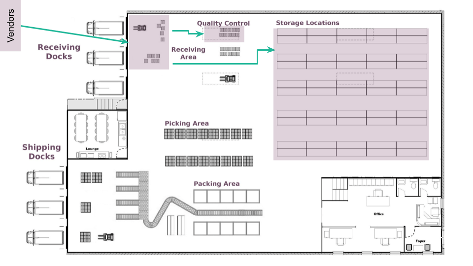

Here is an example of a fulfillment route. In the morning, items are picked for all the orders that
need to be prepared during the day. These items are picked from storage locations and moved to the
picking area, close to where the orders are packed. Then, the orders are packed in their respective
boxes, and conveyor belts bring them to the shipping docks, ready to be delivered to customers.

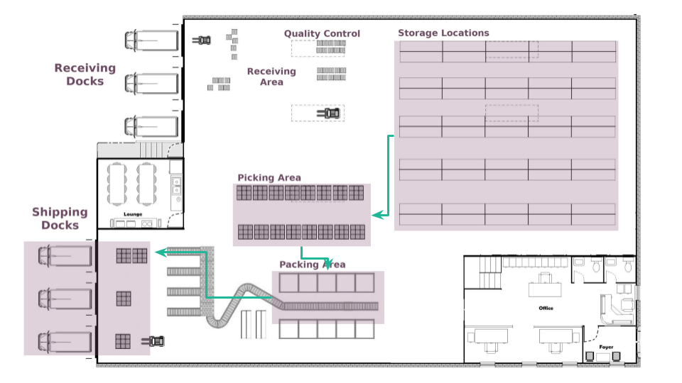

Push rules
----------

Push rules are used to *supply products into a storage locations* as soon as they arrive at a
specific receiving location.

.. note::
   Push rules can only be triggered if there are no pull rules that have already generated the
   product transfers.

In a :doc:`one-step receipt route <receipts_delivery_one_step>`, which uses one push rule, when a
product arrives in the warehouse, a push rule can automatically transfer it to the *Storage
Location*. Different push rules can be applied to different products, allowing for customized
storage locations.

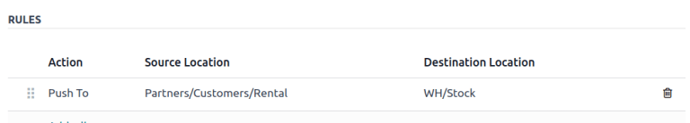

   Push rule for the 'Receive in one step' route.

For more information about configuring rules, skip to the :ref:`Configure rules section
<inventory/shipping_receiving/configure-rules>`.

Pull rules
----------

Pull rules trigger product moves on demand, such as a sales order or a :doc:`need to restock
<../../warehouses_storage/replenishment/reordering_rules>`.

Pull rules work backward from the demand location. For example, in a :ref:`two-step delivery
<inventory/shipping_receiving/two-step-delivery>` route, where items move from *Stock* to *Output*
before being delivered to the *Customer Location*, the pull rule first creates a transfer from
*Output* to the customer. If the product is not at *Output*, another pull rule creates a transfer
from *Stock* to *Output*. The warehouse workers then process these transfers in the reverse order:
picking, then shipping.

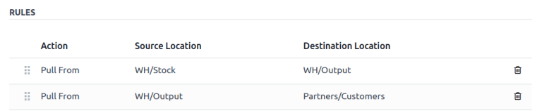

   Pull rules for the 'Deliver in two steps' route.

For more information about configuring rules, skip to the :ref:`Configure rules section
<inventory/shipping_receiving/configure-rules>`.

.. _use-routes/routes-rules:
||||||| 645af1f1e45d27383bbd27b7a662e6de95a1b6e1
.. note::
   Routes are applicable on products, product categories, shipping methods, :ref:`packagings
   <inventory/product_management/route-on-packaging>`, and on the sales order line.

About routes and terminology
============================

In a generic warehouse, there are receiving docks, a quality control area, storage locations,
picking and packing areas, and shipping docks. All products go through all these locations. As the
products move through the locations, each location triggers the products' specified route and
rules.

.. image:: use_routes/stock-example.png
   :align: center
   :alt: View of a generic warehouse with stock and quality control area.

In this example, vendor trucks unload pallets of ordered products at the receiving docks. Operators
then scan the products in the receiving area. Depending on the product's route and rules, some of
these products are sent to a quality control area (for example, products that are components used
in the manufacturing process), while others are directly stored in their respective locations.

Here is an example of a fulfillment route. In the morning, items are picked for all the orders that
need to be prepared during the day. These items are picked from storage locations and moved to the
picking area, close to where the orders are packed. Then, the orders are packed in their respective
boxes, and conveyor belts bring them to the shipping docks, ready to be delivered to customers.

Push rules
----------

Push rules are used to *supply products into a storage locations* as soon as they arrive at a
specific receiving location.

.. note::
   Push rules can only be triggered if there are no pull rules that have already generated the
   product transfers.

In a :doc:`one-step receipt route <receipts_delivery_one_step>`, which uses one push rule, when a
product arrives in the warehouse, a push rule can automatically transfer it to the *Storage
Location*. Different push rules can be applied to different products, allowing for customized
storage locations.

   Push rule for the 'Receive in one step' route.

For more information about configuring rules, skip to the :ref:`Configure rules section
<inventory/shipping_receiving/configure-rules>`.

Pull rules
----------

Pull rules trigger product moves on demand, such as a sales order or a :doc:`need to restock
<../../warehouses_storage/replenishment/reordering_rules>`.

Pull rules work backward from the demand location. For example, in a :ref:`two-step delivery
<inventory/shipping_receiving/two-step-delivery>` route, where items move from *Stock* to *Output*
before being delivered to the *Customer Location*, the pull rule first creates a transfer from
*Output* to the customer. If the product is not at *Output*, another pull rule creates a transfer
from *Stock* to *Output*. The warehouse workers then process these transfers in the reverse order:
picking, then shipping.

   Pull rules for the 'Deliver in two steps' route.

For more information about configuring rules, skip to the :ref:`Configure rules section
<inventory/shipping_receiving/configure-rules>`.

.. _use-routes/routes-rules:
=======
.. _inventory/routes/config:
>>>>>>> 6ea850df866641eb8cac7292646aea16723761e8

Configuration
=============

To access routes and select them on products, navigate to :menuselection:`Inventory app -->
Configuration --> Settings`. In the *Warehouse* section, ensure the :guilabel:`Multi-Step Routes`
and :guilabel:`Storage Locations` features are enabled, then click :guilabel:`Save`.

<<<<<<< eee2e56e2998b754e43758f4854137ae073789fb
- Manage product manufacturing chains.
- Manage default locations per product.
- Define routes within the stock warehouse according to business needs, such as quality control,
  after-sales services, or supplier returns.
- Help rental management by generating automated return moves for rented products.

To configure a route for a product, first, open the :guilabel:`Inventory` application and go to
:menuselection:`Configuration --> Settings`. Then, in the :guilabel:`Warehouse` section, enable the
:guilabel:`Multi-Step Routes` feature and click :guilabel:`Save`.

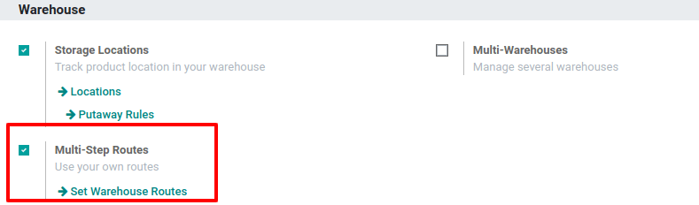

.. note::
   The :guilabel:`Storage Locations` feature is automatically activated with the
   :guilabel:`Multi-Step Routes` feature.

Once this first step is completed, the user can use pre-configured routes that come with Odoo, or
they can create custom routes.

Pre-configured routes
---------------------

To access Odoo's pre-configured routes, go to :menuselection:`Inventory --> Configuration -->
Warehouses`. Then, open a warehouse form. In the :guilabel:`Warehouse Configuration` tab, the user
can view the warehouse's pre-configured routes for :guilabel:`Incoming Shipments` and
:guilabel:`Outgoing Shipments`.

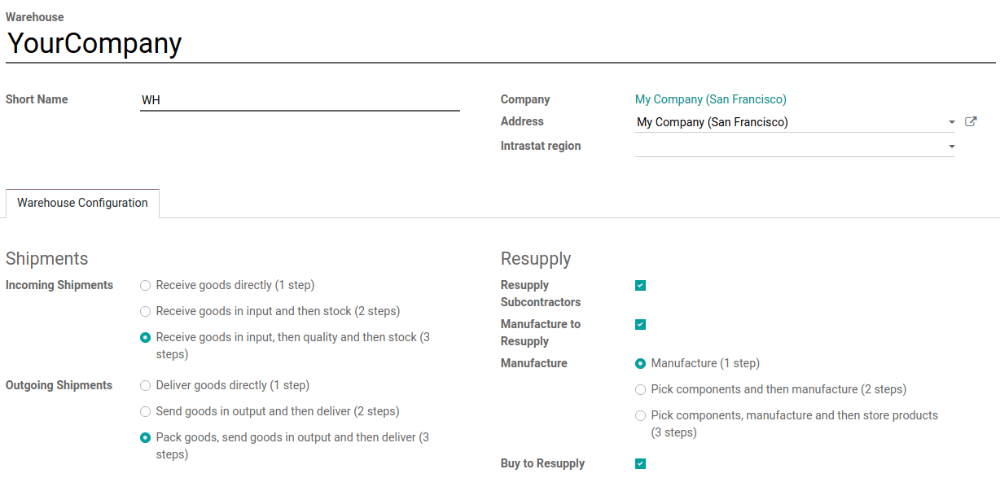

Some more advanced routes, such as pick-pack-ship, are also available. The user can select the
route that best fits their business needs. Once the :guilabel:`Incoming Shipments` and
:guilabel:`Outgoing Shipments` routes are set, head to :menuselection:`Inventory --> Configuration
--> Routes` to see the specific routes that Odoo generated.

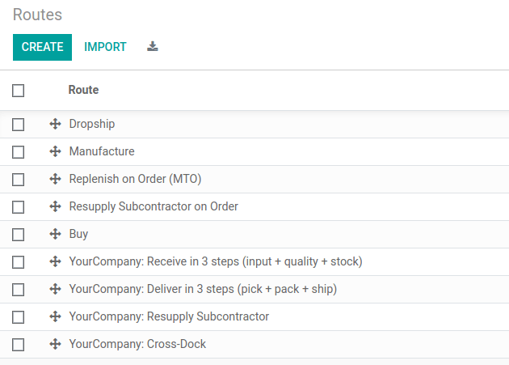

On the :guilabel:`Routes` page, click on a route to open the route form. In the route form, the
user can view which places the route is :guilabel:`Applicable On`. The user can also set the route
to only apply on a specific :guilabel:`Company`. This is useful for multi-company environments; for
example, a user can have a company and warehouse in Country A and a second company and warehouse in
Country B.

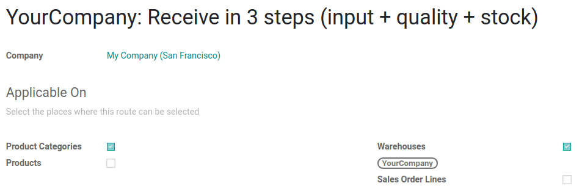

At the bottom of the route form, the user can view the specific :guilabel:`Rules` for the route.
Each :guilabel:`Rule` has an :guilabel:`Action`, a :guilabel:`Source Location`, and a
:guilabel:`Destination Location`.

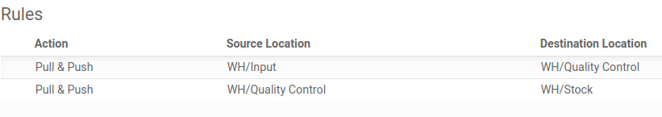

Custom Routes
-------------

To create a custom route, go to :menuselection:`Inventory --> Configuration --> Routes`, and click
on :guilabel:`Create`. Next, choose the places where this route can be selected. A route can be
applicable on a combination of places.

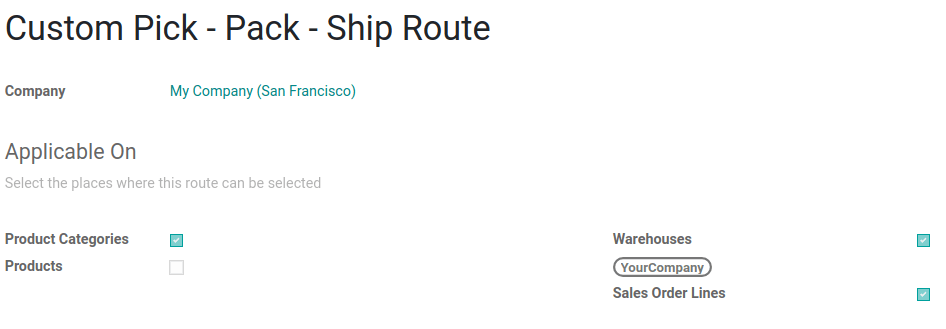

Each place has a different behavior, so it is important to tick only the useful ones and adapt each
route accordingly. Then, configure the :guilabel:`Rules` of the route.

If the route is applicable on a product category, the route still needs to be manually set on the
product category form by going to :menuselection:`Inventory --> Configuration --> Product
Categories`. Then, select the product category and open the form. Next, click :guilabel:`Edit` and
under the :guilabel:`Logistics` section, set the :guilabel:`Routes`.

When applying the route on a product category, all the rules configured in the route are applied to
**every** product in the category. This can be helpful if the business uses the dropshipping
process for all the products from the same category.

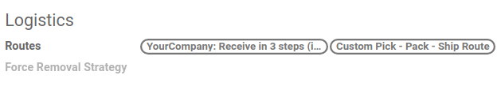

The same behavior applies to the warehouses. If the route can apply to :guilabel:`Warehouses`, all
the transfers occurring inside the chosen warehouse that meet the conditions of the route's rules
will then follow that route.

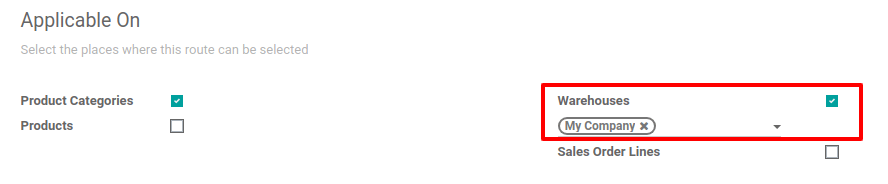

If the route is applicable on :guilabel:`Sales Order Lines`, it is more or less the opposite. The
route must be manually chosen when creating a quotation. This is useful if some products go through
different routes.

Remember to toggle the visibility of the :guilabel:`Route` column on the quotation/sales order.
Then, the route can be chosen on each line of the quotation/sales order.

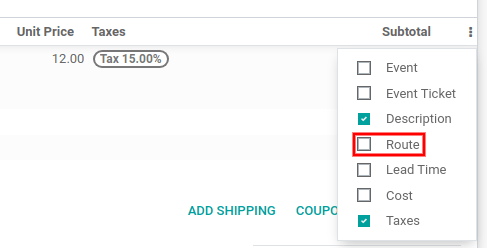

Finally, there are routes that can be applied to products. Those work more or less like the product
categories: once selected, the route must be manually set on the product form.

To set a route on a product, go to :menuselection:`Inventory --> Products --> Products` and select
the desired product. Then, go to the :guilabel:`Inventory` tab and under the :guilabel:`Operations`
section, select the :guilabel:`Routes`.

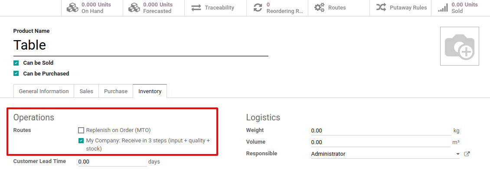
||||||| 645af1f1e45d27383bbd27b7a662e6de95a1b6e1
- Manage product manufacturing chains.
- Manage default locations per product.
- Define routes within the stock warehouse according to business needs, such as quality control,
  after-sales services, or supplier returns.
- Help rental management by generating automated return moves for rented products.

To configure a route for a product, first, open the :guilabel:`Inventory` application and go to
:menuselection:`Configuration --> Settings`. Then, in the :guilabel:`Warehouse` section, enable the
:guilabel:`Multi-Step Routes` feature and click :guilabel:`Save`.

.. note::
   The :guilabel:`Storage Locations` feature is automatically activated with the
   :guilabel:`Multi-Step Routes` feature.

Once this first step is completed, the user can use pre-configured routes that come with Odoo, or
they can create custom routes.

Pre-configured routes
---------------------

To access Odoo's pre-configured routes, go to :menuselection:`Inventory --> Configuration -->
Warehouses`. Then, open a warehouse form. In the :guilabel:`Warehouse Configuration` tab, the user
can view the warehouse's pre-configured routes for :guilabel:`Incoming Shipments` and
:guilabel:`Outgoing Shipments`.

Some more advanced routes, such as pick-pack-ship, are also available. The user can select the
route that best fits their business needs. Once the :guilabel:`Incoming Shipments` and
:guilabel:`Outgoing Shipments` routes are set, head to :menuselection:`Inventory --> Configuration
--> Routes` to see the specific routes that Odoo generated.

On the :guilabel:`Routes` page, click on a route to open the route form. In the route form, the
user can view which places the route is :guilabel:`Applicable On`. The user can also set the route
to only apply on a specific :guilabel:`Company`. This is useful for multi-company environments; for
example, a user can have a company and warehouse in Country A and a second company and warehouse in
Country B.

.. seealso::
   :ref:`Applicable on packagings <inventory/product_management/packaging-route>`

At the bottom of the route form, the user can view the specific :guilabel:`Rules` for the route.
Each :guilabel:`Rule` has an :guilabel:`Action`, a :guilabel:`Source Location`, and a
:guilabel:`Destination Location`.

Custom Routes
-------------

To create a custom route, go to :menuselection:`Inventory --> Configuration --> Routes`, and click
on :guilabel:`Create`. Next, choose the places where this route can be selected. A route can be
applicable on a combination of places.

Each place has a different behavior, so it is important to tick only the useful ones and adapt each
route accordingly. Then, configure the :guilabel:`Rules` of the route.

If the route is applicable on a product category, the route still needs to be manually set on the
product category form by going to :menuselection:`Inventory --> Configuration --> Product
Categories`. Then, select the product category and open the form. Next, click :guilabel:`Edit` and
under the :guilabel:`Logistics` section, set the :guilabel:`Routes`.

When applying the route on a product category, all the rules configured in the route are applied to
**every** product in the category. This can be helpful if the business uses the dropshipping
process for all the products from the same category.

The same behavior applies to the warehouses. If the route can apply to :guilabel:`Warehouses`, all
the transfers occurring inside the chosen warehouse that meet the conditions of the route's rules
will then follow that route.

If the route is applicable on :guilabel:`Sales Order Lines`, it is more or less the opposite. The
route must be manually chosen when creating a quotation. This is useful if some products go through
different routes.

Remember to toggle the visibility of the :guilabel:`Route` column on the quotation/sales order.
Then, the route can be chosen on each line of the quotation/sales order.

Finally, there are routes that can be applied to products. Those work more or less like the product
categories: once selected, the route must be manually set on the product form.

To set a route on a product, go to :menuselection:`Inventory --> Products --> Products` and select
the desired product. Then, go to the :guilabel:`Inventory` tab and under the :guilabel:`Operations`
section, select the :guilabel:`Routes`.

=======
Additionally, routes are generated depending on the warehouse's reception and delivery
configurations. To access these settings, navigate to :menuselection:`Inventory app -->
Configuration --> Warehouses` and select the relevant warehouse. In the *Warehouse Configuration*
tab, enable the desired inbound and outbound flows in the :guilabel:`Incoming Shipments` and
:guilabel:`Outgoing Shipments` fields.
>>>>>>> 6ea850df866641eb8cac7292646aea16723761e8

.. important::
   To use 1-step, 2-step, or 3-step receptions or deliveries, only the :guilabel:`Incoming
   Shipments` and :guilabel:`Outgoing Shipments` fields should be set. Do **not** create or modify
   rules to set up these flows.

.. seealso::
   :doc:`../../warehouses_storage/inventory_management/warehouses`

.. _inventory/routes/warehouse-routes:

Standard warehouse routes
=========================

Odoo automatically generates warehouse routes based on the :guilabel:`Incoming Shipments` and
:guilabel:`Outgoing Shipments` fields of the warehouse. These routes automatically apply to every
product in the warehouse, and do **not** need to be :ref:`manually applied <inventory/routes/apply>`
on individual products.

Depending on the route, products move through the following warehouse locations, where `<WH>` is the
warehouse's short name:

- |ST|: The main stock location, used by all flows.
- |IN|: Where products are received before being stored. Used in 2-step and 3-step receptions.
- |QC|: Where received products are checked. Used in 3-step receptions.
- |PACK|: Where picked products are packed. Used in 3-step deliveries.
- |OUT|: Where products wait before being shipped. Used in 2-step and 3-step deliveries.

Odoo activates and archives these locations automatically when the warehouse options change.

.. image:: use_routes/stock-example.png
   :alt: View of a generic warehouse with stock and quality control area.

The following tables list the operations created for each option. Each operation is created when the
previous one is validated.

Incoming shipments
------------------

.. list-table::
   :width: 100 %
   :widths: 35 65
   :header-rows: 1

   * - Route
     - Operations created
   * - :doc:`Receive and Store (1 step) <receipts_delivery_one_step>`
     - *Receipts*: |VEND| → |ST|
   * - :doc:`Receive then Store (2 steps) <receipts_delivery_two_steps>`
     - #. *Receipts*: |VEND| → |IN|
       #. *Storage*: |IN| → |ST|
   * - :doc:`Receive, Quality Control, then Store (3 steps) <receipts_three_steps>`
     - #. *Receipts*: |VEND| → |IN|
       #. *Quality Control*: |IN| → |QC|
       #. *Storage*: |QC| → |ST|

Outgoing shipments
------------------

.. list-table::
   :width: 100 %
   :widths: 35 65
   :header-rows: 1

   * - Route
     - Operations created
   * - :doc:`Deliver (1 step) <receipts_delivery_one_step>`
     - *Delivery Orders*: |ST| → |CUST|
   * - :doc:`Pick then Deliver (2 steps) <receipts_delivery_two_steps>`
     - #. *Pick*: |ST| → |OUT|
       #. *Delivery Orders*: |OUT| → |CUST|
   * - :doc:`Pick, Pack, then Deliver (3 steps) <delivery_three_steps>`
     - #. *Pick*: |ST| → |PACK|
       #. *Pack*: |PACK| → |OUT|
       #. *Delivery Orders*: |OUT| → |CUST|

.. note::
   Depending on the warehouse configuration, Odoo can also generate the following warehouse routes:

   - :doc:`Cross-Dock <cross_dock>`: Moves received products directly from |IN| to |OUT| without
     storing them. Generated when neither :guilabel:`Incoming Shipments` nor :guilabel:`Outgoing
     Shipments` is set to 1 step.
   - *Resupply Subcontractor*: Sends components from |ST| to subcontractors. Generated when
     :guilabel:`Resupply Subcontractors` is enabled on the warehouse.

.. seealso::
   :doc:`../../warehouses_storage/inventory_management/use_locations`

.. _inventory/routes/overview:

Advanced: how routes work
=========================

:ref:`Standard routes <inventory/routes/warehouse-routes>` work without any rule configurations. For
more advanced users, the following section provides information about routes and their rules and
operations.

*Routes* are combinations of :ref:`push <inventory/routes/overview/push-rules>` and :ref:`pull
<inventory/routes/overview/pull-rules>` rules that determine how products move between locations.

.. _inventory/routes/overview/push-rules:

Push rules
----------

Push rules move products from a source location to a destination location. These rules are triggered
as soon as products arrive at the source location.

.. important::
   Push rules can only be triggered once a product transfer has already been generated.

.. example::
   Different products arrive from |VEND| at |IN|. Push rules are configured on some products to move
   directly to |ST| as soon as they arrive at |IN|, while other products are pushed to |QC|.

   .. image:: use_routes/push-to-rule-example.png
      :alt: View of a generic push to rule when receiving products.

.. _inventory/routes/overview/pull-rules:

Pull rules
----------

Pull rules define product transfer flows from a source location to a destination location. These
rules are demand-driven, triggered only when demand (e.g., sales orders or reordering needs) is
confirmed at the destination location.

.. important::
   For multi-step routes, pull rules are often used along with push rules. When there are multiple
   locations in the transfer flow, the pull rule specifies the final destination of the product and
   generates the first transfer in the route. Push rules are required to move the product through
   the rest of the transfer flow.

.. example::
   For example, a warehouse is configured with a 3-step delivery route. A pull rule is configured to
   move products from the |ST| as soon as they are needed at |CUST|. The rule also creates the first
   transfer in the flow, a *Pick* operation that moves products from |ST| to the |PACK|. Then, push
   rules move the products from |PACK| to |OUT|, then finally from |OUT| to |CUST|.

   .. image:: use_routes/pull-from-rule-example.png
      :alt: View of a generic pull from rule when preparing deliveries.

.. _inventory/routes/reference:

Additional routes
=================

In addition to the standard warehouse flows, the following optional routes are available in Odoo.
Unlike standard warehouse routes, these routes are **not** applied automatically. They must be
manually :ref:`applied <inventory/routes/apply>` to individual products, product categories, or
other records.

.. list-table::
   :width: 100 %
   :widths: 30 70
   :header-rows: 1

   * - Route
     - Description
   * - :doc:`Replenish on Order (MTO) <../../warehouses_storage/replenishment/mto>`
     - Triggers a replenishment for each order instead of using existing stock. Used together with
       the *Buy* or *Manufacture* route. Archived by default.
   * - Buy
     - Creates an |RfQ| when products need to be replenished. Requires the **Purchase** app.
   * - Manufacture
     - Creates an |MO| when products need to be replenished. Requires the **Manufacturing** app.
   * - :doc:`Dropship <dropshipping>`
     - Has a vendor ship products directly to the customer.
   * - :doc:`Resupply Subcontractor on Order
       <../../../manufacturing/subcontracting/subcontracting_resupply>`
     - Sends components to the subcontractor when a subcontracted product is ordered. The components
       are sent from stock through the warehouse's *Resupply Subcontractor* route.
   * - :doc:`Dropship Subcontractor on Order
       <../../../manufacturing/subcontracting/subcontracting_dropship>`
     - Has a vendor deliver components directly to the subcontractor.

.. _inventory/routes/apply:

Applying routes
===============

Routes can be manually assigned to products, product categories, packagings, shipping methods, and
sales order lines. This is only required for :ref:`additional routes <inventory/routes/reference>`,
such as *Replenish on Order (MTO)*, *Buy*, *Manufacture*, or *Dropship*.

.. important::
   In order to apply routes on these forms, they must first be :ref:`made selectable
   <inventory/routes/manage/visibility>`.

.. _inventory/routes/apply/products:

On products
-----------

To assign routes directly to a product, navigate to :menuselection:`Inventory app --> Products -->
Products` and select the product. On the product form, select the *Inventory* tab, then select one
or more :guilabel:`Routes` in the *Operations* section.

.. tip::
   To see which routes and rules apply to a product without modifying them, click
   :icon:`oi-arrow-right` :guilabel:`View Diagram` next to the :guilabel:`Routes` field.

.. image:: use_routes/route-product.png
   :alt: Routes on a product form.

On product categories
---------------------

To assign routes to a product category, navigate to :menuselection:`Inventory app --> Configuration
--> Product Categories` and select the product category. On the category form, select one or more
:guilabel:`Routes` in the *Logistics* section.

.. image:: use_routes/route-category.png
   :alt: Routes on a product category form.

On product packagings
---------------------

To assign routes to a product packaging, navigate to :menuselection:`Inventory app --> Products -->
Products` and select the product. On the product form, select the *Inventory* tab. In the
*Packaging* section, existing packagings are listed. By default, the route column is hidden. To
enable it, click the :icon:`oi-settings-adjust` :guilabel:`(Optional Columns)` icon, then select
:guilabel:`Routes`.

In the newly added column, select one or more routes on a packaging line.

.. seealso::
   :ref:`inventory/product_management/packaging-route`

On shipping methods
-------------------

To assign routes to a shipping method, navigate to :menuselection:`Inventory app --> Configuration
--> Delivery Methods` and select the shipping method. On the form, select one or more
:guilabel:`Routes`.

.. image:: use_routes/route-delivery.png
   :alt: Routes on a delivery method form.

.. seealso::
   :ref:`inventory/shipping_receiving/shipping-route`

On sales order lines
--------------------

To assign routes to a sales order line, open the **Sales** app and select the sales quotation.
Existing lines are listed in the *Order Lines* tab. By default, the route column is hidden. To
enable it, click the :icon:`oi-settings-adjust` :guilabel:`(Optional Columns)` icon, then select
:guilabel:`Route`.

In the newly-added column, select one or more routes on an order line.

.. image:: use_routes/route-so-line.png
   :alt: Routes on a sales order line.

.. _inventory/routes/manage:

Advanced: managing routes
=========================

.. important::
   The following section is intended for advanced users needing configurations for custom flows.
   Standard 1-step, 2-step, and 3-step flows require no route or rule changes.

Access a dashboard of routes by navigating to :menuselection:`Inventory app --> Configuration -->
Routes`. This opens the *Routes* page, displaying a list of all available routes across all
warehouses.

.. tip::
   To access a specific warehouse's routes, navigate to :menuselection:`Inventory app -->
   Configuration --> Warehouses`. Select the warehouse, then click the :icon:`fa-refresh`
   :guilabel:`Routes` smart button.

To view additional settings, click the desired route in the list. This opens the route's form.

.. image:: use_routes/route-form.png
   :alt: Route form in Odoo Inventory.

.. _inventory/routes/manage/visibility:

Define route visibility
-----------------------

The :guilabel:`Company` field allows users to restrict the route to specific companies (if using a
multi-company environment).

In the *Applicable On* section, specify any forms on which the route can be made selectable via the
following options:

- :guilabel:`Product Categories`: Allow routes to be selectable on a *Product Categories* form. When
  configured with a route, every product in the category inherits the route's rules.
- :guilabel:`Products`: Allow routes to be selectable on a *Products* form. The configured product
  inherits the route's rules.
- :guilabel:`Packagings`: Allow routes to be selectable on a *Product Packaging* form. When
  configured with a packaging, all orders with the chosen packaging inherit the route's rules.
- :guilabel:`Shipping Methods`: Allow routes to be selectable on a *Delivery Methods* form. When
  applied on a carrier, all orders with the chosen shipping method inherit the route's rules.
- :guilabel:`Warehouses`: Select the warehouses for which this route should be used as the default
  route.
- :guilabel:`Sales Order Lines`: Allow routes to be selectable on sales order lines. When applied
  on individual sales order lines, the chosen routes override the corresponding product's routes for
  the specific order **only**.

.. seealso::
   See the :ref:`Applying routes <inventory/routes/apply>` section to see how routes are applied on
   these forms.

.. _inventory/routes/manage/view-rules:

Viewing rules
-------------

The *Rules* section lists any rules defining the route.

.. warning::
   Modifying Odoo's default rules may cause unexpected errors in the database and is therefore
   **not** recommended.

Each rule has an :guilabel:`Action`, an :guilabel:`Operation Type`, a :guilabel:`Source Location`,
and a :guilabel:`Destination Location`.

The following actions are defined in Odoo:

- `Pull From`: When demand (e.g., from sales or manufacturing orders) appears at the *Destination
  Location*, a picking of the specified *Operation Type* is created from the *Source Location* to
  fulfill the demand.
- `Push To`: When products arrive at the *Source Location*, a picking of the specified *Operation
  Type* is created to send them to the *Destination Location*.
- `Pull & Push`: Create both a `Pull From` and `Push To` rule with the selected *Operation Type*,
  *Source Location*, and *Destination Location*.
- `Manufacture`: When products are needed at the *Destination Location*, a manufacturing order (MO)
  is created to fulfill the demand, taking any required components from the *Source Location*.
- `Buy`: When products are needed at the *Destination Location*, a request for quotation (RfQ) is
  created to fulfill the need.

.. note::
   The `Buy` action is only available with the **Purchase** app installed, and `Manufacture` with
   the **Manufacturing** app.

.. seealso::
   - :doc:`../../warehouses_storage/inventory_management/operation_type`
   - :doc:`../../warehouses_storage/inventory_management/use_locations`
