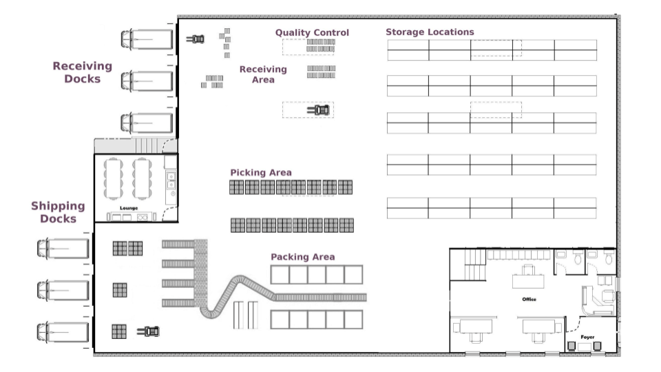
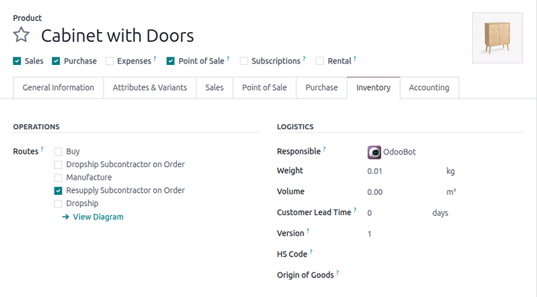
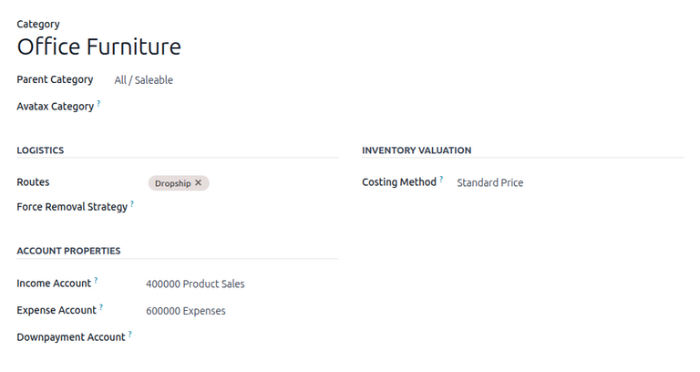
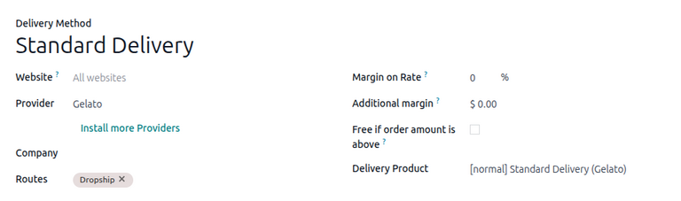
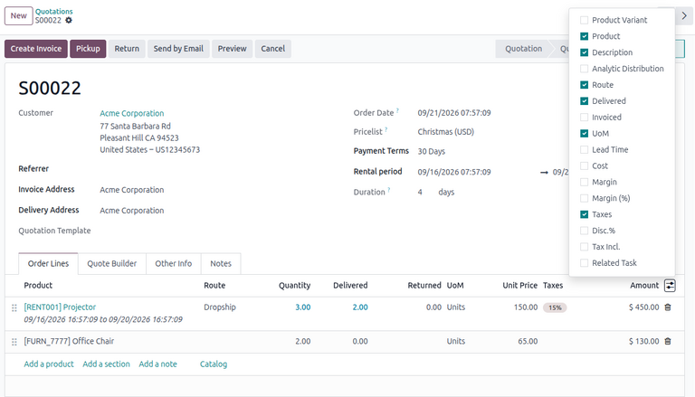
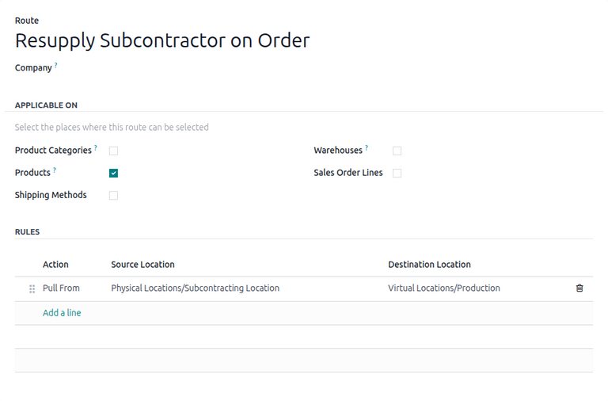

==========================
Routes and push/pull rules
==========================

.. |SO| replace:: :abbr:`SO (Sales Order)`
.. |RfQ| replace:: :abbr:`RfQ (Request for Quotation)`
.. |MO| replace:: :abbr:`MO (Manufacturing Order)`
.. |VEND| replace:: `Partners/Vendors`
.. |CUST| replace:: `Partners/Customers`
.. |ST| replace:: `<WH>/Stock`
.. |QC| replace:: `<WH>/Quality Control`
.. |IN| replace:: `<WH>/Input`
.. |OUT| replace:: `<WH>/Output`
.. |PACK| replace:: `<WH>/Packing Zone`

*Routes* in Odoo control the movement of products between different locations, whether internal or
external, using a combination of push and pull rules. These rules help automate the movement of
products based on specific conditions. They can be configured to create advanced use cases such as:

- Managing product manufacturing chains.
- Managing default locations per product.
- Defining warehouse movement for quality control, after-sales services, or supplier returns.
- Helping rental management automate return moves for rented products.

.. seealso::
   - `Odoo Tutorials: Routes <https://www.youtube.com/watch?v=qkhDUezyZuc>`_
   - :doc:`Standard routes in Odoo <../daily_operations>`

.. _inventory/routes/config:

Configuration
=============

To access routes and select them on products, navigate to :menuselection:`Inventory app -->
Configuration --> Settings`. In the *Warehouse* section, ensure the :guilabel:`Multi-Step Routes`
and :guilabel:`Storage Locations` features are enabled, then click :guilabel:`Save`.

Additionally, routes are generated depending on the warehouse's reception and delivery
configurations. To access these settings, navigate to :menuselection:`Inventory app -->
Configuration --> Warehouses` and select the relevant warehouse. In the *Warehouse Configuration*
tab, enable the desired inbound and outbound flows in the :guilabel:`Incoming Shipments` and
:guilabel:`Outgoing Shipments` fields.

.. important::
   To use 1-step, 2-step, or 3-step receptions or deliveries, only the :guilabel:`Incoming
   Shipments` and :guilabel:`Outgoing Shipments` fields should be set. Do **not** create or modify
   rules to set up these flows.

.. seealso::
   :doc:`../../warehouses_storage/inventory_management/warehouses`

.. _inventory/routes/warehouse-routes:

Standard warehouse routes
=========================

Odoo automatically generates warehouse routes based on the :guilabel:`Incoming Shipments` and
:guilabel:`Outgoing Shipments` fields of the warehouse. These routes automatically apply to every
product in the warehouse, and do **not** need to be :ref:`manually applied <inventory/routes/apply>`
on individual products.

Depending on the route, products move through the following warehouse locations, where `<WH>` is the
warehouse's short name:

- |ST|: The main stock location, used by all flows.
- |IN|: Where products are received before being stored. Used in 2-step and 3-step receptions.
- |QC|: Where received products are checked. Used in 3-step receptions.
- |PACK|: Where picked products are packed. Used in 3-step deliveries.
- |OUT|: Where products wait before being shipped. Used in 2-step and 3-step deliveries.

Odoo activates and archives these locations automatically when the warehouse options change.

The following tables list the operations created for each option. Each operation is created when the
previous one is validated.

Incoming shipments
------------------

.. list-table::
   :width: 100 %
   :widths: 35 65
   :header-rows: 1

   * - Route
     - Operations created
   * - :doc:`Receive and Store (1 step) <receipts_delivery_one_step>`
     - *Receipts*: |VEND| → |ST|
   * - :doc:`Receive then Store (2 steps) <receipts_delivery_two_steps>`
     - #. *Receipts*: |VEND| → |IN|
       #. *Storage*: |IN| → |ST|
   * - :doc:`Receive, Quality Control, then Store (3 steps) <receipts_three_steps>`
     - #. *Receipts*: |VEND| → |IN|
       #. *Quality Control*: |IN| → |QC|
       #. *Storage*: |QC| → |ST|

Outgoing shipments
------------------

.. list-table::
   :width: 100 %
   :widths: 35 65
   :header-rows: 1

   * - Route
     - Operations created
   * - :doc:`Deliver (1 step) <receipts_delivery_one_step>`
     - *Delivery Orders*: |ST| → |CUST|
   * - :doc:`Pick then Deliver (2 steps) <receipts_delivery_two_steps>`
     - #. *Pick*: |ST| → |OUT|
       #. *Delivery Orders*: |OUT| → |CUST|
   * - :doc:`Pick, Pack, then Deliver (3 steps) <delivery_three_steps>`
     - #. *Pick*: |ST| → |PACK|
       #. *Pack*: |PACK| → |OUT|
       #. *Delivery Orders*: |OUT| → |CUST|

.. note::
   Depending on the warehouse configuration, Odoo can also generate the following warehouse routes:

   - :doc:`Cross-Dock <cross_dock>`: Moves received products directly from |IN| to |OUT| without
     storing them. Generated when neither :guilabel:`Incoming Shipments` nor :guilabel:`Outgoing
     Shipments` is set to 1 step.
   - *Resupply Subcontractor*: Sends components from |ST| to subcontractors. Generated when
     :guilabel:`Resupply Subcontractors` is enabled on the warehouse.

.. seealso::
   :doc:`../../warehouses_storage/inventory_management/use_locations`

.. _inventory/routes/overview:

Advanced: how routes work
=========================

:ref:`Standard routes <inventory/routes/warehouse-routes>` work without any rule configurations. For
more advanced users, the following section provides information about routes and their rules and
operations.

*Routes* are combinations of :ref:`push <inventory/routes/overview/push-rules>` and :ref:`pull
<inventory/routes/overview/pull-rules>` rules that determine how products move between locations.

.. _inventory/routes/overview/push-rules:

Push rules
----------

Push rules move products from a source location to a destination location. These rules are triggered
as soon as products arrive at the source location.

.. important::
   Push rules can only be triggered once a product transfer has already been generated.

.. example::
   Different products arrive from |VEND| at |IN|. Push rules are configured on some products to move
   directly to |ST| as soon as they arrive at |IN|, while other products are pushed to |QC|.

   .. image:: use_routes/push-to-rule-example.png
      :alt: View of a generic push to rule when receiving products.

.. _inventory/routes/overview/pull-rules:

Pull rules
----------

Pull rules define product transfer flows from a source location to a destination location. These
rules are demand-driven, triggered only when demand (e.g., sales orders or reordering needs) is
confirmed at the destination location.

.. important::
   For multi-step routes, pull rules are often used along with push rules. When there are multiple
   locations in the transfer flow, the pull rule specifies the final destination of the product and
   generates the first transfer in the route. Push rules are required to move the product through
   the rest of the transfer flow.

.. example::
   For example, a warehouse is configured with a 3-step delivery route. A pull rule is configured to
   move products from the |ST| as soon as they are needed at |CUST|. The rule also creates the first
   transfer in the flow, a *Pick* operation that moves products from |ST| to the |PACK|. Then, push
   rules move the products from |PACK| to |OUT|, then finally from |OUT| to |CUST|.

   .. image:: use_routes/pull-from-rule-example.png
      :alt: View of a generic pull from rule when preparing deliveries.

.. _inventory/routes/reference:

Additional routes
=================

In addition to the standard warehouse flows, the following optional routes are available in Odoo.
Unlike standard warehouse routes, these routes are **not** applied automatically. They must be
manually :ref:`applied <inventory/routes/apply>` to individual products, product categories, or
other records.

.. list-table::
   :width: 100 %
   :widths: 30 70
   :header-rows: 1

   * - Route
     - Description
   * - :doc:`Replenish on Order (MTO) <../../warehouses_storage/replenishment/mto>`
     - Triggers a replenishment for each order instead of using existing stock. Used together with
       the *Buy* or *Manufacture* route. Archived by default.
   * - Buy
     - Creates an |RfQ| when products need to be replenished. Requires the **Purchase** app.
   * - Manufacture
     - Creates an |MO| when products need to be replenished. Requires the **Manufacturing** app.
   * - :doc:`Dropship <dropshipping>`
     - Has a vendor ship products directly to the customer.
   * - :doc:`Resupply Subcontractor on Order
       <../../../manufacturing/subcontracting/subcontracting_resupply>`
     - Sends components to the subcontractor when a subcontracted product is ordered. The components
       are sent from stock through the warehouse's *Resupply Subcontractor* route.
   * - :doc:`Dropship Subcontractor on Order
       <../../../manufacturing/subcontracting/subcontracting_dropship>`
     - Has a vendor deliver components directly to the subcontractor.

.. _inventory/routes/apply:

Applying routes
===============

Routes can be manually assigned to products, product categories, packagings, shipping methods, and
sales order lines. This is only required for :ref:`additional routes <inventory/routes/reference>`,
such as *Replenish on Order (MTO)*, *Buy*, *Manufacture*, or *Dropship*.

.. important::
   In order to apply routes on these forms, they must first be :ref:`made selectable
   <inventory/routes/manage/visibility>`.

.. _inventory/routes/apply/products:

On products
-----------

To assign routes directly to a product, navigate to :menuselection:`Inventory app --> Products -->
Products` and select the product. On the product form, select the *Inventory* tab, then select one
or more :guilabel:`Routes` in the *Operations* section.

.. tip::
   To see which routes and rules apply to a product without modifying them, click
   :icon:`oi-arrow-right` :guilabel:`View Diagram` next to the :guilabel:`Routes` field.

On product categories
---------------------

To assign routes to a product category, navigate to :menuselection:`Inventory app --> Configuration
--> Product Categories` and select the product category. On the category form, select one or more
:guilabel:`Routes` in the *Logistics* section.

On product packagings
---------------------

To assign routes to a product packaging, navigate to :menuselection:`Inventory app --> Products -->
Products` and select the product. On the product form, select the *Inventory* tab. In the
*Packaging* section, existing packagings are listed. By default, the route column is hidden. To
enable it, click the :icon:`oi-settings-adjust` :guilabel:`(Optional Columns)` icon, then select
:guilabel:`Routes`.

In the newly added column, select one or more routes on a packaging line.

.. seealso::
   :ref:`inventory/product_management/packaging-route`

On shipping methods
-------------------

To assign routes to a shipping method, navigate to :menuselection:`Inventory app --> Configuration
--> Delivery Methods` and select the shipping method. On the form, select one or more
:guilabel:`Routes`.

.. seealso::
   :ref:`inventory/shipping_receiving/shipping-route`

On sales order lines
--------------------

To assign routes to a sales order line, open the **Sales** app and select the sales quotation.
Existing lines are listed in the *Order Lines* tab. By default, the route column is hidden. To
enable it, click the :icon:`oi-settings-adjust` :guilabel:`(Optional Columns)` icon, then select
:guilabel:`Route`.

In the newly-added column, select one or more routes on an order line.

.. _inventory/routes/manage:

Advanced: managing routes
=========================

.. important::
   The following section is intended for advanced users needing configurations for custom flows.
   Standard 1-step, 2-step, and 3-step flows require no route or rule changes.

Access a dashboard of routes by navigating to :menuselection:`Inventory app --> Configuration -->
Routes`. This opens the *Routes* page, displaying a list of all available routes across all
warehouses.

.. tip::
   To access a specific warehouse's routes, navigate to :menuselection:`Inventory app -->
   Configuration --> Warehouses`. Select the warehouse, then click the :icon:`fa-refresh`
   :guilabel:`Routes` smart button.

To view additional settings, click the desired route in the list. This opens the route's form.

.. _inventory/routes/manage/visibility:

Define route visibility
-----------------------

The :guilabel:`Company` field allows users to restrict the route to specific companies (if using a
multi-company environment).

In the *Applicable On* section, specify any forms on which the route can be made selectable via the
following options:

- :guilabel:`Product Categories`: Allow routes to be selectable on a *Product Categories* form. When
  configured with a route, every product in the category inherits the route's rules.
- :guilabel:`Products`: Allow routes to be selectable on a *Products* form. The configured product
  inherits the route's rules.
- :guilabel:`Packagings`: Allow routes to be selectable on a *Product Packaging* form. When
  configured with a packaging, all orders with the chosen packaging inherit the route's rules.
- :guilabel:`Shipping Methods`: Allow routes to be selectable on a *Delivery Methods* form. When
  applied on a carrier, all orders with the chosen shipping method inherit the route's rules.
- :guilabel:`Warehouses`: Select the warehouses for which this route should be used as the default
  route.
- :guilabel:`Sales Order Lines`: Allow routes to be selectable on sales order lines. When applied
  on individual sales order lines, the chosen routes override the corresponding product's routes for
  the specific order **only**.

.. seealso::
   See the :ref:`Applying routes <inventory/routes/apply>` section to see how routes are applied on
   these forms.

.. _inventory/routes/manage/view-rules:

Viewing rules
-------------

The *Rules* section lists any rules defining the route.

.. warning::
   Modifying Odoo's default rules may cause unexpected errors in the database and is therefore
   **not** recommended.

Each rule has an :guilabel:`Action`, an :guilabel:`Operation Type`, a :guilabel:`Source Location`,
and a :guilabel:`Destination Location`.

The following actions are defined in Odoo:

- `Pull From`: When demand (e.g., from sales or manufacturing orders) appears at the *Destination
  Location*, a picking of the specified *Operation Type* is created from the *Source Location* to
  fulfill the demand.
- `Push To`: When products arrive at the *Source Location*, a picking of the specified *Operation
  Type* is created to send them to the *Destination Location*.
- `Pull & Push`: Create both a `Pull From` and `Push To` rule with the selected *Operation Type*,
  *Source Location*, and *Destination Location*.
- `Manufacture`: When products are needed at the *Destination Location*, a manufacturing order (MO)
  is created to fulfill the demand, taking any required components from the *Source Location*.
- `Buy`: When products are needed at the *Destination Location*, a request for quotation (RfQ) is
  created to fulfill the need.

.. note::
   The `Buy` action is only available with the **Purchase** app installed, and `Manufacture` with
   the **Manufacturing** app.

.. seealso::
   - :doc:`../../warehouses_storage/inventory_management/operation_type`
   - :doc:`../../warehouses_storage/inventory_management/use_locations`
