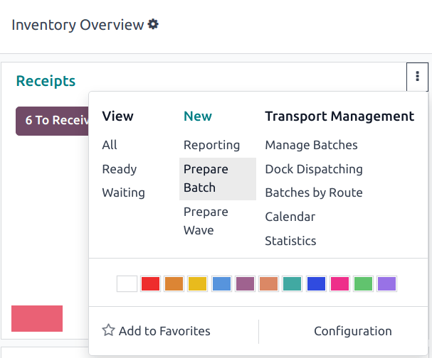
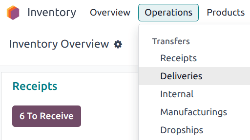

=============
Batch picking
=============

.. _inventory/misc/batch_picking:

*Batch picking* enables a single picker to handle multiple orders at once, reducing the number of
times needed to navigate to a warehouse location. When picking in batches, orders are grouped and
consolidated into a picking list. After the picking, the batch is taken to an output location, where
the products are sorted into their respective delivery packages.

Since orders *must* be sorted at the output location after being picked, this picking method suits
businesses with a few products that are ordered often. Storing high-demand items in easily
accessible locations can increase the number of orders that are fulfilled efficiently.

Batch picking is ideal for industries or warehouses that handle high order volumes with a stable
demand. This method increases efficiency by allowing workers to pick items for multiple orders in
one trip through the warehouse, reducing travel time and boosting productivity.

Configuration
=============

To activate the batch picking option, begin by going to :menuselection:`Inventory app -->
Configuration --> Settings`. Under the :guilabel:`Operations` section, check the :guilabel:`Batch,
Wave & Cluster Transfers` box.

Since batch picking is a method to optimize the *pick* operation in Odoo, the :guilabel:`Storage
Locations` and :guilabel:`Multi-Step Routes` options under the :guilabel:`Warehouse` heading must
also be checked on this settings page. When finished, click :guilabel:`Save`.

.. image:: batch/locations-routes-checkbox.png
   :alt: Enable *Storage Locations* and *Multi-Step Routes* Inventory > Configuration > Settings.

.. seealso::
   - :doc:`Delivery in two steps <../daily_operations/receipts_delivery_two_steps>`
   - :doc:`../daily_operations/delivery_three_steps`

Create batch transfers
======================

To manually group transfers directly from the :menuselection:`Inventory app`, hover over the
desired operation type from the :guilabel:`Inventory Overview` menu (e.g. the :guilabel:`Receipts`
Kanban card), click the :icon:`fa-ellipsis-v` :guilabel:`(vertical ellipsis)` icon, then select
:guilabel:`Prepare Batch`.

On the batch transfer form, fill the following fields out accordingly:

- :guilabel:`Responsible`: employee assigned to the picking. Leave this field blank if *any* worker
  can fulfill this picking.
- :guilabel:`Operation Type`: from the drop-down menu, select the operation type under which the
  picking is categorized.
- :guilabel:`Scheduled Date`: specifies the date by which the :guilabel:`Responsible` person should
  complete the transfer to the output location.

.. seealso::
   To learn more about the :guilabel:`Dock Location`, :guilabel:`Vehicle`, and :guilabel:`Vehicle
   Category` fields, see :doc:`dispatch management system
   <../../shipping_receiving/setup_configuration/dispatch>`.

Next, in the :guilabel:`Transfers` list, click :guilabel:`Add a line` to open the :guilabel:`Add:
Transfers` window.

If the :guilabel:`Operation Type` field was filled, the list will filter transfer records matching
the selected :guilabel:`Operation Type`.

Click the :guilabel:`New` button to create a new transfer.

Once the transfer records are selected, click :guilabel:`Confirm` to confirm the batch picking.

.. example::
   A new batch transfer is assigned to the :guilabel:`Responsible`, `Joel Willis`, for the `Pick`
   :guilabel:`Operation Type`. The :guilabel:`Scheduled Date` is set to `August 11`.

   .. image:: batch/batch-transfer-form.png
      :alt: View of *Batch Transfers* form.

   Clicking the :guilabel:`Add a line` button opens the :guilabel:`Add:Transfers` window,
   displaying only pickings. This is because the :guilabel:`Operation Type` was set to `Pick` on the
   batch transfer form.

   Click the checkbox to the left of the transfers, `WH/PICK/00001` and `WH/PICK/00002`, to include
   them in the new transfer. Then, click the :guilabel:`Select` button to close the
   :guilabel:`Add:Transfers` window.

   .. image:: batch/add-transfers-window.png
      :alt: Select multiple transfers from the *Add:Transfers* window.

.. _inventory/warehouses_storage/add-batch-transfers:

Add batch from transfers list
-----------------------------

Another method of creating batch transfers is available using the :guilabel:`Add to batch` option in
a list. Navigate to the :menuselection:`Inventory app --> Operations` drop-down menu, and select any
of the :guilabel:`Transfers` to open a filtered list of transfers.

         Manufacturings, Batch Transfers, Dropships.

On the transfers list, select the checkbox to the left of the selected transfers to add in a batch.
Next, navigate to the :icon:`fa-cog` :guilabel:`Actions` button, and click :guilabel:`Add to batch`
from the resulting drop-down menu.

.. image:: batch/add-to-batch.png
   :alt: Use *Add to batch* button, from the *Action* button's list.

Doing so opens an :guilabel:`Add to batch` pop-up window, wherein the employee
:guilabel:`Responsible` for the picking can be assigned.

Choose from the two radio options to add to :guilabel:`an existing batch transfer` or create
:guilabel:`a new batch transfer`.

Add a :guilabel:`Description` for this batch.

.. tip::
   The :guilabel:`Description` field can be used to add additional information to help workers
   identify the source of the batch, where to place the batch, what shipping containers to use, etc.

To create a batch to be processed at a later time, select the :guilabel:`Draft` checkbox.

Conclude the process by clicking :guilabel:`Confirm`.

.. image:: batch/add-to-batch-window.png
   :alt: Show *Add to batch* window to create a batch transfer.

Automatic batches
-----------------

Batches can be automatically created and assigned based on several criteria. The *Automatic Batches*
option is defined on the *operation type* level.

.. example::
   In a multi-steps delivery process, the picking operation can be grouped by customer, while the
   shipping operation can be organized by carrier and destination country.

To enable *Automatic Batches*, navigate to :menuselection:`Inventory app --> Configuration -->
Operation Types`, and select the desired operation type (e.g. :guilabel:`Delivery`,
:guilabel:`Pick`, etc). Then, select one or more :guilabel:`Batch Grouping` criteria by ticking the
appropriate checkbox. Even if more than one grouping option is selected, only one batch is created.

Batches can be automatically generated based on the following criteria:

- :guilabel:`Contact`
- :guilabel:`Carrier`
- :guilabel:`Destination Country`
- :guilabel:`Source Location`
- :guilabel:`Destination Location`

.. image:: batch/auto-batch-grouping.png
   :alt: The Batch and Wave Transfers settings page with the Auto batch grouping criteria visible.

Process batch transfer
======================

Handle batch transfers in the :menuselection:`Inventory app --> Operations --> Batch Transfers`
page.

From here, select the intended transfer from the list. Then, on the batch transfer form, input the
:guilabel:`Done` quantities for each product, under the :guilabel:`Detailed Operations` tab.
Finally, select :guilabel:`Validate` to complete the picking.

.. tip::
   Be certain the batch transfer is complete when the :guilabel:`Validate` button is highlighted in
   purple. If the :guilabel:`Check Availability` button is highlighted instead, that means there are
   items in the batch that are currently *not* available in-stock.

.. _inventory/management/batch-transfers-example:

.. example::
   In a batch transfer involving products from pickings, `WH/PICK/00001` and `WH/PICK/00002`, the
   :guilabel:`Detailed Operations` tab shows that the product, `Cabinet with Doors`, has been picked
   because the :guilabel:`Done` column matches the value in the :guilabel:`Reserved` column.
   However, `0.00` quantities have been picked for the other product, `Cable Management Box`.

   .. image:: batch/process-batch-transfer.png
      :alt: Show batch transfer of products from two pickings in the *Detailed Operations* tab.

Only in-stock products are visible in the :guilabel:`Detailed Operations` tab.

To view the complete product list, switch to the :guilabel:`Operations` tab. On this list, the
:guilabel:`Demand` column indicates the required quantity for the order. The :guilabel:`Reserved`
column shows the available stock to fulfill the order. Lastly, the :guilabel:`Done` column specifies
the products that have been picked, and are ready for the next step.

.. example::
   The product, `Desk Pad`, from the same batch as the :ref:`example above
   <inventory/management/batch-transfers-example>`, is only visible in the :guilabel:`Operations`
   tab because there are no :guilabel:`Reserved` quantities in stock to fulfill the batch transfer.

   Click the :guilabel:`Check Availability` button to search the stock again for available products.

   .. image:: batch/operations-tab.png
      :alt: Show unavailable reserved quantities in the *Operations* tab.

Create backorder
----------------

On the batch transfer form, if the :guilabel:`Done` quantity of the product is *less* than the
:guilabel:`Reserved` quantity, a pop-up window appears.

This pop-up window provides the option: :guilabel:`Create Backorder?`.

Clicking the :guilabel:`Create Backorder` button automatically creates a new batch transfer.

.. note::
   When creating a new backorder, the transfers that have **not** been validated in the batch will
   be removed from it.

Click :guilabel:`No Backorder` to finish the picking *without* creating another batch picking.

Click :guilabel:`Discard` to cancel the validation, and return to the batch transfer form.

.. image:: batch/create-backorder.png
   :alt: Show the *Create Backorder* pop-up.
