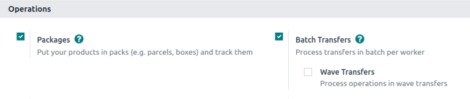
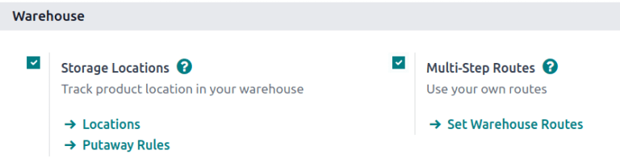
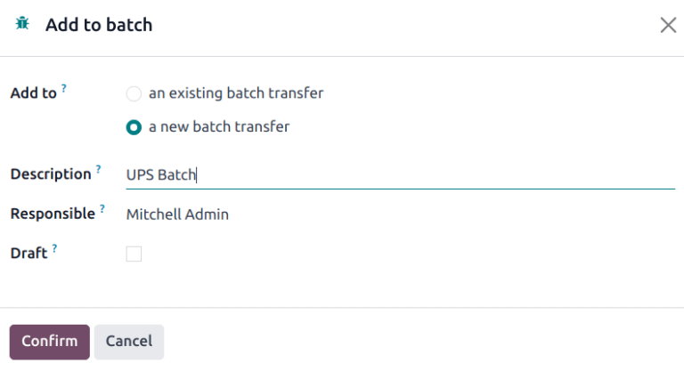

===============
Cluster picking
===============

.. _inventory/misc/cluster_picking:

.. |SO| replace:: :abbr:`SO (Sales Order)`
.. |SOS| replace:: :abbr:`SOs (Sales Orders)`

Cluster picking is an advanced picking method that combines the efficiency of :ref:`batch picking
<inventory/misc/batch_picking>` with immediate sorting during the picking process. It is best suited
for warehouses with high order volumes where organization and speed are critical.

Unlike batch picking, which requires a separate sorting step after picking, cluster picking sorts
items directly into designated bins or containers for each *sales order* (SO). This eliminates the
need for post-picking consolidation, making it ideal for operations prioritizing speed and accuracy.

Cluster picking is particularly effective in environments where immediate organization is crucial,
and orders contain a mix of items that need precise sorting during, rather than after, the picking
process.

However, cluster picking does have some disadvantages. For instance, urgent orders cannot be
prioritized, and optimized batches must be manually created beforehand. As a result, the picking
process can lead to bottlenecks.

.. _inventory/misc/cluster_picking/example:

.. example::
   #. |SO| 1 calls for one apple and orange
   #. |SO| 2 calls for one apple and banana
   #. |SO| 3 calls for one apple, orange, and banana

   Apples are stored in Shelf A, oranges in Shelf B, and bananas in Shelf C.

   To pick products for three orders at once, the cart is loaded with three empty packages.

   Starting at Shelf A, the picker places apples into each package. Next, the picker navigates to
   Shelf B, and places oranges in the packages designated for |SO| 1 and |SO| 3. Finally, the picker
   pushes the cart to Shelf C, and loads packages for |SO| 2 and |SO| 3 with a banana, each.

   With the packages for all three |SOS| packed, the picker pushes the cart to the output location,
   where the packages are sealed and prepared for shipment.

   .. image:: cluster/cluster-example.png
      :alt: Show example of fulfilling sales orders 2 and 3 at once.

Configuration
=============

To enable cluster picking, begin by navigating to :menuselection:`Inventory app --> Configuration
--> Settings`. Under the :guilabel:`Operations` heading, activate the :guilabel:`Packages` and
:guilabel:`Batch, Wave & Cluster Transfers` options.

Since batch picking is used to optimize the *pick* operation in Odoo, the :guilabel:`Storage
Locations` and :guilabel:`Multi-Step Routes` options, under the :guilabel:`Warehouse` heading, must
also be checked on this settings page.

*Storage locations* allow products to be stored in specific locations they can be picked from, while
*multi-step routes* enable the picking operation itself.

When finished, click :guilabel:`Save`.

.. _inventory/misc/create-package:

Packages setup
--------------

To configure the containers to be used during the picking process, navigate to
:menuselection:`Inventory app --> Products --> Packages`. Click the :guilabel:`New` button to create
a new package.

On the new package form, the :guilabel:`Package Reference` is pre-filled with the next available
`PACK` number in the system. :guilabel:`Pack Date` is automatically set to the creation date of the
form.

Set the :guilabel:`Package Use` field to :guilabel:`Reusable Box`.

.. seealso::
   :doc:`Packages <../../product_management/configure/package>`

.. example::
   A package intended for cluster picking is named `CLUSTER-PACK-3` for easy identification. For
   this workflow, the products are directly packed using their intended shipping boxes, so
   :guilabel:`Package Use` is set to :guilabel:`Reusable Box`.

   .. image:: cluster/cluster-package.png
      :alt: Create new package form.

Create cluster batch
====================

To create a cluster, navigate to :menuselection:`Inventory app` and select the operation type card,
:guilabel:`Delivery Orders` or :guilabel:`Pick` (whichever is the first operation in the delivery
flow).

.. note::
   Cluster pick batches can be created for outgoing shipments in one, two, or three steps.

.. seealso::
   - :doc:`Delivery in one step <../daily_operations/receipts_delivery_one_step>`
   - :doc:`Delivery in two steps <../daily_operations/receipts_delivery_two_steps>`
   - :doc:`Delivery in three steps <../daily_operations/delivery_three_steps>`

Click the checkbox to the left of the corresponding outgoing operation to add them to the batch.
With the desired pickings selected, click the :icon:`fa-cog` :guilabel:`Actions` button, and select
the :guilabel:`Add to batch` option from the resulting drop-down menu.

.. example::
   To create a cluster batch, as shown in the :ref:`example above
   <inventory/misc/cluster_picking/example>`, in a warehouse configured with two-step outgoing
   shipments, the following pick operations are selected:

   - `WH/PICK/00007`: linked to |SO| 88 for one apple and orange.
   - `WH/PICK/00008`: linked to |SO| 89 for one apple and banana.
   - `WH/PICK/00009`: linked to |SO| 90 for one apple, orange, and banana.

   .. image:: cluster/select-picks.png
      :alt: Use *Add to batch* button, from the *Action* button's list.

Doing so opens an :guilabel:`Add to batch` pop-up window, wherein the employee
:guilabel:`Responsible` for the picking can be assigned.

Choose from the two options in the :guilabel:`Add to` field to either: add to :guilabel:`an existing
batch transfer`, or create :guilabel:`a new batch transfer`.

Then, add a :guilabel:`Description` for this batch.

.. tip::
   The :guilabel:`Description` field can be used to add additional information to help workers
   identify the source of the batch, where to place the batch, what shipping containers to use, etc.

To create draft batch pickings to be confirmed at a later date, select the :guilabel:`Draft`
checkbox.

Conclude the process by clicking :guilabel:`Confirm`.

Process batches
===============

To process batches, navigate to :menuselection:`Inventory app --> Operations --> Batch Transfers`.
Click on a batch to select it.

In the :guilabel:`Detailed Operations` tab, products that are to be picked are grouped by location.

Set the :guilabel:`Destination Package` to the package dedicated to that particular order.

.. example::
   Process the cluster batch for the three orders of apples, oranges, and bananas :ref:`example
   <inventory/misc/cluster_picking/example>` by assigning each picking to a dedicated package.

   At the storage location for apples, `WH/Stock/Shelf A`, assign the apples in all three pickings
   to one of the three reusable packages, `CLUSTER-PACK-1`, `CLUSTER-PACK-2`, or `CLUSTER-PACK-3`.

   Record this in Odoo using the :guilabel:`Destination Package` field in the :guilabel:`Detailed
   Operations` tab.

   .. image:: cluster/cluster-batch-example.png
      :alt: Example of processing cluster pickings in *Inventory*.
