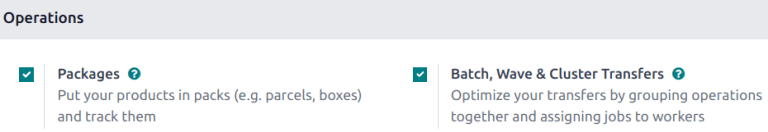
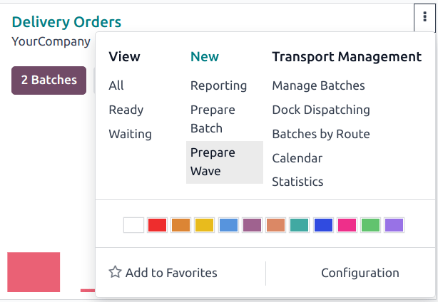
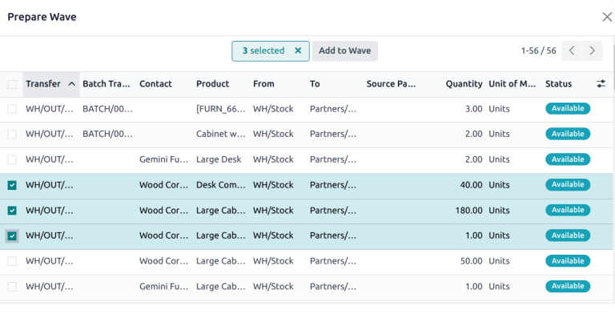
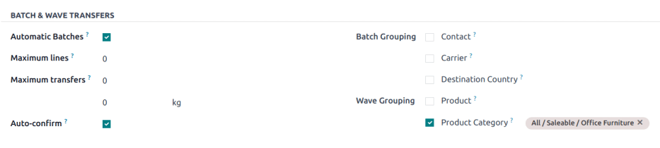

==============
Wave transfers
==============

.. |SO| replace:: :abbr:`SO (sales order)`

While a batch transfer is a group of several pickings, a **wave transfer** contains certain parts
of different pickings. In Odoo, wave transfers are batch transfers with an extra step: transfers are
split before being grouped in a batch.

Wave picking is ideal for warehouses that need to optimize the handling of high order volumes while
managing complex picking criteria. With wave transfers, orders are grouped into waves based on
factors like product location, category, or schedule shipping times. Each wave is assigned to a
different employee for the most efficient execution.

Wave picking is particularly useful for operations where multiple sales orders (SOs), or a single
order, must be picked across different waves. This approach enables flexible scheduling, allowing
warehouses to align picking activities with shipping deadlines, or resource availability.

.. example::
   #. |SO| 1 calls for one apple and one orange
   #. |SO| 2 calls for one apple and one banana
   #. |SO| 3 calls for one apple, one

   Apples are stored in Shelf A, oranges in Shelf B, and bananas in Shelf C. A warehouse employee is
   assigned to the wave, and is provided with the following instructions:

   - Shelf A: Pick three apples. Place them into a central cart designated for the wave.
   - Shelf B: Pick two oranges. Add them to the same cart.
   - Shelf C: Pick two bananas. Add them to the cart.

   The employee then takes the cart to the sorting/packing station. Items are then sorted and packed
   into individual orders.

Configuration
=============

To enable wave picking, begin by navigating to :menuselection:`Inventory --> Configuration -->
Settings`. In the :guilabel:`Operations` section, tick the :guilabel:`Batch, Wave & Cluster
Transfers` checkbox to enable the setting. Then, click :guilabel:`Save` to save the changes.

Create a wave
=============

Wave transfers can only contain product lines from transfers of the same operation type. To view
all the transfers and product lines in a specific operation, navigate to the
:menuselection:`Inventory app`. Find the desired Kanban card, then click the :icon:`fa-ellipsis-v`
:guilabel:`(vertical ellipsis)` icon to open the options menu.

Next, the :guilabel:`Storage Locations` and :guilabel:`Multi-Step Routes` options, under the
:guilabel:`Warehouse` heading, must also be checked on this settings page.

*Storage locations* allow products to be stored in specific locations they can be picked from, while
*multi-step routes* enable the picking operation itself.

Add products to a wave
----------------------

On the operations page, select the product lines that should be added in a new or existing wave.
Then, click :guilabel:`Add to Wave`.

.. tip::
   Use the :guilabel:`Filters` in the search bar to group lines with the same product, location,
   carrier, etc.

After that, a pop-up box appears.

To add the selected lines to an existing wave transfer, select the :guilabel:`an existing wave
transfer` option and select the existing wave transfer from the drop-down menu.

To create a new wave transfer, select the :guilabel:`a new wave transfer` option. If creating a new
wave transfer, an employee can also be set in the optional :guilabel:`Responsible` field. Once the
desired options are selected, click :guilabel:`Confirm` to add the product lines to a wave.

Automatic waves
---------------

Waves can be automatically created and assigned based on different criteria. The *Automatic Batches*
option is defined on the *operation type* level, which enables the creation of waves with distinct
grouping criteria for each operation type.

To enable *Automatic Batches*, navigate to :menuselection:`Inventory app --> Configuration -->
Operation Types`, and select the desired operation type (e.g. Delivery, Pick, etc). Under the
:guilabel:`Batch & Wave Transfers` heading, tick the :guilabel:`Automatic Batches` checkbox.

Then, select one or more :guilabel:`Wave Grouping` criteria by ticking the appropriate checkbox.
Even if more than one grouping option is selected, only one wave is created.

Automatic waves can be created based on the following criteria:

- :guilabel:`Product`: Split transfers by product, then group transfers that have the same product.
- :guilabel:`Product Category`: Split transfers by product category, then group transfers that have
  the same product category.

Process a wave
==============

To view all wave transfers and their statuses, go to :menuselection:`Inventory --> Operations -->
Wave Transfers`.
