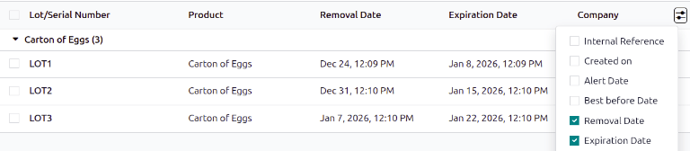
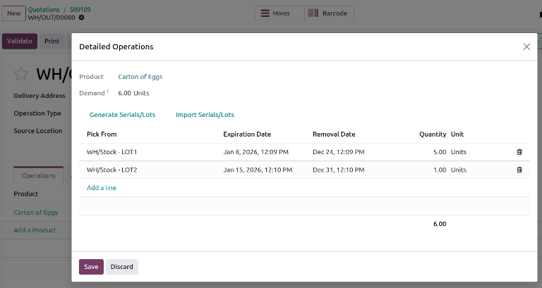

============
FEFO removal
============

The *First Expired, First Out* (FEFO) removal strategy targets products for removal based on their
assigned removal dates.

.. seealso::
   :doc:`About removal strategies <../removal_strategies>`

.. _inventory/warehouses_storage/removal-date:

Removal date
============

Products **must** be removed from inventory before their *removal date*, which is set as a certain
number of days before the product's *expiration date*.

The user sets this number of days by navigating to the product form's :guilabel:`Inventory` tab.
Under the :guilabel:`Traceability` section, ensure the :guilabel:`Tracking` field is set to either
:guilabel:`By Lots` or :guilabel:`By Unique Serial Number`.

Next, select the :guilabel:`Expiration Date` option, which makes the :guilabel:`Removal Date` field
(and other date fields) appear.

.. important::
   The :guilabel:`Lots and Serial Numbers` and :guilabel:`Expiration Dates` features **must** be
   enabled in :menuselection:`Inventory app --> Configuration --> Settings` to track expiration
   dates.

The expiration date of a product is determined by adding the date the product was received to the
number of days specified in the :guilabel:`Expiration Date` field of the product form.

The removal date takes this expiration date, and subtracts the number of days specified in the
:guilabel:`Removal Date` field of the product form.

.. seealso::
   :doc:`Expiration dates <../../product_management/product_tracking/expiration_dates>`

.. example::
   In the :guilabel:`Inventory` tab of the product, `Egg`, the following :guilabel:`Dates` are set
   by the user:

   - :guilabel:`Expiration Date`: `30` days after receipt
   - :guilabel:`Removal Date`: `15` days before expiration date

   .. image:: fefo/user-set-date.png
      :align: center
      :alt: Display expiration and removal dates set on the product form.

   A shipment of Eggs arrive at the warehouse on January 1st. So, the expiration date of the Eggs is
   **January 31st** (Jan 1st + 30). By extension, the removal date is **January 16th** (Jan 31 -
   15).

.. _inventory/warehouses_storage/exp-date:

To view the expiration dates of items in stock, navigate to the product form, and click the
:guilabel:`On Hand` smart button.

Next, click the additional options icon, located on the far-right, and select the columns:
:guilabel:`Expiration Date` and :guilabel:`Removal Date`.

         smart button from the product form.

Workflow
========

Using the :abbr:`FEFO (First Expired, First Out)` removal strategy ensures that products with the
nearest removal date are picked first.

To understand how this removal strategy works, consider the following example below about the
product, `Carton of eggs`, which is a box containing twelve eggs.

The product is tracked :guilabel:`By Lots`, and the product category's :guilabel:`Force Removal
Strategy` is set to :guilabel:`First Expired, First Out (FEFO)`.

.. seealso::
   - :ref:`Set up force removal strategy <inventory/warehouses_storage/removal-config>`
   - :ref:`Enable lots tracking <inventory/warehouses_storage/lots-setup>`
   - `Odoo Tutorials: Perishable Products <https://www.odoo.com/slides/slide/5324/share>`_

.. list-table::
   :header-rows: 1
   :stub-columns: 1

   * -
     - LOT1
     - LOT2
     - LOT3
   * - On-hand stock
     - 5
     - 2
     - 1
   * - Expiration date
     - April 4
     - April 10
     - April 15
   * - :ref:`Removal date <inventory/warehouses_storage/exp-date>`
     - February 26
     - March 4
     - March 9

To see the removal strategy in action, go to the :menuselection:`Sales app` and create a new
quotation.

Clicking :guilabel:`Confirm` creates a delivery order for today, December 29th, and the lot numbers
with the soonest expiration dates are reserved, using the :abbr:`FEFO (First Expired, First Out)`
removal strategy.

To view the detailed pickings, click the :guilabel:`⦙≣ (bulleted list)` icon, located on the
far-right of the Carton of egg's product line, in the :guilabel:`Operations` tab of the delivery
order. Doing so opens the :guilabel:`Open: Stock move` pop-up window.

In the :guilabel:`Open: Stock move` pop-up window, the :guilabel:`Pick from` field displays where
the quantities to fulfill the :guilabel:`Demand` are picked from.

Since the order demanded six Cartons of eggs, using the :abbr:`FEFO (First Expired, First Out)`
removal strategy, all five Cartons from `LOT1`, with the removal date of February 26th, are picked.
The remaining Carton is selected from `LOT2`, which has a removal date of March 4th.

