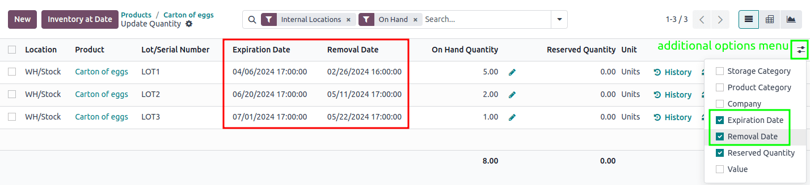
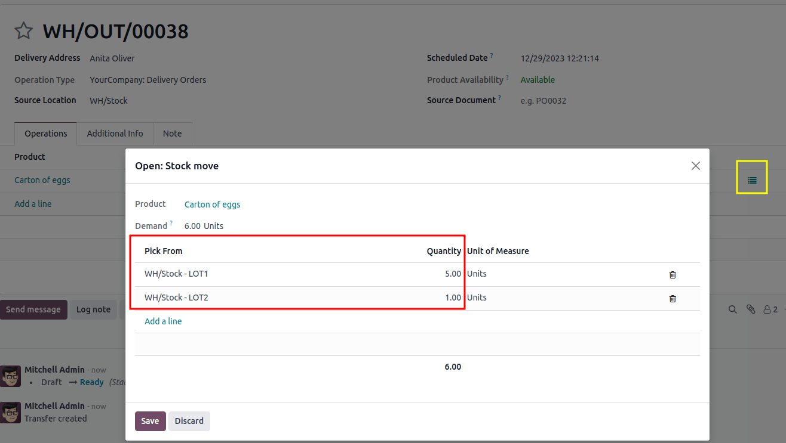

============
FEFO removal
============

The *First Expired, First Out* (FEFO) removal strategy targets products for removal based on their
assigned removal dates.

.. _inventory/warehouses_storage/fefo_enable:

Enabling the FEFO removal strategy
==================================

Lots and serial numbers differentiate identical products and track information like arrival or
expiration dates. To enable this feature, navigate to :menuselection:`Inventory --> Configuration
--> Settings`. Under the :guilabel:`Traceability` heading, check the box beside :guilabel:`Lots &
Serial Numbers`. After :guilabel:`Lots & Serial Numbers` is enabled, the :guilabel:`Expiration Date`
feature appears. Enable it to track expiration dates, best-before dates, removal dates, and alert
dates.

.. image:: fefo/enable-features.png
   :alt: Enable Lots & Serial Numbers and Expiration Dates in the Inventory settings.

Enable tracking by lots or serial numbers
-----------------------------------------

Next, ensure the intended product is tracked by lots or serial numbers by navigating to the product
form through :menuselection:`Inventory --> Products --> Products` and selecting the desired product.
On the product form, open the :guilabel:`General Information` tab and select the check box next to
the :guilabel:`Track Inventory` field, then select either :guilabel:`By Unique Serial Number` or
:guilabel:`By Lots`.

.. image:: fefo/track-by-lots.png
   :alt: Enable tracking by lot.

Setting dates
-------------

Next, set the :guilabel:`Expiration Date`, :guilabel:`Best Before Date`, :guilabel:`Removal Date`,
and :guilabel:`Alert Date` settings for the product. In the :guilabel:`Inventory` tab of the product
form, under the :guilabel:`Traceability` heading, select the :guilabel:`Expiration Date` check box.
The :guilabel:`Dates` heading appears. See :ref:`Removal date
<inventory/warehouses_storage/removal-date>` for more information.

Assigning lots and serial numbers
---------------------------------

After enabling the features, assign lot or serial numbers to products using an :doc:`inventory
adjustment <../../warehouses_storage/inventory_management/count_products>` or during :ref:`product
reception <inventory/product_management/assign-lots>`.

Setting removal strategies
--------------------------

After lot or serial numbers have been assigned, set the removal strategy on the storage location or
product category.

.. image:: fefo/location-categories.png
   :alt: Find the Locations or Categories from the Configuration menu.

On the location
~~~~~~~~~~~~~~~

Open :menuselection:`Inventory app --> Configuration --> Locations`. Select the desired location. On
the location form, under the :guilabel:`Logistics` heading, select :guilabel:`First Expiry First Out
(FEFO)` from the list of removal strategies.

.. image:: fefo/set-on-location.png
   :alt: Set First Expiry First Out as the location removal strategy.

On the product category
~~~~~~~~~~~~~~~~~~~~~~~

Configure removal strategies on product categories by going to :menuselection:`Inventory app -->
Configuration --> Categories` and selecting the intended product category. Next, in the
:guilabel:`Force Removal Strategy` field, specify :guilabel:`First Expiry First Out (FEFO)`.

.. image:: fefo/set-on-category.png
   :alt: Set First Expiry First Out as the product category removal strategy.

.. important::
   When there are different removal strategies applied on both the location and product category for
   a product, the value set on the :guilabel:`Force Removal Strategy` field set on a product
   category form is applied as top priority.

.. _inventory/warehouses_storage/removal-date:

Removal date
============

Products **must** be removed from inventory before their *removal date*, which is set as a certain
number of days before the product's *expiration date*.

The user sets this number of days by navigating to the product form's :guilabel:`Inventory` tab.
Under the :guilabel:`Traceability` section, ensure the :guilabel:`Tracking` field is set to either
:guilabel:`By Lots` or :guilabel:`By Unique Serial Number`.

Next, select the :guilabel:`Expiration Date` option, which makes the :guilabel:`Removal Date` field
(and other date fields) appear.

.. important::
   The :guilabel:`Lots and Serial Numbers` and :guilabel:`Expiration Dates` features **must** be
   enabled in :menuselection:`Inventory app --> Configuration --> Settings` to track expiration
   dates.

The expiration date of a product is determined by adding the date the product was received to the
number of days specified in the :guilabel:`Expiration Date` field of the product form.

The removal date takes this expiration date, and subtracts the number of days specified in the
:guilabel:`Removal Date` field of the product form.

.. example::
   In the :guilabel:`Inventory` tab of the product, `Egg`, the following :guilabel:`Dates` are set
   by the user:

   - :guilabel:`Expiration Date`: `30` days after receipt
   - :guilabel:`Removal Date`: `15` days before expiration date

   .. image:: fefo/user-set-date.png
      :alt: Display expiration and removal dates set on the product form.

   A shipment of Eggs arrive at the warehouse on January 1st. So, the expiration date of the Eggs is
   **January 31st** (Jan 1st + 30). By extension, the removal date is **January 16th** (Jan 31 -
   15).

.. _inventory/warehouses_storage/exp-date:

To view the expiration dates of items in stock, go to :menuselection:`Inventory app --> Products -->
Lots / Serial Numbers`. By default, this report is grouped by location. If necessary, remove that
grouping in the search bar and group by product. Expand the product to show its lots. Next, click
the :icon:`oi-settings-adjust` :guilabel:`(settings adjust)` icon, located on the far-right, and
select the columns: :guilabel:`Expiration Date` and :guilabel:`Removal Date`.

Alternatively, view these dates by clicking the :guilabel:`Lot/Serial Numbers` smart button on the
product form.

.. image:: fefo/removal-date-lots-serial-numbers.png
   :alt: Show expiration dates from the Lots/Serial Numbers list on the product form.

Workflow
========

Using the :abbr:`FEFO (First Expired, First Out)` removal strategy ensures that products with the
nearest removal date are picked first.

To understand how this removal strategy works, consider the following example below about the
product, `Carton of Eggs`, which is a box containing twelve eggs.

The product is tracked :guilabel:`By Lots`, and the product category's :guilabel:`Force Removal
Strategy` is set to :guilabel:`First Expiry First Out (FEFO)`.

.. list-table::
   :header-rows: 1
   :stub-columns: 1

   * -
     - LOT1
     - LOT2
     - LOT3
   * - On-hand stock
     - 5
     - 2
     - 1
   * - Expiration date
     - January 8, 2026
     - January 15, 2026
     - January 22, 2026
   * - :ref:`Removal date <inventory/warehouses_storage/exp-date>`
     - December 24, 2025
     - December 31, 2025
     - January 7, 2026

To see the removal strategy in action, go to the :menuselection:`Sales app` and create a new
quotation.

Clicking :guilabel:`Confirm` creates a delivery order for today, December 9th, and the lot numbers
with the soonest expiration dates are reserved, using the :abbr:`FEFO (First Expired, First Out)`
removal strategy.

To view the detailed pickings, click the :guilabel:`Details` link, located on the far-right of the
Carton of Eggs' product line, in the :guilabel:`Operations` tab of the delivery order. Doing so
opens the :guilabel:`Detailed Operations` pop-up window.

In the :guilabel:`Detailed Operations` pop-up window, the :guilabel:`Pick From` field displays where
the quantities to fulfill the :guilabel:`Demand` are picked from.

Since the order demanded six Cartons of Eggs, using the :abbr:`FEFO (First Expired, First Out)`
removal strategy, all five Cartons from `LOT1`, with the removal date of December 24, are picked.
The remaining Carton is selected from `LOT2`, which has a removal date of December 31.

.. seealso::
   - :doc:`Removal strategies <../removal_strategies>`
   - :ref:`Set up force removal strategy <inventory/warehouses_storage/removal-config>`
   - :doc:`Expiration dates <../../product_management/product_tracking/expiration_dates>`
   - :ref:`Enable lots tracking <inventory/warehouses_storage/lots-setup>`
   - `Odoo Tutorials: Perishable Products <https://www.odoo.com/slides/slide/5324/share>`_
