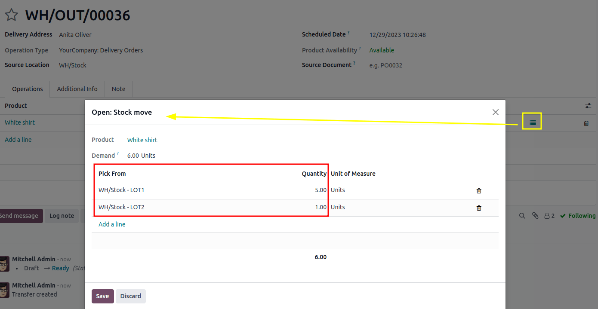

============
FIFO removal
============

The *First In, First Out* (FIFO) removal strategy selects products with the earliest arrival dates.
This method is useful for companies selling products that have short demand cycles, like clothes.
By using :abbr:`FIFO (First In, First Out)`, companies can prevent prolonged stock retention of
specific styles.

.. example::
   Different shipments of t-shirts, tracked by lot numbers, arrive in a business's warehouse between
   August 1st and August 25th. When a customer makes an order on September 1st, the :abbr:`FIFO
   (First In, First Out)` removal strategy prioritizes lots that have been in stock the longest. So,
   products received on August 1st are selected first for picking.

   .. image:: fifo/fifo-example.png
      :alt: Illustration of FIFO selecting the oldest products in stock.

.. _inventory/warehouses_storage/fifo_enable:

Enabling the FIFO removal strategy
==================================

Lots and serial numbers differentiate identical products and track information like arrival or
expiration dates. To enable this feature, navigate to :menuselection:`Inventory --> Configuration
--> Settings`. Under the :guilabel:`Traceability` section, check the box beside :guilabel:`Lots &
Serial Numbers`.

.. image:: fifo/enable-lots-serial-numbers.png
   :alt: Enable Lots & Serial Numbers in the Inventory settings.

Enable tracking by lots or serial numbers
-----------------------------------------

Next, ensure the intended product is tracked by lots or serial numbers by navigating to the product
form through :menuselection:`Inventory --> Products --> Products` and selecting the desired product.
On the product form, open the :guilabel:`General Information` tab and select the check box next to
the :guilabel:`Track Inventory` field, then select either :guilabel:`By Unique Serial Number` or
:guilabel:`By Lots`.

.. image:: fifo/track-by-serial-number.png
   :alt: Enable tracking by serial number.

Assigning lots and serial numbers
---------------------------------

After enabling the features, assign lot or serial numbers to products using an :doc:`inventory
adjustment <../../warehouses_storage/inventory_management/count_products>` or :ref:`during
reception <inventory/product_management/assign-lots>`.

Setting removal strategies
--------------------------

After lot or serial numbers have been assigned, set the removal strategy on the product category or
storage location.

.. image:: fifo/location-categories.png
   :alt: Find the Locations or Categories from the Configuration menu.

On the location
~~~~~~~~~~~~~~~

Open :menuselection:`Inventory app --> Configuration --> Locations`. Select the desired location. On
the location form, under the :guilabel:`Logistics` heading, select :guilabel:`First In First Out
(FIFO)` from the list of removal strategies.

.. image:: fifo/fifo-on-location.png
   :alt: Set First In First Out as the location removal strategy.

On the product category
~~~~~~~~~~~~~~~~~~~~~~~

Configure removal strategies on product categories by going to :menuselection:`Inventory app -->
Configuration --> Categories` and selecting the intended product category. Next, in the
:guilabel:`Force Removal Strategy` field, specify :guilabel:`First In First Out (FIFO)`.

.. image:: fifo/fifo-on-category.png
   :alt: Set First In First Out as the product category removal strategy.

.. important::
   When there are different removal strategies applied on both the location and product category for
   a product, the value set on the :guilabel:`Force Removal Strategy` field set on a product
   category form is applied as top priority.

.. _inventory/warehouses_storage/arrival_date:

Arrival date
============

To see the product lot or serial number that arrived in inventory first, navigate to
:menuselection:`Inventory app --> Products --> Lots/Serial Numbers`. By default, this list is
grouped by location. If necessary, remove that grouping and group by product instead.

Then, select the :icon:`fa-caret-right` :guilabel:`(right-pointing arrow)` icon on the left of a
product line, in order to reveal a list of the product's lots or serial numbers that are in stock.
The :guilabel:`Created on` field shows the lot/serial number creation date, which the system
considers to be the arrival date.

.. example::
   Serial number `0000000000500` of the product, `Cabinet with Doors`, arrived on December 9th, as
   displayed in the :guilabel:`Created on` field.

   .. image:: fifo/created-on.png
      :alt: Display arrival date of a lot for an item.

Workflow
========

To understand how :abbr:`FIFO (First In, First Out)` rotates products out, consider the following
example, focusing on three lots of white shirts.

The shirts are from the *All/Clothes* category, where :abbr:`FIFO (First In, First Out)` is set as
the :guilabel:`Force Removal Strategy`.

The white shirts are tracked :guilabel:`By Lots` in the :guilabel:`Inventory` tab of the product
form.

The following table represents the on-hand stock and lot number details of white shirts.

.. list-table::
   :header-rows: 1
   :stub-columns: 1

   * -
     - LOT1
     - LOT2
     - LOT3
   * - On-hand stock
     - 5
     - 3
     - 2
   * - :ref:`Created on <inventory/warehouses_storage/arrival_date>`
     - March 1
     - April 1
     - May 1

To see the removal strategy in action, create a :ref:`delivery order <inventory/delivery/one-step>`
for six white shirts by navigating to the :menuselection:`Sales app` and creating a new quotation.

After clicking :guilabel:`Confirm` on the sales order, a delivery order with the oldest lot numbers
for shirts are reserved, using the :abbr:`FIFO (First In, First Out)` removal strategy.

To view the detailed pickings, click the :guilabel:`Details` link, located on the far-right of the
white shirt's product line in the :guilabel:`Operations` tab of the delivery order. Doing so opens
the :guilabel:`Detailed Operations` pop-up window.

In the :guilabel:`Detailed Operations` pop-up window, the :guilabel:`Pick From` field displays where
the quantities to fulfill the :guilabel:`Demand` are picked from. Since the order demanded six
shirts, all five shirts from `LOT1`, and one shirt from `LOT2`, are selected.

.. seealso::
   - :doc:`Removal strategies <../removal_strategies>`
   - :ref:`Lot/serial number setup details <inventory/warehouses_storage/lots-setup>`
   - :ref:`Set up force removal strategy <inventory/warehouses_storage/removal-config>`
   - :ref:`Enable lots tracking <inventory/warehouses_storage/lots-setup>`
