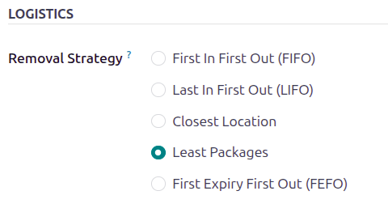
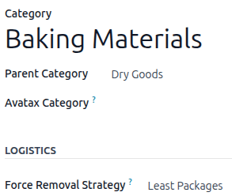
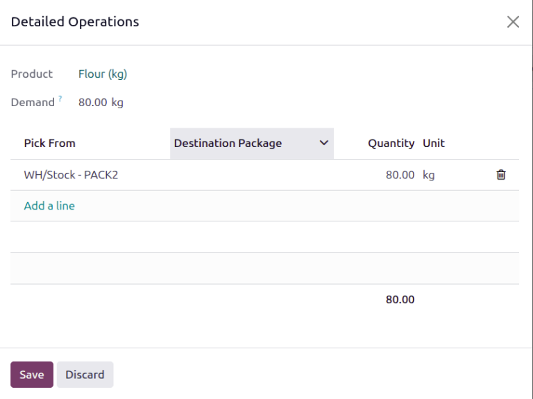

======================
Least packages removal
======================

The *Least Packages* removal strategy fulfills an order by opening the fewest number of packages,
which is ideal for maintaining organized stock without needing to open multiple boxes.

.. _inventory/warehouses_storage/pkg-qty:

.. example::

   To understand how the removal strategy works, consider the following example, featuring a
   warehouse that stores packages of flour in bulk packages of `100 kg`.

   To minimize moisture and prevent possible loss of product due to spillage and repacking, the
   least packages removal strategy is used to fill the order by opening the fewest packages of
   flour, instead of opening multiple packages.

   A package of `100 kg` of flour is depleted to `54 kg` after fulfilling some orders. There are
   other packages of `100 kg` in stock.

   When an order for `14 kg` of flour is placed, the package of `54 kg` is selected, leaving `40 kg`
   of flour in the bag. Another order for `80 kg` of flour is placed. An unopened `100 kg` package
   is used to fulfill the order.

   While this temporarily results in two open packages, one for `40 kg` and another for `20 kg`,
   these open packages are prioritized in the next pickings that are those sizes or smaller.

Enabling the least packages removal strategy
============================================

A *package* is a physical container holding one or more products. Packages can also be used to store
items in bulk.

The packages feature is used to group products together and is required for the *least packages*
removal strategy.

Navigate to :menuselection:`Inventory app --> Configuration --> Settings` and in the
:guilabel:`Operations` section, select the check box for the :guilabel:`Packages` feature.

Store products in packages
--------------------------

First, products are received either in packages or individually. Next, the received products are
stored in packages created :ref:`during a transfer <inventory/warehouses_storage/pack>`.

Set the removal strategy
------------------------

After you have configured your product inventory, set the removal strategy on the :ref:`storage
location <inventory/warehouses_storage/lp-location>` or :ref:`product category
<inventory/warehouses_storage/lp-category>`.

.. _inventory/warehouses_storage/lp-location:

On the storage location
~~~~~~~~~~~~~~~~~~~~~~~

To set a removal strategy on a storage location, you must first enable a couple settings in the
**Inventory** configuration settings. Open :menuselection:`Inventory app --> Configuration -->
Settings`, and in the :guilabel:`Warehouse` section, enable :guilabel:`Storage Locations` and
:guilabel:`Multi-Step Routes`.

Next, open :menuselection:`Inventory app --> Configuration --> Locations`. Open an existing location
or create a new location. On the location form, under the :guilabel:`Logistics` heading, set
the :guilabel:`Removal Strategy`. to :guilabel:`Least Packages`

.. _inventory/warehouses_storage/lp-category:

On the product category
~~~~~~~~~~~~~~~~~~~~~~~

Configure removal strategies on product categories by going to :menuselection:`Inventory app -->
Configuration --> Categories` and selecting the intended product category. Next, in the
:guilabel:`Force Removal Strategy` field, select :guilabel:`Least Packages`.

.. important::
   When there are different removal strategies applied on both the location and product category for
   a product, the value set on the :guilabel:`Force Removal Strategy` field set on a product
   category form is applied as top priority.

   For example, flour is stored in 100-kilogram packages. It is stored in a location with other
   heavy items. To minimize how far pickers have to walk, the location uses the :doc:`closest
   location removal strategy <closest_location>`. To further optimize the picking time, and to
   reduce the number of packages opened during picking, the flour's product category, `Baking
   Materials`, uses the least packages removal strategy.

Workflow
========

Using the *least packages* removal strategy, the fewest number of packages is used to fulfill an
order.

Consider the following example, featuring the product, `Flour (kg)`. The product's
:doc:`unit of measure <../../product_management/configure/uom>`, located on the product form, is set
to `kg`. The product is stored in packages of `100 kg`, with one remaining package containing `54
kg`. The product category's :guilabel:`Force Removal Strategy` is set to :guilabel:`Least Packages`.

.. tip::
   You can verify the product's on-hand stock in the :guilabel:`Locations` report. Open
   :menuselection:`Inventory app --> Reporting --> Locations`. Click in the :guilabel:`Search` field
   to filter by :guilabel:`On Hand`, as well as product.

   .. image:: least_packages/on-hand-quantities.png
      :alt: Show on-hand stock in each package.

A sales order is created for eighty kilograms of flour by going to the :menuselection:`Sales app`
and creating a new quotation. After clicking :guilabel:`Confirm`, the :ref:`delivery order
<inventory/delivery/one-step>` is created.

On the delivery order, the :guilabel:`Quantity` field displays the amount automatically picked,
according to the removal strategy.

For more details about *where* the units were picked, click  :guilabel:`Details` on the product
line. Doing so opens the :guilabel:`Detailed Operations` pop-up window, displaying how the reserved
items were picked, according to the removal strategy.

In the :guilabel:`Detailed Operations` pop-up window, the :guilabel:`Pick From` field displays where
the quantities to fulfill the :guilabel:`Demand` are picked. Because the order demands eighty
kilograms, which exceeds the quantity in the opened package of `54 kg`, an unopened package of `100
kg` is selected.

.. seealso::
   - :doc:`About removal strategies <../removal_strategies>`
   - `Odoo Tutorials: Least Packages <https://www.odoo.com/slides/slide/5477/share>`_
