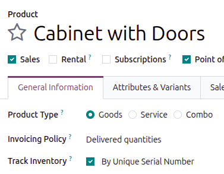
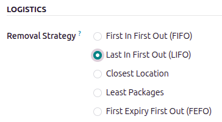
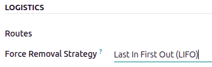
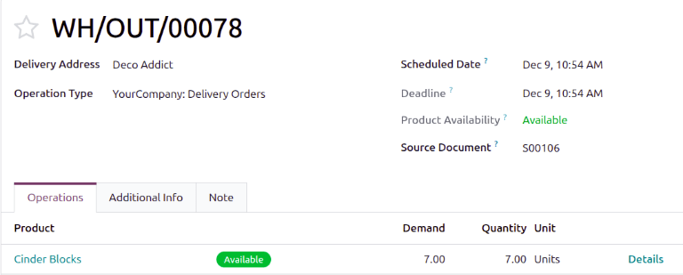
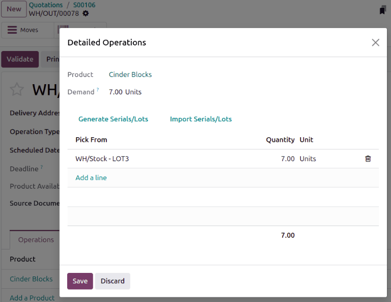

============
LIFO removal
============

The *Last In, First Out* (LIFO) removal strategy picks the **newest** products on-hand, based on the
date they entered a warehouse's stock.

Every time an order is placed for products using the :abbr:`LIFO (Last In, First Out)` strategy, a
transfer is created for the lot/serial number that has most recently entered the stock (the **last**
lot/serial number that entered the warehouse's inventory).

.. warning::
   In many countries, the :abbr:`LIFO (Last In, First Out)` removal strategy is banned, since it can
   potentially result in old, expired, or obsolete products being delivered to customers.

.. _inventory/warehouses_storage/lifo_enable:

Enabling the LIFO removal strategy
==================================

Lots and serial numbers differentiate identical products and track information like arrival or
expiration dates. To enable this feature, navigate to :menuselection:`Inventory --> Configuration
--> Settings`. Under the :guilabel:`Traceability` section, check the box beside :guilabel:`Lots &
Serial Numbers` to enable the feature.

.. image:: lifo/enable-lots-serial-numbers.png
   :alt: Enable Lots & Serial Numbers in the Inventory settings.

Enable tracking by lots or serial numbers
-----------------------------------------

Next, ensure the intended product is tracked by lots or serial numbers by navigating to the product
form in the :menuselection:`Inventory app --> Products --> Products`, then selecting the desired
product. On the product form, open the :guilabel:`General Information` tab, select the checkbox next
to the :guilabel:`Track Inventory` field, then choose either :guilabel:`By Unique Serial Number` or
:guilabel:`By Lots`.

Assigning lots and serial numbers
---------------------------------

After enabling the features, assign lot or serial numbers to products using an :doc:`inventory
adjustment <../../warehouses_storage/inventory_management/count_products>` or :ref:`during reception
<inventory/product_management/assign-lots>`.

Setting removal strategies
--------------------------

After lots or serial numbers have been assigned, set the removal strategy on the product category or
storage location.

.. image:: lifo/location-categories.png
   :alt: Find the Locations or Categories from the Configuration menu.

On the storage location
~~~~~~~~~~~~~~~~~~~~~~~

Open :menuselection:`Inventory app --> Configuration --> Locations`. Select the desired location. On
the location form, under the :guilabel:`Logistics` heading, select :guilabel:`Last In First Out
(LIFO)` from the list of removal strategies.

On the product category
~~~~~~~~~~~~~~~~~~~~~~~

Configure removal strategies on product categories by going to :menuselection:`Inventory app -->
Configuration --> Categories` and selecting the intended product category. In the
:guilabel:`Logistics` section, specify :guilabel:`Last In First Out (LIFO)` in the :guilabel:`Force
Removal Strategy` field.

.. important::
   When there are different removal strategies applied on both the location and product category for
   a product, the value set on the :guilabel:`Force Removal Strategy` field set on a product
   category form is applied as top priority.

Workflow
========

Consider the following example, with the product, `Cinder Block`, which is tracked :guilabel:`By
Lots` in the :guilabel:`General Information` tab of the product form. The :guilabel:`Force Removal
Strategy` for the cinder block's product category is set to :guilabel:`Last In, First Out (LIFO)`.

The following table lists the cinder blocks in stock and their respective lot numbers.

.. list-table::
   :header-rows: 1
   :stub-columns: 1

   * -
     - LOT1
     - LOT2
     - LOT3
   * - On-hand stock
     - 10
     - 10
     - 10
   * - :ref:`Created on <inventory/warehouses_storage/arrival_date>`
     - June 1
     - June 3
     - June 6

To see the removal strategy in action, create a :ref:`delivery order <inventory/delivery/one-step>`
for seven cinder blocks by navigating to the **Sales** app and creating a new quotation.

Click :guilabel:`Confirm` on the sales order form to create a delivery order. Doing so reserves the
newest lot numbers using the :abbr:`LIFO (Last In, First Out)` removal strategy.

To view the detailed pickings, click the :guilabel:`Details` link at the far-right of the cinder
block's product line in the :guilabel:`Operations` tab of the delivery order.

Clicking the :guilabel:`Details` link opens the :guilabel:`Detailed Operations` pop-up window.

In the :guilabel:`Detailed Operations` pop-up window, the :guilabel:`Pick From` field shows where
the quantities to fulfill the :guilabel:`Demand` are picked. Since the order demanded seven cinder
blocks, the newest cinder blocks from `LOT3` are selected using the :abbr:`LIFO (Last In, First
Out)` removal strategy.

.. seealso::
   - :doc:`Removal strategies <../removal_strategies>`
   - :ref:`Enable lots tracking <inventory/warehouses_storage/lots-setup>`
   - :ref:`Check arrival date <inventory/warehouses_storage/arrival_date>`
