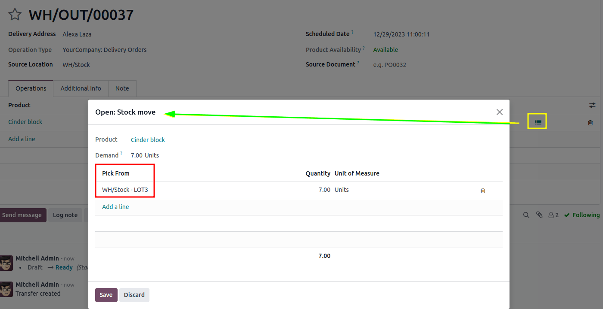

============
LIFO removal
============

The *Last In, First Out* (LIFO) removal strategy picks the **newest** products on-hand, based on the
date they entered a warehouse's stock.

Every time an order is placed for products using the :abbr:`LIFO (Last In, First Out)` strategy, a
transfer is created for the lot/serial number that has most recently entered the stock (the **last**
lot/serial number that entered the warehouse's inventory).

.. seealso::
   :doc:`About removal strategies <../removal_strategies>`

.. warning::
   In many countries, the :abbr:`LIFO (Last In, First Out)` removal strategy is banned, since it can
   potentially result in old, expired, or obsolete products being delivered to customers.

Consider the following example, with the product, `Cinder Block`, which is tracked :guilabel:`By
Lots` in the :guilabel:`Inventory` tab of the product form. The :guilabel:`Force Removal Strategy`
for the cinder block's product category is set to :guilabel:`Last In, First Out (LIFO)`.

.. seealso::
   - :ref:`Set up force removal strategy <inventory/warehouses_storage/removal-config>`
   - :ref:`Enable lots tracking <inventory/warehouses_storage/lots-setup>`
   - :ref:`Check arrival date <inventory/warehouses_storage/arrival_date>`

The following table represents the cinder blocks in stock, and their various lot number details.

.. list-table::
   :header-rows: 1
   :stub-columns: 1

   * -
     - LOT1
     - LOT2
     - LOT3
   * - On-hand stock
     - 10
     - 10
     - 10
   * - :ref:`Created on <inventory/warehouses_storage/arrival_date>`
     - June 1
     - June 3
     - June 6

To see the removal strategy in action, create a :ref:`delivery order <inventory/delivery/one-step>`
for seven cinder blocks by navigating to the :menuselection:`Sales app` and creating a new
quotation.

:guilabel:`Confirm` the sales order to create a delivery order. Doing so reserves the newest lot
numbers are using the :abbr:`LIFO (Last In, First Out)` removal strategy.

To view the detailed pickings, click the :guilabel:`⦙≣ (bulleted list)` icon, located on the
far-right of the cinder block's product line in the :guilabel:`Operations` tab of the delivery
order. Doing so opens the :guilabel:`Open: Stock move` pop-up window.

In the :guilabel:`Open: Stock move` pop-up window, the :guilabel:`Pick from` field displays where
the quantities to fulfill the :guilabel:`Demand` are picked from. Since the order demanded seven
cinder blocks, the newest cinder blocks from `LOT3` are selected, using the :abbr:`LIFO (Last In,
First Out)` removal strategy.

