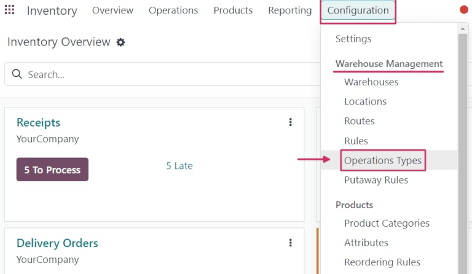

:show-content:
:hide-page-toc:

===================
Reservation methods
===================

Companies that sell and deliver goods to customers need to make sure they always have stock on-hand,
so when new sales orders are confirmed, they can deliver products on time.

In Odoo, this can be handled using *reservation methods*. Reservation methods control how products
included in a delivery order (DO) should be reserved for delivery, ensuring they are reserved at the
correct times, for the correct orders.

There are three different reservation methods in Odoo: *At Confirmation*, *Manually*, and *Before
scheduled date*.

.. tabs::

   .. tab:: At Confirmation

      Reserves products **only** when a sales order is confirmed, **and** if stock is already
      available.

   .. tab:: Manually

      Once a quote is confirmed, product availability **must** be checked manually, and the required
      quantity **must** be reserved manually.

   .. tab:: Before scheduled date

      A specific number of days can be selected; this is the maximum number of days **before** a
      scheduled delivery date that products should be reserved.

Configuration
=============

Reservation methods are set on individual operations types. To configure reservation methods, go to
:menuselection:`Inventory app --> Configuration --> Operations Types`. Then, select the desired
operation type. Or, create a new one by clicking :guilabel:`New`.

In the :guilabel:`General` tab of the operation type form, locate the :guilabel:`Reservation Method`
option, and choose which method should be used for this type of operation.

.. image:: reservation_methods/reservation-methods-operations-type-field.png
   :align: center
   :alt: Reservation method field on delivery order operation type form.

.. tip::
   If the :guilabel:`Before scheduled date` reservation method is selected, a new
   :guilabel:`Reserve before scheduled date` field appears below. From this field, the number of
   :guilabel:`days before` and :guilabel:`days before when starred` can be changed from the default
   `0`.

   Changing the :guilabel:`days before` value changes the maximum number of days before a scheduled
   date that products should be reserved.

   Changing the :guilabel:`days before when starred` value changes the maximum number of days before
   a scheduled date that starred (favorited) transfers for products should be reserved.

   .. image:: reservation_methods/reservation-methods-before-scheduled-date.png
      :align: center
      :alt: Reserve before scheduled date fields with before scheduled date method chosen.

Required applications
=====================

The two required applications that **must** be :ref:`installed <general/install>` to use reservation
methods are the *Sales* and *Inventory* apps.

.. note::
   In addition to delivery orders, reservation methods can also be used for *manufacturing orders*,
   *resupply subcontractor* orders, orders for *repairs*, and *internal transfers*, if desired. To
   enable this, configure the additional settings:

   - **For manufacturing orders:** Install the *Manufacturing* application by going to the
     :menuselection:`Apps` application, locating the *Manufacturing* app, and clicking
     :guilabel:`Install`.
   - **For resupply subcontractor:** Navigate to :menuselection:`Manufacturing app --> Configuration
     --> Settings`, and under the :guilabel:`Operations` section, enable :guilabel:`Subcontracting`.
     Then, click :guilabel:`Save`.
   - **For repairs:** Install the *Repairs* application by going to the :menuselection:`Apps`
     application, locating the *Repairs* app, and clicking :guilabel:`Install`.
   - **For internal transfers:** Navigate to :menuselection:`Inventory app --> Configuration -->
     Settings`, and under the :guilabel:`Warehouse` section, enable :guilabel:`Storage Locations`.
     Then, click :guilabel:`Save`.

Once these apps are installed, no additional features need to be enabled from the settings for
reservation methods to work. They will be available by default on certain operations types, and can
be viewed and changed by navigating to :menuselection:`Inventory app --> Configuration -->
Operations Types`, and then clicking on a specific operations type.

.. note::
   When the :guilabel:`Type of Operation` is changed to :guilabel:`Receipt` on an
   :guilabel:`Operations Type` form, reservation methods are **not** available.

.. seealso::
   - :doc:`reservation_methods/at_confirmation`
   - :doc:`reservation_methods/manually`
   - :doc:`reservation_methods/before_scheduled_date`

.. toctree::
   :titlesonly:

   reservation_methods/at_confirmation
   reservation_methods/manually
   reservation_methods/before_scheduled_date
