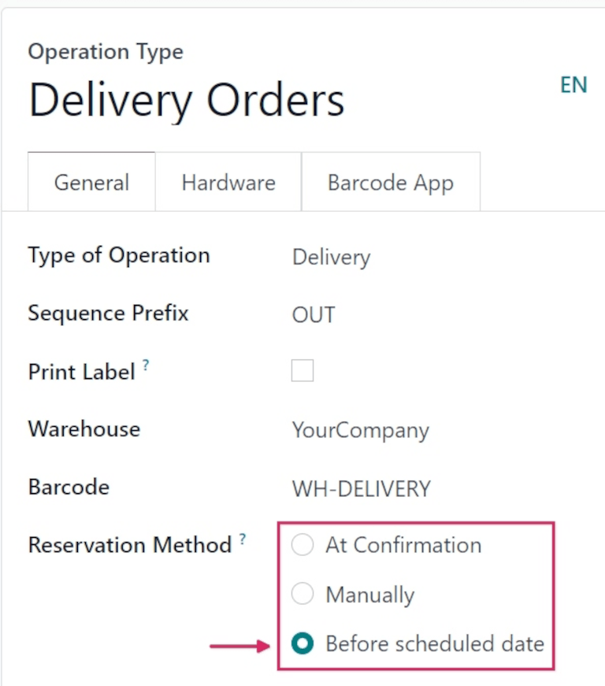
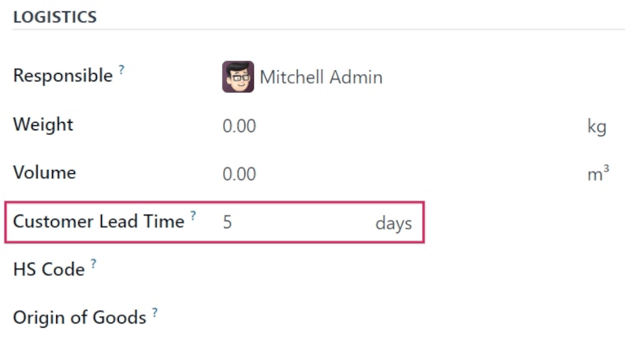
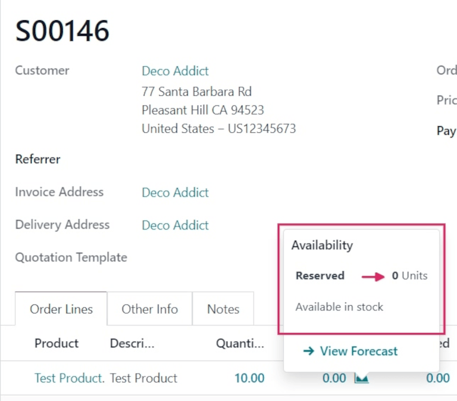
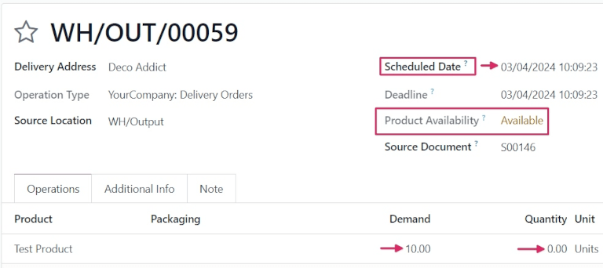

=================================
Before scheduled date reservation
=================================

.. _inventory/reservation_methods/before-scheduled-date:

.. |SO| replace:: :abbr:`SO (Sales Order)`

The *Before scheduled date* reservation method allows users to select a specific number of days that
act as the maximum number of days **before** a scheduled delivery date, when products included in a
sales order (SO) should be reserved.

.. seealso::
   :doc:`About reservation methods <../reservation_methods>`

Configuration
=============

To set the reservation method to *Before scheduled date*, navigate to :menuselection:`Inventory app
--> Configuration --> Operations Types`. Then, select the desired :guilabel:`Operation Type` to
configure, or create a new one by clicking :guilabel:`New`.

In the :guilabel:`General` tab, locate the :guilabel:`Reservation Method` field, and select
:guilabel:`Before scheduled date`.

.. note::
   When the :guilabel:`Type of Operation` is changed to :guilabel:`Receipt` on an
   :guilabel:`Operations Type` form, reservation methods are **not** available.

Once selected, a new :guilabel:`Reserve before scheduled date` field appears below. From this field,
the number of :guilabel:`days before` and :guilabel:`days before when starred` can be changed from
the default `0`.

Changing the :guilabel:`days before` value changes the maximum number of days before a scheduled
date that products should be reserved.

Changing the :guilabel:`days before when starred` value changes the maximum number of days before a
scheduled date that products should be reserved if the transfers are starred (favorited).

.. example::
   Here, the :guilabel:`days before` value is set to `2` days before, and the :guilabel:`days before
   when starred` value is set to `3`.

   This means products are reserved two days before the scheduled delivery date for normal orders,
   and three days before the scheduled delivery date for starred (favorited) transfers.

   .. image:: before_scheduled_date/before-scheduled-date- days-before.png
      :align: center
      :alt: Reserve before scheduled date field with set numerical values.

   This is the configuration applied for the following workflow found below.

Edit product form
-----------------

Before the *Before scheduled date* reservation method can be used, ensure that a *customer lead
time* is added to products that plan to be sold with this method.

To do that, navigate to :menuselection:`Inventory app --> Products --> Products`, and select the
desired product to configure.

On the product form, click the :guilabel:`Inventory` tab, and under the :guilabel:`Logistics`
section, change the value in the :guilabel:`Customer Lead Time` field.

For this example workflow, change it to `5` days.

This sets the scheduled delivery date for this specific product to five days after the creation date
of the sales order.

Workflow
========

To see the *Before scheduled date* reservation method in action, create a new |SO| by navigating to
:menuselection:`Sales app --> New`.

Add a customer in the :guilabel:`Customer` field, then, in the :guilabel:`Order Lines` tab, click
:guilabel:`Add a product`, and select a product from the drop-down menu that has a configured
*customer lead time*, to add to the quotation form.

Finally, in the :guilabel:`Quantity` column, adjust the desired quantity of the product to sell.

For this sample workflow, set the :guilabel:`Quantity` to `10`.

Once ready, click :guilabel:`Confirm` to confirm the sales order.

Click the green :guilabel:`📈 (area graph)` icon on the product line to reveal the product's
:guilabel:`Availability` tooltip. This tooltip reveals the reserved number of units for this order.
Because the reservation method is set to *Before scheduled date*, the :guilabel:`Reserved` quantity
reads `0 Units`.

However, below that quantity reads `Available in stock`. This is because the quantity is available,
but the scheduled date, for this example workflow, is five days from the order date.

Since reservation is not until two days before the scheduled delivery, it will not reserve the
products until then.

.. note::
   If there is **not** sufficient quantity of stock for the product included in the |SO|, the
   :guilabel:`📈 (area graph)` icon is red, instead of green.

   Instead of revealing the reserved number of units for the order, the :guilabel:`Availability`
   tooltip reads :guilabel:`Reserved`, and reveals the available number of units (e.g., `0 Units`).

   Additionally, unless there is a set replenishment or a live receipt, it also reads :guilabel:`No
   future availability`, in red text.

Click the :guilabel:`Delivery` smart button to see the delivery order form.

On the delivery order form, the status in the :guilabel:`Product Availability` field is listed as
`Available`, in yellow text, instead of green. This is because there is sufficient stock on-hand for
this order, but no quantity has been reserved yet.

Note the :guilabel:`Scheduled Date` field, above the :guilabel:`Product Availability` field,
displays the date five days from the order creation date. This indicates that the products are not
reserved until three days from today's date (two days before the scheduled delivery date).

In the :guilabel:`Operations` tab on the :guilabel:`Product` line, the numbers in the
:guilabel:`Demand` column and the :guilabel:`Quantity` column do not match (in this case, the
:guilabel:`Demand` column lists `10.00`, while the :guilabel:`Quantity` column lists `0`).

The :guilabel:`Quantity` column lists `0` because the products aren't reserved until two days
*before* their delivery date. Odoo automatically reserves the products once the scheduled date
arrives, at which point the :guilabel:`Demand` and :guilabel:`Quantity` columns will match.

.. tip::
   If the products in the |SO| should be reserved *sooner* than the scheduled reservation date, the
   reservation can be manually overridden. To manually reserve the products sooner than scheduled,
   click :guilabel:`Check Availability` at the top of the form.

   This turns the `Available` status in the :guilabel:`Product Availability` field green, and
   changes the number in the :guilabel:`Quantity` column to match the :guilabel:`Demand` column.

   Once ready, click :guilabel:`Validate`.

.. seealso::
   - :doc:`Manual reservation <manually>`
   - :doc:`At confirmation reservation <at_confirmation>`
