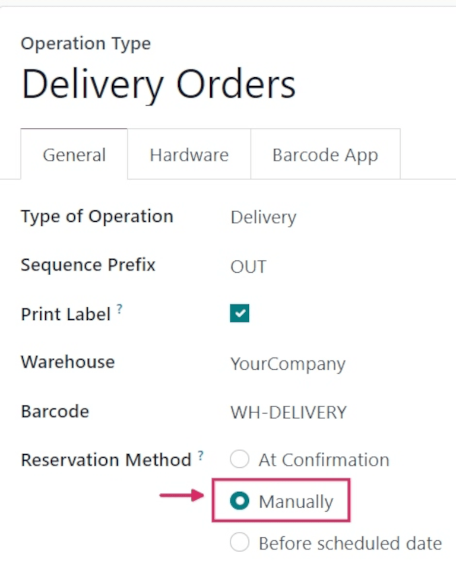
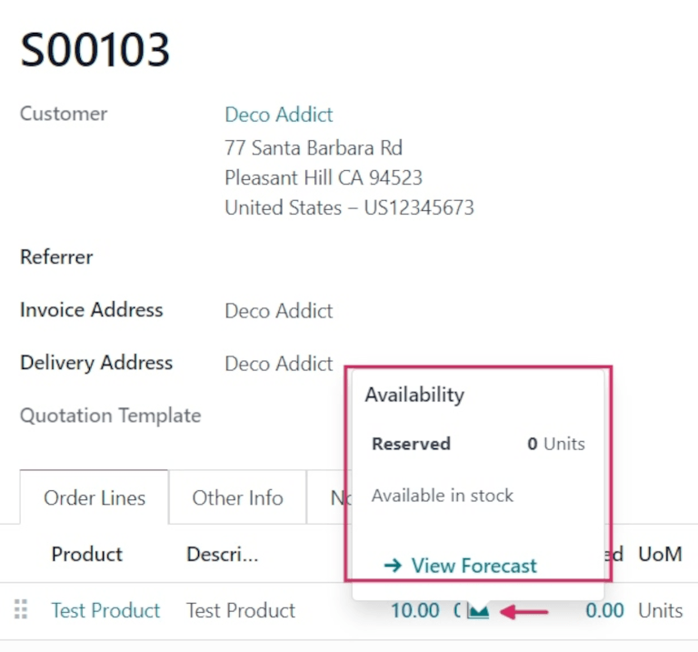
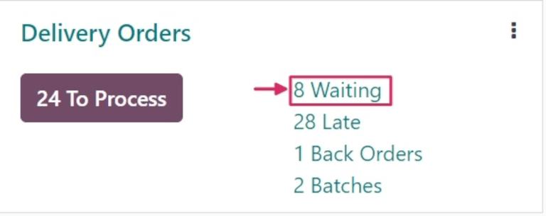
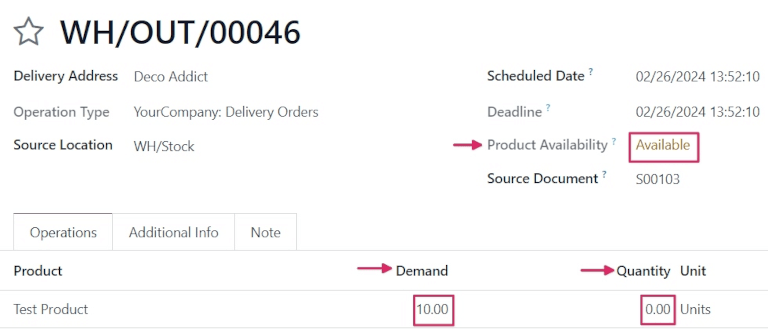

==================
Manual reservation
==================

.. _inventory/reservation_methods/manually:

.. |SO| replace:: :abbr:`SO (Sales Order)`

Unlike the *At Confirmation* reservation method, the *Manually* reservation method does **not**
reserve products automatically.

Instead, once a sales order (SO) is confirmed, product availability **must** be checked manually,
and the required quantity **must** be reserved manually.

.. seealso::
   :doc:`About reservation methods <../reservation_methods>`

Configuration
=============

To set the reservation method to *Manually*, navigate to :menuselection:`Inventory app -->
Configuration --> Operations Types`. Then, select the desired :guilabel:`Operation Type` to be
configured, or create a new one by clicking :guilabel:`New`.

In the :guilabel:`General` tab, locate the :guilabel:`Reservation Method` field, and select
:guilabel:`Manually`.

.. note::
   When the :guilabel:`Type of Operation` is changed to :guilabel:`Receipt` on an
   :guilabel:`Operations Type` form, reservation methods are **not** available.

Workflow
========

To see the *Manually* reservation method in action, create a new |SO| by navigating to
:menuselection:`Sales app --> New`.

Add a customer in the :guilabel:`Customer` field. Then, in the :guilabel:`Order Lines` tab, click
:guilabel:`Add a product`, and select a product to add to the quotation from the drop-down menu.
Finally, in the :guilabel:`Quantity` column, adjust the desired quantity of the product to sell.

Once ready, click :guilabel:`Confirm` to confirm the sales order.

Click the green :guilabel:`📈 (area graph)` icon on the product line to reveal the product's
:guilabel:`Availability` tooltip. This tooltip reveals the reserved number of units for this order.
Because the reservation method is set to *Manually*, the :guilabel:`Reserved` quantity reads `0
Units`.

However, below that quantity reads `Available in stock`. This is because the quantity is available,
but must be manually reserved.

.. note::
   If there is **not** sufficient quantity of stock for the product included in the |SO|, the
   :guilabel:`📈 (area graph)` icon is red, instead of green.

   Instead of revealing the reserved number of units for the order, the :guilabel:`Availability`
   tooltip reads :guilabel:`Reserved`, and reveals the available number of units (e.g., `0 Units`).

   Additionally, unless there is a set replenishment or a live receipt, it also reads :guilabel:`No
   future availability`, in red text.

Once the |SO| is confirmed, navigate to the :menuselection:`Inventory app`, and locate the
:guilabel:`Delivery Orders` card on the :guilabel:`Inventory Overview` page.

The :guilabel:`Delivery Orders` card displays the current status of live orders, including those
with a :guilabel:`Waiting` status. Orders with this status indicate that the products in those
orders have either not been reserved yet, or are not in stock at all.

To see the |SO| created previously, click the :guilabel:`(#) Waiting` button on the card (in this
case, `8 Waiting`).

Locate the delivery order (DO) tied to the |SO| that was previously created, and click the line to
view it.

On the :guilabel:`Delivery Order` form, the status in the :guilabel:`Product Availability` field is
listed as `Available`, in yellow text, instead of green. This is because there is sufficient stock
on hand for this order, but no quantity has been reserved yet.

In the :guilabel:`Operations` tab, on the :guilabel:`Product` line, the numbers in the
:guilabel:`Demand` column and the :guilabel:`Quantity` column do *not* match.

In this case, the :guilabel:`Demand` column lists `10.00`, while the :guilabel:`Quantity` column
lists `0`.

To manually reserve the specified quantity of the product for this order, click the
:guilabel:`Check Availability` button at the top of the form. Doing so turns the `Available` status
in the :guilabel:`Product Availability` field green, and changes the number in the
:guilabel:`Quantity` column to match the :guilabel:`Demand` column.

This is because there is sufficient quantity in stock to reserve for the order.

Once ready, click :guilabel:`Validate`.

.. tip::
   Multiple orders with a *Waiting* status can be manually reserved at the same time, and set to
   *Ready* status.

   To do that, open the :menuselection:`Inventory` app, which reveals the :guilabel:`Inventory
   Overview` page. The :guilabel:`Inventory Overview` page is also accessible by navigating to
   :menuselection:`Inventory app --> Overview`.

   From the :guilabel:`Inventory Overview` page, click the :guilabel:`(#) Waiting` button on the
   :guilabel:`Delivery Orders` card.

   Then, tick the checkboxes to the left of each desired order, or tick the checkbox in the header
   row, to the far-left, to select all orders on the page at once.

   Then, click the :guilabel:`Check Availability` button at the top of the page.

   If the products included in every selected order have enough stock on-hand, this reserves the
   products, and moves the order into :guilabel:`Ready` status. Upon receiving a :guilabel:`Ready`
   status, the order disappears from the :guilabel:`Waiting` list.

   If there is *not* enough stock on-hand, the order retains its current status, and remains on the
   list.

   .. image:: manually/manually-check-availability.png
      :align: center
      :alt: List of orders in waiting status and check availability button.

.. seealso::
   - :doc:`At confirmation reservation <at_confirmation>`
   - :doc:`Before scheduled date reservation <before_scheduled_date>`
