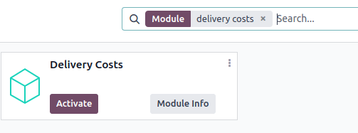

:show-content:

================
Delivery methods
================

When activated in Odoo, the *Delivery Methods* setting adds the option of calculating the cost of
shipping on sales orders and e-commerce shopping carts.

When integrated with a :ref:`third-party carrier <inventory/shipping/third_party>`, shipping prices
are calculated based on the carrier's pricing information.

.. seealso::
   - :ref:`Third-party shipping carrier setup <inventory/shipping/third_party>`
   - `Odoo Tutorials: Delivery Prices
     <https://www.odoo.com/slides/slide/delivery-prices-613?fullscreen=1>`_

Configuration
=============

To calculate shipping on sales orders and e-commerce, the *Delivery Costs* module must be installed.
To do so, navigate to the :menuselection:`Apps` application from the main Odoo dashboard.

Then, remove the :guilabel:`Apps` filter, and type in `Delivery Costs` in the :guilabel:`Search...`
bar. After finding the :guilabel:`Delivery Costs` module, click :guilabel:`Activate` to install it.

.. _inventory/shipping/sales-order:

Add shipping
============

Shipping methods can be added to sales orders in the form of delivery products, which appear as
individual line items. First, navigate to the desired sales order by going to :menuselection:`Sales
app --> Orders --> Orders`.

On the sales order, click the :guilabel:`Add shipping` button, which opens the :guilabel:`Add a
shipping method` pop-up window. Then, choose a :guilabel:`Shipping Method` from the list.

The :guilabel:`Total Order Weight` is pre-filled based on product weights (that are defined in the
:guilabel:`Inventory` tab for each product form). Edit the field to specify the exact weight, and
then click :guilabel:`Add` to add the shipping method.

.. note::
   The amount defined in :guilabel:`Total Order Weight` overwrites the total product weights defined
   on the product form.

The shipping cost is added to the *sales order line* as the :guilabel:`Delivery Product` detailed on
the shipping method form.

.. example::
   `Furniture Delivery`, a delivery product with a fixed rate of `$200`, is added to sales order
   `S00088`.

     .. image:: setup_configuration/delivery-product.png
        :alt: Show delivery order on the sales order line.

Delivery order
--------------

The shipping method added to the sales order is linked to the shipping carrier details on the
delivery order. To add or change the delivery method on the delivery itself, go to the
:guilabel:`Additional Info` tab and modify the :guilabel:`Carrier` field.

.. image:: setup_configuration/delivery-order.png
   :alt: Shipping carrier information on the delivery form.

.. toctree::
   :titlesonly:

   setup_configuration/new_delivery_method
   setup_configuration/third_party_shipper
   setup_configuration/labels
   setup_configuration/bpost
   setup_configuration/dhl_credentials
   setup_configuration/envia_shipping
   setup_configuration/fedex
   setup_configuration/sendcloud_shipping
   setup_configuration/starshipit_shipping
   setup_configuration/ups_credentials
   setup_configuration/zebra
   setup_configuration/cancel
   setup_configuration/invoicing
   setup_configuration/label_type
   setup_configuration/multipack
   setup_configuration/print_on_validation
   setup_configuration/dispatch
