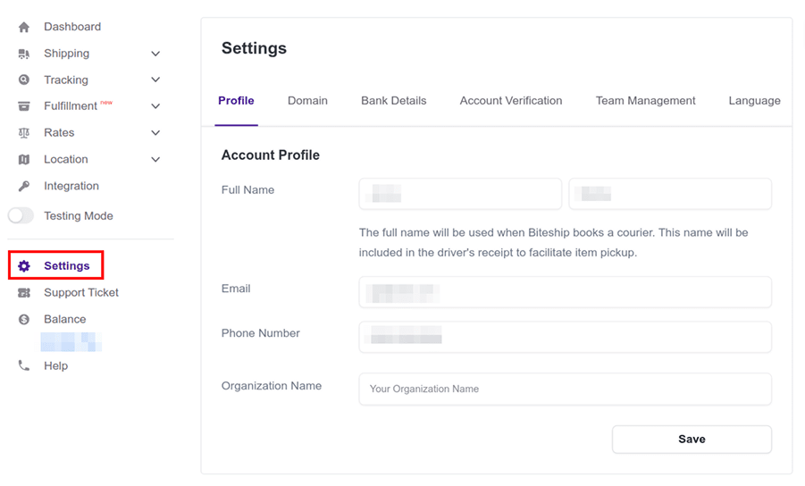
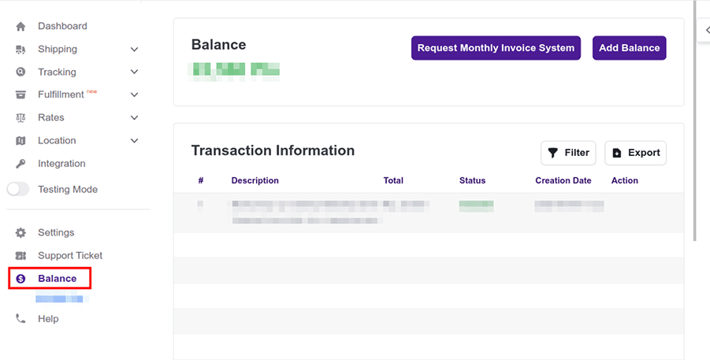
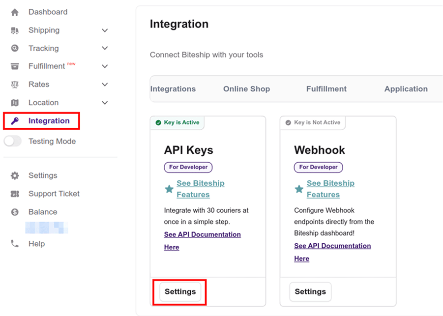
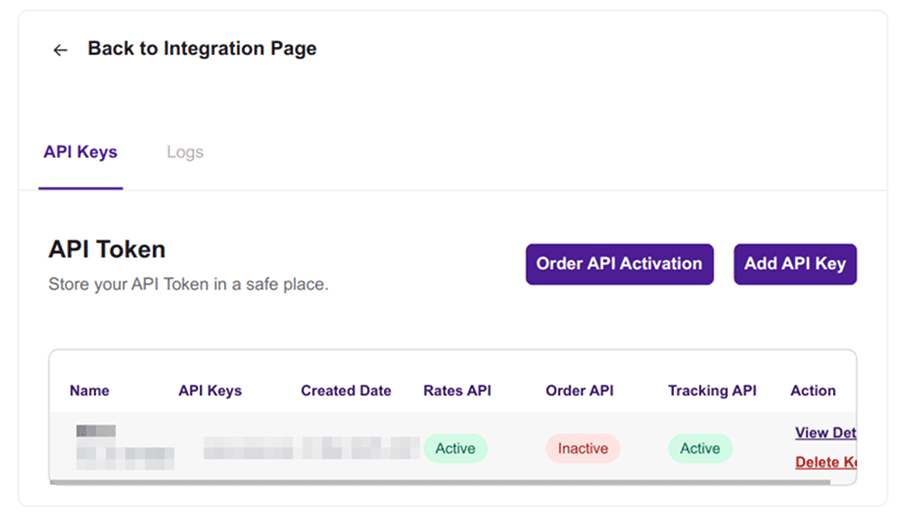
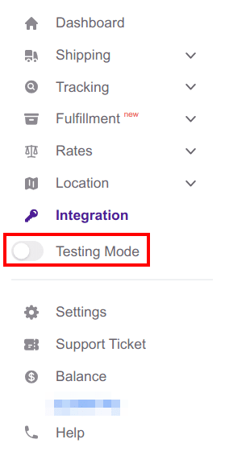
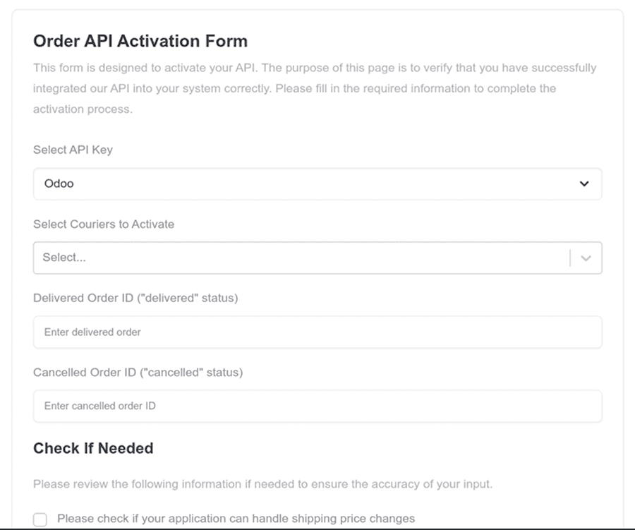
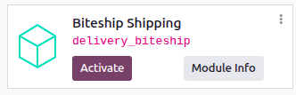
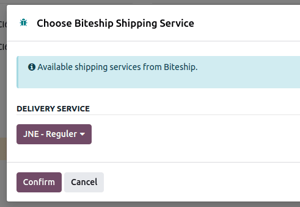
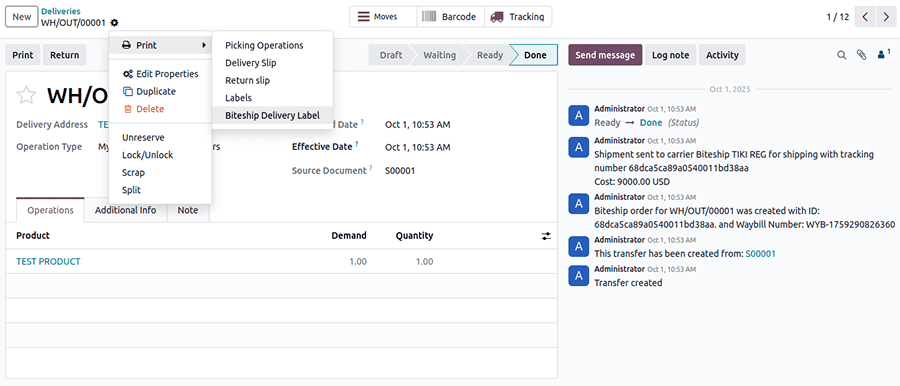

=================
Biteship shipping
=================

Biteship is a shipping service aggregator that facilitates the integration of Indonesian
shipping carriers with Odoo. Once integrated, users can select shipping carriers on inventory
operations in their Odoo database.

.. seealso::
   - :doc:`Automatically calculate shipping <../setup_configuration>`
   - :doc:`Integrate other third-party couriers <third_party_shipper>`

Setup in Biteship
=================

Create an account and complete profile
--------------------------------------

To get started, go to `Biteship's platform <https://dashboard.biteship.com/>`_ to configure the 
account and generate the connector credentials. Log in with the Biteship account, or create a new 
one if needed.

Profile configuration
---------------------

After logging into your Biteship account, go to :menuselection:`Settings`. Complete your profile 
details in the :menuselection:`Profile` tab, then verify your account under the 
:menuselection:`Account Verification` tab.

Payment method configuration
----------------------------

To configure payment methods, open the :menuselection:`Balance` page.

There are two payment options available:

- **Prepaid - Top Up Bitepoints**: Add funds to your wallet for daily transactions by clicking 
  the :guilabel:`Add Balance` button.
- **Postpaid - Monthly Invoicing**: For monthly billing, click the 
  :guilabel:`Request Monthly Invoice System` button to complete and sign the Monthly Payment 
  Activation form. The following documents are required:

   - Company Tax ID (NPWP)
   - Business License (SIUP) or Business Identification Number (NIB)
   - Company Deed

.. _inventory/shipping_receiving/bite-api-key:

Biteship API Key
----------------

In the Biteship account, navigate to :menuselection:`Integration`. Under :guilabel:`API Keys`, click
:guilabel:`Settings`.

The :guilabel:`API Keys` configuration page opens, which displays a list of created API keys and the
API logs.

To create an API key, click :guilabel:`Add API Key`. A prompt appears to enter the name of the key.
The API key is automatically generated and is shown only once. Make sure to copy and keep it
safe.

.. important::
   Save the API key and keep it safe, as it cannot be accessed after this stage.

.. note::
   The Order API is not active yet. An activation request must be submitted to activate it.

.. _inventory/shipping_receiving/bite-api-key-test:

Key for testing
---------------

Next, create a test API key. First, activate the :guilabel:`Testing Mode` toggle in the sidebar.
Then create a testing API key using the same instructions for the production API key.

.. _inventory/shipping_receiving/bite-activation-api:

Activate the order API key
--------------------------

To use the API key in a production environment, you must activate it.

In the Biteship account, navigate to :menuselection:`Integration`. Under :guilabel:`API Key`, click
:guilabel:`Settings`. The :guilabel:`API Keys` page opens. Click the :guilabel:`Order API
Activation` button.

.. important::
   To complete the form, Biteship requires testing mode to be enabled so that it can create a test
   order and simulate multiple order statuses.

Complete the following fields:

 - :guilabel:`Select API Key`: choose the API key to activate.
 - :guilabel:`Select Couriers to Activate`: select one or more couriers to activate.
 - :guilabel:`Delivered Order ID`: enter a test order ID with "delivered" status.
 - :guilabel:`Cancelled Order ID`: enter a test order ID with "cancelled" status.
 - :guilabel:`Please check if you have orders that include insurance`: optionally enable insurance
   for the delivery.

When the form is complete, click the :guilabel:`Submit API Activation Data` button to submit the
activation request. After the request is approved, a confirmation message appears.

Check the API key status. The order API should be active.

Setup in Odoo
=============

Install
-------

After the Biteship account is set up, integrate it with the Odoo database. To do that, go to Odoo's
:guilabel:`Apps` module, search for the :guilabel:`Biteship Shipping` module, and click
:guilabel:`Activate` to install it.

Configuration
-------------

Create a delivery method. Open :menuselection:`Inventory --> Configuration --> Delivery --> Shipping
Methods`, then click :guilabel:`New`.

Configure Biteship in Odoo by filling out the fields on the :guilabel:`Shipping Methods` form as
follows:

- :guilabel:`Shipping Method`: name of shipping method (for example, `Biteship JNE Reguler`).
- :guilabel:`Provider`: select :guilabel:`Biteship`.
- :guilabel:`Delivery Product`: assign or create the delivery product that will appear on the sales
  order line when the cost of shipping is computed.

In the :guilabel:`Biteship Configuration` tab, fill out these fields:

- :guilabel:`Biteship Live API Key`: enter the live :abbr:`API (Application Programming Interface)`
  key :ref:`obtained from Biteship <inventory/shipping_receiving/bite-api-key>`.
- :guilabel:`Biteship Test API Key`: enter the test :abbr:`API (Application Programming Interface)`
  key :ref:`obtained from Biteship <inventory/shipping_receiving/bite-api-key-test>`.
- :guilabel:`Enable Insurance`: this option can be checked to enable insurance for the delivery if
  desired. Make sure to also enable it when submitting the :ref:`Order API Activation
  <inventory/shipping_receiving/bite-activation-api>`.
- :guilabel:`Default Package Type`: Set a default package type to include the weight of the empty
  package when automatically calculating shipping rates. If this is left empty, the weight of the
  product will be used instead.

.. important::
   To set a default package type, the *Packages* feature **must** be enabled in 
   :menuselection:`Inventory --> Configuration --> Settings`.

Manually :guilabel:`Save` the form by clicking the :icon:`fa-cloud-upload` :guilabel:`(Save
manually)` icon icon next to the :guilabel:`Shipping / New` breadcrumbs.

To select a courier service, click the :guilabel:`Select from a list of available couriers` link in
the :guilabel:`Biteship Configuration` tab.

The :guilabel:`Choose Biteship Shipping Service` box opens. In the :guilabel:`Delivery Service`
field, choose the desired shipping service for deliveries from the drop-down menu. Finally, click
:guilabel:`Confirm`.

The chosen delivery service will populate in the :guilabel:`Courier Name` and :guilabel:`Biteship
Service Name` field.

.. example::
   Sample of a Biteship shipping product configured in Odoo:

   | :guilabel:`JNE Reguler`
   | :guilabel:`Courier Name`: `JNE`
   | :guilabel:`Biteship Service Name`: `Reguler`

.. tip::
   Switch between the test and production environment by clicking the :guilabel:`Environment` smart
   button at the top of the shipping method form. Make sure to fill the test API key beforehand.

Generate a label with Biteship
------------------------------

When creating a quotation in Odoo, add the Biteship shipping method by clicking the :guilabel:`Add
shipping` button.

In the :guilabel:`Add a shipping method` box, select Biteship in the :guilabel:`Shipping Method`
field.

Calculate the shipping rate by clicking :guilabel:`Get rate`. Finally, click :guilabel:`Add` to
add the cost of shipping to a sales order line, labeled as the *delivery product*.

.. note::
   Automatically calculate shipping costs for Biteship in **both** Odoo *Sales* and *eCommerce*
   applications.

Then, :guilabel:`Validate` the delivery. Access shipping label documents from the :guilabel:`Print`
menu under the :icon:`fa-cog` :guilabel:`(Actions)` icon next to the :guilabel:`Deliveries`
breadcrumbs.

Information such as :guilabel:`Tracking Number`, :guilabel:`Waybill Number`: and the cost of
shipping are generated in the chatter.

.. important::
   Package weight in Odoo is calculated by adding the weights of the products plus the empty package
   saved in the database. Ensure the correct shipping option is selected, as the package weight is
   not automatically verified.

   Verify the destination address, as Biteship checks it when the order is created.

   Finally, the couriers require information, such as an email address, phone number and a post
   code. Please ensure that all necessary information is set and valid upon sending a shipping order
   and when retrieving the shipping rates.

Cancellations
-------------

If a delivery order is cancelled in Odoo, it is automatically cancelled in Biteship. However, the
cancellation varies between couriers and current status of delivery, so make sure to log onto the
courier's platform to check and potentially handle the cancellation manually.
