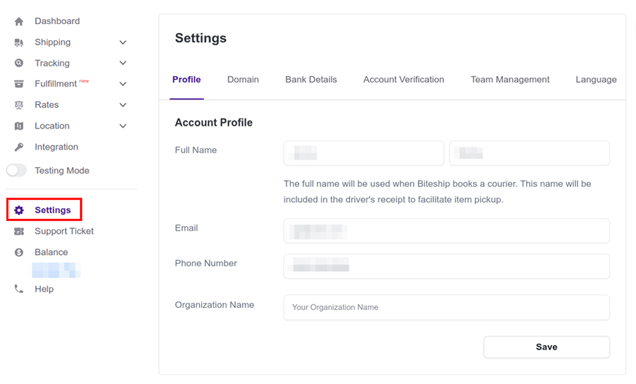
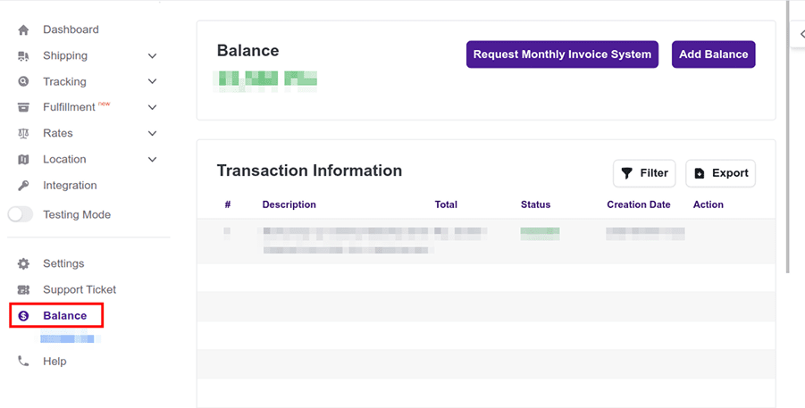
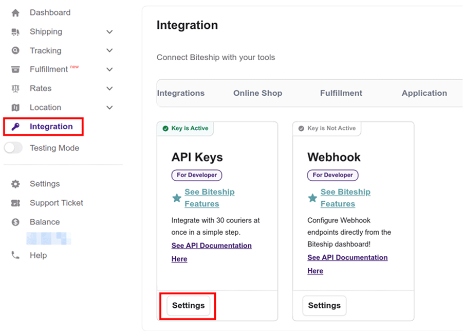
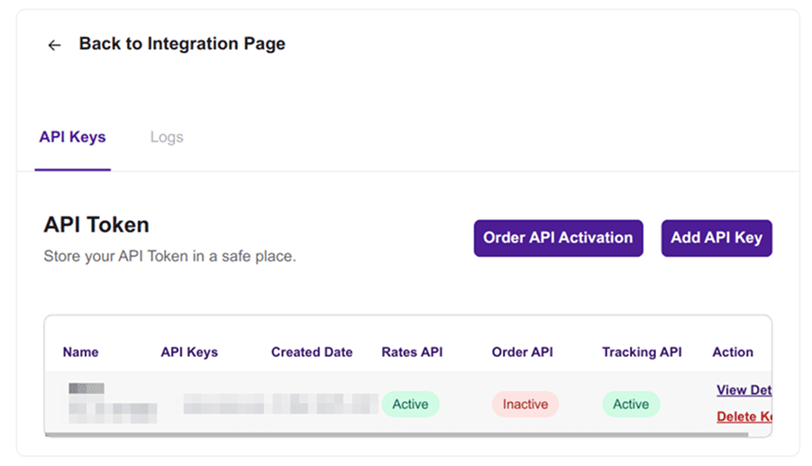
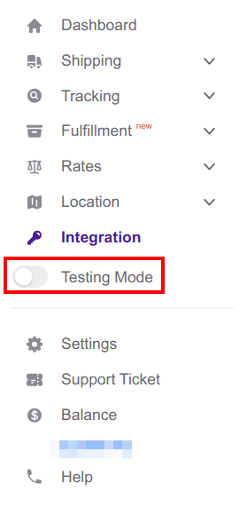
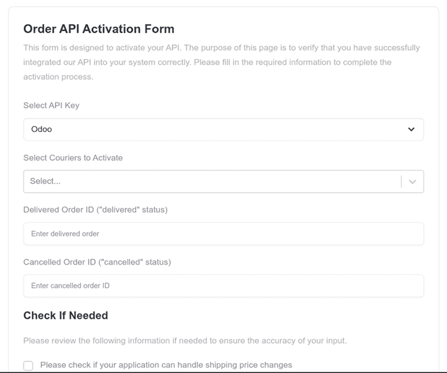
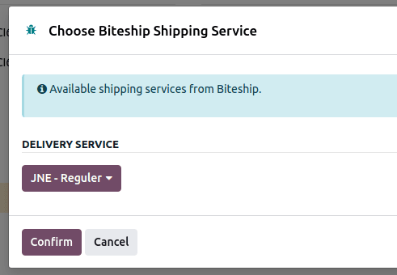
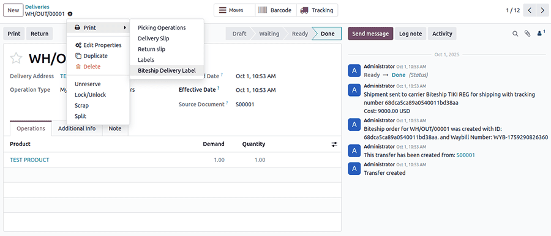

=================
Biteship shipping
=================

Biteship is a shipping service aggregator that facilitates the integration of Indonesian
shipping carriers with Odoo. Once integrated, users can select shipping carriers on inventory
operations in their Odoo database.

.. seealso::
   - :doc:`Automatically calculate shipping <../setup_configuration>`
   - :doc:`Integrate other third-party couriers <third_party_shipper>`

Setup in Biteship
=================

Create an account and complete profile
--------------------------------------

To get started, go to `Biteship's platform <https://dashboard.biteship.com/>`_ to configure the account
and generate the connector credentials. Log in with the Biteship account, or create a new one if
needed.

Profile configuration
---------------------

Once logged into the Biteship account, navigate to :menuselection:`Settings`,
and complete the profile information and verification.

Payment method configuration
----------------------------

To configure payment methods, navigate to :menuselection:`Balance`

There are two payment options available:

- **Prepaid - Top Up Bitepoints**: Add funds to the wallet for daily transactions.
- **Postpaid - Monthly Invoicing**: For monthly billing, complete and sign the the Monthly Payment Activation form. The following documents are required:

   - Company Tax ID (NPWP)
   - Business License (SIUP) or Business Identification Number (NIB)
   - Company Deed

.. _inventory/shipping_receiving/bite-api-key:

Biteship API Key
----------------

In the Biteship account, navigate to :menuselection:`Integration` and find :guilabel:`API Keys` then select :guilabel:`Settings`.

After clicking :guilabel:`Settings`, the page redirects to the :guilabel:`API Key` configuration page which
displays a list of created API Keys and the API Logs.

To create an API Key, click :guilabel:`Add API Key`. A prompt will appear to enter the name of the key.
The API Key will then be automatically generated and will be shown only once. Make sure to copy and keep it safe.

.. important::
   Save the API Key and keep it safe as it cannot be accessed after this stage.

.. note::
   The Order API will not be active yet. An activation request must be submitted to activate it.

.. _inventory/shipping_receiving/bite-api-key-test:

Key for Testing
---------------

For testing purposes, make sure to activate the :guilabel:`Testing Mode` toggle in the sidebar first. Instructions for creating
testing API Key is the same for the production version.

.. _inventory/shipping_receiving/bite-activation-api:

API Key Activation Request
--------------------------

To use the API Key in a production environment, an activation request must be submitted.

In the Biteship account, navigate to :menuselection:`Integration` and find :guilabel:`API Key` then select :guilabel:`Settings`.
Next, select :guilabel:`Order API Activation`.

.. important::
   In order to properly fill the form, Biteship requires usage of the testing mode to create a test order and simulate multiple order statuses.

Fill out the following form fields:
 - In :guilabel:`Select API Key`, choose the API Key to be activated.
 - In :guilabel:`Select Couriers to Activate`, select the courier(s) to acivate.
 - In :guilabel:`Delivered Order ID`, copy the test Order ID of status 'Delivered'.
 - In :guilabel:`Cancelled Order ID`, copy the test Order ID of status 'Cancelled'.
 - In :guilabel:`Please check if you have orders that include insurance`, the option can be checked to enable insurance for the delivery if desired.
 - Once everything is filled, click the :guilabel:`Submit API Activation Data` button to submit the activation request. Once approved, a message will appear.

Check the API Key status, the Order API should be active.

Setup in Odoo
=============

Install
-------

After the Biteship account is set up, integrate it with the Odoo database. To do that, go to
Odoo's :guilabel:`Apps` module, search for the :guilabel:`Biteship Shipping` module, and click
:guilabel:`Activate` to install it.

Configuration
-------------

Create a delivery method by going to :menuselection:`Inventory --> Configuration --> Delivery --> Shipping Methods` and click :guilabel:`New`.

Configure Biteship in Odoo by filling out the fields on the :guilabel:`Shipping Methods` form as
follows:

- :guilabel:`Shipping Method`: Name of shipping method e.g `Biteship JNE Reguler`.
- :guilabel:`Provider`: select :guilabel:`Biteship` from the drop-down menu.
- :guilabel:`Delivery Product`: assign or create the delivery product that will appear on the sales order line when the cost of shipping is computed.

In the :guilabel:`Biteship Configuration` tab, fill out these fields:

- :guilabel:`Biteship Live API Key`: enter the live :abbr:`API (Application Programming Interface)` key :ref:`obtained from Biteship <inventory/shipping_receiving/bite-api-key>`.
- :guilabel:`Biteship Test API Key`: enter the test :abbr:`API (Application Programming Interface)` key :ref:`obtained from Biteship <inventory/shipping_receiving/bite-api-key-test>`.
- :guilabel:`Enable Insurance`: this option can be checked to enable insurance for the delivery if desired. Make sure to also enable it when submitting the :ref:`Order API Activation <inventory/shipping_receiving/bite-activation-api>`.
- :guilabel:`Default Package Type`: Set a default package type to include the weight of the empty package when automatically calculating shipping rates. If this is left empty, the weight of the product will be used instead.

.. important::
   To set a default package type, the *Packages* feature **must** be enabled in :menuselection:`Inventory --> Configuration --> Settings`.

- Manually :guilabel:`Save` the form by clicking the cloud icon next to the :guilabel:`Shipping / New` breadcrumbs.

To select a courier service, click the :guilabel:`Select from a list of available couriers` link at the :guilabel:`Biteship Configuration` tab.

Doing so opens the :guilabel:`Choose Biteship Shipping Service` pop-up window. In the
:guilabel:`Delivery Service` field, choose the desired shipping service for deliveries and from the drop-down menu.
Finally, click :guilabel:`Confirm`.

The chosen delivery service will populate in the :guilabel:`Courier Name` and :guilabel:`Biteship Service Name` field.

.. example::
   Sample of a Biteship shipping product configured in Odoo:

   | :guilabel:`JNE Reguler`
   | :guilabel:`Courier Name`: `JNE`
   | :guilabel:`Biteship Service Name`: `Reguler`

.. tip::
   Switch between the test and production environment by clicking the :guilabel:`Environment` smart button at the top of
   the shipping method form. Make sure to fill the test API Key beforehand.

Generate a label with Biteship
------------------------------

When creating a quotation in Odoo, add the Biteship shipping method by clicking the :guilabel:`Add shipping` button.

In the :guilabel:`Add a shipping method` pop-up window, select Biteship in the :guilabel:`Shipping Method` field.

Calculate the shipping rate by clicking :guilabel:`Get rate`. Finally, click :guilabel:`Add` to include the cost of shipping
to the sales order line, labeled as the *delivery product*.

.. note::
   Automatically calculate shipping costs for Biteship in **both** Odoo *Sales* and *eCommerce* applications.

Then, :guilabel:`Validate` the delivery. Shipping label documents can be accessed by going to the the print menu.

Informations such as :guilabel:`Tracking Number`, :guilabel:`Waybill Number`: and the cost of shipping are generated in the chatter.

.. important::
   Package weight in Odoo is calculated by adding the weights of the products plus the empty package saved in the database.
   Ensure the correct shipping option is selected, as the package weight is not automatically verified.

   Verify the destination address, as Biteship checks it when the order is created.

   Finally, the couriers requires information, such as an email address, phone number and a post code.
   Please ensure that all necessary information are set and valid upon sending a shipping order and when getting the shipping rates.

Cancellations
-------------

If a delivery order is cancelled in Odoo, it will be automatically cancelled in Biteship. However, the cancellation will
vary between courier(s) and current status of delivery, so make sure to log onto the courier's platform to check and
potentially handle the cancellation manually.
