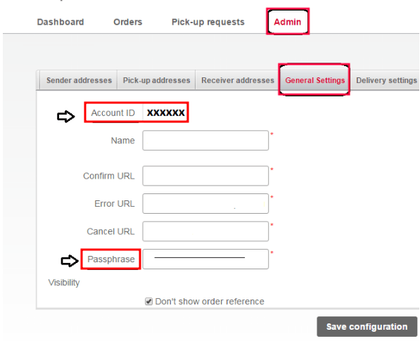

=================
Bpost integration
=================

Set up the *Bpost* shipping connector in Odoo to manage Bpost shipments to clients directly within
Odoo. To configure it, complete these steps:

#. Create a Bpost account.
#. Get the :ref:`Account ID and passphrase <inventory/shipping/Bpost-account>`.
#. Set up the shipping method in Odoo.

Upon completion, it is possible to calculate the cost of shipping, based on package size and weight,
have the charges applied directly to a Bpost business account, and automatically print Bpost
tracking labels through Odoo.

.. seealso::
   - :doc:`third_party_shipper`
   - :doc:`delivery_method`
   - :doc:`dhl_credentials`
   - :doc:`ups_credentials`

Bpost account setup
===================

To begin, go to the `Bpost website <https://parcel.bpost.be/en/home/business>`_ to create, or log
into, the company's Bpost business account. When creating the Bpost account, have the company's VAT
number and mobile phone number ready.

Follow the website's steps to complete registration, and sign up for shipping services. Doing so
submits a request to enter a contractual business relationship between the company and Bpost.

.. important::
   Odoo **cannot** be integrated with `non-business Bpost
   <https://bpost.freshdesk.com/support/solutions/articles/174847-account-id-and-passphrase>`_
   accounts.

After completing the setup, get the Bpost account ID and passphrase, by navigating to the
:guilabel:`Shipping Manager` menu item.

.. _inventory/shipping/bpost-account:

On the :guilabel:`Shipping Manager` page, go to the :guilabel:`Admin` tab, then the
:guilabel:`General Settings` tab, to find the :guilabel:`Account ID` and :guilabel:`Passphrase`
needed to configure Odoo's shipping method.

Configure Bpost shipping method
===============================

With those necessary credentials, configure the Bpost shipping method in Odoo by going to
:menuselection:`Inventory app --> Configuration --> Shipping Methods`.

On the :guilabel:`Shipping Methods` page, click :guilabel:`Create`.

In the :guilabel:`Provider` field, select :guilabel:`Bpost` from the drop-down menu. Doing so
reveals the :guilabel:`Bpost Configuration` tab at the bottom of the form, where the Bpost
credentials can be entered.

For details on configuring the other fields on the shipping method, such as :guilabel:`Delivery
Product`, refer to the :doc:`Configure third-party carrier <third_party_shipper>` documentation.

.. note::
   To generate Bpost :doc:`shipping labels <labels>` through Odoo, ensure the :guilabel:`Integration
   Level` option is set to :guilabel:`Get Rate and Create Shipment`.

In the :guilabel:`Bpost Configuration` tab, complete the following fields:

- :guilabel:`Bpost Account Number` (required field): enter the company's unique :ref:`account ID
  <inventory/shipping/bpost-account>` from the Bpost website.
- :guilabel:`Passphrase` (required field): enter the :ref:`passphrase
  <inventory/shipping/bpost-account>` from the Bpost website.
- :guilabel:`Bpost Delivery Nature`: select either :guilabel:`Domestic` or :guilabel:`International`
  shipping services. Choosing :guilabel:`Domestic` shows the :guilabel:`Options` section, while
  :guilabel:`International` enables the :guilabel:`Bpost Shipment Type` and :guilabel:`Bpost Parcel
  Return Instructions` fields.
- :guilabel:`Bpost Package Type`: select the type of shipping service from the drop-down menu.

  For `domestic delivery
  <https://help.shipmondo.com/en/articles/6092265-bpost-belgium-parcel-types-and-requirements>`_,
  the options are: :guilabel:`bpack 24h Pro`, :guilabel:`bpack 24h business`, or :guilabel:`bpack
  Bus`.

  For `international delivery <https://www.bpost.be/en/business-parcels-send/international>`_, the
  options are: :guilabel:`bpack World Express Pro`, :guilabel:`bpack World Business`, or
  :guilabel:`bpack Europe Business`.
- :guilabel:`Bpost Shipment Type` (required field): for international deliveries, declare the type
  of goods in the package as :guilabel:`SAMPLE`, :guilabel:`GIFT`, :guilabel:`GOODS`,
  :guilabel:`DOCUMENTS`, or :guilabel:`OTHER`.
- :guilabel:`Bpost Parcel Return Address`: return address when an international shipment fails to
  deliver. Select from the drop-down menu: :guilabel:`Destroy`, :guilabel:`Return to sender by air`,
  or :guilabel:`Return to sender by road`.
- :guilabel:`Label Type`: choose :guilabel:`A6` or :guilabel:`A4` label sizes from the drop-down
  menu.
- :guilabel:`Label Format`: choose :guilabel:`PDF` or :guilabel:`PNG` from the drop-down menu.

For domestic deliveries, these features are available in the :guilabel:`Options` section:

- Enable the :guilabel:`Delivery on Saturday` feature to include Saturdays as possible delivery
  dates. Depending on the :guilabel:`Bpost Package Type` selected, this option might incur
  additional costs to the company.
- Enable the :guilabel:`Generate Return Label` feature to automatically print a return label upon
  validating the delivery order.

.. image:: bpost/bpost.png
   :align: center
   :alt: Show Bpost shipping method.

