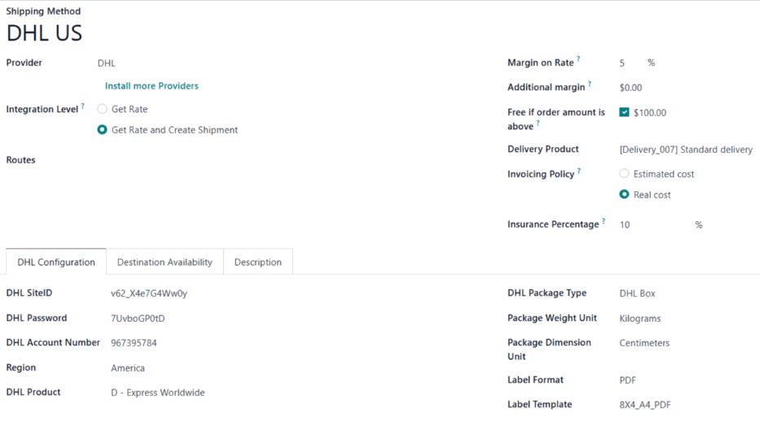

===============
DHL integration
===============

DHL is one of the shipping carriers for which a *shipping connector* is available in Odoo's
**Inventory** app. By enabling the shipping connector in the app's settings, and configuring at
least one *shipping method*, the process of :doc:`calculating shipping rates
<../setup_configuration>` and :doc:`generating shipping labels <labels>` is greatly simplified.

.. note::
   While a variety of shipping connectors are available for different carriers, this documentation
   details the configuration settings specific to integrating DHL. For instructions on configuring
   the integration settings common to all shippers, see the documentation on :doc:`third-party
   shippers <third_party_shipper>`.

Enable DHL shipping connector
=============================

Before creating a DHL shipping method, it is necessary to enable the carrier's shipping connector.
To do so, navigate to :menuselection:`Inventory app --> Configuration --> Settings`.

Scroll down to the :guilabel:`Shipping Connectors` section, and tick the checkbox next to
:guilabel:`DHL Express Connector`. Finally, click :guilabel:`Save` to apply the changes.

Once the connector has been enabled, a :icon:`oi-arrow-right` :guilabel:`DHL Shipping Methods` link
appears below. Click the link to open a page showing all shipping methods configured for DHL.

Configure DHL shipping method
=============================

After enabling the shipping connector for DHL, shipping methods can be configured for the carrier.
Once configured, a shipping method can be added as a line item to sales orders (SOs), which allows
for automatic computation of shipping rates, and generation of shipping labels.

To create a new DHL shipping method, navigate to :menuselection:`Inventory app --> Configuration -->
Settings`. In the :guilabel:`Shipping Connectors` section, select the :guilabel:`DHL Shipping
Methods` link below the :guilabel:`DHL Express Connector` checkbox.

.. note::
   It is also possible to see existing shipping methods for every carrier, by navigating to
   :menuselection:`Inventory app --> Configuration --> Shipping Methods`.

Click :guilabel:`New` to open a blank shipping method form. If a shipping method has already been
created, it can be selected from this screen.

General information
-------------------

Begin configuring the shipping method by entering its title in the :guilabel:`Shipping Method`
field.

In the :guilabel:`Provider` drop-down menu, select the :guilabel:`DHL` option. After doing so, a new
:guilabel:`DHL Configuration` tab appears at the bottom of the form.

All other fields in this section are identical on the shipping method forms for each shipping
carrier. See the documentation on :doc:`third-party shippers <third_party_shipper>` for instructions
on how to properly configure them.

DHL Configuration
-----------------

The :guilabel:`DHL Configuration` tab on the shipping method form is used to connect the user's DHL
account to Odoo, and configure the shipping method's details.

DHL SiteID, password, and account number
~~~~~~~~~~~~~~~~~~~~~~~~~~~~~~~~~~~~~~~~

A DHL SiteID, password, and account number are used to link a DHL account with third-party services,
like Odoo's **Inventory** app. The SiteID and password are different credentials than the ones used
to log in to a DHL account.

To obtain a DHL SiteID, password, and account number, it is necessary to register on the `DHL API
Developer Portal <https://developer.dhl.com/user/register>`_, by filling out the following
information:

- :guilabel:`First name`
- :guilabel:`Last name`
- :guilabel:`Email address`
- :guilabel:`Username`
- :guilabel:`Company Name`
- :guilabel:`Country`

After filling out all of the fields, tick the :guilabel:`I have read and accept the terms of use and
the privacy policy` checkbox, and click :guilabel:`Send` to register.

After registering, a confirmation email is sent to verify the application. Click the link inside the
email to activate the developer portal account, and set a password.

This email also includes the account number for the developer portal account. Enter the number in
the :guilabel:`DHL Account Number` field on the shipping method form.

Once the developer portal account has been confirmed, log in to the portal using the username and
password. Click on the user avatar in the top-right corner of the screen to open the user dashboard.

On the dashboard, click on the :guilabel:`Apps` tab, and select an app. In the
:guilabel:`Credentials` section, click the :guilabel:`Show key` button below the :guilabel:`API Key`
and :guilabel:`API Secret` fields.

Return to the shipping method form in the Odoo database. Enter the *DHL API Key* in the
:guilabel:`DHL SiteID` field, and the *API Secret* in the :guilabel:`DHL Password` field.

Shipping details
~~~~~~~~~~~~~~~~

The rest of the fields in the :guilabel:`DHL Configuration` tab are used to configure the shipping
method itself:

- :guilabel:`Region`: the region in which the shipping method is used.
- :guilabel:`DHL Product`: the shipping service purchased from DHL (e.g. Express Worldwide).
- :guilabel:`DHL Package Type`: the type of DHL package used for delivery (e.g. DHL Box).
- :guilabel:`Package Weight Unit`: the unit of measure used to display package weight.
- :guilabel:`Package Dimension Unit`: the unit of measure used to display package size.
- :guilabel:`Label Format`: the file format used to generate shipping labels.
- :guilabel:`Label Template`: the paper size used to print shipping labels.

.. important::
   Before selecting service options for a shipping method, make sure those services are actually
   available for the DHL account. Available services depend on the contract negotiated with DHL.

Options
~~~~~~~

Additional settings are available in the :guilabel:`Options` section at the bottom of the
:guilabel:`DHL Configuration` tab:

- :guilabel:`Generate Return Label`: Enable this option to automatically generate a return label
  after validating a delivery order.
- :guilabel:`Dutiable Material`: Enable this option if the shipping method is liable to customs or
  other duties.
