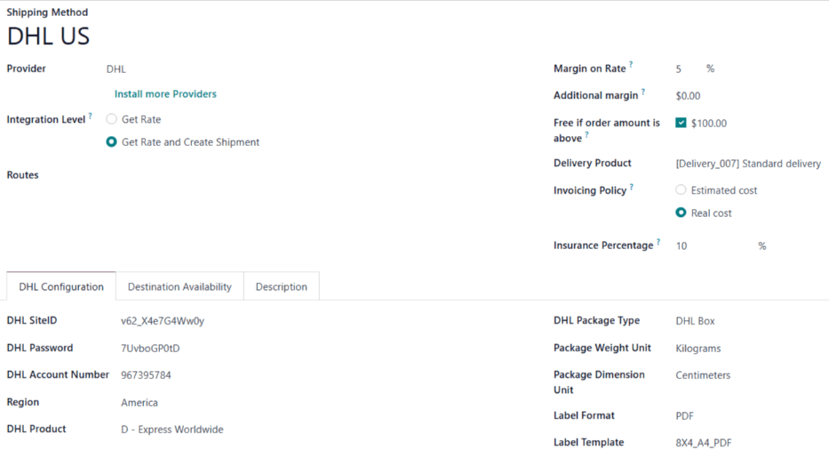

===============
DHL integration
===============

Set up the DHL shipping connector in Odoo to manage DHL shipments to clients directly within Odoo.
Configuring a DHL shipping method simplifies the process of :doc:`calculating shipping rates
<../setup_configuration>` and :doc:`generating shipping labels <labels>`.

.. seealso::
   :doc:`third_party_shipper`

Configure the DHL shipping method
=================================

To enable DHL delivery methods, :ref:`install <general/install>` the **DHL Express Shipping**
module. DHL delivery methods can be configured and added as a line item to sales orders, which
allows for automatic computation of shipping rates and generation of shipping labels.

To create a DHL shipping method, navigate to :menuselection:`Inventory app --> Configuration -->
Delivery Methods`, then click :guilabel:`New` to open a delivery method form. If a shipping method
has already been created, it can be selected from this screen.

General information
-------------------

Begin configuring the shipping method by entering its title in the :guilabel:`Shipping Method`
field.

In the :guilabel:`Provider` drop-down menu, select the :guilabel:`DHL` option, and a new
:guilabel:`DHL Configuration` tab appears at the bottom of the form.

All other fields in this section are identical on the shipping method forms for each shipping
carrier. See :doc:`third-party shippers <third_party_shipper>` for standard configuration
instructions.

DHL Configuration tab
---------------------

The :guilabel:`DHL Configuration` tab on the shipping method form is used to connect the user's DHL
account to Odoo and configure the shipping method's details.

DHL developer credentials
~~~~~~~~~~~~~~~~~~~~~~~~~

To integrate DHL with Odoo, developer credentials must be retrieved from DHL's Developer Portal.
These credentials are used to link the user's DHL account to Odoo's **Inventory** app.

.. important::
   The *SiteID* and *Password* are different credentials from the ones used to log in to a DHL
   account.

With DHL Express Account
************************

If a DHL Express account is available, log in to the `DHL Developer portal
<https://developer.dhl.com/api-reference/dhl-express-mydhl-api#get-started-section/
user-guide%get-access>`_ and `request a DHL API account number <https://developer.dhl.
com/form/dhl-express-onboarding>`_.

Then, in Odoo, on the shipping method form, enter the *DHL API Key* in the :guilabel:`DHL SiteID`
field, and the *API Secret* in the :guilabel:`DHL Password` field.

Without DHL Express Account
***************************

If a DHL Express account is **not** available:

#. Begin by opening a `DHL Express account
   <https://mydhl.express.dhl/gb/en/ship/open-account.html#/fs-step=connectors&fs-step=connectors>`_.
#. Once the developer portal account has been confirmed, log in to the portal using the username and
   password. Click the user avatar in the top-right corner of the screen to open the user dashboard.
#. On the dashboard, open the :guilabel:`Apps` tab, and create an app. Follow the four steps in the
   app creation flow (app name, needed apps, app status, confirmation) to complete the setup.

   .. image:: dhl_credentials/create-dhl-app.png
      :alt: Setup to create DHL account.

#. After setting up the DHL Express account, go `here
   <https://developer.dhl.com/user/login?destination=/form/dhl-express-onboarding>`_ to get the *DHL
   API Key* and *API Secret* credentials.

Then, in Odoo, on the shipping method form, enter the *DHL API Key* in the :guilabel:`DHL SiteID`
field, and the *API Secret* in the :guilabel:`DHL Password` field.

Shipping details
~~~~~~~~~~~~~~~~

The rest of the fields in the :guilabel:`DHL Configuration` tab are used to configure the shipping
method itself:

- :guilabel:`Region`: The region in which the shipping method is used.
- :guilabel:`DHL Product`: the shipping service purchased from DHL (e.g. Express Worldwide).
- :guilabel:`DHL Product`: The shipping service purchased from DHL (e.g., Express Worldwide).
- :guilabel:`DHL Package Type`: The type of DHL package used for delivery (e.g., DHL Box).
- :guilabel:`Package Weight Unit`: the unit of measure used to display package weight.
- :guilabel:`Package Dimension Unit`: the unit of measure used to display package size.
- :guilabel:`Label Format`: the file format used to generate shipping labels.
- :guilabel:`Package Weight Unit`: The unit of measure used to display package weight.
- :guilabel:`Package Dimension Unit`: The unit of measure used to display package size.
- :guilabel:`Label Format`: The file format used to generate shipping labels.
- :guilabel:`Label Template`: The paper size used to print shipping labels.

.. important::
   Before selecting service options for a shipping method, make sure those services are actually
   available for the DHL account. Available services depend on the contract negotiated with DHL.

Options
~~~~~~~

Additional settings are available in the :guilabel:`Options` section at the bottom of the
:guilabel:`DHL Configuration` tab:

- :guilabel:`Generate Return Label`: Enable this option to automatically generate a return label
  after validating a delivery order.
- :guilabel:`Dutiable Material`: Enable this option if the shipping method is liable to customs or
  other duties.

Turn on the DHL Connection
==========================

Once the DHL connection is set up, use the smart buttons at the top of the form to publish, turn on
production mode, or activate debug logging.

- :guilabel:`Unpublished`/:guilabel:`Published`: Determines if this shipping method is available on
  the user's **eCommerce** website.

- :guilabel:`Test Environment`/:guilabel:`Production Environment`: Determines whether label creation
  is for testing and canceled immediately (Test) or generates a real shipping label that is charged
  to the DHL account (Production).
- :guilabel:`No Debug`/:guilabel:`Debug Requests`: Determines whether API requests and responses are
  logged in Odoo (turn on :ref:`developer mode <developer-mode>` and go to :menuselection:`Settings
  app --> Technical --> Logging`).
