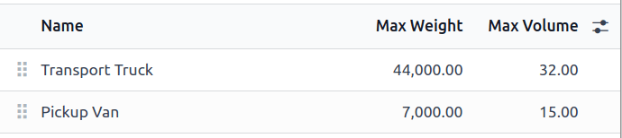
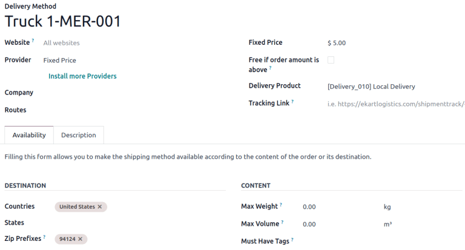
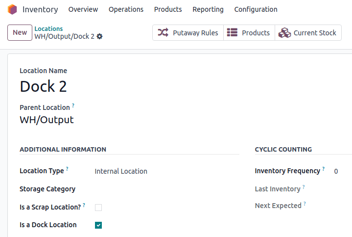
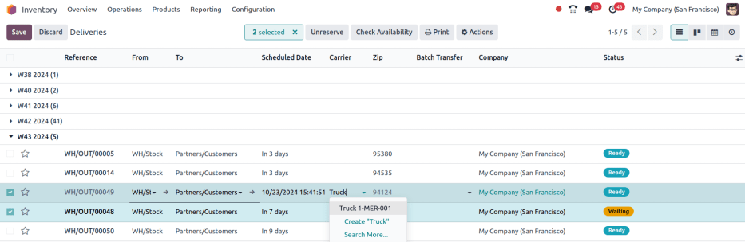
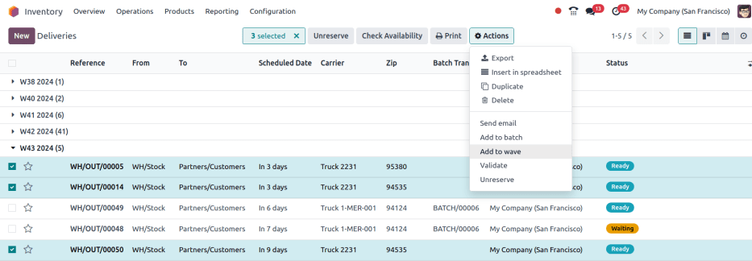
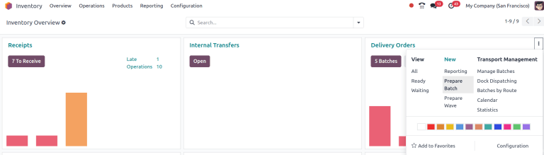
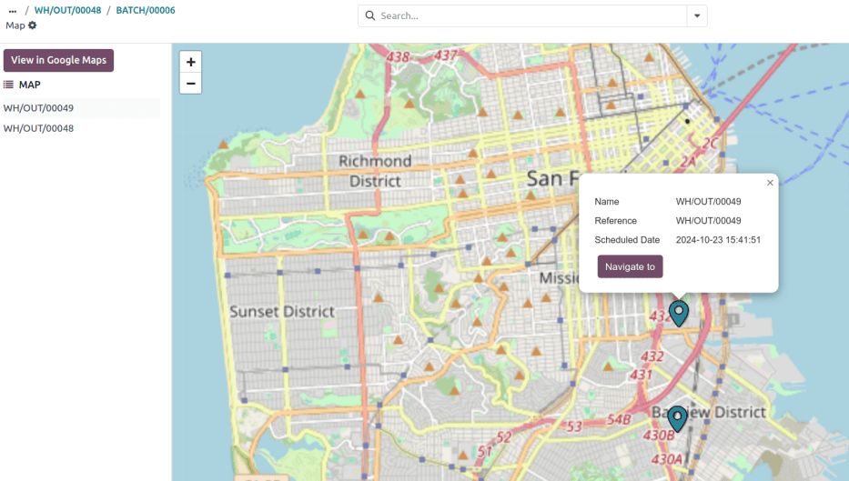
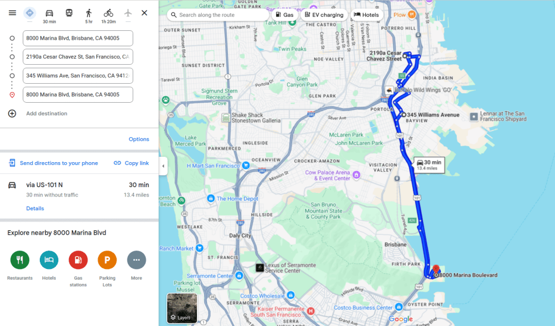

==========================
Dispatch management system
==========================

The *dispatch management system* feature in Odoo is used to plan and build shipments. Key features
include:

- **Load building**: Group products for specific carriers, assign those :doc:`batches
  <../picking_methods/batch>` to loading docks, and manage vehicle assignments based on fleet
  capacity. This ensures the right products are packed into the appropriate trucks for delivery.
- :doc:`Fleet management <../../../../hr/fleet>`: Track and manage the capacity of in-house
  delivery vehicles.

Configuration
=============

To use the dispatch management system, the following setup must be completed:

#. :ref:`Install <general/install>` the **Fleet** application.
#. Configure vehicle :ref:`capacity (volume and weight)
   <inventory/shipping_receiving/vehicle-capacity>`.
#. Enter vehicle :doc:`car model(s) <../../../../hr/fleet/models>`.
#. Enable :ref:`necessary features <inventory/shipping_receiving/inventory-features>` in the
   **Inventory** app.
#. Set up :ref:`vehicles as delivery methods
   <inventory/shipping_receiving/delivery-method-for-carrier>`.
#. Create :ref:`dock locations <inventory/shipping_receiving/docks>`.

.. _inventory/shipping_receiving/vehicle-capacity:

Vehicle capacity
----------------

To configure the vehicle capacity, go to :menuselection:`Fleet app --> Configuration -->
Categories`.

Next, click :guilabel:`New` to add a new category, or click into an existing category to modify it.
In the :guilabel:`Name` field, enter the type of vehicle (e.g., `Pick-up truck`, `Van`, or `Cargo
truck`). Then, enter the vehicle capacity in the :guilabel:`Max Weight` (in kilograms) and
:guilabel:`Max Volume` (in cubic meters) fields.

.. note::
   The units of measurement for vehicle capacity are assigned at the global level in the
   **Settings** app, in the :guilabel:`Units of Measure` section.

   .. image:: dispatch/settings.png
      :alt: Show units of measure settings.

.. seealso::
   :ref:`Vehicle category <fleet/categories>`

Car model
---------

Configuring a vehicle's car model is required when adding vehicles in Odoo. Ensure the correct
*Category* is selected for a car model. Doing so automatically applies weight and volume capacities
to all vehicles of that type.

To configure, navigate to :menuselection:`Fleet app --> Configuration --> Models`.

From the :guilabel:`Models` list, select an existing model, or click :guilabel:`New` in the top-left
corner to create a new model. Then, set the relevant :guilabel:`Category` field to the relevant
vehicle category.

.. seealso::
   :doc:`Create car model <../../../../hr/fleet/models>`

.. _inventory/shipping_receiving/inventory-features:

Inventory settings
------------------

Next, go to :menuselection:`Inventory app --> Configuration --> Settings`, and enable the required
features for dispatch management.

In the :guilabel:`Operations` section, tick the :guilabel:`Batch, Wave & Cluster Transfers`
checkbox to prepare batches of orders for delivery.

In the :guilabel:`Shipping` section, tick the :guilabel:`Delivery Methods` and :guilabel:`Dispatch
Management System` checkboxes. Doing so allows specific vehicles to be :ref:`set as carriers
<inventory/shipping_receiving/delivery-method-for-carrier>`.

In the :guilabel:`Warehouse` section, tick the :guilabel:`Storage Locations` checkbox to assign
specific locations in the warehouse as loading zones for delivery trucks.

Then, once all the configurations are complete, be sure to click :guilabel:`Save`.

.. _inventory/shipping_receiving/delivery-method-for-carrier:

Delivery method
---------------

Next, assign each delivery vehicle as a *Carrier* by configuring a delivery method.

To configure delivery methods, go to :menuselection:`Inventory app --> Configuration --> Delivery
Methods`. Select an existing delivery method, or click :guilabel:`New`.

.. seealso::
   :doc:`Configure delivery method <../setup_configuration>`

On the :guilabel:`Delivery Method` form, enter a name for the delivery method. It is recommended to
use identifying information, such as the vehicle description and license plate number (e.g. `Truck
123-ABCD`).

Since the delivery methods are managed internally, set the :guilabel:`Provider` to either
:guilabel:`Fixed Price` or :guilabel:`Based on Rules`. For more information about how shipping
prices are calculated, refer to the :doc:`Delivery method <../setup_configuration>` article.

Next, set a :guilabel:`Delivery Product`, which is the product that shows up as the customer's
:ref:`delivery charge <inventory/shipping/sales-order>` on the sales order or invoice.

Optionally, in the :guilabel:`Availability` tab, set the :guilabel:`Countries`, :guilabel:`States`,
or :guilabel:`Zip Prefixes` to limit the range of local delivery.

   Example delivery method, with the :guilabel:`Zip Prefixes` set to San Francisco's zip code.

.. _inventory/shipping_receiving/docks:

Dock locations
--------------

Each loading dock must have a dedicated location. To create or configure dock locations, go to
:menuselection:`Inventory app --> Configuration --> Locations`.

Click the desired location, which opens the :guilabel:`Location` form. In the :guilabel:`Additional
Information` section, tick the :guilabel:`Is a Dock Location` checkbox.

   Location configuration page with :guilabel:`Is a Dock Location` checkbox ticked.

Build loads
===========

Once setup is complete, :ref:`assign orders to a carrier
<inventory/shipping_receiving/assign-carrier>` and :ref:`group them into batches
<inventory/shipping_receiving/create-batch>`. Then, :ref:`configure the batch form
<inventory/shipping_receiving/batch-form>`, as needed.

To group products, go to the :menuselection:`Inventory app --> Operations --> Deliveries`, which
reveals a list of outgoing deliveries.

.. seealso::
   Since this article is about a specific use case, explore details about each picking method in
   their dedicated articles.

   - :doc:`../picking_methods/batch`
   - :doc:`Wave picking <../picking_methods/wave>`
   - :doc:`../picking_methods/cluster`

.. _inventory/shipping_receiving/assign-carrier:

Carrier assignment
------------------

Reveal the *Carrier* column, if it is not visible by default, by clicking the
:icon:`oi-settings-adjust` :guilabel:`(settings)` icon in the top-right corner, and ticking the
:guilabel:`Carrier` checkbox.

.. tip::
   Other useful columns to enable can be :guilabel:`Zip` code, :guilabel:`Shipping Weight`, and
   :guilabel:`Shipping Volume`.

Select the delivery orders for the batch by ticking the checkboxes on the left. Next, click into the
line's :guilabel:`Carrier` fields. In the resulting drop-down menu, choose the desired vehicle's
:ref:`delivery method <inventory/shipping_receiving/delivery-method-for-carrier>`. A
:guilabel:`Confirmation` pop-up window appears, indicating the number of orders being added to the
batch. Click :guilabel:`Confirm`, and the carrier is updated for all the selected records.

   The delivery method `Truck 1-MER-001` is set as the :guilabel:`Carrier` for two delivery orders.

.. _inventory/shipping_receiving/create-batch:

Create batch
------------

With the carrier set, begin adding orders to a batch or wave transfer by ticking the checkbox.

.. note::
  If a delivery order is already assigned to a batch transfer, assigning a batch transfer here does
  **not** update it.

Then, click the :icon:`fa-cog` :guilabel:`Actions` button, and click either :guilabel:`Add to batch`
or :guilabel:`Add to wave`. In the pop-up window, ensure :guilabel:`Add to` is set to :guilabel:`a
new [batch/wave] transfer`, then click :guilabel:`Confirm`.

   Delivery orders are selected to be grouped into a wave transfer.

Alternative batch creation method
~~~~~~~~~~~~~~~~~~~~~~~~~~~~~~~~~

Another place to create batches is by going to the :menuselection:`Inventory` app, and in the
:guilabel:`Delivery Orders` card, click the :icon:`fa-ellipsis-v` :guilabel:`(three dots)` icon. In
the resulting drop-down menu, click :guilabel:`Prepare batch`.

.. note::
   The :guilabel:`Transport Management` drop-down menu contains other tools for fleet management:

   - :guilabel:`Manage Batches`: open list of batches
   - :guilabel:`Dock Dispatching`: open weekly calendar view of scheduled batch operations
   - :guilabel:`Batches by Route`: Kanban view of batches grouped by fulfillment route
   - :guilabel:`Calendar`: open hourly calendar view of scheduled operations
   - :guilabel:`Statistics`: open pivot table of the batch transfers

.. _inventory/shipping_receiving/batch-form:

Batch form
----------

On the batch transfer form, fill the following fields out accordingly:

- :guilabel:`Responsible`: employee assigned to the picking. Leave blank if *any* worker can fulfill
  this picking.
- :guilabel:`Operation Type`: from the drop-down menu, select the operation type under which the
  picking is categorized.
- :guilabel:`Scheduled Date`: specifies the date by which the :guilabel:`Responsible` person should
  complete the transfer to the output location.
- :guilabel:`Dock Location`: select the loading location.
- :guilabel:`Vehicle`: select the vehicle, which will auto-fill :guilabel:`Vehicle Category`.
- :guilabel:`Vehicle Category`: show if the order exceeds the :ref:`vehicle's capacity limits
  <inventory/shipping_receiving/vehicle-capacity>`

.. example::
   The :guilabel:`Volume` bar is grayed out because the capacity has been reached.

   .. image:: dispatch/batch-form.png
      :alt: Show batch form.

Prepare delivery route
~~~~~~~~~~~~~~~~~~~~~~

To help the driver prepare, click the :guilabel:`Map` button at the top of the batch or wave form to
view delivery destinations on a map. Selecting an individual delivery order pinpoints its location.

.. note::
   The :guilabel:`Map` button is only visible for transfers with the :guilabel:`In progress` status.

Additionally, use the :guilabel:`View in Google Maps` button to generate a route from the warehouse
to the delivery points.

