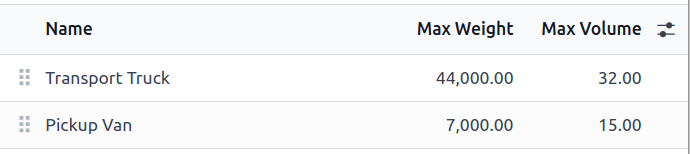
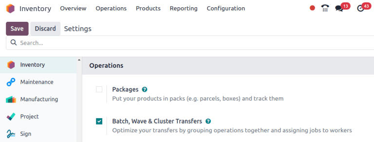
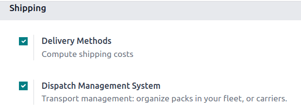
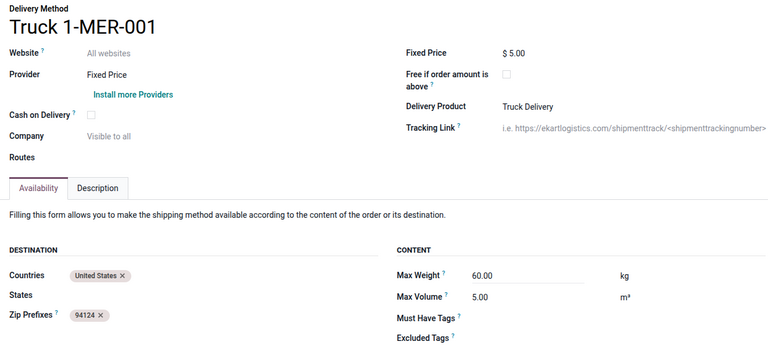
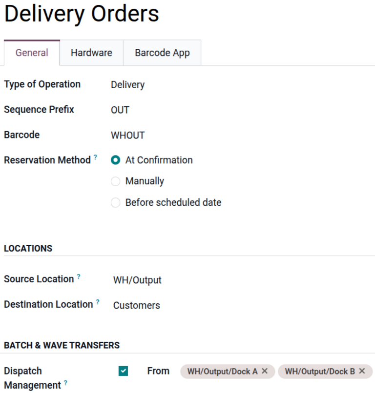
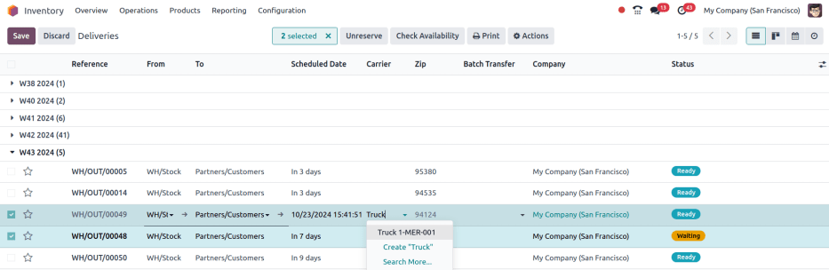
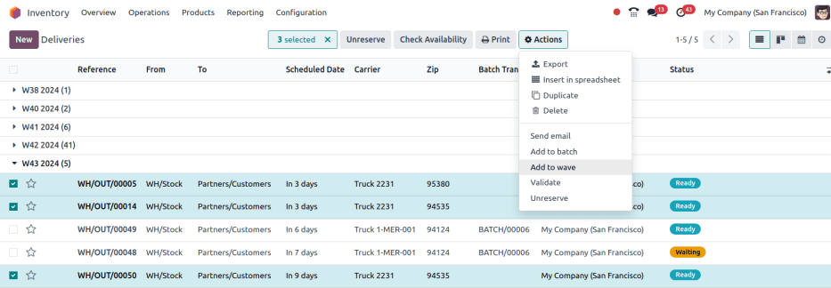
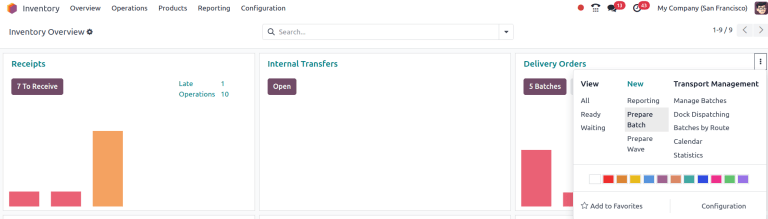
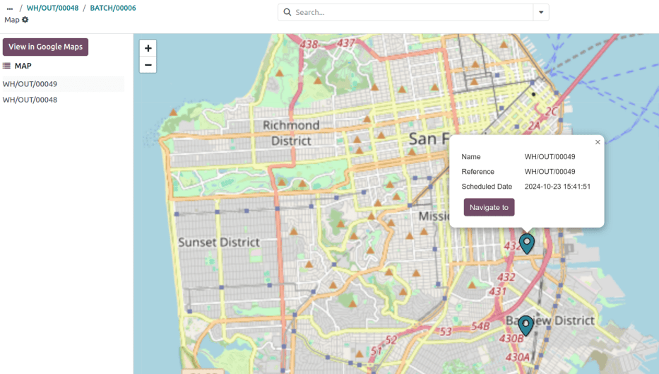
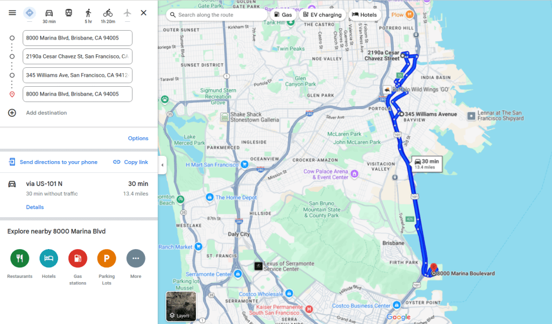

==========================
Dispatch management system
==========================

The *dispatch management system* feature in Odoo is used to plan and build shipments. Key features
include:

- *Load building*: Group products for specific carriers, assign those :doc:`batches
  <../picking_methods/batch>` to loading docks, and manage vehicle assignments based on fleet
  capacity. This ensures the right products are packed into the appropriate trucks for delivery.
- :doc:`Fleet management <../../../../hr/fleet>`: Track and manage the capacity of in-house
  delivery vehicles.

Configuration
=============

To use the dispatch management system, the following setup must be completed:

#. Install **Fleet**.
#. Configure vehicle's volume and weight :ref:`capacity
   <inventory/shipping_receiving/vehicle-capacity>`.
#. Enter the :doc:`car model(s) <../../../../hr/fleet/models>` of the vehicles.
#. Enable :ref:`necessary features <inventory/shipping_receiving/inventory-features>` in the
   **Inventory** app.
#. Set up :ref:`vehicle as a delivery method
   <inventory/shipping_receiving/delivery-method-for-carrier>`.
#. Create :ref:`dock locations <inventory/shipping_receiving/docks>`.

.. _inventory/shipping_receiving/vehicle-capacity:

Vehicle capacity
----------------

To configure the vehicle capacity, go to :menuselection:`Fleet app --> Configuration -->
Categories`.

Next, click :guilabel:`New` or an existing category. In the blank :guilabel:`Name` field, enter the
type of vehicle, e.g. `Pick-up truck`, `Van`, `Cargo truck`. Then, enter vehicle capacity in the
:guilabel:`Max Weight` (in kilograms) and :guilabel:`Volume` (in cubic meters).

.. seealso::
   :ref:`Vehicle category <fleet/categories>`

Car model
---------

Configuring a vehicle's car model is required when adding vehicles in Odoo. It is helpful to assign
the Category of the car model to the vehicle category set in the :ref:`Vehicle capacity
<inventory/shipping_receiving/vehicle-capacity>` section. This automatically applies the capacity
limits from the category to any new vehicles of this car's make and model.

To configure, navigate to :menuselection:`Fleet app --> Configuration --> Models`.

.. seealso::
   :doc:`Create car model <../../../../hr/fleet/models>`

From the :guilabel:`Models` list, select an existing model or :guilabel:`New` to create one. Then,
set the relevant :guilabel:`Category` field to the relevant vehicle category.

.. _inventory/shipping_receiving/inventory-features:

Inventory settings
------------------

Next, go to :menuselection:`Inventory app --> Configuration --> Settings` and enable the necessary
**Inventory** features to use the dispatch management system.

In the :guilabel:`Operations` section, tick the :guilabel:`Batch, Wave & Cluster Transfers`
checkbox. This will be used to prepare batches of orders to be loaded into a delivery truck.

In the :guilabel:`Shipping` section, tick the :guilabel:`Delivery Methods` and :guilabel:`Dispatch
Management System` checkboxes. Doing so allows specific vehicles to be :ref:`set as carriers
<inventory/shipping_receiving/delivery-method-for-carrier>` on a sales order.

In the :guilabel:`Warehouse` section, tick the :guilabel:`Storage Locations` checkbox to assign
specific locations in the warehouse as loading zones for delivery trucks.

.. _inventory/shipping_receiving/delivery-method-for-carrier:

Delivery method
---------------

Next, ensure each delivery vehicle is properly assigned as a :guilabel:`Carrier` on a delivery order
by configuring a delivery method for each vehicle.

To configure delivery methods, go to :menuselection:`Inventory app --> Configuration --> Delivery
Methods`. Select an existing delivery method, or click :guilabel:`New`.

.. seealso::
   :doc:`Configure delivery method <../setup_configuration>`

On the :guilabel:`Delivery Method` form, name the delivery method as the vehicle, with identifying
information, such as the license plate. Since we're configuring internally managed methods of
delivery, set the :guilabel:`Provider` to either :guilabel:`Fixed Price` or :guilabel:`Based on
Rules`.

Next, set a :guilabel:`Delivery Product`, which is the product that shows up as the customer's
delivery charge.

Optionally, in the :guilabel:`Availability` tab, set the :guilabel:`Countries`, :guilabel:`States`,
or :guilabel:`Zip Prefixes` to limit the range of local delivery.

   Example delivery method, with the :guilabel:`Zip Prefixes` set to the surrounding San Francisco
   area.

.. _inventory/shipping_receiving/docks:

Dock locations
--------------

Each loading dock that delivery trucks load products from must have a dedicated dock location set.
To create or configure dock locations, go to :menuselection:`Inventory app --> Configuration -->
Locations`.

Choose the desired location, and on the :guilabel:`Location` page, in the :guilabel:`Additional
Information` section, tick the :guilabel:`Is a Dock Location` checkbox.

  Location configuration page with :guilabel:`Is a Dock Location` checkbox ticked.

Build loads
===========

After completing setup, batches of orders can be grouped together to load onto a delivery truck. To
do that, orders must be :ref:`assigned to the carrier
<inventory/shipping_receiving/assign-carrier>`. Then, group delivery orders together to :ref:`create
a batch <inventory/shipping_receiving/create-batch>`. Finally, :ref:`configure the batch form
<inventory/shipping_receiving/batch-form>` correctly.

Since this article is about a specific use case, the details about each picking methods can be
further explored in their dedicated articles.

.. seealso::
   - :doc:`../picking_methods/batch`
   - :doc:`Wave picking <../picking_methods/wave>`
   - :doc:`../picking_methods/cluster`

To group products, go to the :menuselection:`Inventory app --> Operations --> Deliveries`, which
reveals a list of outgoing deliveries.

.. _inventory/shipping_receiving/assign-carrier:

Carrier assignment
------------------

Reveal the :guilabel:`Carrier` column if it is not visible by default, by clicking the
:icon:`oi-settings-adjust` :guilabel:`(settings)` icon and ticking the :guilabel:`Carrier` checkbox.

.. tip::
   Other useful columns to enable can be :guilabel:`Zip` code, :guilabel:`Shipping Weight` and
   :guilabel:`Shipping Volume`.

Next, tick the checkbox to far left of the delivery orders intended to go into the batch. After the
deliveries are selected, click into one of the line's :guilabel:`Carrier` fields. In the resulting
drop-down menu, choose the desired vehicle's :ref:`delivery method
<inventory/shipping_receiving/delivery-method-for-carrier>`. In the resulting
:guilabel:`Confirmation` pop-up window, click :guilabel:`Confirm`.

   The delivery method `Truck 1-MER-001` is set as the :guilabel:`Carrier` for two delivery orders.

.. _inventory/shipping_receiving/create-batch:

Create batch
------------

With the carrier set, add the orders to a batch by having the desired orders checked. Then, click
the :icon:`fa-cog` :guilabel:`Actions` button and click either :guilabel:`Add to batch` or
:guilabel:`Add to wave` to group the orders. In the resulting pop-up window, ensure the
:guilabel:`Add to` field is set :guilabel:`a new [batch/wave] transfer`, and click
:guilabel:`Confirm`. Doing so opens a batch or wave transfer with the orders included.

   Delivery orders are selected to be grouped into a wave transfer.

Alternative batch creation method
~~~~~~~~~~~~~~~~~~~~~~~~~~~~~~~~~

Another place to create batches is by going to the :menuselection:`Inventory` app, and in the
:guilabel:`Delivery Orders` card, click the :icon:`fa-ellipsis-v` :guilabel:`(three dots)` icon.
In the resulting drop-down menu, click :guilabel:`Prepare batch`.

.. note::
   In the :guilabel:`Transport Management` drop-down menu, these other options are used for the
   following:

   - :guilabel:`Manage Batches`: open list of batches.
   - :guilabel:`Dock Dispatching`: open weekly calendar view of scheduled batch operations.
   - :guilabel:`Batches by Route`: kanban view of batches grouped by fulfillment route.
   - :guilabel:`Calendar`: open hourly calendar view of scheduled operations.
   - :guilabel:`Statistics`: open pivot table of the batch transfers.

.. _inventory/shipping_receiving/batch-form:

Batch form
----------

On the batch transfer form, fill the following fields out accordingly:

- :guilabel:`Responsible`: employee assigned to the picking. Leave this field blank if *any* worker
  can fulfill this picking.
- :guilabel:`Operation Type`: from the drop-down menu, select the operation type under which the
  picking is categorized.
- :guilabel:`Scheduled Date`: specifies the date by which the :guilabel:`Responsible` person should
  complete the transfer to the output location.
- :guilabel:`Dock Location`: select the loading location.
- :guilabel:`Vehicle`: select the vehicle, which will auto-fill :guilabel:`Vehicle Category`.
- :guilabel:`Vehicle Category`: configure the vehicle category to determine the vehicle's capacity.
  Items in the batch, with the weight and volume fields configured on the product form, are totaled
  to show how much space is remaining for loading products.

The :guilabel:`Weight` and :guilabel:`Volume` fields display whether the items in the order exceed
the :ref:`capacity set on the vehicle category <inventory/shipping_receiving/vehicle-capacity>`.

.. example::
   The :guilabel:`Volume` bar is grayed out because the capacity has been reached.

   .. image:: dispatch/batch-form.png
      :alt: Show batch form.

Prepare delivery route
~~~~~~~~~~~~~~~~~~~~~~

Additional resources are available to prepare the driver for the delivery. On the top of the batch
or wave form, click the :guilabel:`Map`. Doing so opens another page, displaying a map. Selecting an
individual delivery order pin points the destination location on the map.

Additionally, the :guilabel:`View in Google Maps` button can be clicked to generate a Google Map
route from the warehouse location to the delivery locations.

