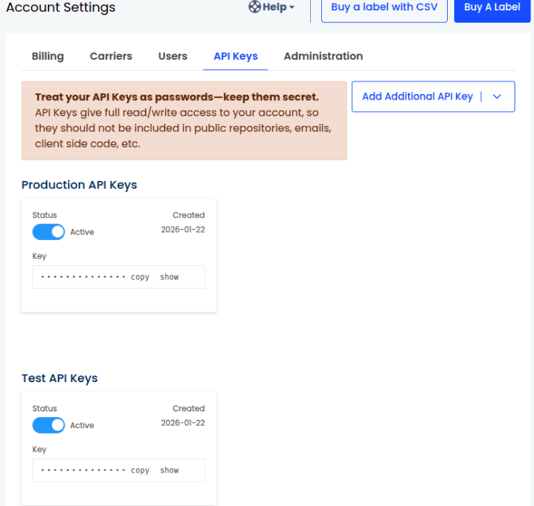
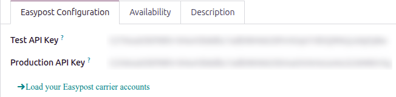
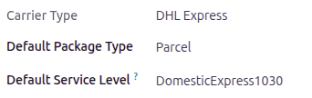

====================
EasyPost integration
====================

Set up the EasyPost delivery connector in Odoo to manage EasyPost shipments to clients directly
within Odoo.

EasyPost is a service that allows users to connect with multiple carriers, like UPS, USPS, FedEx,
DHL, and more. Odoo can then connect to EasyPost to purchase labels from those carriers.

To configure it, complete these steps:

#. :ref:`Create an EasyPost account <inventory/shipping_receiving/easypost-account>`.
#. :ref:`Integrate carrier accounts if the carrier is not enabled on the EasyPost account
   <inventory/shipping_receiving/integrate-easypost-carrier>`.
#. :ref:`Obtain Test and Production API keys <inventory/shipping_receiving/easypost-api-keys>`.
#. :ref:`Set up the delivery method in Odoo <inventory/shipping_receiving/easypost-method>`.

Upon completion, it is possible to calculate shipping costs based on package size and weight, have
the charges applied directly to an EasyPost business account, and automatically print EasyPost
tracking labels in Odoo.

.. _inventory/shipping_receiving/easypost-account:

Account setup
=============

To begin, go to the `EasyPost <https://www.easypost.com>`__ website to create or log into the
company's EasyPost business account.

Follow the website's steps to complete registration and sign up for shipping services. Some shipping
services (like USPS and DHL Express) are automatically enabled.

.. _inventory/shipping_receiving/integrate-easypost-carrier:

Integrating other carrier accounts
----------------------------------

To use a different carrier, it is possible to `enable Wallet Carrier Accounts
<https://support.easypost.com/hc/en-us/articles/21336276718605-Enabling-Wallet-Carriers-Using-the-EasyPost-Dashboard>`__
to purchase labels from EasyPost. Alternatively, if a user has their own carrier account, they can
`enable it on EasyPost
<https://support.easypost.com/hc/en-us/articles/25246240687373-Bring-Your-Own-Carrier-Account-to-EasyPost>`__.
Then, after these accounts are enabled, Odoo can integrate with the EasyPost account and manage
labels.

.. _inventory/shipping_receiving/easypost-api-keys:

Obtain Test and Production API keys
-----------------------------------

After completing the setup, create Test and Production API keys. On the EasyPost website, click the
:guilabel:`Account Settings` link, then open the :guilabel:`API Keys` page.

If these API keys have not yet been created, click :guilabel:`Add Additional API Key`. Select either
:guilabel:`Production` or :guilabel:`Test`. The API key is automatically created. Follow the same
process to create both keys.

.. _inventory/shipping_receiving/easypost-method:

Delivery method configuration
=============================

With those necessary credentials, configure the EasyPost delivery method in Odoo by going to
:menuselection:`Inventory app --> Configuration --> Delivery Methods`.

On the *Delivery Methods* page, click :guilabel:`New`.

In the :guilabel:`Provider` field, select :guilabel:`Easypost` from the drop-down menu. Doing so
reveals the *Easypost Configuration* tab at the bottom of the form, where the EasyPost API keys
should be entered.

For details on configuring the other fields on the delivery method, such as :guilabel:`Delivery
Product`, refer to the :doc:`new_delivery_method` documentation.

.. note::
   To generate EasyPost shipping labels through Odoo, ensure the :guilabel:`Integration Level`
   option is set to :guilabel:`Get Rate and Create Shipment`.

In the *Easypost Configuration* tab, complete the following fields:

- :guilabel:`Test API Key`: the Test API key in the EasyPost Account Settings.
- :guilabel:`Production API Key`: the Production API key in the EasyPost Account Settings.
- :guilabel:`Label Format`: Choose :guilabel:`PNG`, :guilabel:`PDF`, :guilabel:`ZPL`, or
  :guilabel:`EPL2` from the drop-down menu.
- :guilabel:`Generate Return Label`: Select to automatically generate a return label when validating
  the delivery.

Save the delivery method by clicking the :icon:`fa-cloud-upload` :guilabel:`(Save manually)` icon.

Click the :guilabel:`Load your Easypost carrier accounts` link under the API keys.

The *Select a carrier* pop-up window opens. Select a shipping carrier from the drop-down menu, then
click :guilabel:`Select`.

After the carrier type has been selected, complete the :guilabel:`Default Package Type` and
:guilabel:`Default Service Level` fields.

Turn on the Easypost integration
================================

After the EasyPost connection is set up, use the smart buttons at the top of the form to publish,
turn on production mode, or activate debug logging.

- :guilabel:`Unpublished/Published`: determines if this delivery method is available on the user's
  **eCommerce** website.
- :guilabel:`Test Environment/Production Environment`: determines whether label creation is for
  testing and cancelled immediately (Test) or generating a real shipping label that is charged to
  the EasyPost account (Production).
- :guilabel:`No Debug/Debug Requests`: determines whether API requests and responses are logged in
  Odoo (turn on **developer mode** and go to :menuselection:`Settings app --> Technical -->
  Logging`).
