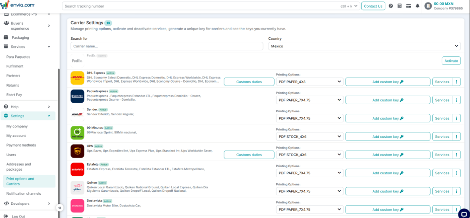
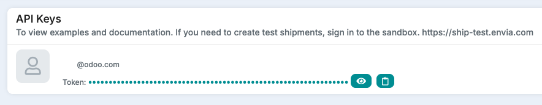
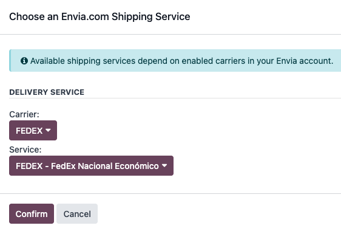
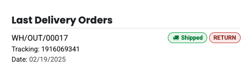

=====================
Envia.com integration
=====================

Envia.com is a shipping service that connects businesses with multiple carriers in Odoo. Key
features include:

- **Multi-carrier & international shipping**: Compare rates across carriers and select the best
  option for domestic or global shipments.
- **Automated label generation**: Generate shipping labels at order confirmation.
- **Real-time rate calculation**: Fetch rates based on package details and destination.

Setup in Envia
==============

To integrate `Envia.com <https://www.envia.com>`_ with Odoo, first create an account and activate
the necessary shipping carriers. Then, obtain the API credentials, which is used to connect
Envia.com to the Odoo database.

Create an account and activate carriers
---------------------------------------

Begin by going to `Envia.com <https://www.envia.com>`_.

After signing in, in the left sidebar, click :menuselection:`Settings --> Print Options and
Carriers`. Next, select the country to set the currency and display available shipping carriers.

.. important::
   When signing up, make sure to select the correct language **and** country in the upper right-hand
   corner. This affects the currency of the account!

   .. image:: envia_shipping/envia-registry-process.png
      :alt: Registry process in website with Envia.com.

After deciding on the desired carrier, click :guilabel:`Activate`, then click :guilabel:`Services`
to select the carrier's available shipping options.

.. tip::
   Billing is always processed in the currency of the country that matches the primary billing
   address. If the company operates in multiple countries, consider creating separate accounts for
   each location.

.. note::
   Envia will send an SMS or WhatsApp message to confirm the email address and phone number.

Generate Envia.com credentials
------------------------------

Go to `Envia.com <https://www.envia.com>`_, navigate to :menuselection:`Developers --> API Keys`, on
the left menu, then click :guilabel:`add` to generate a new key.

This key is required to authenticate Odoo's connection with Envia.com. Retrieve it at any time by
returning to the :guilabel:`API Keys` section.

Setup in Odoo
=============

:ref:`Install <general/install>` the :guilabel:`Envia Shipping` (`delivery_envia`) module, and
proceed to the following sections to configure the integration in Odoo.

Envia.com shipping connector configuration
------------------------------------------

After activating the Envia.com connector, create a delivery method by going to
:menuselection:`Inventory --> Configuration --> Delivery Methods` and click :guilabel:`New`.

Fill out the following form fields:

- :guilabel:`Shipping Method`: Name of the shipping method, e.g. `Envia.com`.
- :guilabel:`Provider`: Select :guilabel:`Envia` from the drop-down menu.
- :guilabel:`Delivery Product`: The product listed on the sales order as the delivery charge. A
  specific delivery product for Envia.com must be created.
- In the :guilabel:`Envia Configuration` tab, enter the :guilabel:`Envia Production Access Token`.
- In the :guilabel:`Envia Configuration` tab, enter the :guilabel:`Envia Sandbox Access Token`.
- :guilabel:`Insurance percentage`: If insurance is needed, place a percentage of the value to
  insure. If not, leave it as 0. Keep in mind that the insurance price is calculated only after the
  label has been generated, including for LTL shipments.

.. tip::
   It is mandatory to fill both the production and sandbox tokens, but it could be left as a random
   character as it is not validated at this point.

Additional considerations for the :guilabel:`Envia Default Package`:

- The package is specified in :guilabel:`mm` and :guilabel:`kg`. The weight refers to the container
  itself, not its contents. Leave the weight as `0` if no weight is reported, and set the max weight
  to `0` if there is no specified limit.
- :guilabel:`Envia Package Type`: Set to :guilabel:`Box` by default. Ensure the correct type is
  selected, as it affects the available carriers and options displayed, which vary depending on this
  selection.

Once previous fields are properly set, navigate to the :guilabel:`Envia Configuration` tab, and in
the :guilabel:`Envia.com Service Name` field, click the :icon:`fa-refresh` :guilabel:`(refresh)`
icon to sync the carriers. In the pop-up window that appears, select a carrier and a service level
from the list.

.. important::
   Envia keeps the main currency of the account fixed. In order to provide more precise conversions
   for the costs of shipping, specify the currency that is set for the account on Envia. If
   necessary, Odoo offers the option to change the country. By default it uses the country
   associated with the company.

.. note::
   If more than one shipping option is needed, create more shipping methods in Odoo and modify any
   parameter like the package, carrier, or service.

.. _inventory/shipping_receiving/envia-shipping-info:

Shipping information
--------------------

To use Envia.com to generate shipping labels, the following information **must** be filled out
accurately and completely in Odoo:

#. **Customer information**: When creating a quotation, ensure the selected :guilabel:`Customer` has
   a valid phone number, email address, and shipping address.

   To verify, select the :guilabel:`Customer` field to open their contact page. Here, add their
   shipping address in the :guilabel:`Contact` field, along with their :guilabel:`Mobile` number and
   :guilabel:`Email` address.
#. **Product weight**: Ensure all products in a delivery order have a specified :guilabel:`Weight`
   in the :guilabel:`Inventory` tab of their product form. Refer to the :ref:`Product weight section
   <inventory/shipping_receiving/configure-weight>` of this article for detailed instructions.
#. **Warehouse address**: By default all packages are sent from the specified address in the
   warehouse, make sure to set the address for correct label generation.

Address filling guide
---------------------

Each country has rules regarding how an address is filled. This is a comprehensive guide of each
country's expected fields exceptions:

.. list-table::
   :header-rows: 1
   :stub-columns: 1

   * - Country
     - Street
     - Street 2
     - City
     - State_id
   * - Argentina
     - Street and number
     - Locality
     - City
     - Province
   * - Brazil
     - Exception
     - Neighborhood
     - City
     - State
   * - Chile
     - Street and number
     - City
     - Commune
     - Region
   * - Colombia
     - Street and number
     - Not needed
     - Municipality
     - Department
   * - Guatemala
     - Street and number
     - Neighborhood
     - City
     - State
   * - Mexico
     - Street and number
     - Neighborhood
     - City
     - State
   * - Uruguay
     - Street and number
     - Complementary info
     - Locality
     - State

Countries not listed here should be entered normally.

.. note::
   For some countries, the zip code is not commonly requested. If empty, Odoo will use Envia's zip
   approximation services to get the zip code.

   For Colombia, the zip code is extracted from the city selected in `city_id` if the localization
   is installed, otherwise Odoo will use the zip field.

.. note::
   Colombia and Mexico have a list of cities referred to as `city_id` in Odoo. If `city_id` is set,
   it is used as the city field. If not set, then Odoo will try to use the city field.

.. note::
   In Mexico, some carriers might require the :guilabel:`Colony` field, commonly known as
   neighborhood. It is not always mandatory, but when using the **EDI for Mexico (Advanced
   Features)** module, the :guilabel:`Colony` field is required.

.. note::
   In Brazil the address is split to comply with regulation, so `street_name` is used for the street
   name only. `street_number1` is used for the street number and `street_number2` is used for the
   complement. This logic also applies if the :guilabel:`Extended Addresses` module is installed.

Generate labels with Envia
==========================

When creating a quotation in Odoo, add shipping and the :guilabel:`Envia.com shipping product`.
Then, :guilabel:`Validate` the delivery. Shipping label documents are automatically generated in the
chatter, which include the following:

#. :guilabel:`Shipping label(s)` depending on the number of packages.
#. :guilabel:`Return label(s)` if the Envia.com connector is configured for returns.

.. important::
   When labels are created, Envia.com automatically charges the configured account and the final
   amount is logged in the chatter. If multi-currency operations occur, the amount logged is
   calculated using Odoo's rate. Actual rates may vary.

Additionally, the tracking number is now available.

.. note::
   Brazilian Authorities might request the invoice related to the shipping (NFe). It is recommended
   to physically attach the invoice of the order along with the label.

International shipping
----------------------

For international shipments it is required to fill both the :guilabel:`HS code` and the country of
:guilabel:`Origin of Goods`, both can be found on the product's :guilabel:`Inventory` tab.

LTL shipments
-------------

LTL shipment labels can be generated through the Envia connector. The insurance for LTL shipments is
based on the *insurance percentage* specified in the delivery method's form.

.. important::
   For Mexico, since a *Bill of Landing* needs to be created for the shipment, Odoo is required to
   send the UNSPSC code of the contents, as well as a unit of measure for transportation which is
   **X8A - Pallet de madera** by default.

.. note::
   Additional services are available when selecting `pallet` as a :guilabel:`Envia Package Type` on
   the delivery method, which allows selecting additional services like lift assistance and
   deliveries during weekends.

.. _inventory/shipping_receiving/setup_configuration/cancel:

Tracking and cancellation
=========================

Shipments registered with Envia can be tracked using the :guilabel:`Tracking` smart button from the
delivery order or using the tracking link from the :doc:`customer portal
<../../../../general/users/portal>`.

FAQ
===

Measuring volumetric weight
---------------------------

Many carriers have several measurements for weight. There is the actual weight of the products in
the parcel, and the volumetric weight. Volumetric weight is the volume that a package occupies when
in transit, i.e. the physical size of a package.

.. note::
   Due to volumetric weight, it is possible that the actual weight in the label is higher than the
   calculated value.

Which printing options are available?
-------------------------------------

On Envia.com in :menuselection:`Settings --> Print options and Carriers printing options` for each
of the carriers displayed, make sure to use the appropriate format for the chosen carrier.

The needed service is not available
-----------------------------------

For available carriers, make sure that they are enabled through Envia.

Who will pay customs duties?
----------------------------

It's important to make sure that if there are exports to other countries, use Envia's carrier
settings to configure whether it is paid by the sender or the receiver.

What is "Envia error"?
----------------------

It's a message that appears when there's an error in Envia. This message mentions what went wrong in
their platform so it can be addressed.
