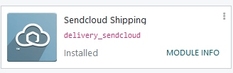
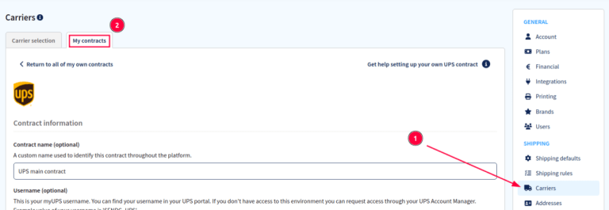

=====================
Envia.com Integration
=====================

Envia is a shipping service aggregator with presence in over 13 countries, specializing in Latin America. Once integrated, users can select shipping carriers on inventory operations in their Odoo database.

Setup in Envia
==================

Create an account and activate carriers
---------------------------------------

If you don’t have an account, we recommend heading to the `referral link <https://ship.envia.com/registro?partner_id=673>`_. This link provides personalized attention while also offering lower prices.

 
.. tip::
   Make sure to select the appropriate country for your main billing, if you have multi-country operations you can also create two separate accounts, keep in mind that your billing will be done in your main currency.
  
.. note::
   Envia requests to confirm your email address and phone number via SMS or Whatsapp.

Generate Envia.com credentials
-----------------------

In your Envia.com, navigate to :menuselection:`Developers --> API Keys`, on the left menu and click on :guilabel:`add` to generate a new key.

This API key is the one we will request in Odoo, you can always come back for it.

Setup in Odoo
==================

Install Envia.com shipping module
-----------------------

Go to Odoo’s :guilabel:`Apps` module, search for the `Envia Shipping` integration, and install it.

Envia shipping connector configuration
-----------------------

After activating the Envia Connector, go to the Delivery Methods page and click Create.

.. tip::
   :guilabel:`Shipping Methods` can also be accessed by going to :menuselection:`Inventory -->
   Configuration --> Delivery --> Shipping Methods`.

Fill out the following fields in the New Delivery Method form:

- :guilabel:`Shipping Method`: type `Shipping carrier name`.
- :guilabel:`Provider`: select :guilabel:`Envia` from the drop-down menu.
- :guilabel:`Delivery Product`: set the product that was configured for this shipping method or
  create a new product, a default Envia.com product is provided.
- In the :guilabel:`Envia Configuration` tab, enter the :guilabel:`Envia Production Access Token`.
- In the :guilabel:`Envia Configuration` tab, enter the :guilabel:`Envia Sandbox Access Token`.
- Manually :guilabel:`Save` the form by clicking the cloud icon next to the :guilabel:`Shipping
  Methods / New` breadcrumbs.
- :guilabel:`Insurance percentage`: If insurances is needed here we need to place a percentage of the value to insure, 
  if this is not desired, it can always be left as 0. Keep in mind that insurance price is calculated only after the label has been generated. This also applies to LTL shipments.

.. tip::
   It is mandatory to fill both the production and sandbox tokens but it is not validated at this point, it could be left with just a random character.

Additional considerations for the :guilabel:`Envia Default Package`:
  
- The package is specified in :guilabel:`mm` and :guilabel:`kg`. Keep in mind that the weight is for the container alone and not its contents, 
  it can be left as 0 for no reported weight and 0 in max weight for no specified limit weight.
- :guilabel:`Envia Package Type`: By default is set to Box, make sure to select the appropriate one because it will be 
  used to display available carriers and options as they change depending on it.

Once previous fields are properly set, sync the carriers and a pop up will ask you to select one from the list and a service level: 

.. important::
   Envia keeps the main currency of the account fixed so in order to provide more precise conversions for the costs of shipping you have to 
   specify the currency that is set for your account on Envia.
   If necessary, we offer the option to change your origin country, by default it uses the country associated with your company.

.. note::
   If more than one shipping option is needed, just create more Odoo shipping methods and vary any parameter like the package, carrier or service.

Shipping information
--------------------

To use Envia.com to generate shipping labels, the following information **must** be filled out
accurately and completely in Odoo:

#. **Customer information**: when creating a quotation, ensure the selected :guilabel:`Customer` has
   a valid phone number, email address, and shipping address.

   To verify, select the :guilabel:`Customer` field to open their contact page. Here, add their
   shipping address in the :guilabel:`Contact` field, along with their :guilabel:`Mobile` number and
   :guilabel:`Email` address.

#. **Product weight**: ensure all products in an order have a specified :guilabel:`Weight` in the
   :guilabel:`Inventory` tab of their product form. Refer to the :ref:`Product weight section
   <inventory/shipping_receiving/configure-weight>` of this article for detailed instructions.

#. **Warehouse address**: By default all packages will be sent from the specified address in the
   warehouse, make sure to set the address for correct label generation.

Address filling guide
--------------------

Each country has rules regarding how an address is filled so here is a comprehensive guide of each country's expected fields exceptions:

.. list-table::
   :header-rows: 1
   :stub-columns: 1

   * - Country
     - Street
     - Street 2
     - City
     - State_id
   * - Argentina
     - Street and number
     - Locality
     - City
     - Province
   * - Brazil
     - Exception
     - Neighborhood
     - City
     - State
   * - Chile
     - Street
     - City
     - Commune
     - Region
   * - Colombia
     - Street and number
     - Not needed
     - Municipality
     - Department
   * - Guatemala
     - Street and Number
     - Neighborhood
     - City
     - State
   * - Mexico
     - Street and number
     - Neighborhood
     - City
     - State
   * - Uruguay
     - Street and number
     - Complementary info
     - Locality
     - State

  
Countries not listed here should be filled as normal.

.. note::
   For some countries the zipcode is not commonly requested, it is not filled, Odoo will use Envia's zip approximation services to get the zip code.
   For Colombia the zipcode is extracted from the city selected in city_id if the localization is installed, otherwise Odoo will use the zip field.

.. note::
   Colombia and Mexico have a list of cities referred to as city_id in Odoo, if city_id is set it will be used as the city field, if not set then Odoo will try to use the city field.

.. note::
   In Mexico some carriers might require the :guilabel:`Colony` field commonly know as neighborhood, it is not always mandatory but if required the installation of the 
   :guilabel:`EDI for Mexico (Advanced Features)` module will be needed.
  
.. note::
   In Brazil the address is split to comply with regulation so street_name is used for the street name only, street_number1 is used for the street number and street_number2 is used for the complement.
   This logic also applies if the :guilabel:`extended address module` is installed.

  
Generate labels with Envia
==================

When creating a quotation in Odoo, add shipping and a :guilabel:`Envia.com shipping product`. Then,
:guilabel:`Validate` the delivery. Shipping label documents are automatically generated in the
chatter, which include the following:

#. :guilabel:`Shipping label(s)` depending on the number of packages.
#. :guilabel:`Return label(s)` if the Sendcloud connector is configured for returns.

.. important::
   When labels are created, Envia.com automatically charges the configured
   account and the final amount is logged in the chatter, if multi-currency operations ocurr the
   amount logged will be calculated usind Odoo's rate, actual rates may vary.

Additionally, the tracking number is now available.

.. note::
   In Brazil Authorities might request the invoice related to the shipping (NFe), it is recommended to physically attach the invoice of the order along with the label.

International shipping
--------------------

For international shipments it is required to fill both :guilabel:`HS code` and the country of :guilabel:`Origin of Goods`,
both can be found on the product’s :guilabel:`Inventory tab`.

LTL Shipments
--------------------
LTL shipment labels can be generated through the connector, the insurance for LTL shipments is covered under the insurance percentage value at the delivery method’s form.

.. important:: 
   For Mexico since a Bill of Landing needs to be created for the shipment, Odoo is required to send the UNSPSC code of the contents,
   as well as a unit of measure for transportation which is currently fixed as :guilabel:`X8A - Pallet de madera`.

.. note::
   Additional services are available when you select pallet as an option and allows you to give additional services like lift assistance and deliveries during weekends.

Tracking and cancellation
==================
Shipments registered with Envia can be tracked using the tracking smart button from the delivery order or using the tracking link from the customer portal.

Cancellations can be requested directly, see :ref:`Product weight section
   <inventory/shipping_receiving/setup_configuration/cancel>`

FAQ
===

Measuring volumetric weight
---------------------
  
Many carriers have several measures for weight. There is the actual weight of the products in the parcel, and there is the volumetric weight (
Volumetric weight is the volume that a package occupies when in transit. In other words it is the physical size of a package).
  
.. note::
   Due to volumetric weight it is possible that the actual weight in the label is higher than the calculated value.

Which printing options are available?
---------------------
  
On Envia.com in :menuselection:`Settings > Print options and Carriers printing options` for each of your carriers are displayed, make sure to use the appropriate format for the carrier of your choice.

My desired service is not available
---------------------

For available carriers make sure that they are enabled through Envia.

Who will pay customs duties?
---------------------

It’s important to make sure that if there are exports to other countries, whether its paid by the customer or the receiver it is configured in Envia's carrier settings.

What is Envia error?
---------------------------------

Every error that gives the message "Envia error" means that Envia.com is directly telling us what went wrong in their platform so it can be addressed.
