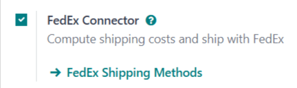
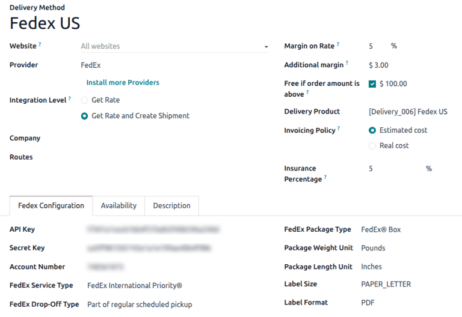
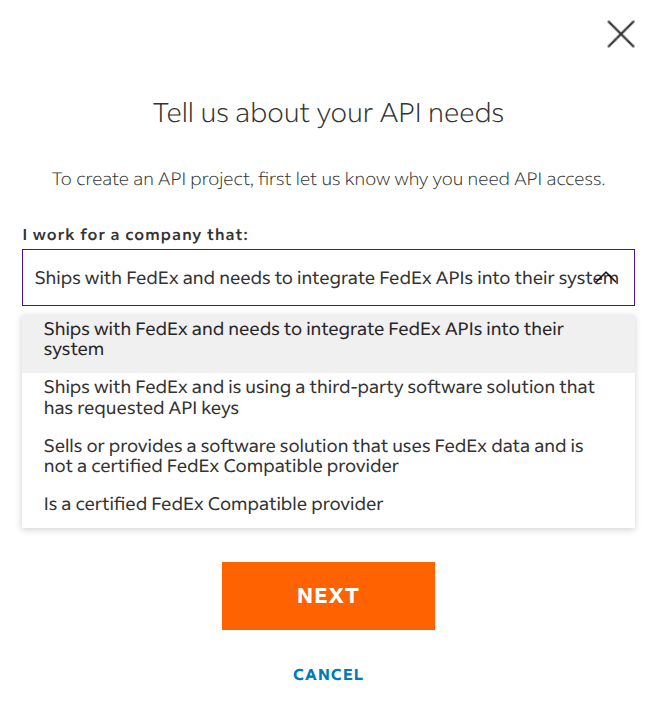
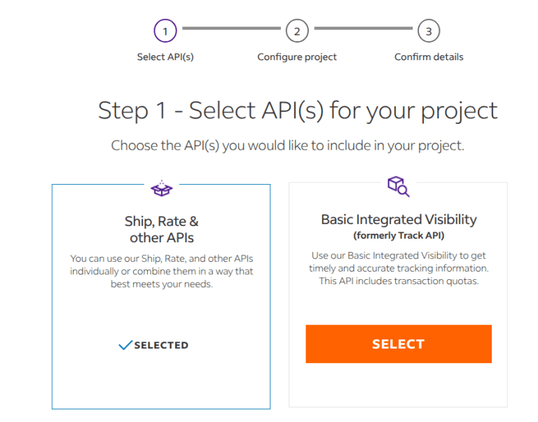
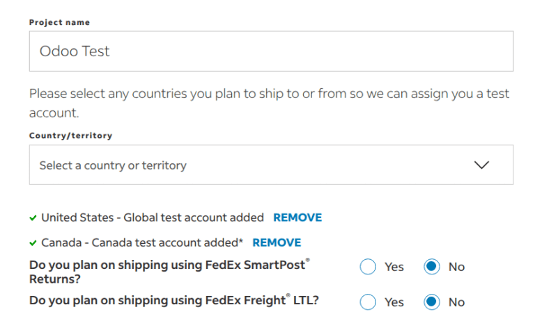

=================
FedEx integration
=================

Integrating a FedEx account with Odoo's **Inventory** app makes it possible to :doc:`calculate
delivery rates <../setup_configuration>`, and :doc:`generate delivery labels <labels>` within Odoo.
This is accomplished by enabling the FedEx *shipping connector*, then configuring at least one
*shipping method*.

.. warning::
   As of October 21, 2025, the FedEx integration using the latest API is temporarily unavailable
   while FedEx reviews Odoo's certification as a solution provider. Any *existing* integrations
   using the *FedEx Legacy* provider currently work, but *new* setups are currently **blocked**.

   While this issue is being resolved, `submit a support ticket <https://www.odoo.com/help>`_ for
   available workarounds.

.. note::
   This documentation contains configuration details specific to FedEx integration. See the
   documentation on :doc:`third-party shippers <third_party_shipper>` for general shipper
   integration instructions.

Enable shipping connector
=========================

To enable the shipping connector for FedEx, navigate to :menuselection:`Inventory app -->
Configuration --> Settings`. Scroll down to the :guilabel:`Shipping Connectors` section, and tick
the checkbox next to :guilabel:`FedEx Connector`.

Finally, click :guilabel:`Save` to save the changes. After doing so, a :icon:`oi-arrow-right`
:guilabel:`FedEx Shipping Methods` button appears below :guilabel:`FedEx Connector`.

Configure delivery method
=========================

Once the FedEx shipping connector is enabled, it is necessary to configure at least one delivery
method. After doing so, the delivery method can be included in sales orders (SOs), and used to
compute delivery costs, and print delivery labels.

To enable a delivery method, navigate to :menuselection:`Inventory app --> Configuration -->
Settings`, and click the :guilabel:`FedEx Shipping Methods` button below the :guilabel:`FedEx
Connector` checkbox. Doing so opens a page that shows all existing FedEx delivery methods.

.. note::
   To see all delivery methods for every shipper with a connector enabled, navigate to
   :menuselection:`Inventory app --> Configuration --> Delivery Methods`.

Select a delivery method to open its form. Alternatively, click :guilabel:`New` to open a blank
form, and configure a new delivery method.

.. important::
   Enabling the FedEx shipping connector automatically creates two default shipping methods:
   :guilabel:`FedEx US` and :guilabel:`FedEx International`. Each of these methods are
   pre-configured with test credentials, allowing them to be used for testing purposes.

   Before the delivery method can be used to create actual shipments, the test credentials must be
   replaced with credentials from a valid FedEx account.

General information
-------------------

At the very top of a delivery method form are fields used to configure the way the method operates
in Odoo. In the :guilabel:`Provider` field, select :guilabel:`FedEx` from the drop-down menu, if it
is not already selected.

The rest of the fields in this section are general to all delivery providers. For details on how to
fill them out, see the documentation on :doc:`third-party shippers <third_party_shipper>`.

Fedex Configuration tab
-----------------------

The options in the :guilabel:`Fedex Configuration` tab of a FedEx delivery method form are used to
connect the method to a FedEx account, and configure the delivery details associated with the method
(drop-off type, package type, etc.).

A FedEx developer account is required to obtain the information needed to fill out the fields in
this tab. To create a new account, navigate to FedEx's `Open Account
<https://www.fedex.com/en-us/open-account.html>`_ page, click on :guilabel:`Create Account`, and
follow the instructions.

Create API Project
~~~~~~~~~~~~~~~~~~

After creating a `developer account <https://developer.fedex.com/api/en-us/home.html>`_, navigate to
the :guilabel:`My Projects` tab, and click :guilabel:`CREATE API PROJECT`.

On the :guilabel:`Tell us about your API needs` popup, select `Ships with FedEX and needs to
integrate FedEx APIs into their system` in the :guilabel:`I work for a company that:` drop-down.

Next, when prompted to `Select API(s) for your project`, make sure to enable the following APIs:

 - :guilabel:`Ship, Rate & Other APIs`
 - :guilabel:`Address Validation API`
 - :guilabel:`Rates and Transit Times API`
 - :guilabel:`Ship API`
 - :guilabel:`Trade Documents Upload API`

Enter a :guilabel:`Project name`, then select any countries where packages will be shipped to, or
delivered from.

To move the project to production, click the :guilabel:`Production key` tab. From there, link a
:guilabel:`Shipping Account`. Copy the `API Key`, `Secret Key`, and `Account` number, then paste
them into the appropriate fields on the :guilabel:`Delivery Methods` form.

Certification process
~~~~~~~~~~~~~~~~~~~~~

To enable the creation of FedEx shipping labels, the API must be certified. On the sidebar menu in
the FedEx `developer portal <https://developer.fedex.com/api/en-us/home.html>`_, click
:guilabel:`API Certification`, and follow the required instructions.

.. note::
   These certification often require reaching out to the FedEx support team via email.

Account Number fields
~~~~~~~~~~~~~~~~~~~~~

An *account number* is the unique number assigned to each FedEx account.

To find a FedEx account number, log in to a FedEx account at https://www.fedex.com. Click on the
account holder's name in the top-right corner of the screen, and select :menuselection:`My Profile`
from the drop-down menu.

On the profile page, click :guilabel:`Account Management` on the left side of the screen. The
account number is displayed on this screen.

Once the password and account number are determined, enter them in the :guilabel:`Password` and
:guilabel:`Account Number` fields on the :guilabel:`Fedex Configuration` tab of the delivery method
form.

Delivery details
~~~~~~~~~~~~~~~~

The main section of the :guilabel:`Fedex Configuration` tab includes a number of additional fields
used provide information about the delivery method:

- :guilabel:`Fedex Service Type`: The FedEx service used to ship a package.
- :guilabel:`Fedex Drop-Off Type`: The method for getting a package into FedEx's possession.
- :guilabel:`Fedex Package Type`: The type of package used for the delivery method.
- :guilabel:`Package Weight Unit`: The unit of measure used to weigh packages.
- :guilabel:`Package Length Unit`: The unit of measure used to determine the dimensions of packages.
- :guilabel:`Label Type`: The type of delivery label used for packages.
- :guilabel:`Label Format`: The file format used by Odoo to generate delivery labels.
- :guilabel:`Commercial Invoice Type`: The dimensions and type of the paper used to print invoices.

.. important::
   The options that should be selected on the :guilabel:`Fedex Configuration` tab of a delivery
   method depend on the negotiated delivery services of the associated FedEx account. To confirm the
   available services for a FedEx account, visit the *Account Management* page after logging in to
   the FedEx website, or speak with a customer service representative.

Options section
~~~~~~~~~~~~~~~

The :guilabel:`Options` section of the :guilabel:`Fedex Configuration` tab provides a few additional
options to further configure the delivery method:

- :guilabel:`Saturday Delivery`: Tick the checkbox to allow packages shipped with the delivery
  method to be delivered on Saturdays.
- :guilabel:`Generate Return Label`: Tick the checkbox to automatically generate a return label upon
  validation of a delivery order.
- :guilabel:`Duties paid by`: Use the drop-down menu to select whether duty charges should be paid
  by the :guilabel:`Sender` or :guilabel:`Recipient`.

Activate delivery method
========================

By default, delivery methods in Odoo are created within a *test environment*. This means they can
only be used for testing purposes, and are unable to generate actual delivery orders.

To activate a delivery method in a *production environment*, click the :icon:`fa-stop`
:guilabel:`Test Environment` smart button at the top of the delivery method form. After doing so,
the smart buttons changes to read :icon:`fa-play` :guilabel:`Production Environment`.

With the production environment enabled, validating a delivery order using the delivery method
generates an actual delivery label with FedEx.

Click the :icon:`fa-play` :guilabel:`Production Environment` smart button to return the delivery
method to a test environment.

.. warning::
   **Do not** enable the production environment for a delivery method before it is ready to be used
   for actual delivery orders. Doing so may lead to the creation of unwanted charges with FedEx.
