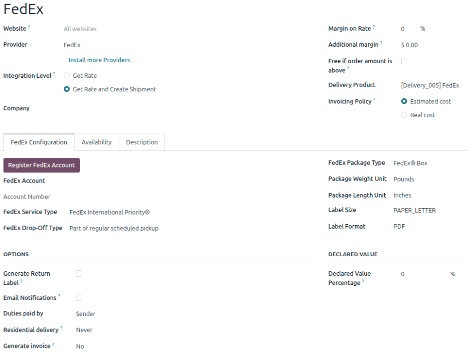

=================
FedEx integration
=================

Integrating a FedEx account with Odoo's **Inventory** app makes it possible to :doc:`calculate
shipping rates <../setup_configuration>` and :doc:`generate shipping labels <labels>` within Odoo.
This is accomplished by enabling the FedEx *shipping connector*, then configuring at least one
*shipping method*.

.. warning::
   As of October 21, 2025, the FedEx integration using the latest API is temporarily unavailable
   while Odoo finalizes its solution-provider validation for FedEx. New setups are currently
   blocked, and existing integrations using the FedEx Shipping (Legacy) provider will stop working
   as of June 1, 2026.

   For a temporary solution, the :doc:`Sendcloud integration <sendcloud_shipping>` also supports
   FedEx services. To request further assistance, `submit a support ticket
   <https://www.odoo.com/help>`_.

.. note::
   This documentation contains configuration details specific to FedEx integration. See the
   documentation on :doc:`third-party shippers <third_party_shipper>` for general shipper
   integration instructions.

Enable shipping connector
=========================

To enable the shipping connector for FedEx, open the :menuselection:`Apps` app. Search for `FedEx`.
:guilabel:`Activate` the shipping connector.

Configure shipping method
=========================

After the FedEx shipping connector is enabled, it is necessary to configure at least one shipping
method. After doing so, the shipping method can be included in sales orders (SOs), and used to
compute shipping costs, and print shipping labels.

To see all shipping methods for every shipper with a connector enabled, navigate to
:menuselection:`Inventory app --> Configuration --> Shipping Methods`.

Select a FedEx shipping method to open its form. Alternatively, click :guilabel:`New` to open a
blank form, and configure a new shipping method.

General information
-------------------

At the very top of a shipping method form are fields used to configure the way the method operates
in Odoo. In the :guilabel:`Provider` field, select :guilabel:`FedEx` from the drop-down menu, if it
is not already selected.

The rest of the fields in this section are general to all shipping providers. For details on how to
fill them out, see the documentation on :doc:`third-party shippers <third_party_shipper>`.

FedEx Configuration tab
-----------------------

The options in the *Fedex Configuration* tab of a FedEx shipping method form are used to connect the
method to a FedEx account, and configure the shipping details associated with the method (drop-off
type, package type, etc.).

A FedEx business account is required to obtain the information needed to fill out the fields in this
tab. To create a new account, navigate to FedEx's `Open Account
<https://www.fedex.com/en-us/open-account.html>`_ page, click on :guilabel:`Create Account`, and
follow the instructions.

Then, register the FedEx account in the database. Click the :guilabel:`Register FedEx Account`
button. The *FedEx Account Registration* window opens. Accept the end user license agreement (EULA)
by selecting the :guilabel:`I acknowledge the reading of the FedEx End User License Agreement` and
:guilabel:`I accept the terms of FedEx EULA to start shipping` checkboxes, then click
:guilabel:`Accept and Continue`.

In the *FedEx Account Registration - Shipper Information* window, enter the :guilabel:`FedEx Account
Number`. Enter the name of the company in the :guilabel:`Customer Name` field and provide the
business address. If products are being shipped from a residential address, select the
:guilabel:`Residential Address` checkbox. Click the :guilabel:`Validate Address` button.

Next, choose a :guilabel:`Validation Option` to verify access to the account. This is a form of
multi-factor authentication (MFA). Two options are available:

- :guilabel:`Invoice Validation`: Use information from a recent invoice (within the past 90 days) to
  validate the account information.
- :guilabel:`Secure Code Validation`: Receive a PIN via :guilabel:`Email`, :guilabel:`SMS`, or
  :guilabel:`Voice Call`.

If successful, the *FedEx Account Registration - Success* window displays, and the account is
available for all companies. To change this setting, click :guilabel:`Open FedEx Account Form` and
modify the company settings.

In the *FedEx Configuration* tab, provide more information about the shipping method:

- :guilabel:`FedEx Service Type`: Select the FedEx service used to ship a package.
- :guilabel:`FedEx Drop-Off Type`: Select the method for getting a package into FedEx's possession.
- :guilabel:`FedEx Package Type`: Select the type of package used for the shipping method.
- :guilabel:`Package Weight Unit`: Select the unit of measure used to weigh packages.
- :guilabel:`Package Length Unit`: This field changes based on what is selected in the
  :guilabel:`Package Weight Unit` field. If :guilabel:`Pounds` is selected, the length unit updates
  to :guilabel:`Inches`. If :guilabel:`Kilograms` is selected, the length unit updates to
  :guilabel:`Centimeters`.
- :guilabel:`Label Size`: Select the type of shipping label used for packages.
- :guilabel:`Label Format`: Select the file format used by Odoo to generate shipping labels.

.. important::
   The options that should be selected on the *FedEx Configuration* tab of a shipping method depend
   on the negotiated shipping services of the associated FedEx account. To confirm the available
   services for a FedEx account, visit the *Account Management* page after logging in to the FedEx
   website or speak with a customer service representative.

Options section
~~~~~~~~~~~~~~~

The :guilabel:`Options` section of the *FedEx Configuration* tab provides a few additional options
to further configure the shipping method:

- :guilabel:`Generate Return Label`: Select this checkbox to automatically generate a label when a
  delivery is validated.
- :guilabel:`Email Notifications`: Select this checkbox to send updates via email to customers, if
  an email address is configured for the customer.
- :guilabel:`Duties paid by`: Use the drop-down menu to select whether duty charges should be paid
  by the :guilabel:`Sender` or :guilabel:`Recipient`.
- :guilabel:`Residential delivery`: Specify when to mark a recipient's address as residential.
- :guilabel:`Generate invoice`: Specify whether an invoice should be generated as a PDF or sent as
  an electronic trade document. This is typically required when commercial invoices are needed for
  international shipments.

Declared Value section
~~~~~~~~~~~~~~~~~~~~~~

Specify the :guilabel:`Declared Value Percentage` for insurance purposes.

Activate shipping method
========================

By default, shipping methods in Odoo are created within a *test environment*. This means they can
only be used for testing purposes, and are unable to generate actual shipping orders.

To activate a shipping method in a *production environment*, click the :icon:`fa-stop`
:guilabel:`Test Environment` smart button at the top of the shipping method form. After doing so,
the smart buttons changes to read :icon:`fa-play` :guilabel:`Production Environment`.

With the production environment enabled, validating a delivery order using the shipping method
generates an actual shipping label with FedEx.

Click the :icon:`fa-play` :guilabel:`Production Environment` smart button to return the shipping
method to a test environment.

.. warning::
   **Do not** enable the production environment for a shipping method before it is ready to be used
   for actual shipping orders. Doing so may lead to the creation of unwanted charges with FedEx.
