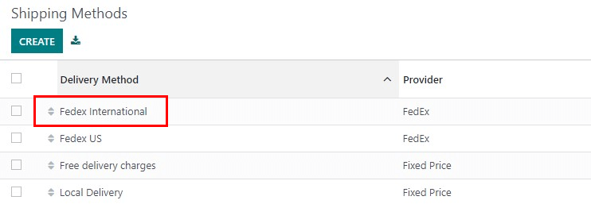
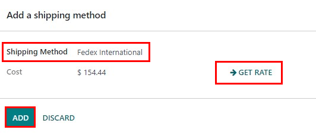
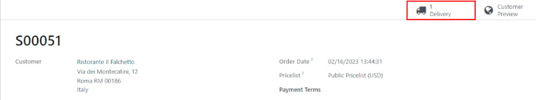
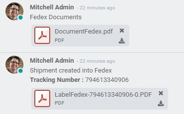
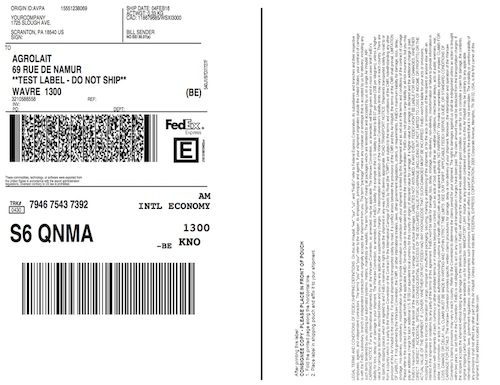

==========================
Change shipping label size
==========================

Overview
========

In Odoo, there are a variety of different types of shipping labels that can be selected for delivery
orders. Depending on the types of shipping packages used, different label sizes may be more
appropriate, and can be configured to fit the package.

Configuration
=============

In the :menuselection:`Inventory` module, go to :menuselection:`Configuration --> Delivery -->
Shipping Methods.` Click on a delivery method to choose it. For the following example, *FedEx
International* will be used.

In the :guilabel:`Configuration` tab, under :guilabel:`Label Type`, choose one of the label types
available. The availability varies depending on the carrier.

.. image:: label_type/label-type-dropdown.png
   :align: center
   :alt: Select a label type.

When a sales order with the corresponding shipping company is confirmed and a delivery order is
validated, the shipping label will be automatically created as a PDF and appear in the
:guilabel:`Chatter`.

Create a sales order
====================

In the :menuselection:`Sales` application, click :guilabel:`Create` and select an international
customer. Click :guilabel:`Add A Product` and select an item. Click :guilabel:`Add Shipping`, select
a shipping method, then click :guilabel:`Get Rate`, and finally, click :guilabel:`Add`.

Once the quotation is confirmed by clicking :guilabel:`Confirm`, a :guilabel:`Delivery` smart button
will appear.

Once the delivery order is validated by clicking :guilabel:`Validate` in the delivery order, the
shipping documents appear in the :guilabel:`Chatter`.

Example labels
==============

The default :guilabel:`Label Type` is :guilabel:`Paper Letter`. An example of a FedEx letter sized
label is:

.. image:: label_type/full-page-fedex.png
   :align: center
   :alt: Full page letter size FedEx shipping label.

For comparison, an example of a FedEx bottom-half label is:

