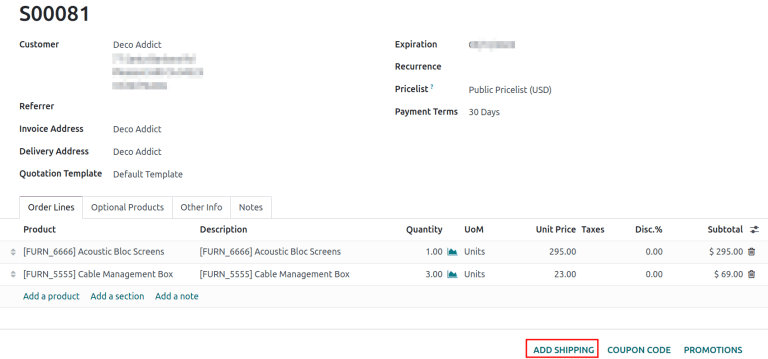
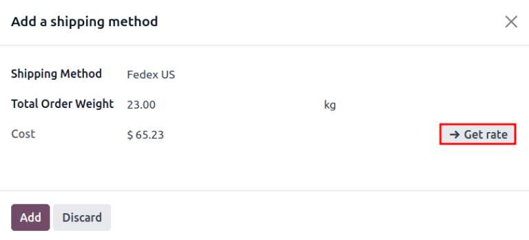
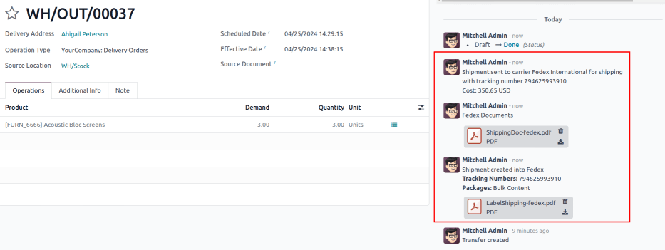

=====================
Print shipping labels
=====================

.. |DO| replace:: :abbr:`DO (Delivery Order)`
.. |SO| replace:: :abbr:`SO (Sales Order)`

Integrate Odoo with :doc:`third-party shipping carriers
<../setup_configuration/third_party_shipper>` to automatically generate shipping labels that
includes prices, destination addresses, tracking numbers, and barcodes.

.. seealso::
   :ref:`Automatically print shipping carrier labels <inventory/shipping_receiving/carrier-labels>`

Configuration
=============

To generate labels for a third-party shipping carrier, first :doc:`install the third-party shipping
connector <../setup_configuration/third_party_shipper>`. Then, configure and activate the
:ref:`delivery method <inventory/shipping_receiving/configure-delivery-method>`, being sure to set
the :guilabel:`Integration Level` to :guilabel:`Get Rate and Create Shipment` to generate shipping
labels. Finally, provide the company's :ref:`source address
<inventory/shipping_receiving/configure-source-address>` and :ref:`product weights
<inventory/shipping_receiving/configure-weight>`.

.. seealso::
   :doc:`../setup_configuration/third_party_shipper`

.. image:: labels/integration-level.png
   :align: center
   :alt: Set the "Get Rate and Create Shipment" option.

.. _inventory/shipping_receiving/picking-config:

Labels for multi-step
---------------------

For companies using :doc:`two <../daily_operations/receipts_delivery_two_steps>` or :doc:`three step
delivery <../daily_operations/delivery_three_steps>`, labels can be triggered to print after
validating the picking or packing operation. To do that, go to :menuselection:`Inventory app -->
Configuration --> Operations Types`, and choose the desired operation.

On the :guilabel:`Operation Type` configuration page, tick the :guilabel:`Print Label` checkbox.
Enabling this feature ensures that the third-party shipping label is printed upon validating this
operation.

.. example::
   For :doc:`two-step delivery <../daily_operations/receipts_delivery_two_steps>`, where products
   are placed directly in packages during picking, companies can print shipping labels during
   picking instead of delivery. Odoo allows users to enable the :guilabel:`Print Label` feature on
   the `Pick` operation itself to achieve this flexibility.

   .. image:: labels/pick-print-label.png
      :align: center
      :alt: Enable the "Print Label" feature.

Print tracking labels
=====================

Tracking labels are printed when specific operations are validated. By default, validating a
delivery order (DO) generates a tracking label in the chatter.

.. note::
   For companies using two or three step delivery, refer to the :ref:`printing labels for multi-step
   delivery <inventory/shipping_receiving/picking-config>` section to learn how to print the label
   after validating a picking or packing operation.

When both the *Sales* and *Inventory* apps are installed, begin in the :menuselection:`Sales` app,
and proceed to the desired quotation or sales order (SO). There, and :ref:`add the shipping cost
<inventory/shipping_receiving/add-shipping-quote>` to the order. Then, navigate to the linked |DO| —
or another operation type when using multi-step delivery — to validate the operation and print the
label.

If only the *Inventory* app is installed, create :abbr:`DOs (Delivery Orders)` directly in the
:menuselection:`Inventory` app, :ref:`add the third-party carrier
<inventory/shipping_receiving/validate-print-label>` in the :guilabel:`Carrier` field, and validate
the |DO|.

.. _inventory/shipping_receiving/add-shipping-quote:

Add shipping on quotation
-------------------------

To generate a tracking label for an order, begin by creating a quotation in :menuselection:`Sales
app --> Orders --> Quotations`, clicking :guilabel:`New`, and filling out the quotation form. Then,
click the :guilabel:`Add Shipping` button in the bottom-right corner of the quotation.

In the resulting pop-up window, select the intended carrier from the :guilabel:`Shipping Method`
drop-down menu. The :guilabel:`Total Order Weight` field is automatically populated, based on the
:ref:`weight of products in the order <inventory/shipping_receiving/configure-weight>`. Modify this
field to overwrite the predicted weight, and use this weight to estimate the cost of shipping.

Next, click :guilabel:`Get Rate` to display the shipping cost for the customer, via the third-party
carrier in the :guilabel:`Cost` field.

.. important::
   If clicking :guilabel:`Get Rate` results in an error, ensure the :ref:`warehouse's address
   <inventory/shipping_receiving/configure-source-address>` and :ref:`weight of products in the
   order <inventory/shipping_receiving/configure-weight>` are properly configured.

Click :guilabel:`Add` to add the cost to the quotation, which is listed as the :ref:`configured
delivery product <inventory/shipping_receiving/delivery-product>`. Finally, click
:guilabel:`Confirm` on the quotation, and click the :guilabel:`Delivery` smart button to access the
|DO|.

.. tip::
   For users who do not have the *Sales* app installed, specify the :guilabel:`Carrier` by going to
   the :menuselection:`Inventory` app, navigating to the |DO|, and going to the
   :guilabel:`Additional Info` tab.

   .. image:: labels/additional-info-tab.png
      :align: center
      :alt: Show the "Additional Info" tab of a delivery order.

.. _inventory/shipping_receiving/validate-print-label:

Validate delivery order
-----------------------

On a delivery order form, navigate to the :guilabel:`Additional Info` tab to ensure the third-party
shipping carrier has been added to the :guilabel:`Carrier` field.

.. important::
   If the *Sales* app is not installed, the third-party carrier is set in the :guilabel:`Carrier`
   field.

After the items in the order have been packed, click :guilabel:`Validate` to get the shipping
carrier's tracking number, and generate the shipping label.

.. note::
   Create or select an existing delivery order by going to the :menuselection:`Inventory` app, and
   selecting the :guilabel:`Delivery Orders` card.

The :guilabel:`Tracking Reference` number is generated in the :guilabel:`Additional Info` tab of the
delivery order. Click the :guilabel:`Tracking` smart button to access the tracking link from the
shipping carrier's website.

The tracking label is found in PDF format in the chatter.

.. note::
   For multi-package shipping, one label is generated per package. Each label appears in the
   chatter.

.. figure:: labels/sample-label.png
   :align: center
   :alt: Sample label generated from Odoo's shipping connector with FedEx.

   Sample label generated from Odoo's shipping connector with FedEx.

.. seealso::
   - :doc:`../advanced_operations_shipping/invoicing`
   - :doc:`../advanced_operations_shipping/multipack`
