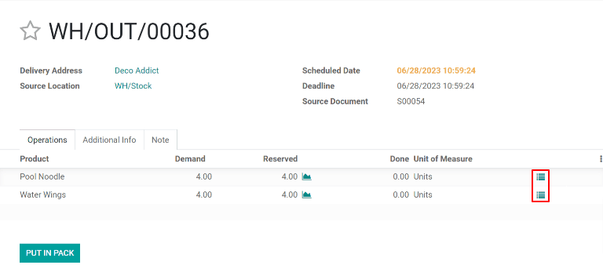
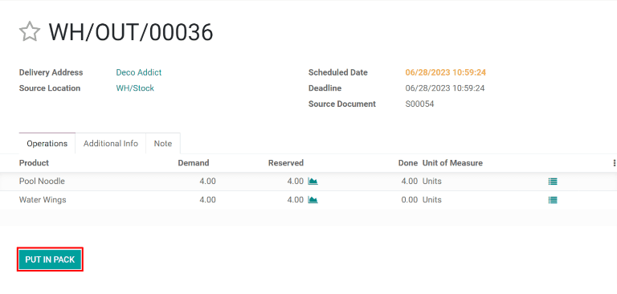
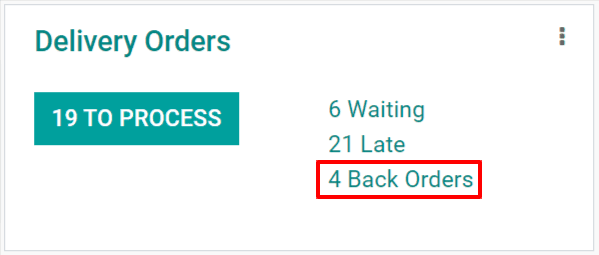

=======================
Multi-package shipments
=======================

In some cases, a delivery order with multiple items may need to be shipped in more than one package.
This may be necessary if the items are too large to ship in a single package, or if certain items
cannot be packaged together. Shipping a single delivery order in multiple packages provides
flexibility for how each item is packaged, without the need to create multiple delivery orders.

Configuration
=============

In order to split a delivery order across multiple packages, the *Packages* setting must be enabled.
To do so, navigate to :menuselection:`Inventory --> Configuration --> Settings`, then enable the
checkbox next to :guilabel:`Packages`. Click :guilabel:`Save` to confirm the change.

.. image:: multipack/packages-setting.png
   :align: center
   :alt: The Packages setting on the Inventory app settings page.

.. _inventory/shipping/multiple-packages:

Ship items in multiple packages
===============================

To split items in the same delivery order across multiple packages, begin by navigating to
:menuselection:`Inventory --> Delivery Orders`, then select a delivery order that has multiple
items, a multiple quantity of the same item, or both.

On the :guilabel:`Operations` tab, select the :guilabel:`⁞≣ (menu)` icon in the line of the product
that will be shipped in the first package.

This makes a :guilabel:`Detailed Operations` pop-up window appear. In the table at the bottom of the
pop-up window, the :guilabel:`Reserved` column shows the total quantity of the product included in
the delivery order.

If the full quantity will be shipped in the first package, enter the number from the
:guilabel:`Done` column in the :guilabel:`Reserved` column. If less than the full quantity will be
shipped in the first package, enter a smaller number than the one that appears in the
:guilabel:`Reserved` column. Click :guilabel:`Confirm` to confirm the :guilabel:`Done` quantities
and close the pop-up.

.. image:: multipack/detailed-operations.png
   :align: center
   :alt: The Detailed Operations pop-up for a product in a delivery order.

Repeat the same steps for every item quantity that is included in the first package. Then, click
:guilabel:`Put In Pack` to create a package with all of the selected items.

For the next package, follow the same steps as detailed above, marking the quantity of each item to
be included in the package as :guilabel:`Done` before clicking :guilabel:`Put In Pack` on the
delivery order. Continue doing so until the full quantity of all items are added to a package.

Finally, after all of the packages have been shipped, click :guilabel:`Validate` to confirm that the
delivery order has been completed.

.. tip::
   After one or more packages are created, a :guilabel:`Packages` smart button appears in the
   top-right corner of the delivery order. Click the :guilabel:`Packages` smart button to go to the
   :guilabel:`Packages` page for the delivery order, where each package can be selected to view all
   of the items included in it.

   .. image:: multipack/packages-smart-button.png
      :align: center
      :alt: The Packages smart button on a delivery order.

Create a backorder for items to be shipped later
================================================

If some items will be shipped at a later date than others, there is no need to put them in a package
until they are ready to be shipped. Instead, create a backorder for the items being shipped later.

Begin by shipping the items that will be shipped immediately. If they will be shipped in multiple
packages, follow the :ref:`steps above <inventory/shipping/multiple-packages>` to package them as
required. If they will be shipped in a single package, simply mark in the :guilabel:`Done` column
the quantity of each item being shipped, but **do not** click the :guilabel:`Put In Pack` button.

After all quantities being shipped immediately are marked as :guilabel:`Done`, click the
:guilabel:`Validate` button, and a :guilabel:`Create Backorder?` pop-up window appears. Then, click
the :guilabel:`Create Backorder` button. Doing so confirms the items being shipped immediately and
creates a new delivery order for the items that will be shipped later.

.. image:: multipack/backorder-pop-up.png
   :align: center
   :alt: The Create Backorder? pop-up window.

The backorder delivery order will be listed in the chatter of the original delivery order in a
message that reads :guilabel:`The backorder WH/OUT/XXXXX has been created.`. Click on
:guilabel:`WH/OUT/XXXXX` in the message to view the backorder delivery order.

.. image:: multipack/backorder-chatter.png
   :align: center
   :alt: The backorder delivery order listed in the chatter of the original delivery order.

The backorder delivery order can also be accessed by navigating to :menuselection:`Inventory`,
clicking the :guilabel:`# Back Orders` button on the :guilabel:`Delivery Orders` card, and selecting
the delivery order.

Once the remaining items are ready to be shipped, navigate to the backorder delivery order. The
items can be shipped in a single package by clicking :guilabel:`Validate` and selecting
:guilabel:`Apply` on the :guilabel:`Immediate Transfer?` pop-up window that appears, or shipped in
multiple packages by following the steps detailed in the section above.

It is also possible to ship out some of the items while creating another backorder for the rest. To
do so, simply follow the same steps used to create the first backorder.
