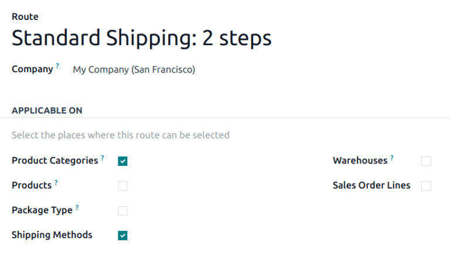

=========================
Add a new delivery method
=========================

To configure delivery methods, go to :menuselection:`Inventory app --> Configuration --> Delivery
Methods`.

.. note::
   If the :guilabel:`Delivery Methods` option is not available from the :guilabel:`Configuration`
   drop-down menu, verify whether the feature is enabled by following these steps:

   #. Go to :menuselection:`Inventory app --> Configuration --> Settings`.
   #. Scroll to the :guilabel:`Shipping` section and enable the :guilabel:`Delivery Methods` feature
      by checking the corresponding checkbox.

   .. image:: new_delivery_method/enable-delivery.png
      :alt: Enable the *Delivery Methods* feature by checking the box in Configuration > Settings.

On the :guilabel:`Delivery Methods` page, add a method by clicking :guilabel:`New`. Doing so opens
a form to provide details about the shipping provider, including:

- :guilabel:`Delivery Method` (*Required field*): the name of the delivery method (e.g. `flat-rate
  shipping`, `same day delivery`, etc.).
- :guilabel:`Provider` (*Required field*): choose the delivery service, like FedEx, if using a
  :ref:`third-party carrier <inventory/shipping/third_party>`. Ensure the integration with the
  shipping carrier is properly installed and select the provider from the drop-down menu.

  For more details on configuring custom shipping methods, such as :ref:`fixed price
  <inventory/shipping/fixed>`, :ref:`based on rules <inventory/shipping/rules>`, or :ref:`pickup in
  store <inventory/shipping/pickup>` options, refer to their respective sections below.
- :guilabel:`Website`: configure shipping methods for an **eCommerce** page. Select the applicable
  website from the drop-down menu, or leave it blank to apply the method to all web pages.
- :guilabel:`Company`: If the shipping method should apply to a specific company, select it from the
  drop-down menu. Leave the field blank to apply the method to all companies.
- :guilabel:`Routes`: select the applicable routes to define different delivery methods, such as
  standard or express shipping, based on varying lead times. For more information, jump
  to the :ref:`Set routes on shipping method <inventory/shipping_receiving/shipping-route>` section.

.. _inventory/shipping_receiving/delivery-product:

- :guilabel:`Delivery Product` (*Required field*): the product listed on the :ref:`sales order line
  <inventory/shipping/sales-order>` as the delivery charge.
- :guilabel:`Free if order amount is above`: checking this box enables free shipping if the customer
  spends above the specified amount.

.. _inventory/shipping_receiving/availability:

Use the :guilabel:`Availability` tab to define conditions for the delivery method based on the
order's content or destination:

- :guilabel:`Countries`: Specify one or more countries where the method is available.
- :guilabel:`Max Weight`: Set a maximum weight; the method is only available for orders below this
  limit.
- :guilabel:`Max Volume`: Set a maximum volume; the method is only available for orders below this
  limit.
- :guilabel:`Must Have Tags`: The method is available only if at least one product in the order has
  one of these tags.
- :guilabel:`Excluded Tags`: The method is unavailable if at least one product in the order has one
  of these tags.

For examples on how to configure specific shipping methods, refer to the sections below.

.. _inventory/shipping/fixed:

Fixed price
-----------

To configure a shipping price that is the same for all orders, go to :menuselection:`Inventory app
--> Configuration --> Delivery Methods`. Then, click :guilabel:`New`, and on the shipping method
form, set the :guilabel:`Provider` to the :guilabel:`Fixed Price` option. Selecting this option
makes the :guilabel:`Fixed Price` field become available, which is where the fixed rate shipping
amount is defined.

To enable free shipping if the amount of the order exceeds a specified amount, check the box
:guilabel:`Free if order amount is above` and fill in the amount.

.. example::
   To set up `$20` flat-rate shipping that becomes free if the customer spends over `$100`, fill in
   the following fields:

   - :guilabel:`Delivery Method`: `Flat-rate shipping`
   - :guilabel:`Provider`: :guilabel:`Fixed Price`
   - :guilabel:`Fixed Price`: `$20.00`
   - :guilabel:`Free if order amount is above`: `$100.00`
   - :guilabel:`Delivery Product`: `[SHIP] Flat`

   .. image:: new_delivery_method/new-shipping-method.png
      :alt: Example of filling out a shipping method.

.. _inventory/shipping/rules:

Based on rules
--------------

To calculate the price of shipping based on pricing rules, set the :guilabel:`Provider` field to the
:guilabel:`Based on Rules` option. Optionally, adjust :guilabel:`Margin on Rate` and
:guilabel:`Additional margin` to include additional shipping costs.

Create pricing rules
~~~~~~~~~~~~~~~~~~~~

Navigate to the :guilabel:`Pricing` tab and click :guilabel:`Add a line`. Doing so opens the
:guilabel:`Create Pricing Rules` window, where the :guilabel:`Condition` related to the product
weight, volume, price, or quantity is compared to a defined amount to calculate the
:guilabel:`Delivery Cost`.

Once finished, click either :guilabel:`Save & New` to add another rule, or :guilabel:`Save & Close`.

.. example::
   To charge customers $20 in shipping for orders with five or fewer products, set the
   :guilabel:`Condition` to `Quantity <= 5.00`, and the :guilabel:`Delivery Cost` to `$20`.

   .. image:: new_delivery_method/pricing-rule.png
      :alt: Display window to add a pricing rule. Set a condition and delivery cost.

To restrict shipping to specific destinations on the **eCommerce** website, in the shipping method
form, navigate to the :guilabel:`Destination Availability` tab and define the :guilabel:`Countries`,
:guilabel:`States`, and :guilabel:`Zip Prefixes`. Leave these fields empty if all locations apply.

Calculate delivery cost
~~~~~~~~~~~~~~~~~~~~~~~

Shipping cost is the :guilabel:`Delivery cost` specified in the rule that satisfies the
:guilabel:`Condition`, plus any extra charges from the :guilabel:`Margin on rate` and
:guilabel:`Additional margin`.

.. math::
   Total = Rule's~Delivery~Cost + (Margin~on~rate \times Rule's~Delivery~Cost) + Additional~margin

.. example::
   With the two following rules set up:

   #. If the order contains five or fewer products, shipping is $20
   #. If the order contains more than five products, shipping is $50.

   :guilabel:`Margin on Rate` is `10%` and :guilabel:`Additional margin` is `$9.00`.

   .. image:: new_delivery_method/delivery-cost-example.png
      :alt: Show example of "Based on rules" shipping method with margins configured.

   When the first rule is applied, the delivery cost is $31 (20 + (0.1 * 20) + 9). When the second
   rule is applied, the delivery cost is $64 (50 + (0.1 * 50) + 9).

.. _inventory/shipping/pickup:

Pickup in store
---------------

To configure in-store pickup, select :guilabel:`Pickup in store` in the :guilabel:`Provider` field
and specify the pickup location in :guilabel:`Warehouse`.

To invoice the customer for the shipping cost to the pickup location, choose the :guilabel:`Get Rate
and Create Shipment` option in the :guilabel:`Integration Level` field. Then, pick either the
:guilabel:`Estimated cost` or :guilabel:`Real cost` radio options in the :guilabel:`Invoicing
Policy` field to decide whether the added shipping charge on the sales order is the precise cost
from the shipping carrier.

.. seealso::
   :doc:`Invoice cost of shipping <../setup_configuration/invoicing>`

.. _inventory/shipping_receiving/shipping-route:

Route on shipping method
------------------------

Optionally, set different warehouse delivery processes for a shipping method by configuring
different :doc:`routes <../daily_operations/use_routes>` for it.

.. example::
   Configuring multiple routes per shipping method is helpful for adjusting warehouse delivery
   processes based on:

   - speed (e.g., use :doc:`one-step delivery <../daily_operations/receipts_delivery_one_step>` for
     express shipping, or :doc:`two-step <../daily_operations/receipts_delivery_two_steps>` for
     standard shipping).
   - international shipping (e.g. use :doc:`three-step delivery
     <../daily_operations/delivery_three_steps>` to prepare documents for customs)
   - in-store pickup or home delivery: ship from the central warehouse, or pick from the store's
     stock, depending on customer selection.

To set up routes, go to :menuselection:`Inventory app --> Configuration --> Routes`. Click
:guilabel:`New`, or select the desired route.

On the route form, in the :guilabel:`Applicable On` section, tick the :guilabel:`Shipping Methods`
checkbox.

   Routes form with the :guilabel:`Shipping Method` checkbox ticked.

Then, go to :menuselection:`Inventory app --> Configuration --> Delivery Methods`, and select the
desired shipping method.

On the shipping method form, in the :guilabel:`Routes` field, select the available fulfillment
routes from the drop-down menu.

.. note::
   If the desired route is not selectable, check that the *Shipping Methods* option is enabled in
   the route's *Applicable On* section.

.. figure:: new_delivery_method/set-routes.png
   :alt: Show set routes on shipping method form.

   By default, most shipping methods are created with two routes available for standard or express
   delivery.
