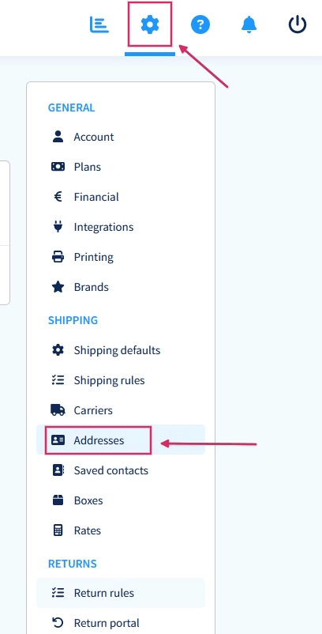
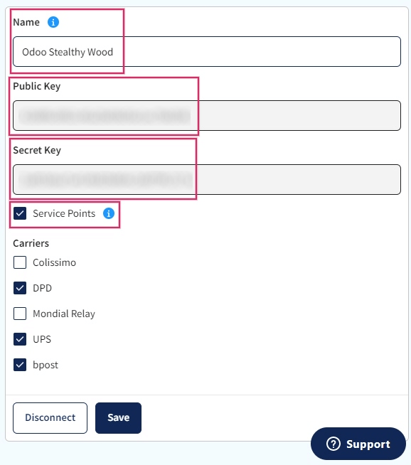
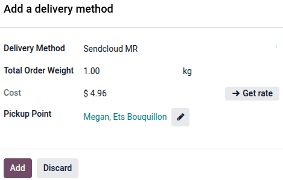
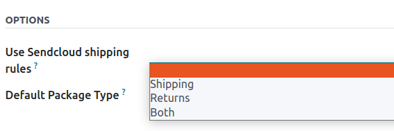
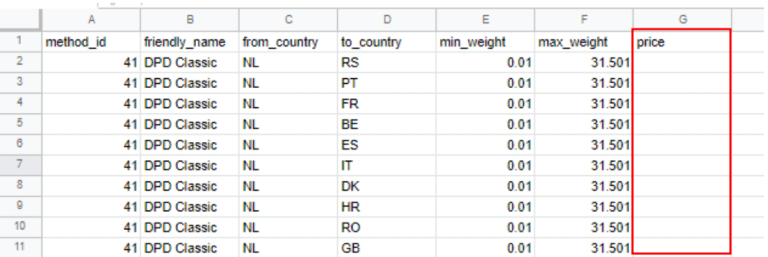

=====================
Sendcloud integration
=====================

Sendcloud is a shipping service aggregator that facilitates the integration of European shipping
carriers with Odoo. Once integrated, users can select shipping carriers on inventory operations in
their Odoo database.

Setup in Sendcloud
==================

Create an account and activate carriers
---------------------------------------

To get started, `create or log in to a Sendcloud account <https://account.sendcloud.com/signup/
?utm_source=odoo&utm_medium=partnerships&utm_campaign=partner_integrations_page>`_. On the Sendcloud
platform, follow the `Sendcloud integration documentation
<https://support.sendcloud.com/hc/en-us/articles/360059470491-Odoo-Native-integration>`_ to
configure the account and generate the connector credentials.

.. note::
   For new account creation, Sendcloud will ask for a :abbr:`VAT (Value-Added Tax Identification)`
   number or :abbr:`EORI (Economic Operators' Registration and Identification)` number. After
   completing the account setup, activate (or deactivate) the shipping carriers that will be used in
   the Odoo database.

.. important::
   Odoo integration of Sendcloud works on free Sendcloud plans *only* if a bank account is linked,
   since Sendcloud won't ship for free. To use shipping rules, or individual custom carrier
   contacts, a paid plan of Sendcloud is **required**.

.. _inventory/shipping_receiving/sendcloud-warehouse-config:

Warehouse configuration
-----------------------

Once logged into the Sendcloud account, navigate to :menuselection:`Settings --> Shipping -->
Addresses`, and fill in the field for :guilabel:`Warehouse address`.

To allow Sendcloud to process returns as well, a :guilabel:`Return Address` is required. Under the
:guilabel:`Miscellaneous section`, there is a field called :guilabel:`Address Name (optional)`. The
Odoo warehouse name should be entered here, and the characters should be exactly the same.

.. example::

   | **SendClould configuration**
   | :guilabel:`Miscellaneous`
   | :guilabel:`Address Name (optional)`: `Warehouse #1`
   | :guilabel:`Brand`: `Default`

   | **Odoo warehouse configuration**
   | :guilabel:`Warehouse`: `Warehouse #1`
   | :guilabel:`Short Name`: `WH`
   | :guilabel:`Company`: `My company (San Francisco)`
   | :guilabel:`Address`: `My Company (San Francisco)`

   Notice how the inputs for the :guilabel:`Warehouse` field, for both the Odoo configuration and
   the Sendcloud configuration, are the exact same.

Generate Sendcloud credentials
------------------------------

In the Sendcloud account, navigate to :menuselection:`Settings --> Integrations` in the menu on the
right. Next, search for :guilabel:`Odoo Native`. Then, click on :guilabel:`Connect`.

After clicking on :guilabel:`Connect`, the page redirects to the :guilabel:`Sendcloud API` settings
page, where the :guilabel:`Public and Secret Keys` are produced. The next step is to name the
:guilabel:`Integration`. The naming convention is as follows: `Odoo CompanyName`, with the user's
company name replacing `CompanyName` (e.g. `Odoo Stealthy Wood`).

Then, check the box next to :guilabel:`Service Points` and select the shipping services for this
integration. After saving, the :guilabel:`Public and Secret Keys` are generated.

Setup in Odoo
=============

To ensure seamless Sendcloud integration with Odoo, :ref:`install
<inventory/shipping_receiving/sendcloud-module>` and :ref:`link
<inventory/shipping_receiving/link-sendcloud-module>` the Sendcloud shipping connector to the
Sendcloud account. Then, :ref:`configure Odoo fields
<inventory/shipping_receiving/sendcloud-shipping-info>`, so Sendcloud can accurately pull shipping
data to generate labels.

.. seealso::
   :ref:`Enable pickup points on websites <inventory/shipping_receiving/sendcloud-pickups>`

.. _inventory/shipping_receiving/sendcloud-module:

Install Sendcloud shipping module
---------------------------------

After the Sendcloud account is set up and configured, it's time to configure the Odoo database. To
get started, go to Odoo's :guilabel:`Apps` module, search for the `Sendcloud Shipping`, and
:ref:`install it <general/install>`.

.. image:: sendcloud_shipping/sendcloud-mod.png
   :alt: Sendcloud Shipping module in the Odoo Apps module.

.. _inventory/shipping_receiving/link-sendcloud-module:

Sendcloud shipping connector configuration
------------------------------------------

Once installed, activate the :guilabel:`Sendcloud Shipping` module in :menuselection:`Inventory -->
Configuration --> Settings`. The :guilabel:`Sendcloud Connector` setting is found under the
:guilabel:`Shipping Connectors` section.

After activating the :guilabel:`Sendcloud Connector`, click on the :guilabel:`Sendcloud Delivery
Methods` link below the listed connector. Once on the :guilabel:`Delivery Methods` page, click
:guilabel:`New`.

.. tip::
   :guilabel:`Delivery Methods` can also be accessed by going to :menuselection:`Inventory -->
   Configuration --> Delivery Methods`.

Fill out the following fields in the :guilabel:`New Delivery Method` form:

- :guilabel:`Delivery Method`: Type `Sendcloud DPD`.
- :guilabel:`Provider`: Select :guilabel:`Sendcloud` from the drop-down menu.
- :guilabel:`Delivery Product`: Set the product that was configured for this shipping method or
  create a new product.
- :guilabel:`Invoicing Policy`: Select one of the options.
- In the :guilabel:`SendCloud Configuration` tab:

  - Enter the :guilabel:`Sendcloud Public Key`.
  - Enter the :guilabel:`Sendcloud Secret Key`.
  - Enter the :guilabel:`Ship From` location.

.. _inventory/shipping_receiving/sendcloud-pickups:

Pickup points
~~~~~~~~~~~~~

Sendcloud's `service point delivery
<https://support.sendcloud.com/hc/en-us/articles/360026097951-FAQ-Service-Points>`_ lets customers
choose a pickup location (such as a nearby shop or locker) instead of entering a private delivery
address.

To enable the feature, go to the shipping method form, and under the *Options* section in the
*SendCloud Configuration* tab, enable :guilabel:`Use Sendcloud Locations` feature.

Once enabled, the pickup point selection is available through:

 - The **Website** app on the *Delivery method* page during the online checkout process.

   .. image:: sendcloud_shipping/website-delivery-method-option.png
      :alt: The Delivery method page with Sendcloud option selected.

 - The **Sales** app on the sales quotation using the *Add shipping* button or the *Delivery* smart
   button.

To add a :guilabel:`Pickup point` to a sales quote, :ref:`create a quotation
<sales_quotations/create_quotations/create-quotation>` and click the :guilabel:`Add shipping`
button. The *Add a delivery method* pop-up displays. Select :guilabel:`Sendcloud MR` (Sendcloud
Mondial Relay) for the :guilabel:`Delivery Method` and then click :guilabel:`Get Rate`.

Click the :icon:`fa-pencil` :guilabel:`pencil` icon next to the :guilabel:`Pickup Point` field and
the *Choose a pick-up point* pop-up displays. Enter a zip code and select a location from the
generated list. Click :guilabel:`Choose this location` to save it and return to the *Add a delivery
method* pop-up, then click :guilabel:`Add`.

To change a pickup point after a sales quotation is confirmed, ensure the delivery order has not
been validated. If the delivery order is validated:

 #. **Do not** attempt to change the pickup point on the sales order or delivery order.
 #. Cancel the existing sales order.
 #. Create a new sales order with the correct pickup point.

.. example::
   The customer has already confirmed the sales order with their chosen pickup point, however, now
   they want to change the pickup point location.

   Navigate to  :menuselection:`Sales app --> Orders --> Orders` and select the sales order. Click
   the :guilabel:`Delivery` smart button and the delivery order displays. Ensure the delivery order
   has not been validated, then click the :icon:`fa-pencil` :guilabel:`pencil` icon next to the
   :guilabel:`Pickup Point` field to change the location.

   .. image:: sendcloud_shipping/delivery-order-pickup-point.png
      :alt: The Pickup Point field on the delivery receipt.

   In the *Choose a pick-up point* window, enter in the preferred zip code and select a location
   from the generated list. Click :guilabel:`Choose this location` to finalize the change.

   .. image:: sendcloud_shipping/choose-a-pick-up-point-window.png
      :alt: Completed window with a zip code entered and available locations listed.

Load shipping products
~~~~~~~~~~~~~~~~~~~~~~

After configuring and saving the form, follow these steps to load the shipping products:

#. In the *SendCloud Configuration* tab of the :guilabel:`New Delivery Method` form, click the
   :guilabel:`Load your products` button.
#. Select the shipping products the company would like to use for deliveries and returns.
#. Click :guilabel:`Confirm`.

.. example::
   Sample Sendcloud shipping products configured in Odoo:

   | :guilabel:`Delivery Product`: `DPD Relais`
   | :guilabel:`Carrier`: `dpd_fr`
   | :guilabel:`Weight range`: `1-20001 g`
   | :guilabel:`Max length`: `100 cm`
   | :guilabel:`Max width`: `0 cm`
   | :guilabel:`Max height`: `0 cm`
   | :guilabel:`Delivery attempts`: `2`
   | :guilabel:`Delivery deadline`: `Best effort`
   | :guilabel:`First mile`: `Pickup`
   | :guilabel:`Other Functionalities`: `B2b` `B2c` `Direct contact only` `Tracked`
   | :guilabel:`Form factor`: `Parcel`
   | :guilabel:`Last mile`: `Service point`

   :guilabel:`Service area`: `Domestic`

   | :guilabel:`Return Product`: `DPD Relais Return`
   | :guilabel:`Carrier`: `dpd_fr`
   | :guilabel:`Weight range`: `1-20001 g`
   | :guilabel:`Max length`: `100 cm`
   | :guilabel:`Max width`: `0 cm`
   | :guilabel:`Max height`: `0 cm`
   | :guilabel:`Delivery attempts`: `1`
   | :guilabel:`Delivery deadline`: `Best effort`
   | :guilabel:`First mile`: `Dropoff`
   | :guilabel:`Other Functionalities`: `B2b` `B2c` `Direct contact only` `Returns` `Tracked`
   | :guilabel:`Form factor`: `Parcel`
   | :guilabel:`Insurance`: `1000`
   | :guilabel:`Last mile`: `Home delivery`

   :guilabel:`Service area`: `Domestic`

   .. image:: sendcloud_shipping/sendcloud-example.png
      :alt: Example of shipping products configured in Odoo.

.. tip::
   Sendcloud does not provide test keys when a company tests the sending of a package in Odoo. This
   means if a package is created, the configured Sendcloud account will be charged, unless the
   associated package is cancelled within 24 hours of creation.

   Odoo has a built-in layer of protection against unwanted charges when using test environments.
   Within a test environment, if a shipping method is used to create labels, then those labels are
   immediately cancelled after the creation — this occurs automatically. The test and production
   environment settings can be toggled back and forth from their respective smart buttons.

.. _inventory/shipping_receiving/sendcloud-shipping-info:

Shipping information
--------------------

To use Sendcloud to generate shipping labels, the following information **must** be filled out
accurately and completely in Odoo:

#. **Customer information**: When creating a quotation, ensure the selected :guilabel:`Customer` has
   a valid phone number, email address, and shipping address.

   To verify, select the :guilabel:`Customer` field to open their contact page. Here, add their
   shipping address in the :guilabel:`Contact` field, along with their :guilabel:`Mobile` number and
   :guilabel:`Email` address.

#. **Product weight**: Ensure all products in an order have a specified :guilabel:`Weight` in the
   :guilabel:`Inventory` tab of their product form. Refer to the :ref:`Product weight section
   <inventory/shipping_receiving/configure-weight>` of this article for detailed instructions.

#. **Warehouse address**: Ensure the warehouse name and address in Odoo match the :ref:`previously
   defined warehouse <inventory/shipping_receiving/sendcloud-warehouse-config>` in the Sendcloud
   setup. For details on warehouse configuration in Odoo, refer to the :ref:`warehouse configuration
   section <inventory/shipping_receiving/configure-source-address>` of the third-party shipping
   documentation.

Generate labels with Sendcloud
==============================

When creating a quotation in Odoo, add shipping and a :guilabel:`Sendcloud shipping product`. Then,
:guilabel:`Validate` the delivery. Shipping label documents are automatically generated in the
chatter, which include the following:

#. :guilabel:`Shipping label(s)` depending on the number of packages.
#. :guilabel:`Return label(s)` if the Sendcloud connector is configured for returns.
#. :guilabel:`Shipping labels` depending on the number of packages.
#. :guilabel:`Return labels` if the Sendcloud connector is configured for returns.
#. :guilabel:`Customs documents` should the destination country require them.

Additionally, the tracking number is now available.

.. important::
   When return labels are created, Sendcloud automatically charges the configured Sendcloud account.

Shipping rules
--------------

Optionally, create shipping rules to automatically generate shipping labels tailored to different
product needs. For example, a shipping rule can be created for customers shipping expensive jewelry
product needs. For example, a shipping rule can be created to automatically purchase insurance for
customers shipping expensive jewelry.

.. note::
   Shipping rules do **not** affect :ref:`shipping rate calculations
   <inventory/shipping_receiving/third-party-rate>`, and are only used to improve the process of
   :doc:`generating shipping labels <labels>`.

To use shipping rules, navigate to :menuselection:`Inventory app --> Configuration --> Delivery:
Shipping Methods`, and select the intended `Sendcloud` shipping method.

Under the :guilabel:`Sendcloud Configuration` tab, in the :guilabel:`OPTIONS` section, choose the
kind of shipments the shipping rules apply to, via the :guilabel:`Use Sendcloud shipping rules`
Under the *Sendcloud Configuration* tab, in the *Options* section, choose the kind of shipments the
shipping rules apply to, via the :guilabel:`Use Sendcloud shipping rules` field.

From here, choose either: :guilabel:`Shipping` to customers, :guilabel:`Returns` from customers, or
:guilabel:`Both`.

Then, in the Sendcloud website, navigate to :menuselection:`Settings --> Shipping rules`. Create a
new shipping rule by clicking :guilabel:`Create New`.

In the :guilabel:`Actions` section, set a :guilabel:`Condition` to determine when the rule applies.
Then, configure what to do when packages meet the condition.

.. seealso::
   `Create shipping rules on Sendcloud <https://support.sendcloud.com/hc/en-us/articles/
   10274470454292-How-to-create-shipping-rules#examples-smart-shipping-rules>`_

FAQ
===

Shipment is too heavy
---------------------

If the shipment is too heavy for the Sendcloud service that is configured, then the weight is split
to simulate multiple packages. Products will need to be put in different :guilabel:`Packages` to
:guilabel:`Validate` the transfer and generate labels.

:guilabel:`Rules` can also be set up in Sendcloud to use other shipping methods when the weight is
too heavy. However, note that these rules will not apply to the shipping price calculation on the
calculation on the sales order.

Personal carrier contract
-------------------------

Use custom prices from a direct carrier contract, via CSV upload, by first logging into Sendcloud,
navigating to :menuselection:`Settings --> Carriers --> My contracts`, and then selecting the
intended contract.

.. image:: sendcloud_shipping/contracts.png
   :alt: Navigate to the contracts section in Sendcloud.

Under the :guilabel:`Contract prices` section, click :guilabel:`Download CSV` and fill out the
contract prices in the :guilabel:`price` column of the CSV file template.

.. warning::
   Ensure the CSV file includes the correct prices to avoid any inaccuracies.

:guilabel:`Upload` the completed CSV file to Sendcloud, then click :guilabel:`Save these prices`.

.. seealso::
   `Sendcloud: How to upload contract prices with carriers
   <https://support.sendcloud.com/hc/en-us/articles/5163547066004>`_

Measuring volumetric weight
---------------------------

Many carriers have several measures for weight. There is the actual weight of the products in the
parcel, and there is the *volumetric weight*. Volumetric weight is the volume that a package
occupies when in transit. In other words, it is the physical size of a package.

.. tip::
   Check to see if selected carriers already have defined formulas to compute the volumetric weight.

.. seealso::
   `Sendcloud: How to calculate & automate parcel volumetric weight <https://support.sendcloud.com/
   hc/en-us/articles/360059644051-How-to-calculate-automate-parcel-volumetric-weight>`_

Unable to calculate shipping rate
---------------------------------

First, verify that the product being shipped has a weight that is supported by the selected shipping
method. If this is set, then verify that the destination country (from the customer address) is
supported by the carrier. The country of origin (warehouse address) should also be supported by the
carrier.

.. seealso::
   `Magic Sheet - Connect Sendcloud [PDF]
   <https://drive.google.com/drive/folders/1Cj_bbIn2gOA6HNDFEI8AhjUvcxe2wSMf>`_

