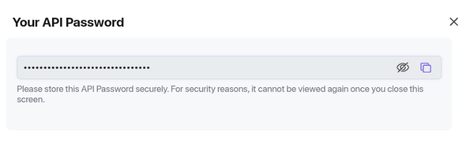
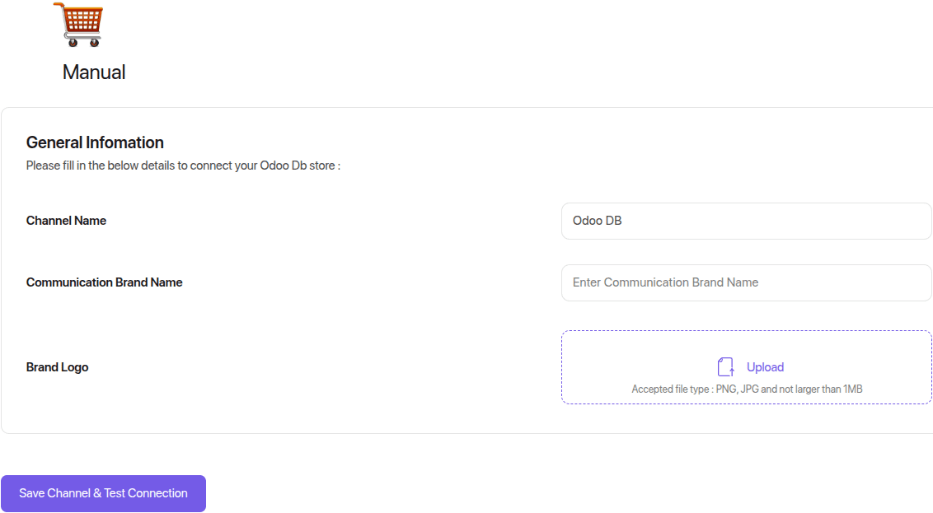
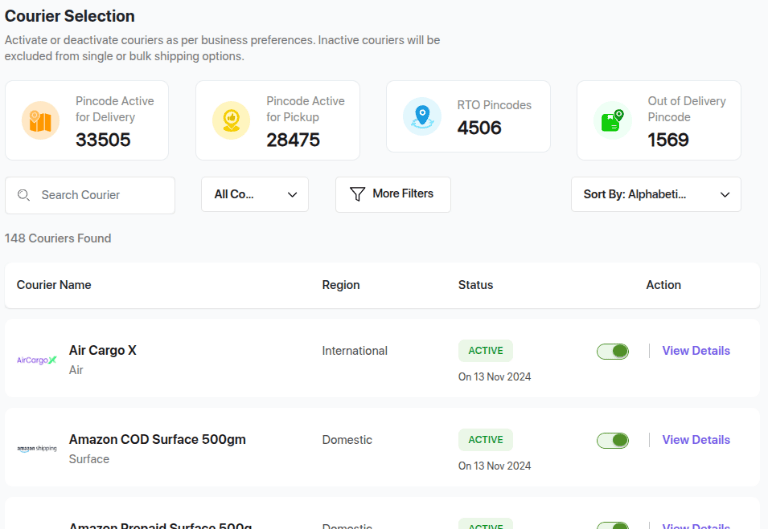
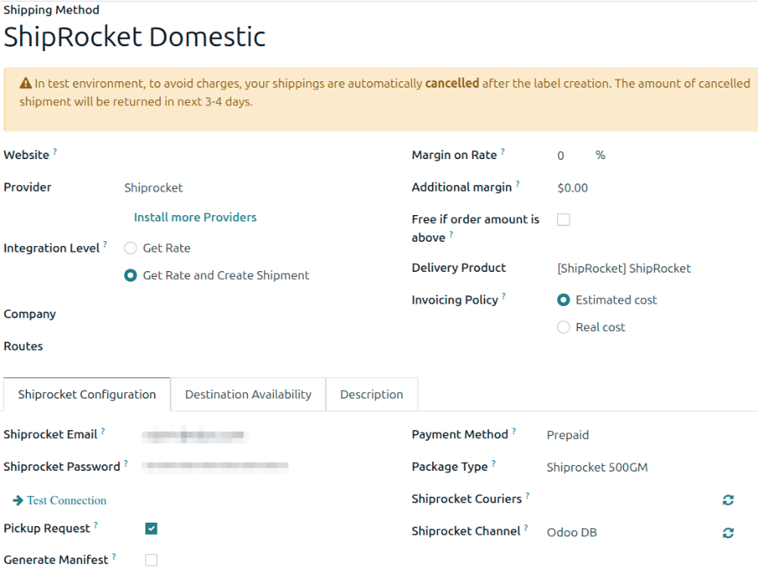
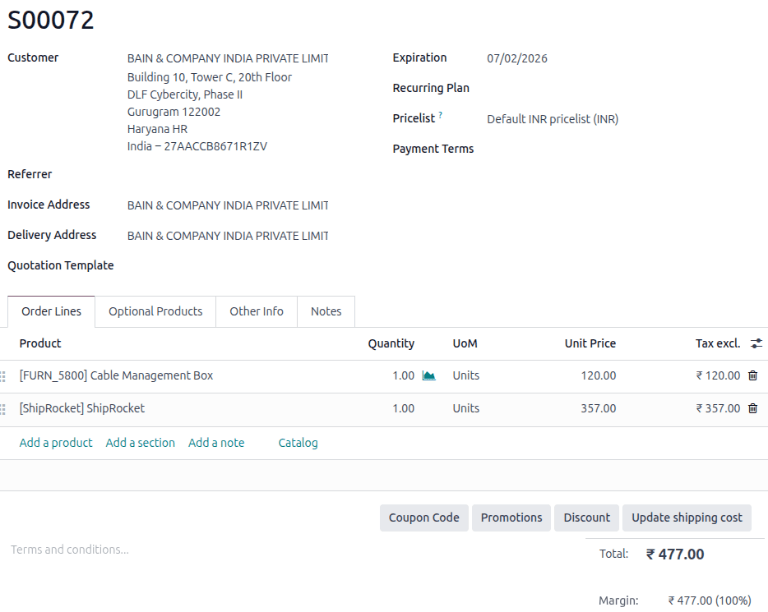
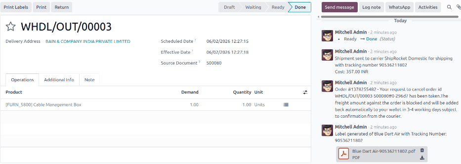

======================
Shiprocket integration
======================

Shiprocket is an Indian service that allows users to connect with multiple carriers, like Delhivery,
Blue Dart, DTDC, India Post, Xpressbees, and more. To manage Shiprocket shipments to clients
directly within Odoo, it must first be configured.

To configure it, complete these steps:

#. :ref:`Create a Shiprocket account <inventory/shiprocket/account-setup>`.
#. :ref:`Create an API user <inventory/shiprocket/api-user>`.
#. :ref:`Create a sales channel <inventory/shiprocket/sales-channel>`.
#. :ref:`Enable couriers <inventory/shiprocket/enable-couriers>`.
#. :ref:`Enable the Shiprocket connector in Odoo <inventory/shiprocket/enable>`.
#. :ref:`Configure the shipping method in Odoo <inventory/shiprocket/configure>`.

Upon completion, it is possible to calculate shipping costs based on package size and weight, have
the charges applied directly to a Shiprocket account, and automatically print Shiprocket tracking
labels in Odoo.

.. _inventory/shiprocket/account-setup:

Account setup
=============

To begin, go to the `Shiprocket website <https://app.shiprocket.in/newlogin>`_ to create or log into
the company's Shiprocket account.

Follow the website's steps to complete registration.

.. _inventory/shiprocket/api-user:

Create API user
---------------

On the Shiprocket *Homepage*, open the :menuselection:`Settings` menu. In the *Additional Settings*
section, navigate to the :menuselection:`API Users` page.

On the *API Users* page, click the :guilabel:`+ Add New API User` button. In the *Add New User*
window, specify an :guilabel:`Email ID`. Open the :guilabel:`Select Modules to Access` menu and
select :guilabel:`Orders (create, update)`, :guilabel:`Settings`, :guilabel:`Shipments`,
:guilabel:`Listings`, and :guilabel:`Courier`, then click :guilabel:`Apply`. Finally, click
:guilabel:`Create User` to add the user.

Copy the API password from the *Your API Password* window.

.. _inventory/shiprocket/sales-channel:

Create sales channel
--------------------

From the sidebar, navigate to :menuselection:`Setup & Manage --> Channels`. On the *Sales Channels*
page, click :guilabel:`Connect New Channel`. In the *Shopping Carts* section, click the
:guilabel:`Add` button under the *Manual* heading. The *Manual* settings page opens.

Specify a :guilabel:`Channel Name`, such as `Odoo`. Click :guilabel:`Save Channel & Test
Connection`.

.. _inventory/shiprocket/enable-couriers:

Configure couriers
------------------

From the sidebar, navigate to :menuselection:`Setup & Manage --> Courier`. On the *Courier
Selection* page, enable or disable shipping couriers.

Open the :menuselection:`Courier Priority` page. Set a priority ranking to which orders are assigned
and click :guilabel:`Save`. The courier is selected in Odoo based on this priority. For example, if
:guilabel:`Cheapest` is selected, the most cost-effective courier is selected.

.. _inventory/shiprocket/enable:

Enable connector
================

The *Shiprocket Connector* must be enabled before a shipping method can be configured.

Navigate to :menuselection:`Inventory app --> Configuration --> Settings`. In the *Shipping
Connectors* section, enable :guilabel:`Shiprocket Connector`, then click :guilabel:`Save`.

.. _inventory/shiprocket/configure:

Configure shipping method
=========================

Configure the Shiprocket shipping method in Odoo by going to :menuselection:`Inventory app -->
Configuration --> Shipping Methods`.

On the *Shipping Methods* page, open the :guilabel:`ShipRocket Domestic` shipping method, or click
:guilabel:`New`.

In the :guilabel:`Provider` field, select :guilabel:`Shiprocket` from the list of providers. Doing
so reveals the *Shiprocket Configuration* tab at the bottom of the form, where Shiprocket
credentials are entered.

For details on configuring the other fields on the shipping method, such as :guilabel:`Delivery
Product`, refer to the :ref:`inventory/setup_configuration/add-method` documentation.

.. important::
   To generate Shiprocket shipping labels through Odoo, ensure the :guilabel:`Integration Level`
   option is set to :guilabel:`Get Rate and Create Shipment`.

Shiprocket Configuration tab
----------------------------

Enter the API user email address in the :guilabel:`Shiprocket Email` field. Enter the API password
for the user in the :guilabel:`Shiprocket Password` field. Click the :icon:`fa-arrow-right`
:guilabel:`Test Connection` link.

Select :guilabel:`Pickup Request` to send a pickup request when a delivery order is validated.

Select :guilabel:`Generate Manifest` to generate a shipping manifest and streamline the pickup
process.

Select a :guilabel:`Payment Method`. Select :guilabel:`Prepaid` to pay for labels using Shiprocket
account funds. Select cash on delivery (:guilabel:`COD`) to ensure the receiver pays for the
shipment when they receive it.

.. important::
   For **both** :guilabel:`Payment Method` selections, Shiprocket account funds are deducted.

   If :guilabel:`COD` is selected, the payment collected upon delivery is remitted according to
   Shiprocket's settlement cycle.

In the :guilabel:`Package Type` field, select a package dimension to use for shipments.

To retrieve the list of supported Shiprocket couriers, click the :icon:`fa-refresh` :guilabel:`(Sync
Couriers from Shiprocket)` icon next to the :guilabel:`Shiprocket Couriers` field. Select the
couriers to use in the :guilabel:`Shiprocket Couriers` field. If this field is left blank, Odoo will
select the first courier based on the :ref:`courier priority <inventory/shiprocket/enable-couriers>`
set in the Shiprocket portal.

To retrieve the list of Shiprocket channels, click the :icon:`fa-refresh` :guilabel:`(Sync Channel
from Shiprocket)` icon next to the :guilabel:`Shiprocket Channel` field. In the
:guilabel:`Shiprocket Channel` field, select the sales channel that was created in the
:ref:`inventory/shiprocket/sales-channel` step.

Destination Availability tab
----------------------------

Use the *Destination Availability* tab to specify the :guilabel:`Countries` the shipping method
applies to.

.. note::
   Shiprocket supports deliveries to over 220 countries; only those countries can be selected.

Shipping information
--------------------

To use Shiprocket to generate shipping labels, the following information **must** be filled out
accurately and completely in Odoo:

#. **Customer information**: When creating a quotation, ensure the selected :guilabel:`Customer` has
   a valid phone number, email address, and shipping address.

   To verify, select the :guilabel:`Customer` field to open their contact page. Add their shipping
   address in the :guilabel:`Contact` field, along with their :guilabel:`Mobile` number and
   :guilabel:`Email` address.
#. **Product weight**: Ensure all products in a delivery order have a specified :guilabel:`Weight`
   in the *Inventory* tab of their product form. Refer to the
   :ref:`inventory/shipping_receiving/configure-weight` documentation for detailed instructions.
#. **Warehouse address**: By default all packages are sent from the specified address in the
   warehouse. Make sure to set the :guilabel:`Address` in the warehouse form with a valid phone
   number and email address.

Generate a Shiprocket label
===========================

When a quotation is created in Odoo, add the Shiprocket shipping method by clicking the
:guilabel:`Add shipping` button.

In the *Add a shipping method* pop-up window, select :guilabel:`Shiprocket` in the
:guilabel:`Shipping Method` field. Calculate the shipping rate by clicking :guilabel:`Get rate`.
Finally, click :guilabel:`Add` to include the cost of shipping to the sales order line, labeled as
the *delivery product*.

.. note::
   Automatically calculate shipping costs for Shiprocket in both the **Sales** and **eCommerce**
   applications.

Then, :guilabel:`Validate` the delivery. Shipping label documents are automatically generated in the
chatter, which includes the following:

- **Shipping labels**, depending on the number of packages
- **Tracking numbers**, if the selected courier supports it

.. important::
   If the shipment is too heavy for the Shiprocket service that is configured, the weight is split
   to simulate multiple packages. Products must be put in different packages to validate the
   transfer and generate labels.

Cancellations
-------------

If a delivery order is cancelled in Odoo, it is automatically archived in Shiprocket. However, the
cancellation will not be sent to the courier itself, so make sure to log in to the courier's
platform to handle the cancellation manually.

Turn on Shiprocket integration
==============================

After the Shiprocket connection is set up, use the smart buttons at the top of the form to publish,
turn on production mode, or activate debug logging.

- :guilabel:`Unpublished/Published`: Click this smart button to make this shipping method available
  on the **eCommerce** website.
- :guilabel:`Test Environment/Production Environment`: Click this smart button to specify that
  labels are for testing only and cancelled immediately (Test) or that real shipping labels can be
  generated and charged to the Shiprocket account (Production). In the Test environment, the amount
  of the cancelled shipment is refunded in 3 to 4 days.
- :guilabel:`No Debug/Debug Requests`: Click this smart button to specify whether API requests and
  responses are logged in Odoo (:doc:`turn on developer mode <../../../../general/developer_mode>`
  and go to :menuselection:`Settings app --> Technical --> Logging`).
