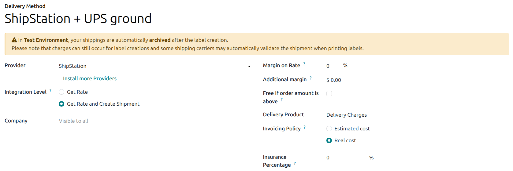
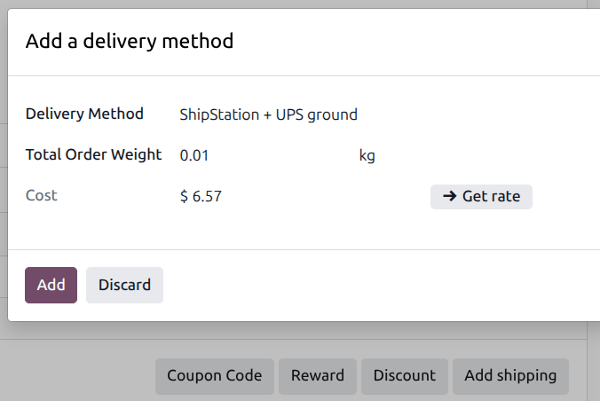
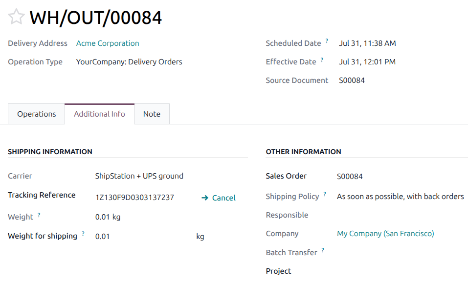

=======================
ShipStation integration
=======================

ShipStation is an all-in-one shipping and fulfillment platform. Integrating ShipStation with Odoo
makes it possible to calculate shipping costs and print shipping labels directly through Odoo.

ShipStation supports integration with carriers including UPS, USPS, FedEx, and DHL. International
carriers such as Mercado Libre and OnTrac are also supported.

.. seealso::
   :doc:`third_party_shipper`

Configuration
=============

To enable ShipStation as a delivery method in Odoo, :ref:`retrieve the API key and set carrier
preferences in ShipStation <inventory/shipstation/api-key-carriers>`, then :ref:`create ShipStation
delivery methods in Odoo <inventory/shipstation/create-delivery-method>`.

.. _inventory/shipstation/api-key-carriers:

Configuration in ShipStation
----------------------------

To configure carrier preferences in ShipStation, go to the `ShipStation website
<https://www.shipstation.com/start-a-free-trial/>`_ and sign in or create a ShipStation account.

#. **Obtain test and production API keys**: Go to :menuselection:`Settings --> Account --> API
   Settings`, select :guilabel:`V2 API`, and click :guilabel:`Generate API Key`.

   .. image:: shipstation/shipstation-api-settings.png
      :alt: ShipStation API Settings page with Generate API Key button.

   .. important::
      For the integration to work in Odoo, the :guilabel:`V2 API` needs to be selected from the
      version drop-down, as it is the only one supported.

#. **Copy the production key**: Keep the :guilabel:`Production Key` on hand for :ref:`delivery
   method configuration in Odoo <inventory/shipstation/create-delivery-method>`.

   .. image:: shipstation/shipstation-copy-production-key.png
      :alt: ShipStation Production Key "copy to clipboard" button.

#. **Enable the carrier**: Go to :menuselection:`Settings --> Account --> Shipping --> Carriers`. In
   the *ShipStation Carriers* tab, enable the desired carriers.

   .. image:: shipstation/shipstation-carriers.png
      :alt: ShipStation Carriers list with On/Off toggles.

.. _inventory/shipstation/create-delivery-method:

Configuration in Odoo
---------------------

To enable ShipStation delivery methods in Odoo, :ref:`install <general/install>` the *ShipStation
Shipping* module.

Create one delivery method for each carrier and service enabled in ShipStation. Delivery methods
created in Odoo can be selected in the sales order form.

To create a delivery method, go to :menuselection:`Inventory --> Configuration --> Delivery
Methods`, then click :guilabel:`New`. In the *Delivery Method* form, fill in the following fields:

- :guilabel:`Name`: Enter a name for the delivery method, e.g., `ShipStation + UPS Ground`.
- :guilabel:`Provider`: Select :guilabel:`ShipStation` as the provider.
- :guilabel:`Integration Level`: Select :guilabel:`Get Rate and Create Shipment` to generate
  shipping labels through Odoo.
- :guilabel:`Delivery Product`: Select a generic delivery product (:guilabel:`Delivery Charges`), or
  create a dedicated ShipStation delivery product specifically to track delivery orders that use
  this method.

.. important::
   To generate ShipStation shipping labels through Odoo, the :guilabel:`Integration Level` field
   must be set to :guilabel:`Get Rate and Create Shipment`.

When the :guilabel:`Provider` is set to :guilabel:`ShipStation`, the *ShipStation Configuration* tab
appears. Fill in the following fields in the *ShipStation Configuration* tab:

- :guilabel:`ShipStation API Key`: Paste the :ref:`ShipStation V2 API Production Key
  <inventory/shipstation/api-key-carriers>`.
- :guilabel:`ShipStation Label Layout`: Optionally select a label size.
- :guilabel:`ShipStation Label Format`: Optionally select the desired label file format.
- :guilabel:`ShipStation Insurance Provider`: Optionally select an insurance provider.

  .. important::
     When selecting an insurance provider, make sure to set the :guilabel:`Insurance Percentage`
     field.

- :guilabel:`ShipStation Service Name`: Click the :icon:`fa-refresh` :guilabel:`(Sync
  Carriers/Services from ShipStation)` button to synchronize the available carriers and services
  from the ShipStation account, then click the field to select the desired carrier and service.
- :guilabel:`ShipStation Default Package`: Select or create a package type for this
  delivery method. The available package types are defined in the ShipStation account. Make sure the
  package measurements (length, width, height) match the selected service.

  .. important::
     When selecting a package type, make sure it is available for the service selected above. This
     can be verified from the ShipStation website.

.. _inventory/shipstation/generate-labels:

Generate labels with ShipStation
================================

Once a ShipStation delivery method is configured, labels and shipping costs can be generated from
within a quotation or sales order form.

:doc:`Create a quotation <../../../../sales/sales/sales_quotations/create_quotations>`, then click
:guilabel:`Add Shipping`, and select the delivery method (`ShipStation +` *the selected carrier and
service*). The delivery product associated with the method is added to the quotation.

.. important::
   The product added to the quotation must have a weight associated with it to avoid errors.

After confirming the quotation, validate the delivery order to view the shipping information and
label.

.. seealso::
   :doc:`labels`
