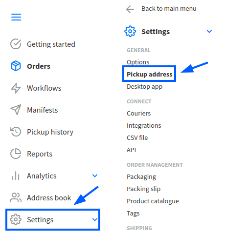
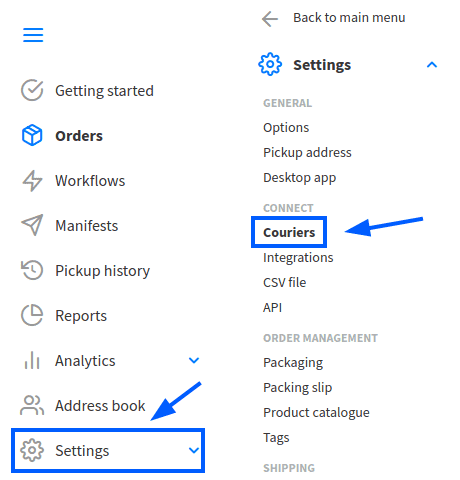
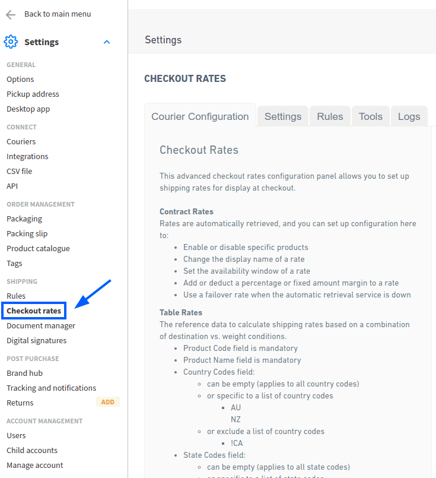
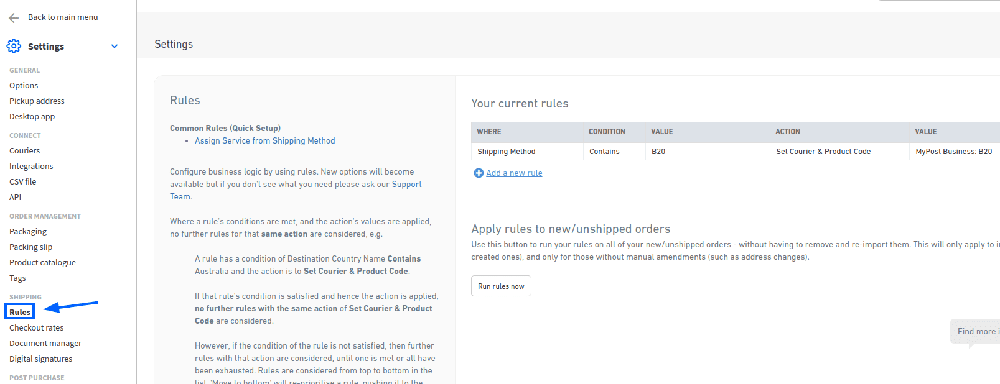
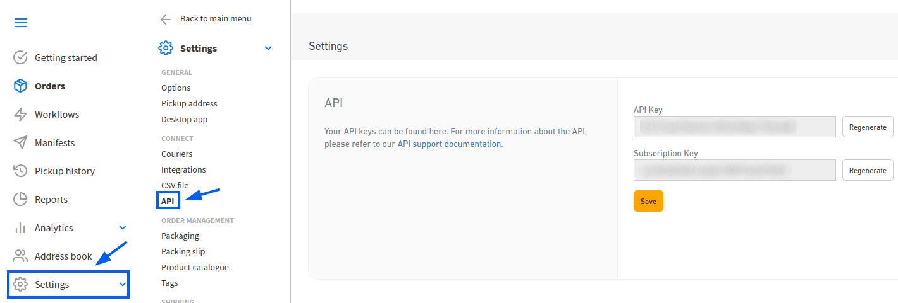
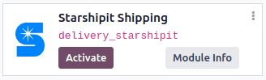
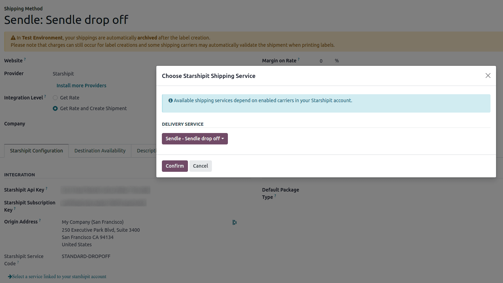
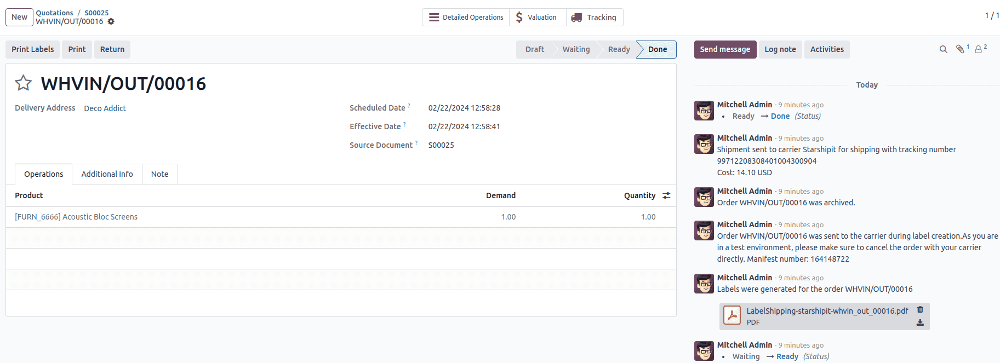

===================
Starshipit shipping
===================

Starshipit is a shipping service operator that facilitates the integration of Australasian
shipping couriers with Odoo. Once integrated, users can create shipping methods that will
automatically get rates from specific couriers (such as Australia Post, NZ Post, DHL,...)
based on predefined conditions.

.. seealso::
   - :doc:`Automatically calculate shipping <../setup_configuration>`
   - :doc:`Integrate other third-party couriers <third_party_shipper>`

Setup in Starshipit
===================

Create an account and activate couriers
---------------------------------------

To get started, go to `Starshipit's platform <https://starshipit.com/>`_ to configure the account
and generate the connector credentials. Log in with the Starshipit account, or create a new one if
needed.

Pickup address configuration
----------------------------

Once logged into the Starshipit account, navigate to :menuselection:`Settings --> Pickup address`,
and fill in the :guilabel:`Pickup address`. Ensure this field matches the warehouse address.

Couriers configuration
----------------------

To integrate with third-party couriers, navigate to :menuselection:`Settings --> Couriers`, and
select :guilabel:`Couriers`.

.. tip::
   For details on integrating with different couriers, refer to `Starshipit's support center
   <https://support.starshipit.com/hc/en-us/>`_.

Checkout rates
--------------

To configure shipping rate calculations, navigate to :menuselection:`Settings --> Checkout rates`.
The selected delivery costs are automatically applied in Odoo when calculating shipping costs.

Starshipit API key
------------------

Configure shipping rules to assign the correct shipping methods to orders based on specific
conditions.

To create a rule, go to :menuselection:`Settings --> Rules` and click :guilabel:`Add a new rule`.

While there are multiple ways to configure rules, it is recommended to set:

#. :guilabel:`Condition` to :guilabel:`Contains`
#. :guilabel:`Value` to the :guilabel:`product code`
#. :guilabel:`Action` to :guilabel:`Set Courier & Product Code`

.. _inventory/shipping_receiving/star-api:

Finding Starshipit API credentials
----------------------------------

In the Starshipit account, navigate to :menuselection:`Settings --> API` in the side menu.
This page contains the :abbr:`API (Application Programming Interface)` keys needed to connect to
Odoo.

Setup in Odoo
=============

Install
-------

After the Starshipit account is set up, integrate it with the Odoo database. To do that, go to
Odoo's :guilabel:`Apps` module, search for the :guilabel:`Starshipit Shipping` module, and click
:guilabel:`Activate` to install it.

Configuration
-------------

Once installed, activate the feature by going to :menuselection:`Inventory --> Configuration -->
Settings`. Under the :guilabel:`Shipping Connectors` section, activate the :guilabel:`Starshipit
Connector` option.

After activating :guilabel:`Starshipit Connector`, click the :guilabel:`Starshipit Shipping Methods`
link below the listed connector. Once on the :guilabel:`Shipping Methods` page, click
:guilabel:`Create`.

.. tip::
   :guilabel:`Shipping Methods` can also be accessed by going to :menuselection:`Inventory -->
   Configuration --> Delivery --> Shipping Methods`.

Configure Starshipit in Odoo by filling out the fields on the :guilabel:`Shipping Methods` form as
follows:

- :guilabel:`Shipping Method`: type `Starshipit`.
- :guilabel:`Provider`: select :guilabel:`Starshipit` from the drop-down menu.
- :guilabel:`Delivery Product`: assign or create the delivery product that will appear on the sales
  order line when the cost of shipping is computed.

  .. note::
   The fields discussed in this section are specific to configuring Starshipit. For more information
   about the other fields, refer to :doc:`../setup_configuration`.

In the :guilabel:`Starshipit Configuration` tab, fill out these fields:

- :guilabel:`Starshipit API Key`: enter the :abbr:`API (Application Programming Interface)` key
  :ref:`obtained from Starshipit <inventory/shipping_receiving/star-api>`.
- :guilabel:`Starshipit Subscription Key`: enter the subscription key obtained from the same place
  as the :ref:`API key <inventory/shipping_receiving/star-api>`.
- :guilabel:`Origin Address`: Enter the address where products are shipped from. This field is
  crucial for calculating shipping rates and :ref:`generating shipping labels
  <inventory/shipping_receiving/star-label>`.
- :guilabel:`Default Package Type`: Set a default package type to include the weight of the empty
  package when automatically calculating shipping rates.

.. important::
   To set a default package type, the *Packages* feature **must** be enabled in
   :menuselection:`Inventory --> Configuration --> Settings`.

- Manually :guilabel:`Save` the form by clicking the cloud icon next to the :guilabel:`Shipping
  Methods / New` breadcrumbs.

To load the newly configured shipping products, click the :guilabel:`Select a service linked to the
Starshipit account` link at the bottom of the :guilabel:`Starshipit Configuration` tab.

Doing so opens the :guilabel:`Choose Starshipit Shipping Service` pop-up window. In the
:guilabel:`Delivery Service` field, choose the desired shipping service for deliveries and returns
from the drop-down menu. Finally, click :guilabel:`Confirm`.

The chosen delivery service will populate in the :guilabel:`Service Name` field.

.. example::
   Sample of a Starshipit shipping product configured in Odoo:

   | :guilabel:`Sendle: Sendle drop off`
   | :guilabel:`Shipping Product`: `Sendle Delivery`
   | :guilabel:`Starshipit Service Code`: `STANDARD-DROPOFF`

.. tip::
   Starshipit does not provide test keys when a company tests the sending of a package in Odoo. This
   means that if a package is created, the account may be charged.

   Odoo has a built-in layer of protection against unwanted charges when using test environments.
   Within a test environment, if a shipping method is used to create labels, then those labels are
   immediately canceled after creation — this occurs automatically. Please note that depending on
   the shipping provider being used, the account might be charged for printing label, unless the
   order is cancelled manually on the couriers’s portal.

   Switch between the test and production environment by clicking the :guilabel:`Environment` smart
   button at the top of the shipping method form.

.. _inventory/shipping_receiving/star-label:

Generate a label with Starshipit
--------------------------------

When creating a quotation in Odoo, add the Starshipit shipping method by clicking the :guilabel:`Add
shipping` button.

In the :guilabel:`Add a shipping method` pop-up window, select Starshipit in the :guilabel:`Shipping
Method` field.

Calculate the shipping rate by clicking :guilabel:`Get rate`.
Finally, click :guilabel:`Add` to include the cost of shipping to the sales order line, labeled as
the *delivery product*.

.. note::
   Automatically calculate shipping costs for Starshipit in **both** Odoo *Sales* and *eCommerce*
   applications.

Then, :guilabel:`Validate` the delivery. Shipping label documents are automatically generated in the
chatter, which includes the following:

#. :guilabel:`Shipping label(s)` depending on the number of packages.
#. :guilabel:`Tracking number(s)` if the selected courier supports it.
#. :guilabel:`Return label(s)` if the Starshipit connector is configured for returns.

.. important::
   Package weight in Odoo is calculated by adding the weights of the products plus the empty package
   saved in the database. Ensure the correct shipping option is selected, as the package weight is
   not automatically verified.

   Verify the destination address, as Starshipit checks it when the order is created.

   Finally, some couriers may require other information, such as an email address or phone number.
   Please ensure that all necessary information are set upon sending a shipping order.

Returns
-------

Starshipit allows returns with the following couriers:
 * Australia Post eParcel
 * TNT
 * Couriers Please
 * Aramex
 * StarTrack
 * DHL Express
 * NZ Post Domestic

This can be done by clicking the :guilabel:`Return` smart button on the intended delivery order.
If the selected courier supports returns, the :guilabel:`Print Return Label` button will be
available.

Cancellations
-------------

If a delivery order is cancelled in Odoo, it will be automatically archived in Starshipit.
However, the cancellation will not be sent to the courier itself, so make sure to log onto the
courier's platform to handle the cancellation manually.
