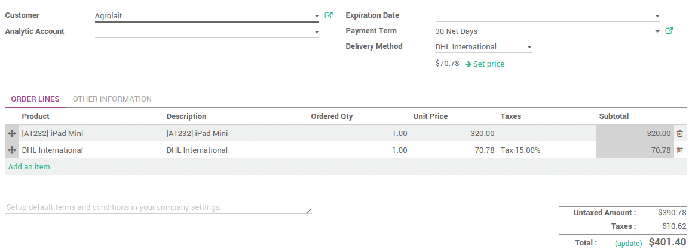

=======================================
How to integrate a third party shipper?
=======================================

.. _inventory/shipping/third_party:

Overview
========

Odoo can handle various delivery methods, including third party
shippers. Odoo can be linked with the transportation company tracking
system. It will allow you to manage the transport company, the real
prices and the destination.

Configuration
=============

Install the shipper company connector module
--------------------------------------------

In the inventory module, click on :menuselection:`Configuration --> Settings`.
Under **Shipping Connectors**, flag the transportation companies you want to
integrate :

.. image:: third_party_shipper/third_party_shipper06.png
   :align: center

Then click on **Apply**.

.. note::
    If you want to integrate delivery methods in your e-commerce,
    you'll have to install the **eCommerce Delivery** module.

Configure the delivery method
-----------------------------

To configure your delivery methods, go to the **Inventory** module, click on
:menuselection:`Configuration --> Delivery Methods`.

The delivery methods for the chosen shippers have been automatically
created. Most of the time, there will be **2** delivery methods for the same
provider: one for **international** shipping and the other for **domestic**
shipping.

You can create other methods with the same provider with other
configuration, for example the **Packaging Type**.

You can change the **Name** of the delivery method. This is the name that
will appear on your ecommerce.

Flag **Shipping enabled** when you are ready to use it.

.. image:: third_party_shipper/third_party_shipper02.png
   :align: center

In the pricing tab, the name of the provider chosen under the **Price computation**
means that the pricing will be computed by the shipper system.

The configuration of the shipper is split into two columns:

-  The first one is linked to **your account** (developer key, password,...).
   For more information, please refer to the provider website.

-  The second column varies according to the **provider**. You can choose
   the packaging type, the service type, the weight unit...

-  Uncheck **Test Mode** when you are done with the testings.

Finally you can limit the delivery method to a few destinations. You can
limit it to some countries, states or even zip codes. This feature
limits the list of countries on your e-commerce. It is useful for the
domestic providers. For example, USPS US only delivers from the United
States to the United States.

.. image:: third_party_shipper/third_party_shipper07.png
   :align: center

Company configuration
---------------------

In order to compute the right price, the provider needs your company
information. Be sure your address and phone number are correctly
encoded.

.. image:: third_party_shipper/third_party_shipper03.png
   :align: center

To check your information, go to the **Settings** application and click on
**General Settings**. Click on the first link **Configure your company data**.

Product configuration
---------------------

The shipper companies need the weight of your product, otherwise the
price computation cannot be done.

Go the menu :menuselection:`Sales --> Sales --> Products`. Open the products you
want to ship and set a weight on it.

.. image:: third_party_shipper/third_party_shipper09.png
   :align: center

.. tip::
    The weight on the product form is expressed in kilograms.
    Don't forget to make the conversion if you are used to the imperial
    measurement system.

Sale process
============

Sale order
----------

You can now choose the carrier on your sale order. Click on **Delivery
method** to choose the right one.

The price is computed when you save the sale order or when you click on
**Set price**.

If you want to invoice the price of the delivery charge on the sale
order, click on **Set price**, it will add a line with the name of the
delivery method as a product. It may vary from the real price.

Otherwise, the real price (computed when the delivery is validated) will
automatically be added to the invoice. For more information, please read
the document :doc:`../advanced_operations_shipping/invoicing`.

Delivery
--------

The delivery created from the sale order will take the shipping
information from it. You can change the carrier if you want to.

If you create a delivery transfer from the inventory module, you can add
the third party shipper in the additional info tab.

.. image:: third_party_shipper/third_party_shipper01.png
   :align: center

The weight is computed based on the products weights. The shipping cost
will be computed once the transfer is validated.

Click on **Validate** to receive the tracking number. The **Carrier Tracking
ref** field will automatically be filled. Click on the **Tracking** button
to check your delivery on the provider website.

.. image:: third_party_shipper/third_party_shipper08.png
   :align: center

The label to stick on your package is available in the history
underneath :

.. image:: third_party_shipper/third_party_shipper04.png
   :align: center

.. seealso::
    * :doc:`../advanced_operations_shipping/invoicing`
    * :doc:`../advanced_operations_shipping/labels`
