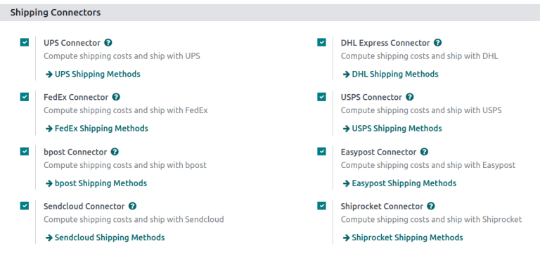
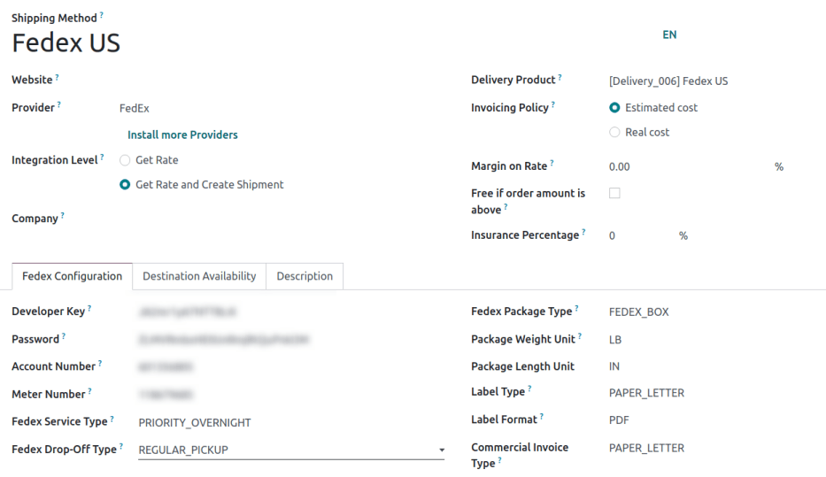
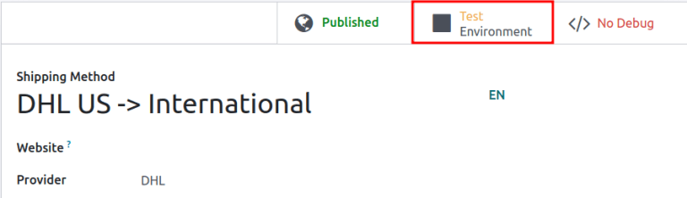
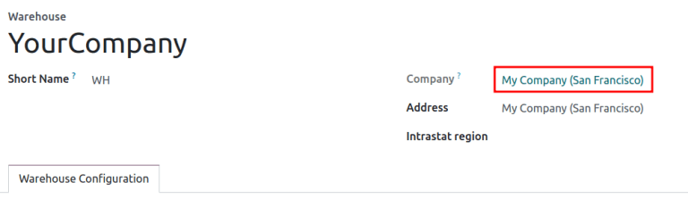
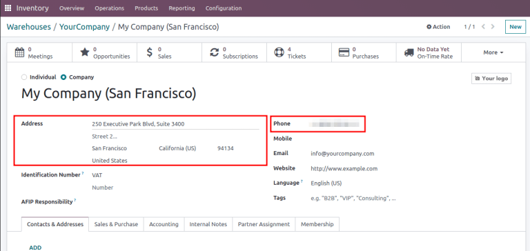
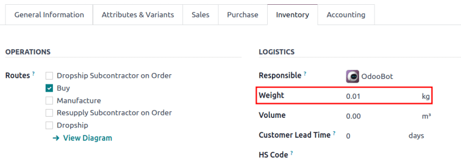
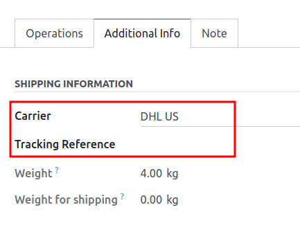
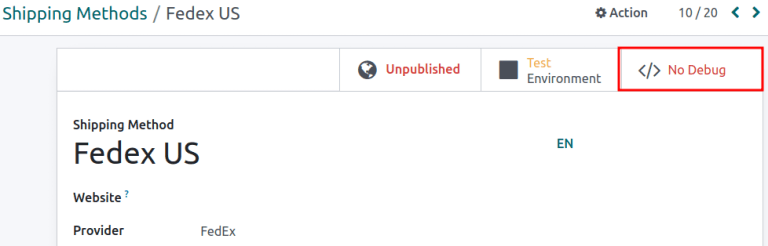
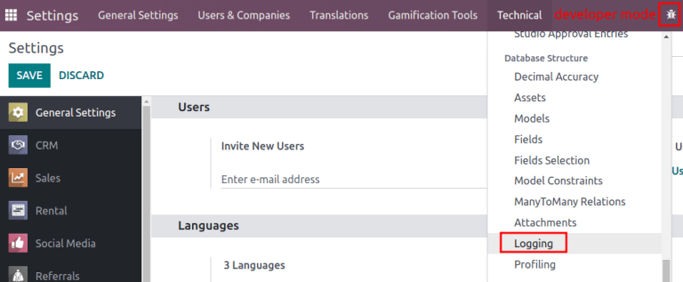
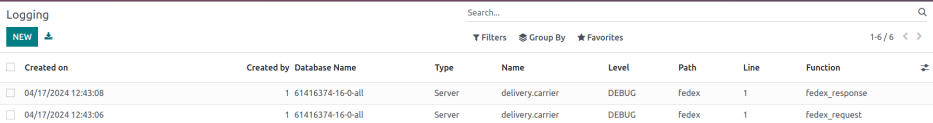

=============================
Third-party shipping carriers
=============================

.. |SO| replace:: :abbr:`SO (Sales Order)`
.. |DO| replace:: :abbr:`DO (Delivery Order)`

.. _inventory/shipping/third_party:

Users can link third-party shipping carriers to Odoo databases, in order to verify carriers'
delivery to specific addresses, :doc:`automatically calculate shipping costs
<../setup_configuration>`, and :doc:`generate shipping labels <labels>`.

In Odoo, shipping carriers can be applied to a sales order (SO), invoice, or delivery order. For
tips on resolving common issues when configuring shipping connectors, skip to the
:ref:`Troubleshooting <inventory/shipping_receiving/third-party-troubles>` section.

.. seealso::
   - :doc:`dhl_credentials`
   - :doc:`sendcloud_shipping`
   - :doc:`ups_credentials`

The following is a list of available shipping connectors in Odoo:

.. list-table::
   :header-rows: 1
   :stub-columns: 1

   * - Carrier
     - Region availability
   * - FedEx
     - All
   * - :doc:`DHL <dhl_credentials>`
     - All
   * - :doc:`UPS <ups_credentials>`
     - All
   * - US Postal Service
     - United States of America
   * - :doc:`Sendcloud <sendcloud_shipping>`
     - EU
   * - Bpost
     - Belgium
   * - Easypost
     - North America
   * - Shiprocket
     - India

Configuration
=============

To ensure proper setup of a third-party shipping carrier with Odoo, follow these steps:

#. :ref:`Install the shipping connector <inventory/shipping_receiving/shipping-connector>`.
#. :ref:`Set up delivery method <inventory/shipping_receiving/configure-delivery-method>`.
#. :ref:`Activate production environment <inventory/shipping_receiving/production-env>`.
#. :ref:`Configure warehouse <inventory/shipping_receiving/configure-source-address>`.
#. :ref:`Specify weight of products <inventory/shipping_receiving/configure-weight>`.

.. _inventory/shipping_receiving/shipping-connector:

Install shipping connector
--------------------------

To install shipping connectors, go to :menuselection:`Inventory app --> Configuration --> Settings`.

Under the :guilabel:`Shipping Connectors` section, tick the third-party shipping carrier's checkbox
to install it. Multiple third-party shipping connectors can be selected at once. Then, click
:guilabel:`Save`.

.. note::
   :doc:`Delivery methods <../setup_configuration>` can also be integrated with operations in the
   *Sales*, *eCommerce*, and *Website* apps. To install, refer to the :ref:`install apps and modules
   <general/install>` documentation.

.. _inventory/shipping_receiving/configure-delivery-method:

Delivery method
---------------

To configure the API credentials, and activate the shipping carrier, begin by going to
:menuselection:`Inventory app --> Configuration --> Shipping Methods`, and select the desired
delivery method.

.. note::
   The list often includes **two** delivery methods from the same :guilabel:`Provider`: one for
   international shipping and one for domestic shipping.

   Additional delivery methods can be created for specific purposes, such as :doc:`packaging
   <../../product_management/configure/packaging>`.

.. seealso::
   :doc:`Configure delivery methods <../setup_configuration>`

.. note::
   Ensure the delivery method is published when it should be available on the *Website* app. To
   publish a delivery method on the website, click the desired delivery method, then click the
   :guilabel:`Unpublished` smart button. Doing so changes that smart button to read:
   :guilabel:`Published`.

The :guilabel:`Shipping Method` page contains details about the provider, including:

- :guilabel:`Shipping Method` (*Required field*): the name of the delivery method (e.g. `FedEx US`,
  `FedEx EU`, etc.).
- :guilabel:`Website`: configure shipping methods for an *eCommerce* page that is connected to a
  specific website in the database. Select the applicable website from the drop-down menu, or leave
  it blank to apply the method to all web pages.
- :guilabel:`Provider` (*Required field*): choose the third-party delivery service, like FedEx. Upon
  choosing a provider, the :guilabel:`Integration Level`, :guilabel:`Invoicing Policy` and
  :guilabel:`Insurance Percentage` fields become available.
- :guilabel:`Integration Level`: choose :guilabel:`Get Rate` to simply get an :ref:`estimated
  shipment cost <inventory/shipping_receiving/third-party-so>` on an |SO| or invoice.

  .. important::
     Select :guilabel:`Get Rate and Create Shipment` to also :doc:`generate shipping labels
     <labels>`.

- :guilabel:`Company`: if the shipping method should apply to a specific company, select it from the
  drop-down menu. Leave the field blank to apply the method to all companies.
- :guilabel:`Delivery Product` (*Required field*): the delivery charge name that is added to the
  |SO| or invoice.
- :guilabel:`Invoicing Policy`: select and calculate an :guilabel:`Estimated cost` of shipping
  directly from the shipping carrier. If the :guilabel:`Real cost` of shipping is wanted instead,
  refer to this :doc:`doc about invoicing real shipping costs
  <../advanced_operations_shipping/invoicing>`.
- :guilabel:`Margin on Rate`: specify an additional percentage amount added to the base shipping
  rate to cover extra costs, such as handling fees, packaging materials, exchange rates, etc.
- :guilabel:`Free if order amount is above`: enables free shipping for orders surpassing a specified
  amount entered in the corresponding :guilabel:`Amount` field.
- :guilabel:`Insurance Percentage`: specify a percentage amount of the shipping costs reimbursed to
  the senders if the package is lost or stolen in transit.

   **Shipping Method** configuration page for `FedEx US`.

In the :guilabel:`Configuration` tab, fill out the API credential fields (e.g. API key, password,
account number, etc.). Depending on the third-party shipping carrier chosen in the
:guilabel:`Provider` field, the :guilabel:`Configuration` tab will contain different required
fields. For more details about configuring specific carriers' credentials, refer to the following
documents:

.. seealso::
   - :doc:`DHL credentials <dhl_credentials>`
   - :doc:`Sendcloud credentials <sendcloud_shipping>`
   - :doc:`UPS credentials <ups_credentials>`

.. _inventory/shipping_receiving/production-env:

Production environment
----------------------

With the delivery method details configured, click the :guilabel:`Test Environment` smart button to
set it to :guilabel:`Production Environment`.

.. warning::
   Setting the delivery method to :guilabel:`Production` creates **real** shipping labels, and users
   are at risk of being charged through their carrier account (e.g. UPS, FedEx, etc.) **before**
   users charge customers for shipping. Verify all configurations are correct before launching the
   delivery method to :guilabel:`Production`.

.. _inventory/shipping_receiving/configure-source-address:

Warehouse configuration
-----------------------

Ensure the warehouse's :guilabel:`Address` (including ZIP code) and :guilabel:`Phone` number are
entered accurately. To do that, go to :menuselection:`Inventory app --> Configuration -->
Warehouses`, and select the desired warehouse.

On the warehouse configuration page, open the warehouse contact page by clicking the
:guilabel:`Company` field.

Verify that the :guilabel:`Address` and :guilabel:`Phone` number are correct, as they are required
for the shipping connector to work properly.

.. _inventory/shipping_receiving/configure-weight:

Product weight
--------------

For the carrier integration to work properly, specify the weight of products by going to
:menuselection:`Inventory app --> Products --> Products`, and selecting the desired product.

Then, switch to the :guilabel:`Inventory` tab, and define the :guilabel:`Weight` of the product in
the :guilabel:`Logistics` section.

Apply third-party shipping carrier
==================================

Shipping carriers can be applied on a :abbr:`SO (Sales Order)`, invoice, or delivery order.

After configuring the third-party carrier's :ref:`delivery method
<inventory/shipping_receiving/configure-delivery-method>` in Odoo, create or navigate to a quotation
by going to :menuselection:`Sales app --> Orders --> Quotations`.

.. _inventory/shipping_receiving/third-party-so:

Sales order
-----------

To assign a third-party shipping carrier, and get an estimated cost of shipping, begin by going to
:menuselection:`Sales app --> Orders --> Quotations`. Create or select an existing quotation, and
add the cost of shipping through a third-party carrier to a quotation, by clicking the
:guilabel:`Add Shipping` button in the bottom-right corner of the :guilabel:`Order Lines` tab.

.. image:: third_party_shipper/add-shipping.png
   :align: center
   :alt: Show the "Add shipping" button at the bottom of a quotation.

In the resulting :guilabel:`Add a shipping method` pop-up window, select the intended carrier from
the :guilabel:`Shipping Method` drop-down menu. The :guilabel:`Cost` field is automatically filled
based on:

- the amount specified in the :guilabel:`Total Order Weight` field (if it is not provided, the sum
  of :ref:`product weights <inventory/shipping_receiving/configure-weight>` in the order is used)
- the distance between the warehouse's :ref:`source address
  <inventory/shipping_receiving/configure-source-address>` and the customer's address.

.. _inventory/shipping_receiving/third-party-rate:

After selecting a third-party provider in the :guilabel:`Shipping Method` field, click
:guilabel:`Get Rate` in the :guilabel:`Add a shipping method` pop-up window to get the estimated
cost through the shipping connector. Then, click the :guilabel:`Add` button to add the delivery
charge to the |SO| or invoice.

.. seealso::
   :doc:`Charge customers for shipping after product delivery
   <../advanced_operations_shipping/invoicing>`

.. _inventory/shipping_receiving/third-party-do:

Delivery order
--------------

For users making shipments without installing the *Sales* app, assign the shipping carrier to the
delivery order, by first going to the :menuselection:`Inventory` app. Then, from the
:guilabel:`Inventory Overview` dashboard, select the :guilabel:`Delivery Orders` operation type, and
choose the desired delivery order that is not already marked as :guilabel:`Done` or
:guilabel:`Cancelled`.

In the :guilabel:`Additional info` tab, set the :guilabel:`Carrier` field to the desired third-party
shipping carrier. When the delivery method is set to :ref:`production mode
<inventory/shipping_receiving/configure-delivery-method>`, a :guilabel:`Tracking Reference` is
provided.

.. seealso::
   :doc:`Generate shipping labels <labels>`

.. _inventory/shipping_receiving/third-party-troubles:

Troubleshooting
===============

Since shipping connectors can sometimes be complex to set up, here are some checks to try when
things are not working as expected:

#. Ensure the :ref:`warehouse information <inventory/shipping_receiving/configure-source-address>`
   (e.g., address and phone number) in Odoo is correct **and** matches the records saved in the
   shipping provider's website.
#. Verify that the :ref:`package type <inventory/warehouses_storage/package-type>` and parameters
   are valid for the shipping carrier. To check, ensure the shipment can be directly created on the
   shipping carrier's website.
#. When encountering a price mismatch between Odoo's estimated cost and the provider's charge, first
   ensure the delivery method is set to :ref:`production environment
   <inventory/shipping_receiving/production-env>`.

   Then, create the shipment in both the carrier's website and Odoo, and verify the prices are the
   same across Odoo, the shipping provider, and in the *debug logs*.

   .. example::
      When checking for a price mismatch in the debug logs, if the request says the package weighs
      six kilograms, but the response from FedEx says the package weights seven kilograms, it
      concludes that the issue is on FedEx's side.

Debug log
---------

Track shipping data inconsistencies by activating debug logging. To do that, go to the delivery
method's configuration page (:menuselection:`Inventory app --> Configuration --> Shipping
Method`), and select the desired shipping method. Click the :guilabel:`No Debugging` smart button to
activate :guilabel:`Debug Requests`.

With :guilabel:`Debug Requests` activated, each time the shipping connector is used to estimate the
cost of shipping, records are saved in the :guilabel:`Logging` report. To access the report, turn on
:ref:`developer mode <developer-mode>`, and go to :menuselection:`Settings app --> Technical -->
Database Structure section --> Logging`.

.. note::
   Logs are created for a shipping method each time the :ref:`Get Rate
   <inventory/shipping_receiving/third-party-rate>` button is clicked on :abbr:`SOs (Sales Orders)`
   and invoices, **and** when a customer adds the shipping carrier to their order through the
   *Website* app.

Click the *HTTP request* line item to open a detailed page, and verify the correct information is
sent from Odoo to the shipping carrier. In the *HTTP response*, verify that the same information is
received.

