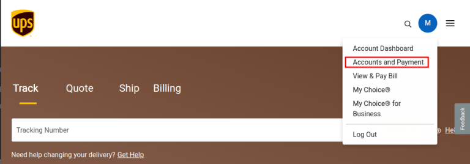
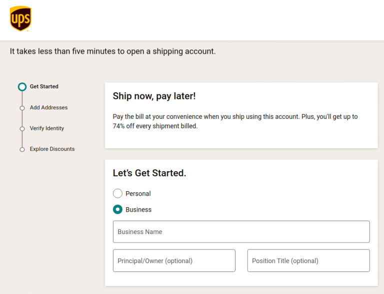
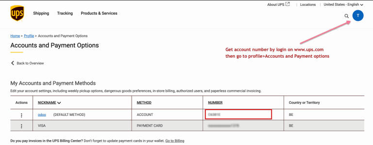
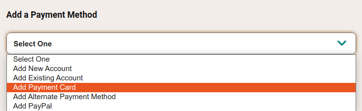
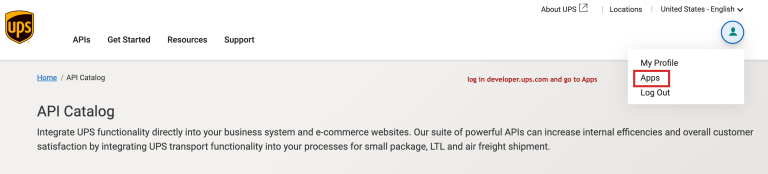
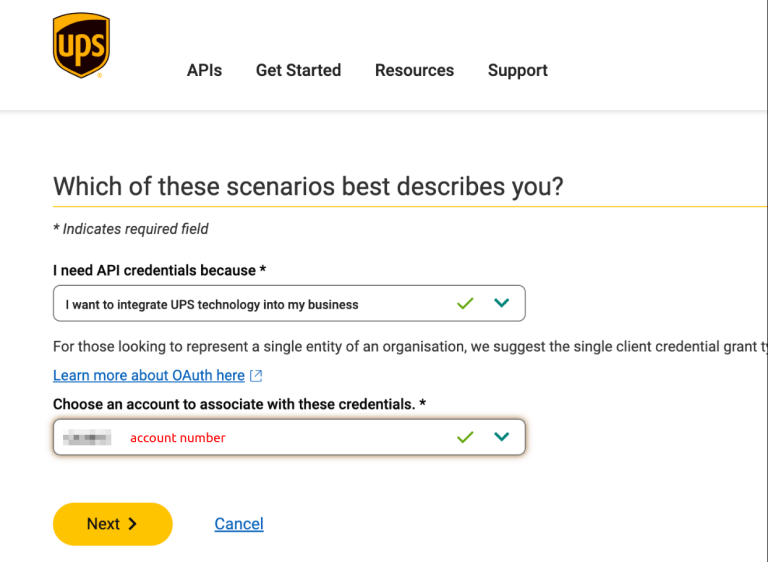
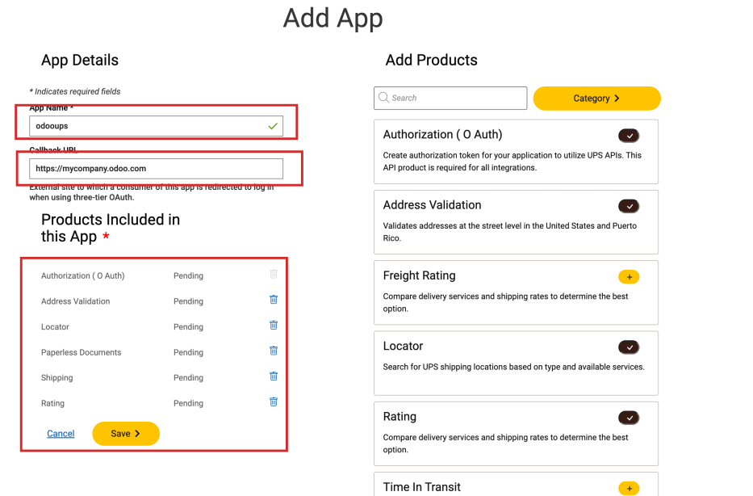
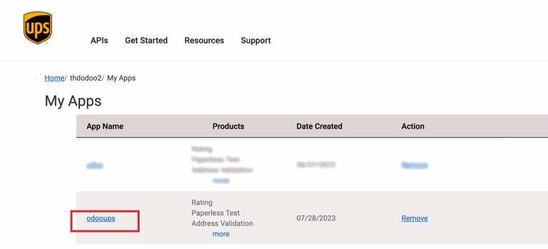
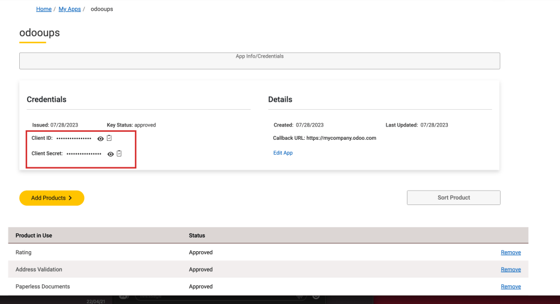
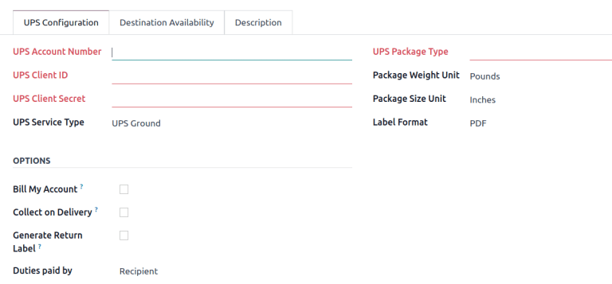

===============
UPS integration
===============

UPS is a shipping carrier service that integrates with Odoo to coordinate shipping to all regions.
Once integrated, users can create shipping methods that estimate shipping costs and :doc:`generate
labels <labels>`.

.. seealso::
   :doc:`third_party_shipper`

To set up the UPS shipping connector in Odoo, complete these steps:

#. Create a UPS account to get :ref:`account number
   <inventory/shipping_receiving/ups-account-number>`
#. Create UPS developer account to get :ref:`client credentials
   <inventory/shipping_receiving/ups-client-id>`
#. Set up shipping method in Odoo

UPS account setup
=================

To get started, go to the `UPS website <https://www.ups.com>`_ and click the :guilabel:`Log In`
button in the top-right corner to log in or create a UPS account.

After logging in, click the profile icon in the top-right corner, and select :guilabel:`Accounts and
Payment` from the drop-down menu.

On the :guilabel:`Accounts and Payment Options` page, two accounts must be configured: an Odoo
shipment account and a payment card.

Shipping account
----------------

To add an Odoo shipment account, select :guilabel:`Add New Account` from the :guilabel:`Add a
Payment Method` drop-down menu, and click :guilabel:`Add`.

.. image:: ups_credentials/new-account.png
   :align: center
   :alt: Display "Add an account" option from the drop-down menu.

On the next screen, labeled :guilabel:`Open a Shipping Account`, complete the forms to configure the
shipping account type (e.g. :guilabel:`Business`) and if any regulated items will be shipped. Then
finish the remaining three steps in the wizard to :guilabel:`Add Addresses`, :guilabel:`Verify
Identity`, and :guilabel:`Explore Discounts`, with the last option being optional.

When complete, submit the application on the last page of the wizard to finish setting up the
shipping account.

.. _inventory/shipping_receiving/ups-account-number:

Get account number
------------------

With the shipping account set up, the UPS :guilabel:`Account Number` becomes available. To access
it, navigate to :menuselection:`Profile --> Accounts and Payment` and refer to the shipping
account's :guilabel:`Number` field.

Payment card
------------

Navigate back to the :guilabel:`Accounts and Payments` page and select the :guilabel:`Add Payment
Card` option from the :guilabel:`Add a Payment Method` drop-down menu. Then, complete the form to
add the credit card information.

UPS developer account setup
===========================

Next, log into the `UPS developer account <http://developer.ups.com/>`_ to generate the developer
key. To begin, click the profile icon in the top-right corner, and choose the :guilabel:`Apps`
option from the drop-down menu.

Add app
-------

Then, click the :guilabel:`Add Apps` button to begin filling out the form. In the :guilabel:`I need
API credentials because \*` field, select :guilabel:`I want to integrate UPS technology into my
business`.

Under the next label, :guilabel:`Choose an account to associate with these credentials. \*`, select
:guilabel:`Add existing account` from the drop-down menu in the corresponding field, and then select
the :ref:`account number <inventory/shipping_receiving/ups-account-number>` linked to the UPS
account created in the previous step.

Click :guilabel:`Next`, and proceed to the :guilabel:`Add App` form, and fill out the fields:

- :guilabel:`App Name`: Type the name to identify the app by.
- :guilabel:`Callback URL`: Type the URL of the Odoo database, in the format:
  `https://databaseName.odoo.com`. Do **not** include `www` in the URL.

In the :guilabel:`Add Products` section on the right, search for and click the :guilabel:`+ (plus)`
icon to add the following products to the app:

- :guilabel:`Authorization (O Auth)`: Used to generate the authorization token to request
  information from the UPS API.
- :guilabel:`Address Validation`: Validates addresses at the street level in the United States and
  Puerto Rico.
- :guilabel:`Locator`: Enables search for UPS shipping locations based on type and available
  services.
- :guilabel:`Paperless Documents`: Enables the upload of document images to link to shipments.
- :guilabel:`Shipping`: Enables UPS shipping services, such as preparing packages for shipment,
  managing returns, and canceling scheduled shipments.
- :guilabel:`Rating`: Compare delivery services and shipping rates.

Finally, click :guilabel:`Save` and accept UPS's terms and conditions.

.. seealso::
   `UPS API Catalog <https://developer.ups.com/catalog?loc=en_US>`_

.. _inventory/shipping_receiving/ups-client-id:

Client ID and Client Secret
---------------------------

With the new app created, in the :menuselection:`Profile --> My Apps --> App` page, select the app
from the :guilabel:`Credentials` section to view the UPS credentials.

In the :guilabel:`Credentials` section, copy the :guilabel:`Client ID` and :guilabel:`Client Secret`
key.

Setup in Odoo
=============

With the credentials obtained, configure the UPS shipping method in Odoo by going to
:menuselection:`Inventory app --> Configuration --> Shipping Methods`.

On the :guilabel:`Shipping Methods` page, click the :guilabel:`New` button.

.. note::
   For existing UPS shipping methods whose :guilabel:`Provider` is :guilabel:`UPS Legacy`, archive
   it and create a new shipping method using :guilabel:`UPS`.

In the :guilabel:`Provider` field, select :guilabel:`UPS`. Doing so reveals the :guilabel:`UPS
Configuration` tab, where various fields must be entered. For details instructions on configuring
the other fields on the shipping method, refer to the :doc:`Configure third-party carrier
<third_party_shipper>` documentation.

In the :guilabel:`UPS Configuration` tab, complete the following fields:

- :guilabel:`UPS Account Number`: (*required*) Get the :ref:`account number
  <inventory/shipping_receiving/ups-account-number>` from the UPS portal.
- :guilabel:`UPS Client ID`: (*required*) Get the :ref:`Client ID
  <inventory/shipping_receiving/ups-client-id>` from the UPS developer website.
- :guilabel:`UPS Client Secret`: (*required*) Get the :ref:`Client Secret
  <inventory/shipping_receiving/ups-client-id>` key from the UPS developer website.
- :guilabel:`UPS Service Type`: Select from the drop-down menu the type of shipping service.
- :guilabel:`UPS Package Type`: (*required*) Select from the drop-down menu the :doc:`package type
  <../../product_management/configure/package>` that is supported for the shipping service.
- :guilabel:`Package Weight Unit`: The unit of measure for the package weight.
- :guilabel:`Package Size Unit`: The unit of measure for the package dimensions.
- :guilabel:`Label Format`: Choose the label format shipping labels: :guilabel:`PDF`,
  :guilabel:`ZPL`, :guilabel:`EPL`, or :guilabel:`SPL`.

In the :guilabel:`Options` section, the following features are available:

- :guilabel:`Bill My Account`: Charge the user's UPS account for shipping in the *eCommerce* app.
- :guilabel:`Collect on Delivery`: Collect payment from customers for shipping after the shipment is
  delivered.
- :guilabel:`Generate Return Label`: Print the return label for the order after the delivery order
  is validated.
- :guilabel:`Duties paid by`: Select whether duties or other fees are charged to the
  :guilabel:`Sender` or :guilabel:`Recipient` of the order.
