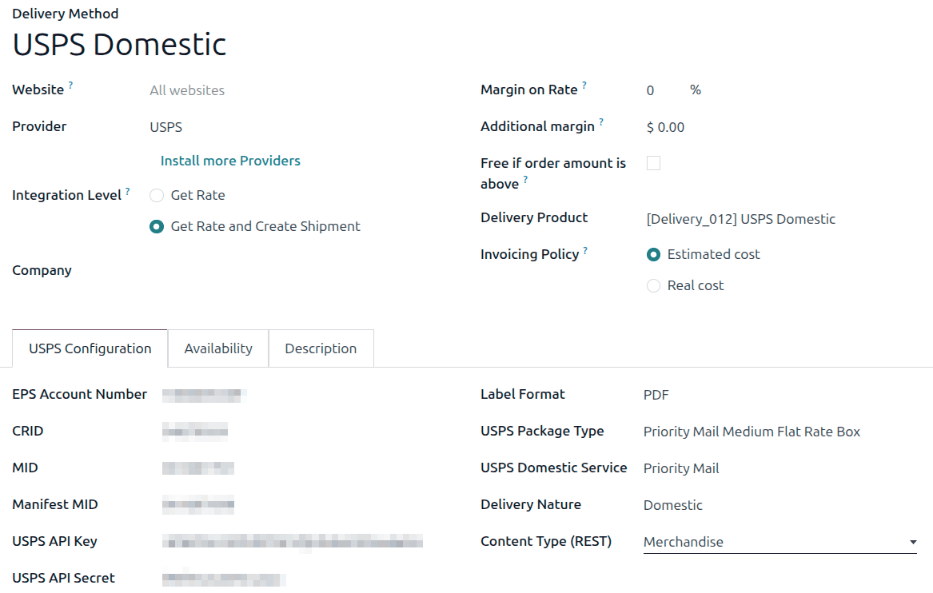

================
USPS integration
================

.. |COP| replace:: :abbr:`COP (Customer Onboarding Portal)`

Integrating a USPS account with Odoo's **Inventory** app makes it possible to calculate delivery
rates and generate delivery labels within Odoo. This is accomplished by enabling the USPS shipping
connector, then configuring at least one delivery method.

Enable shipping connector
=========================

To enable the USPS shipping connector, open the :menuselection:`Apps` app from the main Odoo
dashboard. In the :guilabel:`Search` field, search for `USPS`  and click :guilabel:`Install`.

After the shipping connector is installed, the USPS connector is enabled by default.

Configure USPS business account
===============================

A USPS business account is required to obtain the information needed to :ref:`fill out the fields in
the delivery method form <inventory/shipping_receiving/usps-configuration>`. To create a new
account, navigate to USPS's `Create Your USPS.com Account
<https://reg.usps.com/entreg/RegistrationAction_input>`_ page, select the :guilabel:`Business
Account` option, then follow the steps.

Create a developer app
----------------------

After the USPS Business Customer Onboarding Portal (COP) is set up, `sign in to the USPS COP
<https://cop.usps.com/>`_ to manage business account information and access the USPS APIs.

On this page, make note of the :guilabel:`Customer Registration ID (CRID)`, the :guilabel:`Master
Mailer ID`, and the :guilabel:`Label Mailer ID`.

Click the :guilabel:`My Apps` link at the top of the screen.

Open the :guilabel:`Developer Apps` tab. Click the :guilabel:`Add App` button. In the *Add App*
pop-up window, specify an :guilabel:`App Name`. Select the APIs to use. Finally, click the
:guilabel:`Add App` button.

A window opens, titled after the app name. Keep this window open as the delivery method is
configured. The :guilabel:`Consumer Key` and :guilabel:`Consumer Secret` will be necessary in the
delivery method form.

Configure delivery method
=========================

Once the USPS shipping connector is enabled, at least one delivery method must be configured. After
doing so, the delivery method can be included in sales orders (SOs) and used to compute delivery
costs and print shipping labels.

.. important::
   The USPS shipping connector automatically creates two default delivery methods:
   :guilabel:`USPS Domestic` and :guilabel:`USPS International`. These methods are
   preconfigured with test credentials, allowing them to be used for testing purposes.

  To create actual shipments using the default delivery methods, the test credentials must be
  replaced with credentials from a valid USPS account.

Open or create a new delivery method. Navigate to :menuselection:`Inventory --> Configuration -->
Delivery Methods`, then open an existing USPS delivery method to display its form. Alternatively,
click :guilabel:`New` to open a blank form and configure a new delivery method.

General information
-------------------

The fields at the top of the delivery method form configure how the method operates in Odoo. In
the :guilabel:`Provider` field, select :guilabel:`USPS` from the drop-down menu if it is not already
selected.

The remaining fields in this section are general to all delivery providers. For details on how to
fill them out, see :doc:`third_party_shipper`.

.. _inventory/shipping_receiving/usps-configuration:

USPS Configuration tab
----------------------

The options in the *USPS Configuration* tab are used to connect the method to a USPS account and to
configure the delivery details associated with it.

Fill out the following fields in the form:

- :guilabel:`EPS Number`: The Enterprise Payment System (EPS) account number identifies the payment
  account and is used for electronic funds transfers. After a payment account is added in the |COP|
  tool, the EPS number will display, or it can be retrieved from the `USPS Business Customer Gateway
  <https://epay.usps.com/paymod/>`_.
- :guilabel:`CRID`: The CRID is a number that identifies the physical business address across all
  USPS systems and applications.
- :guilabel:`MID`: Fill in the :guilabel:`Master Mailer ID` listed in the |COP|.
- :guilabel:`Manifest MID`: Fill in the :guilabel:`Label Mailer ID` listed in the |COP|.
- :guilabel:`USPS API Key`: Enter the :guilabel:`Consumer Key` credential for the app created in the
  USPS |COP| tool.
- :guilabel:`USPS API Secret`: Enter the :guilabel:`Consumer Secret` credential for the app created
  in the USPS |COP| tool.
- :guilabel:`Label Format`: Select the file format that generated labels should use.
- :guilabel:`USPS Package Type`: Select or create the package type to use for shipping.
- :guilabel:`USPS Domestic Service` or :guilabel:`USPS International Service`: Select the
  service level that should be used to generate shipping labels.
- :guilabel:`Delivery Nature`: Select whether the delivery method is :guilabel:`Domestic` or
  :guilabel:`International`.
- :guilabel:`Content Type`: Select the type of content that will be shipped in packages with this
  delivery method.

In the :guilabel:`Options` section, configure the following fields:

- :guilabel:`Domestic Rating Indicator` or :guilabel:`International Rating Indicator`: Select the
  rating indicator that works best for shipping needs. USPS uses specific indicators, pricing
  groups, and automated classification systems to distinguish between domestic and international
  shipments for rating purposes. These systems help ensure accurate postage calculations based on
  factors such as destination, package weight, dimensions, and selected mail class.
- :guilabel:`Processing Category`: Select a packaging processing category.
- :guilabel:`Generate Return Label`: For domestic shipments only. Select this checkbox to
  automatically generate a return label when the delivery is validated.

Turn on the USPS delivery method
================================

After the USPS connection is set up, use the smart buttons at the top of the form to publish, turn
on production mode, or activate debug logging.

- :guilabel:`Unpublished` / :guilabel:`Published`: Determines whether the delivery method is
  available on the **eCommerce** website.
- :guilabel:`Test Environment` / :guilabel:`Production Environment`: Determines whether the delivery
  method creates :guilabel:`Test` labels, which are canceled immediately,  or :guilabel:`Production`
  labels, which are real shipping labels charged to the USPS account.
- :guilabel:`No Debug` / :guilabel:`Debug Requests`: Determines whether API requests and responses
  are logged in Odoo (:doc:`turn on developer mode <../../../../general/developer_mode>` and go to
  :menuselection:`Settings app --> Technical --> Logging`).
