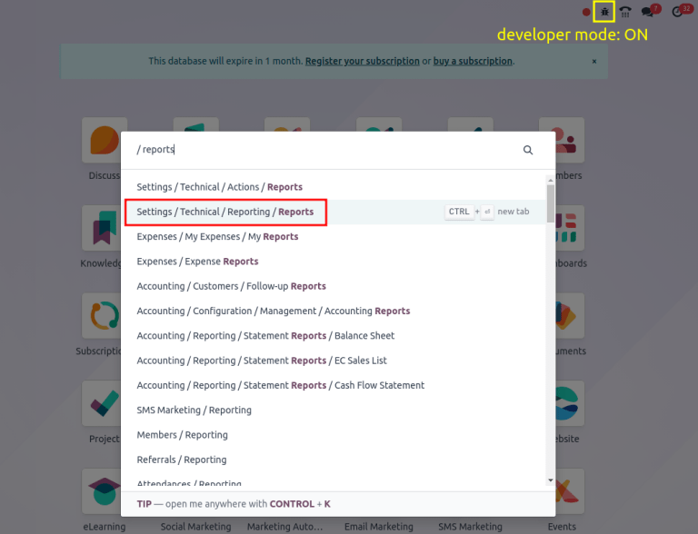
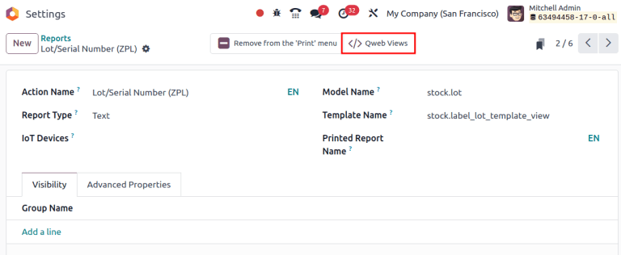

=========================
Zebra label configuration
=========================

.. |ZPL| replace:: :abbr:`ZPL (Zebra Programming Language)`

In Odoo, labels printed in the Zebra Programming Language (ZPL) file format are designed to fit a
four-by-six inch label. To resize (or reformat) text to fit a variety of |ZPL| label sizes,
:ref:`navigate to the ZPL label view <inventory/shipping_receiving/zpl-view>`, and alter the |ZPL|
code.

.. warning::
   When customizing code in Odoo, please note that upgrading the database to newer versions may
   break custom |ZPL| code. **Customers are responsible for maintaining their custom code**.

Refer to the following sections for explanations, and example code, for frequently requested Zebra
label customizations.

- :ref:`Adjust margins <inventory/shipping_receiving/margin>`
- :ref:`Enlarge/minimize barcodes <inventory/shipping_receiving/resize>`
- :ref:`Rotate elements <inventory/shipping_receiving/rotate>`

.. _inventory/shipping_receiving/zpl-view:

Navigate to ZPL label view
==========================

To begin customizing a Zebra label in Odoo, turn on :ref:`developer mode <developer-mode>`, and on
the main Odoo dashboard, type `Reports`. From the search results that appear in the resulting pop-up
window, choose :guilabel:`Settings / Technical / Reporting / Reports` to open the
:guilabel:`Reports` page.

.. note::
   To manually navigate to the :guilabel:`Reports` page, go to :menuselection:`Settings app -->
   Technical --> Reporting: Reports`.

On the :guilabel:`Reports` page, in the :guilabel:`Search...` bar, type `ZPL`, and hit :kbd:`Enter`.
Upon doing so, Odoo presents a list of available Zebra labels in Odoo. Select the desired Zebra
label from the list to modify it on a separate page.

.. note::
   Printable ZPL labels in Odoo:

   - :ref:`lot/serial number <inventory/shipping_receiving/lot-sn-labels>`
   - operation type
   - package barcode
   - :ref:`product label <inventory/shipping_receiving/product-labels>`
   - product packaging
   - finished product (Odoo *Manufacturing* app required)

Next, click the :icon:`fa-code` :guilabel:`Qweb Views` smart button, and choose the desired label
:doc:`view <../../../../../developer/reference/user_interface/view_records>`.

   **Lot and Serial Number (ZPL)** report, highlighting the Qweb smart button.

On the resulting view form, go to the :guilabel:`Architecture` tab to view the |ZPL| code.

.. important::
   To ensure the customization is **not** overwritten during an update, click the :icon:`fa-bug`
   :guilabel:`(bug)` icon on the view page. Then, select the :guilabel:`View Metadata` option from
   the resulting drop-down menu, in order to open the :guilabel:`View Metadata` pop-up window. Then,
   ensure the :guilabel:`No Update` field is set to :guilabel:`true (change)`. Click :guilabel:`Ok`
   to exit the :guilabel:`View Metadata` pop-up window.

.. image:: zebra/architecture.png
   :align: center
   :alt: Architecture tab in the view.

.. _inventory/shipping_receiving/margin:

Adjust margin
=============

Text gets cut off from standard |ZPL| labels printed in Odoo when the line exceeds fifty-five
characters. To fit long product names, or lot numbers, on a single line, adjust the margin.

To begin, navigate to the :ref:`ZPL code of the label <inventory/shipping_receiving/zpl-view>` in
the :guilabel:`Architecture` tab. In the |ZPL| code for product labels, look for the `^FT` command,
which specifies where to start placing the text, or graphic element, on the label. The two numbers
immediately following `^FT` define the x-coordinate and y-coordinate in dots (:dfn:`similar to
pixels for printers`) from the left and top margins.

.. important::
   When customizing lot/serial number labels, look for the `^FO` command, instead of `^FT`.

.. example::

    The following is an example where the product's name gets cut off with Odoo's default |ZPL|
    formatting. In the **Fixed** tab, the x-coordinate of the starting position of the label is
    changed from `^FT100,80` to `^FT0,80`, to fit the entire name.

.. tabs::

   .. tab:: Default

      .. image:: zebra/default-margin.png
         :align: center
         :alt: Example barcode label with the product name cut off.

      **Code**:

      .. code-block:: xml

         ^XA^CI28
         ^FT100,80^A0N,40,30^FD[E-COM11] Cabinet with Doors (wood: Cherry, handles: brass)^FS
         ...
         ^XZ

   .. tab:: Modified

      .. image:: zebra/fixed-margin.png
         :align: center
         :alt: Example barcode label with the product name margin adjusted to the left.

      **Code**:

      .. code-block:: xml

         ^XA^CI28
         ^FT0,80^A0N,40,30^FD[E-COM11] Cabinet with Doors (wood: Cherry, handles: brass)^FS
         ...
         ^XZ

.. _inventory/shipping_receiving/resize:

Resize barcode
==============

To adjust the size of the barcode to scale, begin by navigating to the :ref:`ZPL code of the label
<inventory/shipping_receiving/zpl-view>` in the :guilabel:`Architecture` tab. Look for the `^FO`
command (typically in the third line), which is the starting point of the margin for the barcode.

The `^BY` command configures barcode size, and takes three numbers: bar width, width of wide bars
relative to narrow bars, and bar height. By default, |ZPL| code in Odoo uses `^BY3`, setting the bar
width to three dots, a typical size that is easy for barcode scanners to read.

.. example::
   To shrink the barcode to scale, `^BY3` is reduced to `^BY2`.

.. tabs::

   .. tab:: Default

      .. image:: zebra/normal-barcode.png
         :align: center
         :alt: Example barcode label.

      **Code**:

      .. code-block:: xml

         ^XA^CI28
         ...
         ^FO100,160^BY3
         ...
         ^XZ

   .. tab:: Modified

      .. image:: zebra/shrink-barcode.png
         :align: center
         :alt: Example barcode label with the barcode size reduced.

      **Code**:

      .. code-block:: xml

         ^XA^CI28
         ...
         ^FO100,160^BY2
         ...
         ^XZ

.. _inventory/shipping_receiving/rotate:

Rotate elements
===============

To rotate elements in |ZPL|, begin by navigating to the :ref:`ZPL code of the label
<inventory/shipping_receiving/zpl-view>` in the :guilabel:`Architecture` tab.

The `^BC` command's first parameter (:dfn:`information that affects the behavior of the command`)
defines the rotation of an item, which can be:

- `N`: display normally
- `R`: rotate 90 degrees
- `I`: rotate 180 degrees
- `B`: rotate 270 degrees

.. example::
   To rotate the barcode, `^BCN` is changed to `^BCB`.

.. tabs::

   .. tab:: Default

      .. image:: zebra/lot.png
         :align: center
         :alt: Example barcode label.

      **Code**:

      .. code-block:: xml

         ^XA^CI28
         ...
         ^BCN,100,Y,N,N
         ...
         ^XZ

   .. tab:: Modified

      .. image:: zebra/rotate.png
         :align: center
         :alt: Example barcode label with the barcode rotated.

      **Code**:

      .. code-block:: xml

          ^XA^CI28
          ...
          ^BCB,100,Y,N,N
          ...
          ^XZ

