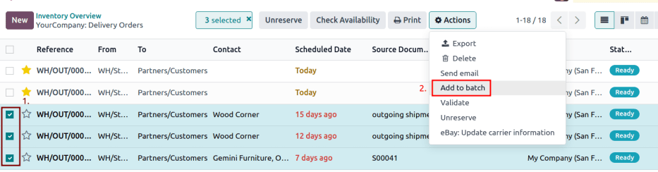
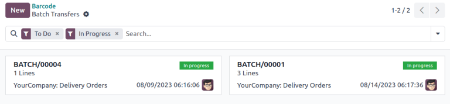

=============
Batch picking
=============

.. _inventory/misc/batch_picking:

*Batch picking* enables a single picker to handle multiple orders at once, reducing the time needed
to navigate to the same location in a warehouse.

When picking in batches, orders are grouped and consolidated into a picking list. After the picking,
the batch is taken to an output location, where the products are sorted into their respective
delivery packages.

.. seealso::
   :ref:`Use Barcode app for pickings <inventory/management/barcode_picking>`

Since orders *must* be sorted at the output location after being picked, this picking method suits
businesses with a few products that are ordered often. Storing high-demand items in easily
accessible locations can increase the number of orders that are fulfilled efficiently.

Configuration
=============

To activate the batch picking option, begin by going to :menuselection:`Inventory app -->
Configuration --> Settings`. Under the :guilabel:`Operations` section, check the :guilabel:`Batch
Transfers` box.

.. image:: batch_transfers/batch-transfer-checkbox.png
   :align: center
   :alt: Enable the *Batch Transfers* in Inventory > Configuration > Settings.

Since batch picking is a method to optimize the *pick* operation in Odoo, the :guilabel:`Storage
Locations` and :guilabel:`Multi-Step Routes` options under the :guilabel:`Warehouse` heading must
also be checked on this settings page. When finished, click :guilabel:`Save`.

.. image:: batch_transfers/locations-routes-checkbox.png
   :align: center
   :alt: Enable *Storage Locations* and *Multi-Step Routes* Inventory > Configuration > Settings.

Lastly, enable the warehouse picking feature, by navigating to the warehouse settings page, which is
accessible from :menuselection:`Inventory app --> Configuration --> Warehouses`.

From here, select the desired warehouse from the list. Then, from the radio options available for
:guilabel:`Outgoing Shipments`, select either the :guilabel:`Send goods in output and then deliver
(2 steps)` or :guilabel:`Pack goods, send goods in output and then deliver (3 steps)`.

.. seealso::
   - :ref:`Delivery in two steps <inventory/receipts_delivery_two_steps>`
   - :ref:`Delivery in three steps <inventory/delivery_three_steps>`

.. image:: batch_transfers/set-2-or-3-step-shipment.png
   :align: center
   :alt: Set up 2-step or 3-step outgoing shipments.

Create batch transfers
======================

Manually create batch transfers directly from the :menuselection:`Inventory app --> Operations -->
Batch Transfers` page. Click the :guilabel:`New` button to begin creating a batch transfer.

On the batch transfer form, fill the following fields out accordingly:

- :guilabel:`Responsible`: employee assigned to the picking. Leave this field blank if *any* worker
  can fulfill this picking.
- :guilabel:`Operation Type`: from the drop-down menu, select the operation type under which the
  picking is categorized.
- :guilabel:`Scheduled Date`: specifies the date by which the :guilabel:`Responsible` person should
  complete the transfer to the output location.

Next, in the :guilabel:`Transfers` list, click :guilabel:`Add a line` to open the :guilabel:`Add:
Transfers` window.

If the :guilabel:`Operation Type` field was filled, the list will filter transfer records matching
the selected :guilabel:`Operation Type`.

Click the :guilabel:`New` button to create a new transfer.

Once the transfer records are selected, click :guilabel:`Confirm` to confirm the batch picking.

.. example::
   A new batch transfer assigned to the :guilabel:`Responsible`, `Joel Willis`, for the `Pick`
   :guilabel:`Operation Type`. The :guilabel:`Scheduled Date` is set to `August 11`.

   .. image:: batch_transfers/batch-transfer-form.png
      :align: center
      :alt: View of *Batch Transfers* form.

   Clicking the :guilabel:`Add a line` button opens the :guilabel:`Add:Transfers` window,
   displaying only pickings. This is because the :guilabel:`Operation Type` was set to `Pick` on the
   batch transfer form.

   Click the checkbox to the left of the transfers, `WH/PICK/00001` and `WH/PICK/00002`, to include
   them in the new transfer. Then, click the :guilabel:`Select` button to close the
   :guilabel:`Add:Transfers` window.

   .. image:: batch_transfers/add-transfers-window.png
      :align: center
      :alt: Select multiple transfers from the *Add:Transfers* window.

Add batch from transfers list
-----------------------------

Another method of creating batch transfers is available using the :guilabel:`Add to batch` option in
a list. Navigate to the :menuselection:`Inventory app --> Operations` drop-down menu, and select any
of the :guilabel:`Transfers` to open a filtered list of transfers.

.. image:: batch_transfers/transfers-drop-down.png
   :align: center
   :alt: Show all transfer types in a drop-down menu: Receipts, Deliveries, Internal Transfers,
         Manufacturings, Batch Transfers, Dropships.

On the transfers list, select the checkbox to the left of the selected transfers to add in a batch.
Next, navigate to the :guilabel:`Actions ⚙️ (gear)` button, and click :guilabel:`Add to batch` from
the resulting drop-down menu.

Doing so opens an :guilabel:`Add to batch` pop-up window, wherein the employee
:guilabel:`Responsible` for the picking can be assigned.

Choose from the two radio options to add to :guilabel:`an existing batch transfer` or create
:guilabel:`a new batch transfer`.

To begin with a draft, select the :guilabel:`Draft` checkbox.

Conclude the process by clicking :guilabel:`Confirm`.

.. image:: batch_transfers/add-to-batch-window.png
   :align: center
   :alt: Show *Add to batch* window to create a batch transfer.

Process batch transfer
======================

Handle batch transfers in the :menuselection:`Inventory app --> Operations --> Batch Transfers`
page.

From here, select the intended transfer from the list. Then, on the batch transfer form, input the
:guilabel:`Done` quantities for each product, under the :guilabel:`Detailed Operations` tab.
Finally, select :guilabel:`Validate` to complete the picking.

.. tip::
   Be certain the batch transfer is complete when the :guilabel:`Validate` button is highlighted in
   purple. If the :guilabel:`Check Availability` button is highlighted instead, that means there are
   items in the batch that are currently *not* available in-stock.

.. _inventory/management/batch-transfers-example:

.. example::
   In a batch transfer involving products from pickings, `WH/PICK/00001` and `WH/PICK/00002`, the
   :guilabel:`Detailed Operations` tab shows that the product, `Cabinet with Doors`, has been picked
   because the :guilabel:`Done` column matches the value in the :guilabel:`Reserved` column.
   However, `0.00` quantities have been picked for the other product, `Cable Management Box`.

   .. image:: batch_transfers/process-batch-transfer.png
      :align: center
      :alt: Show batch transfer of products from two pickings in the *Detailed Operations* tab.

Only in-stock products are visible in the :guilabel:`Detailed Operations` tab.

To view the complete product list, switch to the :guilabel:`Operations` tab. On this list, the
:guilabel:`Demand` column indicates the required quantity for the order. The :guilabel:`Reserved`
column shows the available stock to fulfill the order. Lastly, the :guilabel:`Done` column specifies
the products that have been picked, and are ready for the next step.

.. example::
   The product, `Desk Pad`, from the same batch as the :ref:`example above
   <inventory/management/batch-transfers-example>`, is only visible in the :guilabel:`Operations`
   tab because there are no :guilabel:`Reserved` quantities in-stock to fulfill the batch picking.

   Click the :guilabel:`Check Availability` button to search the stock again for available products.

   .. image:: batch_transfers/operations-tab.png
      :align: center
      :alt: Show unavailable reserved quantities in the *Operations* tab.

Create backorder
----------------

On the batch transfer form, if the :guilabel:`Done` quantity of the product is *less* than the
:guilabel:`Reserved` quantity, a pop-up window appears.

This pop-up window provides the option: :guilabel:`Create Backorder?`.

Clicking the :guilabel:`Create Backorder` button automatically creates a new batch transfer,
containing the remaining products.

Click :guilabel:`No Backorder` to finish the picking *without* creating another batch picking.

Click :guilabel:`Discard` to cancel the validation, and return to the batch transfer form.

.. image:: batch_transfers/create-backorder.png
   :align: center
   :alt: Show the *Create Backorder* pop-up.

.. _inventory/management/barcode_picking:

Process batch transfer: Barcode app
===================================

Created batch transfers are also listed in the :menuselection:`Barcode` app, accessible by selecting
the :guilabel:`Batch Transfers` button.

By default, confirmed batch pickings appear on the :guilabel:`Batch Transfers` page. On that page,
click on the desired batch transfer to open the detailed list of products for the picking.

For the chosen batch transfer, follow the instructions at the top of the page in the black
background. Begin by scanning the product's barcode to record a single product for picking. To
record multiple quantities, click the :guilabel:`✏️ (pencil)` icon, and enter the required
quantities for the picking.

.. note::
   Products from the same order are labeled with the same color on the left. Completed pickings are
   highlighted in green.

.. example::
   In a batch transfer for 2 `Cabinet with Doors`, 3 `Acoustic Bloc Screens`, and 4 `Four Person
   Desks`, the `3/3` and `4/4` :guilabel:`Units` indicate that the last two product pickings are
   complete.

   `1/2` units of the `Cabinet with Doors` has already been picked, and after scanning the product
   barcode for the second cabinet, Odoo prompts the user to `Scan a serial number` to record the
   unique serial number for :ref:`product tracking <inventory/serial_numbers/configure>`.

   .. image:: batch_transfers/barcode-products.png
      :align: center
      :alt: Display products to be picked in barcode view.

Once all the products have been picked, click on :guilabel:`Validate` to mark the batch transfer as
:guilabel:`Done`.
