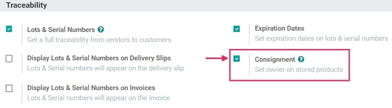

=================================================
Consignment: buy and sell stock without owning it
=================================================

Most of the time, products stored in a company's warehouse are either purchased from suppliers, or
are manufactured in-house. However, suppliers will sometimes let companies store and sell products
in the company's warehouse, without having to buy those items up-front. This is called
*consignment*.

Consignment is a useful method for suppliers to launch new products, and easily deliver to their
customers. It's also a great way for the company storing the products (the consignee) to earn
something back for their efforts. Consignees can even charge a fee for the convenience of storing
products they don't actually own.

Enable the consignment setting
==============================

To receive, store, and sell consignment stock, the feature needs to be enabled in the settings. To
do this, go to :menuselection:`Inventory --> Configuration --> Settings`, and under the
:guilabel:`Traceability` section, check the box next to :guilabel:`Consignment`, and then click
:guilabel:`Save` to finish.

Receive (and store) consignment stock
=====================================

With the feature enabled in Odoo, consignment stock can now be received into a warehouse. From the
main :menuselection:`Inventory` dashboard, click into the :guilabel:`Receipts`
section. Then, click :guilabel:`Create`.

.. note::
   Consignment stock is not actually purchased from the vendor; it is simply received and stored.
   Because of this, there are no quotations or purchase orders involved in receiving consignment
   stock. So, *every* receipt of consignment stock will start by creating manual receipts.

Choose a vendor to enter in the :guilabel:`Receive From` field, and then choose the same vendor to
enter in the :guilabel:`Assign Owner` field.

.. important::
   Since the products received from the vendor will be owned by the same vendor, the
   :guilabel:`Receive From` and :guilabel:`Assign Owner` fields must match.

Once the vendor-related fields are set, enter products into the :guilabel:`Product` lines, and set
the quantities to be received into the warehouse under the :guilabel:`Done` column. If the
:guilabel:`Units of Measure` feature is enabled, the :abbr:`UoM (Units of Measure)` can be changed,
as well. Once all the consignment stock has been received, :guilabel:`Validate` the receipt.

.. image:: owned_stock/owned-stock-receipt-fields.png
   :align: center
   :alt: Matching vendor fields in consignment Receipt creation.

Sell and deliver consignment stock
==================================

Once consignment stock has been received into the warehouse, it can be sold the same as any other
in-stock product that has the :guilabel:`Can Be Sold` option enabled on the product form.

To create a sales order, navigate to the :menuselection:`Sales` app, and from the
:guilabel:`Quotations` overview, click :guilabel:`Create`. Next, choose a customer to enter into the
:guilabel:`Customer` field.

.. note::
   The :guilabel:`Customer` *must* be different from the :guilabel:`Vendor` that supplied the
   consignment stock received (and stored) in the warehouse.

Add the consignment product under the :guilabel:`Product` column in the order lines, set the
:guilabel:`Quantity`, and fill out any other pertinent product details on the form. Once the
quotation is complete, click :guilabel:`Confirm`.

.. image:: owned_stock/owned-stock-sales-order.png
   :align: center
   :alt: Sales order of consignment stock.

Once the :abbr:`RFQ (Request for Quotation)` has been confirmed, it will become a sales order. From
here, the products can be delivered by clicking on the :guilabel:`Delivery` smart button, and
selecting :guilabel:`Validate` to validate the delivery.

Traceability and reporting of consignment stock
===============================================

Although consignment stock is owned by the vendor who supplied it, and not by the company storing it
in their warehouse, consignment products will *still* appear in certain inventory reports.

To find inventory reports, go to :menuselection:`Inventory --> Reporting`, and choose a report to
view.

.. note::
   Since the consignee does not actually own consigment stock, these products are *not* reflected
   in the :guilabel:`Stock Valuation` report, and have no impact on the consignee's inventory
   valuation.

Product moves report
--------------------

To view all information about on-hand stock moves, navigate to the the :guilabel:`Product Moves`
dashboard by going to :menuselection:`Inventory --> Reporting --> Product Moves`. For consignment
products, the information in this report is the same as any other product: the history
of its product moves can be reviewed; the :guilabel:`Quantity Done` and :guilabel:`Reference`
document are available; and its :guilabel:`Locations` are available, as well. The consignment stock
will originate from :guilabel:`Partner Location/Vendors`.

.. tip::
   To view a consignment product's moves by ownership, select the :guilabel:`Group By` filter,
   choose the :guilabel:`Add Custom Group` parameter, and then select :guilabel:`From Owner`, and
   :guilabel:`Apply` to finish.

.. image:: owned_stock/owned-stock-moves-history.png
   :align: center
   :alt: Consignment stock moves history.

.. tip::
   To see forecasted units of consignment stock, go to :menuselection:`Inventory --> Reporting -->
   Forecasted Inventory`.

Stock on hand report
--------------------

View the :guilabel:`Stock On Hand` dashboard by navigating to :menuselection:`Inventory -->
Reporting --> Inventory Report`. From this report, the :guilabel:`Locations` of all stock on-hand
are displayed, in addition to the quantities per location. For consigment products, the
:guilabel:`Owner` column will be populated with the owner of those products, or the original vendor
who supplied the products in the first place.
