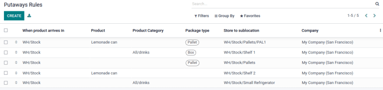

=============
Putaway rules
=============

What is a Putaway Rule?
=======================

A good warehouse implementation makes sure that products automatically move to their appropriate
destination location. To make that process easier, Odoo uses *Putaway Rules*. Putaway is the
process of taking products from the received shipments and putting them into the appropriate
location.

If, for example, a warehouse contains volatile substances, it is important to make sure that certain
products are not stored close to each other because of a potential chemical reaction. That's where
putaway rules intervene, to avoid storing products wrongly.

Configuration
-------------

In the :guilabel:`Inventory` app, go to :menuselection:`Configuration --> Settings` and activate
the :guilabel:`Multi-Step Routes` feature. By doing so, the :guilabel:`Storage Locations` feature
is also automatically activated.

.. image:: putaway/activate-multi-step-routes.png
   :align: center
   :alt: Activate Multi-Step Routes in Inventory configuration settings.

Setting up a putaway rule
-------------------------

In some cases, like for a retail shop storing fruits and vegetables, products should be stored in
different locations depending on several factors like frequency, size, product category, specific
environment needs, and so on.

In this example, suppose there is one warehouse location, **WH/Stock**, with the following
sub-locations:

- WH/Stock/Pallets

  - WH/Stock/Pallets/PAL1
  - WH/Stock/Pallets/PAL2
  - WH/Stock/Pallets/PAL3

- WH/Stock/Shelf 1

- WH/Stock/Shelf 2

  - WH/Stock/Shelf 2/Small Refrigerator

- WH/Stock/Shelf 3

Manage those locations with putaway rules. To create a putaway rule, open the :guilabel:`Inventory`
app and go to :menuselection:`Configuration --> Putaway Rules`. Then, click on :guilabel:`Create`
and configure a putaway rule that indicated the main location the product will enter before being
redirected to the right storage location.

.. important::
   The putaway rules can be defined either per product/product category and/or package type (the
   :guilabel:`Packages` setting must be enabled for that). Putaway rules are read sequentially
   until a match is found.

Take the following example:

- If water (category All/drinks) is received, whatever the package, it will be redirected to
  WH/Stock/Shelf 2/Small Refrigerator.
- If orange juice cans, packaged in boxes, are received, they will be redirected to
  WH/Stock/Shelf 2.
- If water or apple juice bottles, packaged in boxes, are received, they will be redirected to
  WH/Stock/Shelf 3.
- If a pallet of lemonade cans are receieved, it will be redirected to WH/Stock/Pallets/PAL1.

Using Storage Categories
========================

A *Storage Category* is an extra location attribute. Storage categories allow the user to define
the quantity of products that can be stored in the location and how the location will be selected
with putaway rules.

Configuration
-------------

In the :guilabel:`Inventory` app, go to :menuselection:`Configuration --> Settings` and activate
the :guilabel:`Storage Categories` feature. By doing so, the :guilabel:`Storage Locations` feature
is also automatically activated.

Create a Storage Category
-------------------------

To create a storage category, go to :menuselection:`Inventory --> Configuration --> Storage
Categories` and click :guilabel:`Create`. Then, click :guilabel:`Save` and click :guilabel:`Storage
Categories` or go to :menuselection:`Configuration --> Storage Categories` to create a new storage
category.

.. image:: putaway/storage-category.png
   :align: center
   :alt: Create Storage Categories inside Odoo Inventory configuration settings.

First, click :guilabel:`Create` and type a name for the storage category.

Then, there are options to limit the capacity by weight, by product, or by package type. The
:guilabel:`Allow New Product` field defines when the location is considered available to store a
product:

- :guilabel:`If location is empty`: a product can be added there only if the location is empty.
- :guilabel:`If products are the same`: a product can be added there only if the same product is
  already there.
- :guilabel:`Allow mixed products`: several different products can be stored in this location at
  the same time.

Once the storage category settings are saved, the storage category can be linked to a location.

.. image:: putaway/location-storage-category.png
   :align: center
   :alt: When a Storage Category is created, it can be linked to a warehouse location.

Storage categories in putaway rules
-----------------------------------

To continue the example from above, apply the "High Frequency Pallets" on the PAL1 and PAL2
locations and rework the putaway rules as follows:

Assume one pallet of lemonade cans is received:

- If PAL1 and PAL2 are empty, the pallet will be redirected to WH/Stock/Pallets/PAL1.
- If PAL1 is full, the pallet will be redirected to WH/Stock/Pallets/PAL2.
- If PAL1 and 2 are full, the pallet will be redirected to WH/Stock/Pallets.

.. image:: putaway/smart-putaways.png
   :align: center
   :alt: Storage Categories used in a variety of putaway rules.
