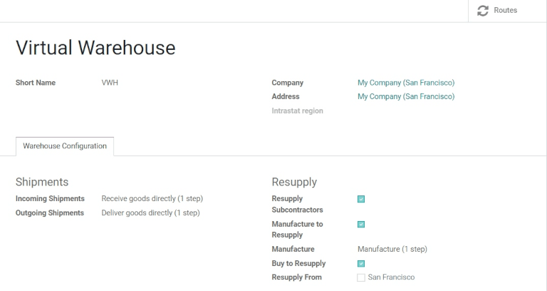
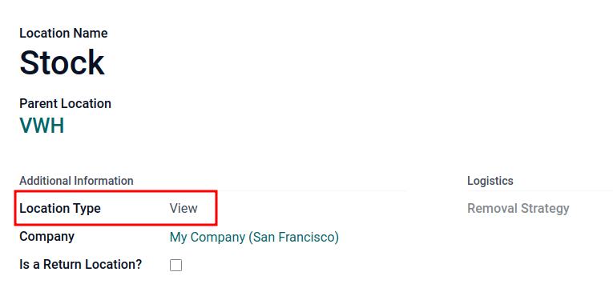
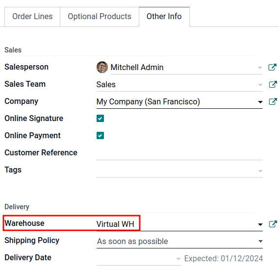
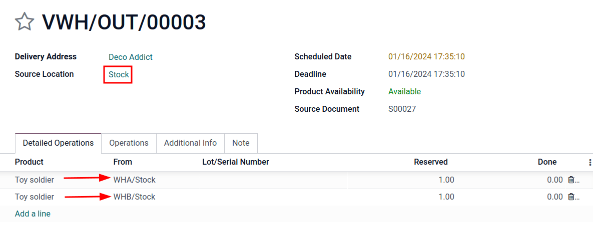

===========================================================
Sell stock from multiple warehouses using virtual locations
===========================================================

While keeping stock and selling inventory from one warehouse might work for smaller companies,
bigger companies might need to keep stock in, or sell from, multiple warehouses in multiple
locations.

Sometimes products included in a single sales order might take stock from two (or more) warehouses;
in Odoo, pulling products from multiple warehouses to satisfy sales demands can be done using
*virtual locations*.

.. important::
   The solution in this document, describing the use of a virtual warehouse to fulfill orders for
   multiple warehouses, has some limitations. Consider the following before proceeding:

   #. When the :guilabel:`Warehouse` field is set to a virtual warehouse on a sales order, the
      virtual warehouse's address is indicated on the picking, packing, and delivery forms, **not**
      the actual warehouse's address.
   #. Each location has a `warehouse_id` (hidden field). This means that the stock in the virtual
      warehouse will **not** be the sum of the stock of the real warehouses, but rather the sum of
      the stock in the locations whose warehouse ID is the virtual warehouse.

.. danger::
   Potential limitation for those using :doc:`two
   <../../shipping_receiving/daily_operations/receipts_delivery_two_steps>` or :doc:`three-step
   delivery <../../shipping_receiving/daily_operations/delivery_three_steps>`:

   #. The output or packing zone on the various forms is incorrectly listed as the virtual
      warehouse's address.
   #. There is no workaround for two or three-step deliveries.
   #. Proceed **only** if setting a virtual warehouse's address as the output or packing zone makes
      sense for the company's workflow.

.. note::
   In order to create virtual locations in warehouses, and proceed to the following steps, the
   :guilabel:`Storage Locations` and :guilabel:`Multi-Step Routes` features **must** be enabled.

   To do so, go to :menuselection:`Inventory app --> Configuration --> Settings`, scroll down to the
   :guilabel:`Warehouse` section, and enable the :guilabel:`Storage Locations` and
   :guilabel:`Multi-Step Routes` options. Then, :guilabel:`Save` the changes to finish.

.. _inventory/routes/virtual-wh:

Create virtual parent location
==============================

Before creating any virtual stock locations, create a new warehouse that acts as a *virtual*
warehouse — the *parent* location of other physical warehouses.

.. spoiler:: Why a "virtual" warehouse?

   Virtual warehouses are great for companies with multiple physical warehouses. This is because a
   situation might arise when one warehouse runs out of stock of a particular product, but another
   warehouse still has stock on-hand. In this case, stock from these two (or more) warehouses could
   be used to fulfill a single sales order.

   The "virtual" warehouse acts as a single aggregator of all the inventory stored in a company's
   physical warehouses, and is used (for traceability purposes) to create a hierarchy of locations
   in Odoo.

To create a new warehouse, go to :menuselection:`Inventory app --> Configuration --> Warehouses`,
and click :guilabel:`Create`. From here, the warehouse :guilabel:`Name` and :guilabel:`Short Name`
can be changed, and other warehouse details can be changed under the :guilabel:`Warehouse
Configuration` tab.

Lastly, click :guilabel:`Save` to finish creating a *regular* warehouse. Continue following the
steps below to finish configuring the virtual parent warehouse.

.. seealso::
   - :doc:`Warehouse configurations <../inventory_management/warehouses>`
   - :ref:`Incoming and outgoing shipments <inventory/receipts_delivery_one_step/wh>`
   - :doc:`Resupply from another warehouse <../inventory_management/resupply_warehouses>`

.. _inventory/routes/child-wh:

Create child warehouses
=======================

Create at least two *child* warehouses to link to the virtual warehouse.

.. important::
   In order to take stock from multiple warehouses to fulfill a sales order, there needs to be at
   least **two** warehouses acting as child locations of the virtual parent location warehouse.

To do that, navigate to :menuselection:`Inventory app --> Configuration --> Warehouses`, click
:guilabel:`Create`, and follow the :ref:`preceding instructions <inventory/routes/virtual-wh>` to
configure the physical stock locations.

.. example::

   | **Parent Warehouse**
   | :guilabel:`Warehouse`: `Virtual Warehouse`
   | :guilabel:`Location`: `VWH/Stock`

   | **Child Warehouses**
   | :guilabel:`Warehouses`: `Warehouse A` and `Warehouse B`
   | :guilabel:`Locations`: `WHA` and `WHB`

   .. image:: stock_warehouses/parent-location.png
      :align: center
      :alt: Graphic of child locations 'WHA' and 'WHB' tied to the parent location.

.. important::
   While the virtual stock location will be changed to 'View' later, the :guilabel:`Location Type`
   **must** be :guilabel:`Internal Location` at this point to :ref:`link the child warehouses
   <inventory/routes/link-to-vwh>` in the next section.

.. _inventory/routes/link-to-vwh:

Link child warehouses to virtual stock
======================================

To set physical warehouses as child locations of the virtual location configured in the
:ref:`previous step <inventory/routes/virtual-wh>`, navigate to :menuselection:`Inventory app -->
Configuration --> Locations`.

Remove any filters from the search bar. Then, click the physical warehouse :guilabel:`Location` that
was previously created to be a child location (e.g. `WHA`), and click :guilabel:`Edit`.

Change the :guilabel:`Parent Location` field from :guilabel:`Physical Locations` to the virtual
warehouse's **stock location** (e.g. `VWH/Stock`) from the drop-down menu, and click
:guilabel:`Save`.

.. important::
   To select the virtual warehouse's stock location in the :guilabel:`Parent Location` drop-down
   menu, the parent warehouse stock location (e.g. `VWH/Stock`) **must**  have its
   :guilabel:`Location Type` set to :guilabel:`Internal Location`.

.. image:: stock_warehouses/configure-physical-wh.png
   :align: center
   :alt: Set the child warehouse's *Parent Location* to the virtual warehouse.

Repeat the preceding steps to configure two or more child warehouses.

Once complete, the virtual, parent warehouse (e.g. `VWH/Stock`) fulfills orders using stock from
child warehouses (e.g. `WHA` and `WHB`), if there is insufficient stock in any one location.

Set virtual stock location as 'view'
====================================

Set the virtual stock location's :guilabel:`Location Type` to :guilabel:`View`, as it is a
non-existent location used to group various physical warehouses together.

To do that, navigate to :menuselection:`Inventory app --> Configuration --> Locations`.

Click the virtual warehouse's stock location (e.g. `VWH/Stock`) that was :ref:`previously created
<inventory/routes/virtual-wh>`, from the :guilabel:`Locations` list.

On the location form, under the :guilabel:`Additional Information` heading, set the
:guilabel:`Location Type` to :guilabel:`View`. :guilabel:`Save` the changes.

.. tip::
   To view the total quantity across **all** linked child warehouses, go to the product form and
   click the :guilabel:`On Hand` smart button.

   .. image:: stock_warehouses/on-hand.png
      :align: center
      :alt: Display stock across all linked warehouses.

Example: sell products from a virtual warehouse
===============================================

To sell products from multiple warehouses using a virtual parent location, the database must have at
least **two** warehouses configured — with at least **one** product, with quantity on-hand in each
warehouse, respectively.

.. example::
   The following product, `Toy soldier`, is available at each location with the quantities:

   - `WHA/Stock` : 1
   - `WHB/Stock` : 2
   - Warehouses `WHA` and `WHB` are child warehouses of the virtual warehouse `VWH`.

Create a quotation for the product by navigating to the :menuselection:`Sales` app and clicking
:guilabel:`Create`. On the quote, add a :guilabel:`Customer`, and click :guilabel:`Add a product` to
add the two products stored in the two warehouses.

Then, click the :guilabel:`Other Info` tab on the sales order form. Under the :guilabel:`Delivery`
section, change the :guilabel:`Warehouse` field value to the virtual warehouse that was
:ref:`previously created <inventory/routes/virtual-wh>`. Next, :guilabel:`Confirm` the sales order.

Then, click the :guilabel:`Delivery` smart button. From the warehouse delivery form, confirm that
the :guilabel:`Source Location` value matches the :guilabel:`Warehouse` field value from the sales
order. Both should list the virtual warehouse location.

Finally, on the warehouse delivery form, under the :guilabel:`Detailed Operations` tab, confirm that
the :guilabel:`Locations` in the :guilabel:`From` column for each product match the child locations
that are tied to the virtual parent location.

.. important::
   The :guilabel:`Source Location` on the warehouse delivery form, and the :guilabel:`Warehouse`
   under the :guilabel:`Other Info` tab on the sales order, **must** match for products in the sales
   order to be pulled from different warehouses.

  - If the virtual warehouse is not in the :guilabel:`Source Location` field on the warehouse
    delivery form, retry product reservation by:

    - Running the scheduler: turn on :ref:`developer mode <developer-mode>`, and then go to
      :menuselection:`Inventory app --> Operations --> Run Scheduler`.
    - Clicking :guilabel:`Check Availability` on the delivery order.
  - If the virtual warehouse is **not** assigned to the :guilabel:`Warehouse` field on the sales
    order, then cancel it, and create a new sales order with the virtual warehouse set in the
    :guilabel:`Warehouse` field.
  - If the :guilabel:`Warehouse` field is missing on the sales order form, then the multiple child
    warehouses may not have been set up correctly. Review the :ref:`previous section
    <inventory/routes/child-wh>` to ensure the correct settings.

.. tip::
   To use a virtual *parent* location as the default warehouse for sales orders, each salesperson
   should have the virtual warehouse assigned to them from the drop-down menu next to
   :guilabel:`Default Warehouse` on their employee form.

   .. image:: stock_warehouses/stock-warehouses-employee-form.png
      :align: center
      :alt: Default warehouse location on employee form.
